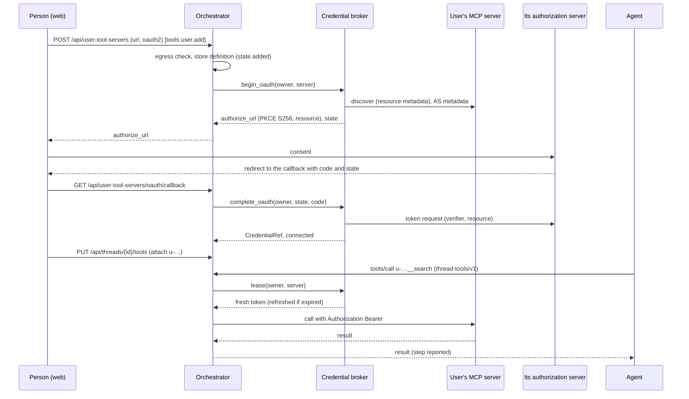
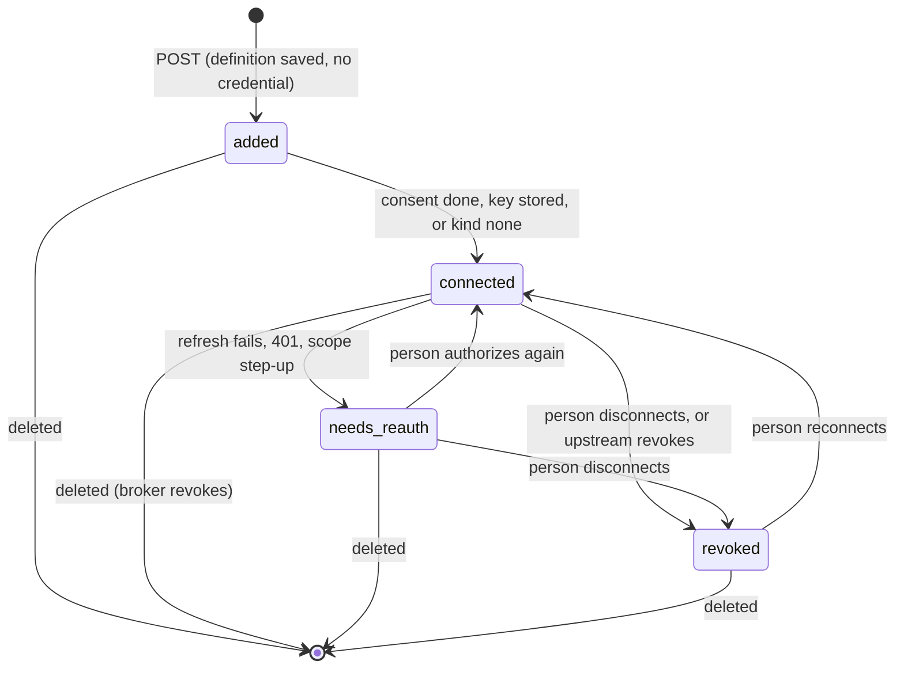

# ADR 0046 — People add their own MCP servers from the UI; their secrets live in a credential broker, never here

- **Status:** proposed (2026-10-06). **Accepted** on the owner's decisions of 2026-10-06: decisions 1 to 4 below, in
  substance (an agent's own servers are fixed; people add their own, with four kinds of authentication, stored per person,
  "we'll mimic how LibreChat is doing their stuffs"; secrets go to a credential broker, never into the log; a user server is
  relayed like today's web search and fails closed; a person's URL is untrusted). **Proposed**, for the owner to confirm: every
  name, default and shape marked *proposed*, which are the ports, the permission, the configuration, the endpoints and the
  lifecycle. **Nothing of this is built.** Extends [ADR 0024](0024-mcp-tools-attached-per-conversation.md) (the relay) and
  [ADR 0045](0045-admin-dashboard-in-the-web-and-agent-access-from-the-registry.md) (permissions); amends invariant 3 of
  `CLAUDE.md` for the definitions of decision 2. *Amended 2026-10-06:* the link to the platform's broker (decision 3) now names its section.

## Context

Today a person attaches only what the deployment lists in `toolServers` ([`config.md`](../api/config.md#toolservers)), with
credentials from the orchestrator's own configuration, and the orchestrator relays the server's tools to the agent on the
thread's endpoint, `thread-tools/v1` ([`thread-tools-v1.md`](../api/thread-tools-v1.md#attached-servers-and-the-relay-slice-8),
`dev/tools-e2e.sh`). "A person cannot enter a URL: the list is the deployment's." The owner wants people to bring their own
servers, with their own credentials, as LibreChat does.

What LibreChat does, as far as this ADR copies it (*verified 2026-10-06*, page fetches; the tool summarised the pages, so a
wording below is a paraphrase unless quoted):

- Servers can be added from the UI, **per-user credentials** are asked of the person ("User provides key"), and "each user gets
  their own isolated connection" and "will be prompted to authenticate with their own OAuth login"
  (<https://www.librechat.ai/docs/features/mcp>).
- Authentication of a UI-added server is an **API key** (Bearer, Basic or a custom header) or **OAuth 2.0**; an OAuth server is
  "registered on save but starts out disconnected" until the person authorizes; a UI-created server resolves only the person's
  own variables, never the server's environment or the person's identity token (same page).
- OAuth is the **authorization code flow with PKCE**, with automatic renewal when a refresh token exists
  (same page); the settings are `authorization_url`, `token_url`, `client_id`, `client_secret`, `scope`, `redirect_uri`
  (`/api/mcp/<server>/oauth/callback`) (<https://www.librechat.ai/docs/configuration/librechat_yaml/object_structure/mcp_servers>).
- Who may create is a flag, `interface.mcpServers.create` (beside `USE`, `SHARE`, `SHARE_PUBLIC`), and a server can be shared with
  users, groups, roles or all (same pages); LibreChat's network guard is `mcpSettings.allowedDomains` and `allowedAddresses`,
  private IP literals blocked unless allowed (configuration page).
- *Unverified:* how LibreChat encrypts what it stores (its pages say only "stored securely"), and whether its callback binds
  `state` to the signed-in person.

What the protocol requires of a client (*verified 2026-10-06*, MCP specification 2025-11-25,
<https://modelcontextprotocol.io/specification/2025-11-25/basic/authorization>): discovery by the server's Protected Resource
Metadata (RFC 9728) and the authorization server's metadata; **PKCE with `S256`**, refusing a server whose metadata lacks
`code_challenge_methods_supported`; the `resource` parameter (RFC 8707) on the authorization and the token request; client
registration by pre-registration, Client ID Metadata Documents or dynamic registration; tokens only in the `Authorization`
header, never in a URL; all authorization-server endpoints over HTTPS and redirect URIs `localhost` or HTTPS; a client must
not send a token to a server other than the one its authorization server issued it for. Every authorization is optional for
a server, so **"none"** is a real kind.

## Decision

1. **An agent's own MCP servers are fixed** *(accepted)*. They are the agent's files or custom resource (adam-rs `mcp.json`), and nothing here edits them. A user server is only ever
   **added on top**, as a relayed tool `<server>__<tool>`, so it cannot shadow or replace one of the agent's. The deployment's
   `toolServers` stay as they are.
2. **People add their own servers, kept per person** *(accepted; the rest proposed)*.
   - **Kinds** (a closed enum, ADR 0004, *proposed* name `UserAuth`): `none`; `bearer` (a token); `api_key` (a value in a header
     the person names, with LibreChat's "custom header" shape; the names `Host`, `Accept`, `Content-Type`, `Mcp-*` and
     `Last-Event-ID` are refused, as for `toolServers[].headers`); `oauth2` (authorization code with PKCE; scopes, and an
     optional pre-registered client id).
   - **Owner and limits:** keyed by the token's subject, as threads are ([ADR 0039](0039-nobody-reads-another-persons-thread.md)):
     nobody lists, reads or attaches another's server (a 404). *Proposed* at most 8 per person; the existing 16 per thread
     stand. **Org sharing is later** (open question 53): nothing here shares a server.
   - **What is stored here** is the definition and its state, never a secret: id, name, URL, kind, header name, scopes, state,
     a `CredentialRef` (an opaque id the broker gave). Postgres, a table of its own like the thread's organisation in
     [ADR 0042](0042-the-thread-list-is-the-owners.md); **no event** records it (it is the person's, not the thread's).
     The log keeps recording `tools_attached` with an id only, as now.
   - **The id** is `u-` plus 10 lowercase letters or digits, made here; a deployment `toolServers[].id` may not start with `u-`
     when the feature is on (a startup error), so the two never collide.
3. **Secrets go to a credential broker** *(accepted)*. The broker, its storage and its OAuth work are specified in the platform
   ([architecture §39a, `08-security.md`](https://github.com/vymalo/another-agentic-platform/blob/main/docs/architecture/08-security.md#39a-connections-user-mcp-servers-and-the-credential-broker)). This repository's side is two ports in `orch-ports`
   ([ADR 0009](0009-swappable-implementations-at-build-time.md); no driver type in a signature), each with a testkit, in the
   style of `ToolServerClient`. **Not implemented here.**
   - `UserToolServerStore` (*proposed*): `put`, `get`, `list(owner)`, `set_state` and `delete` of a definition, by
     `(owner, id)`; a Postgres adapter and an in-memory one, with a conformance testkit.
   - `CredentialBroker` (*proposed*): `store(owner, server, kind, material) -> CredentialRef` (material is a `ToolSecret`),
     `begin_oauth(owner, server, redirect) -> {authorize_url, state}`, `complete_oauth(owner, state, code)`,
     `lease(owner, server) -> Lease { header, value: ToolSecret, expires_at }`, and `revoke(owner, server)`. Discovery, PKCE
     `S256`, the `resource` parameter, client registration, storage and refresh are the broker's, as the spec requires of a
     client; this side never holds a verifier, a refresh token or a client secret. Its errors carry a class
     (`Classify`, as every port's): `NeedsReauth`, `Unavailable`, `Unknown`.
   - **A secret appears only** on the person's request body to the add or key endpoint, in memory, on its way to `store`, and
     on the relay's request to the server in a `ToolSecret`. It is in **no** event, outbox row, export, AG-UI frame, log line,
     step input or output ([ADR 0030](0030-a-step-carries-its-input-and-output-bounded-and-redacted.md)), error or agent file;
     the request body of those endpoints is never logged. A test that plants a sentinel secret and greps every output is the
     acceptance of the slice, as `dev/tools-e2e.sh` does for configured ones.
   - **Fail closed**: with no broker configured, `bearer`, `api_key` and `oauth2` cannot be added (only `none`); the feature
     itself is off unless `userToolServers.enabled: true` (*proposed*).
4. **A user server is relayed like web search, and fails closed** *(accepted; the names proposed)*.
   - **Added** with `POST /api/user-tool-servers` (*proposed*; with `PATCH`, `DELETE`, `POST …/authorize`, and the OAuth
     callback `GET /api/user-tool-servers/oauth/callback`, `state` bound to the person who started the flow and used once; see the amendment below for desktop and mobile).
     `GET /api/tool-servers` lists the person's own beside the deployment's, each with `status`
     (`ready`, `needs_auth`, `unavailable`) and a `reason` the web shows; never a URL's credential.
   - **Attached** by the existing `PUT /api/threads/{id}/tools`, which needs `thread.write` as today. Only the thread owner's own
     servers are accepted (a 422 otherwise); a fork carries those its new owner owns and detaches the rest in its first
     events, as it does for an agent that may not use a server.
   - **Relayed** by `RelayTools` through the same `ToolServerClient`: per `tools/list` and `tools/call` it asks the broker for a
     **fresh** `lease`, so a token is never cached by the relay or older than the broker says; the agent sees `<id>__<tool>` and
     the orchestrator reports the step with the server's icon (a generic one: a user supplies none).
   - **A server whose credential cannot be obtained is not offered**: not `ready` in the picker (with its reason), a 422 on
     attach, left out of `tools/list`, and a call that was already attached fails as a refused credential does today
     (`isError`, "the MCP server needs the person to sign in again", a `failed` step), never a silent skip. The person's own
     `needs_auth` is a call to action in the web, not an error of the agent.
   - **What a user server says is untrusted**: its tool `annotations` are dropped (ADR 0024: untrusted unless from a trusted
     server), its `description` is cut at 2 KiB, and nothing it returns is read as an instruction here.
   - **Permission** (*proposed*, ADR 0045 style, an orchestrator permission mapped in `auth.roles`, and in Keycloak a client
     role that a composite can bundle): **`tools.user.add`** gates adding, editing, authorizing and re-keying a server.
     Listing one's own, attaching it (`thread.write`) and **removing** it are not gated by it, so a person whose permission is
     taken away can still remove what they added; but with it off a person's servers are not offered (`status:
     unavailable`, reason "not permitted"). It is **off by default**: the chart grants it to no role, and a deployment gives it to
     the roles it chooses. `admin` (ADR 0039) does not imply it and reads nobody's servers.
5. **A person's URL is untrusted** *(accepted; the rules proposed)*. One function, in `orch-ports` so that the broker's side
   applies the same, decides whether a URL may be added **and** whether a connection may be made:
   1. **`https` only**, a host, no user information, query or fragment; no redirect is followed (the client follows none today).
   2. **Private ranges are denied by default**: loopback, RFC 1918, link-local (the metadata address among them),
      carrier-grade NAT, multicast, reserved and the IPv6 equivalents, judged on **the address the connection is made to**, not
      on the name, so DNS rebinding has no gap. This is the guard of `dev/searxng-mcp/server.mjs` (`fetch`), which is the
      model, ported rather than shared.
   3. **The deployment's lists win** (`userToolServers.egress.deny` and `.allow`, host patterns, *proposed*): a **deny** match
      refuses, whatever else; a non-empty **allow** list refuses every host it does not match; a host that an allow entry names
      may resolve to a private address (an operator's explicit choice, as LibreChat's `allowedAddresses`); the default of the
      allow list is empty, meaning every public host.
   4. **The same rules apply to every URL the broker fetches** for the server (its resource metadata, authorization-server
      metadata, token endpoint and a client-metadata document), because those come from a stranger too (the spec itself warns
      of SSRF in the last).
   5. The check runs when a server is added or edited, again at each connection, and a refusal says which rule, never a
      resolved address.

## The flow

Only `connected` is offered. `unavailable` (server down, egress refused, permission off) is a reason shown, not a stored
state: it clears when the cause does. The state is the definition's, so it is the same for every thread of the person.

## Consequences

- One agent, with a chat's web search, can also have the person's own GitHub or Notion server for that chat only; the agent's
  own tools are untouched, and nobody else's thread sees the server.
- **Invariant 3 is amended** (note in `CLAUDE.md`): Postgres also keeps a person's definitions of servers, which is not the log
  and holds no secret. The credentials are the broker's, outside this repository's database.
- **A new required port pair**: the composition root needs a broker adapter, and one for the platform's service is a slice of
  its own. With none, only `none` servers work.
- **The relay gains a dependency on the broker on its critical path**: a broker that is down makes the person's `oauth2`,
  `bearer` and `api_key` servers `unavailable`, never the deployment's.
- **A revoked permission** does not detach a server from a running thread; it stops it being offered and leased at the next
  attach, and `userToolServers.enabled: false` stops every lease at once (the chart's switch).
- `config.md`, its schema, `chat-api.yaml`, `thread-tools-v1.md` and the web's picker change in the slices that build it;
  `docs/open-questions.md` question 11 (authentication to MCP servers) is partly answered here and stays open for the
  deployment's own servers.
- Slices (*proposed*): ports and testkits with an in-memory broker; the egress function and its tests; the Postgres store and
  endpoints; the relay's lease; the web (add, authorize, status); the platform's broker adapter.

## Alternatives rejected

- **Secrets in this database, encrypted** (as the orchestrator holds the configured ones in its environment). It makes the
  orchestrator the vault for strangers' tokens, with refresh and rotation here, and the owner chose a broker.
- **The agent connects to the person's server directly** ("direct", ADR 0024). The agent would hold the credential and the log
  would not see the calls; the relay is what exists and shows steps.
- **Let a person edit an agent's own servers.** They are the agent's contract, versioned with it; users add on top.
- **No egress guard, trusting the person.** The orchestrator would fetch any URL, the cloud metadata address among them.

## Amended 2026-10-06: the callback on desktop and mobile

[ADR 0047](0047-one-ui-for-web-desktop-and-mobile-each-signs-in-as-a-public-oauth-client.md) adds Tauri clients that call
the API with a bearer token. The browser that comes back to the OAuth callback (the system browser on desktop, the in-app
tab on mobile) carries neither that token nor, on native, the web's cookie. So the callback does not need the person to be
signed in: the orchestrator stores the flow, keyed by its `state`, when the signed-in person starts it (who, which server,
the PKCE verifier, an expiry of minutes), and the callback finds the person through that `state` alone, used once. The page
it answers says "you can return to the app"; the app learns the new status from `GET /api/tool-servers`.
