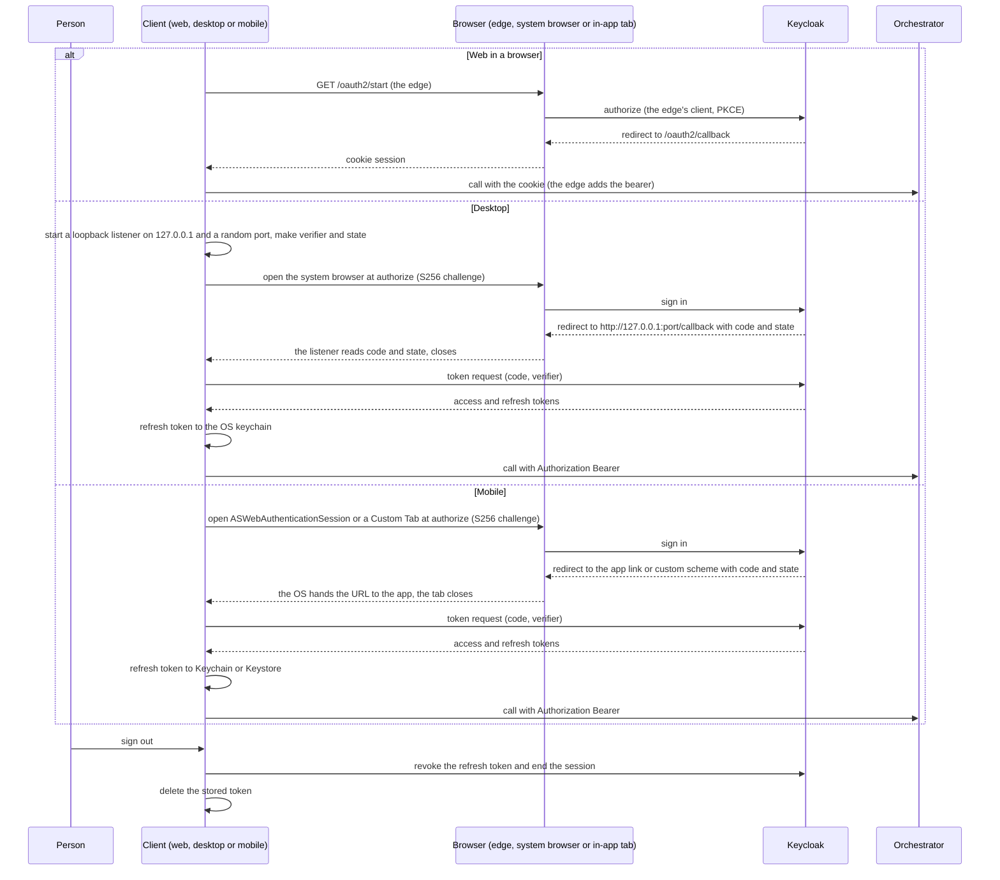
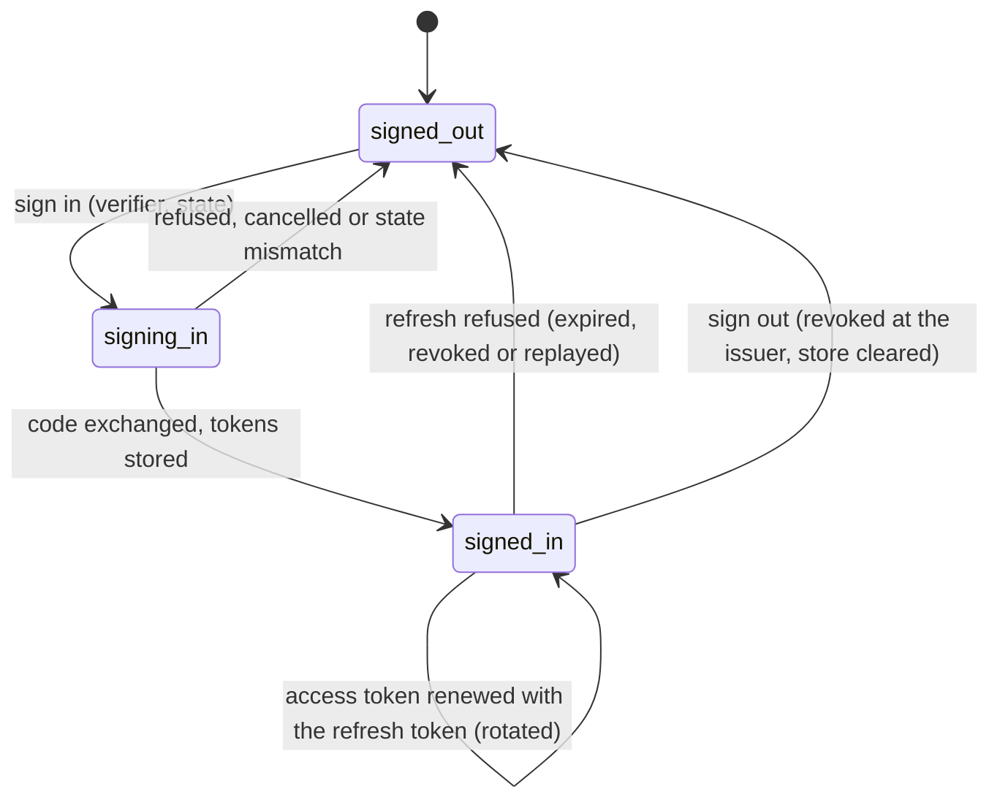

# ADR 0047 — One UI for web, desktop and mobile; each signs in as a public OAuth client

- **Status:** proposed (2026-10-06). **Accepted** on the owner's direction of 2026-10-06 (*"we're packing the UI into tauri for
  building a desktop and a mobile application… start thinking about auth in such cases (in app browser for mobile, server +
  callback for desktop, simple redirect for web)"*): one UI, packed into Tauri for desktop and mobile, with those three sign-ins.
  **Proposed**, for the owner to confirm: everything else, which is the static build and what it changes, the browser web's
  keeping the edge, the redirect URIs, the token storage, the CORS settings and the lifecycle. **Nothing of this is built.**
  Extends [ADR 0033](0033-the-orchestrator-is-an-oauth2-resource-server.md); amends nothing, but [ADR 0045](0045-admin-dashboard-in-the-web-and-agent-access-from-the-registry.md)
  gets a dated note of today (its route handler cannot exist in a static build).

## Context

Today the web is `output: "standalone"` (`web/next.config.ts`): a Node server behind oauth2-proxy, a session cookie, and `/api`
and `/agui` on the web's own origin, routed by the edge ([ADR 0033](0033-the-orchestrator-is-an-oauth2-resource-server.md),
[ADR 0041](0041-deployed-with-helm-on-kubernetes-secrets-by-externalsecret.md)). Tauri cannot run a Node server, so the web
must be a static export: `output: 'export'` allows no dynamic routes without `generateStaticParams()`, no cookies, rewrites,
redirects, headers, proxy (middleware), request-dependent route handlers or Server Actions, and no default image loader
(*verified 2026-10-06*, <https://nextjs.org/docs/app/guides/static-exports>).

The orchestrator is already an OAuth2 resource server: it validates a JWT bearer against the issuer's JWKS (`iss`, `aud` among
`auth.jwt.audiences`, `exp`) and maps the roles claim ([ADR 0033](0033-the-orchestrator-is-an-oauth2-resource-server.md)). A
native client only has to send one.

## Decision

### 1. The web is a static SPA build, served by a static server and packed unchanged into Tauri

`output: 'export'`; the web image serves `out/` with a small static server (*proposed*: Caddy, as the edge already is) instead of
`node server.js`; the same `out/` is the Tauri frontend. **What in `web/` must change** (found by reading it, 2026-10-06; no
code is changed here):

| In `web/` | Why it cannot stay | Becomes |
|---|---|---|
| `next.config.ts` `output: "standalone"` | needs `node server.js` | `output: 'export'` |
| `next.config.ts` `rewrites()` (`/api`, `/agui`, `/oauth2` to the mock or a real orchestrator, dev and e2e only) | unsupported in export, also in `next dev` | the mock server (`web/mock/server.ts`) serves `out/` and the API on one origin for the e2e; `next dev` calls the API origin directly (needs the CORS of decision 3) |
| `next.config.ts` `headers()` (`nosniff`, `Referrer-Policy: same-origin`) | unsupported in export | the static server sets them; the `Referrer-Policy` keeps the share token out of referrers ([ADR 0040](0040-thread-sharing-by-revocable-link.md)) |
| `src/app/threads/[id]/page.tsx` and `src/app/s/[token]/page.tsx`: dynamic segments read with `await params` | ids are not known at build; no `generateStaticParams()` | one exported shell per area that reads the id from the path on the client; the static server answers any `/threads/*` and `/s/*` with it. Whether Tauri's asset protocol falls back the same way is *unverified*; if not, the app navigates by a query (`?t=<id>`) |
| `notFound()` in `threads/[id]/page.tsx` (a non-UUID id) | request-time | the check moves to the client component, which draws `not-found.tsx` |
| `src/app/manifest.ts` (a metadata route) | must be static in export | keep it static (`force-static`, to be checked at build); the manifest means nothing in Tauri |
| `NEXT_PUBLIC_SIGN_IN_PATH` and a same-origin `baseUrl: ""` in `src/lib/api/client.ts`, `credentials: "same-origin"` in `files.ts` and `session-refresh.ts` | inlined at build, one build per deployment; assume the edge's origin and cookie | a runtime `config.json` (*proposed*: API origin, issuer, client id, sign-in mode) read at start, so one image or one app build serves a deployment |
| `` and download links (`kept-file-card.tsx`, `sources-tab.tsx`) | a header cannot ride on `src`, only the cookie | in bearer mode the file is fetched with the header and shown from a blob URL; in edge mode as today |
| `/admin/api/[...path]` route handler of [ADR 0045](0045-admin-dashboard-in-the-web-and-agent-access-from-the-registry.md) (not built) | a server | gone; see the note of today in that ADR |

Not found in `web/src` (grep, 2026-10-06): `next/headers`, `cookies()`, `headers()`, `middleware` or `proxy`, route handlers,
`"use server"`, `next/server`, `next/image`, `revalidate`, `generateStaticParams`. `images.unoptimized` is already set.

### 2. Every client calls the orchestrator directly with a bearer

Native clients (and, later, the Platform API) are called with `Authorization: Bearer <JWT>`: the **access token**, with
`aud` including `another-agentic` and the `agentic_roles` claim, from the audience and role mappers the CLI client already has
([`deploy/keycloak/`](../../deploy/keycloak/README.md)). No change to the orchestrator's check.

- **AG-UI streaming.** The web does **not** use `EventSource` today: `ThreadAgent` (`src/features/chat/lib/agui/thread-agent.ts`)
  sends `fetch` with `Accept: text/event-stream` and reads the body with its own `readSse` (`sse.ts`, which keeps the `id:` line
  for `Last-Event-ID`). So the stream needs only the header added by the one `fetch` seam that `withSessionRefresh` wraps today
  (`client.ts`, `thread-agent.ts`). The orchestrator ends a stream at the token's `exp` plus 60 s ([ADR 0033](0033-the-orchestrator-is-an-oauth2-resource-server.md));
  the client then refreshes the token and reconnects with `Last-Event-ID`, as it reconnects today.
  Streaming `fetch` in the iOS and Android webviews is *unverified*; the fallback is Tauri's HTTP plugin.
- **CORS** (a layer on the orchestrator, *proposed* setting `server.cors.allowedOrigins`): an allow-list, never `*`; allowed
  headers `Authorization`, `Content-Type`, `Accept`, `Last-Event-ID`; no credentials (no cookie is sent cross-origin). The list is the
  deployment's origins plus the Tauri origins, *unverified* strings: `tauri://localhost` (macOS, Linux, iOS), `http://tauri.localhost`
  (Windows, Android), and `https://tauri.localhost` where Tauri's `useHttpsScheme` is on. The browser web on the edge's own origin
  needs none. A bad origin is refused, as the surface's other refusals ([`api/agui.md`](../api/agui.md)).
- **The browser web keeps oauth2-proxy and the cookie session** *(recommended)*. Its tokens never reach JavaScript (no XSS
  theft of a refresh token), its calls stay same-origin (no CORS, no preflight), and the keep-warm, refresh-on-401 and sign-in
  popup of `web/README.md` "Signing in again" stay as built and proven. The cost is two transports in one client: **`edge`**
  (cookie, same origin, today's code) and **`bearer`** (native), behind one seam that every request already passes through.
  oauth2-proxy **still does**: the browser's sign-in and callback, the cookie, the forwarded ID token, the `--allowed-role` gate,
  and the pass-through of a verified bearer from a native client (`--skip-jwt-bearer-tokens`, with an `--extra-jwt-issuers`
  `issuer=audience` pair if the audience differs; *unverified* for these tokens). **SPA PKCE for the browser too** would give one
  code path and let the edge drop oauth2-proxy, but it puts a refresh token in the page; revisit it if the edge is ever
  simplified.

### 3. Sign-in per platform: a public client with PKCE (RFC 8252)

All three use the authorization code flow with PKCE `S256` ([RFC 7636](https://www.rfc-editor.org/rfc/rfc7636),
[RFC 8252](https://www.rfc-editor.org/rfc/rfc8252): an external user agent or an in-app browser tab, never an embedded webview
that could read the password), no client secret, `state` checked.

| Platform | Flow | Callback | Token storage |
|---|---|---|---|
| Web (browser) | redirect through the edge (oauth2-proxy, confidential client `another-agentic`) | `https://<host>/oauth2/callback` | the edge's cookie; nothing in JavaScript |
| Desktop (Tauri) | the **system browser** and a **loopback** listener | `http://127.0.0.1:<random port>/callback`, e.g. with `tauri-plugin-oauth` (<https://www.lib.rs/crates/tauri-plugin-oauth>; maintenance *unverified*) | OS keychain (refresh token); access token in memory |
| Mobile (Tauri) | an **in-app browser tab**: `ASWebAuthenticationSession` (iOS), Custom Tabs (Android) | an app-claimed https link (Universal Links, App Links) or, failing that, a custom scheme (`com.vymalo.agentic:/oauth2/callback`, *proposed* name) | Keychain (iOS), Keystore (Android) |

- **Keycloak: one public client per platform** (*proposed* ids `another-agentic-desktop`, `another-agentic-ios`,
  `another-agentic-android`), *Client authentication* off, *Standard flow* on, PKCE `S256` required, direct access grants off, each
  with only its redirect URIs, the audience and roles mappers, and a refresh-token revocation setting (below). A loopback redirect
  with any port (`http://127.0.0.1:*`) is the RFC 8252 shape; whether Keycloak matches it so is *unverified*. Https app links need the
  static server to serve `/.well-known/apple-app-site-association` and `/.well-known/assetlinks.json`. **`deploy/keycloak/` gains these
  client exports when the apps are built**, not before.
- **Refresh-token rotation.** Each refresh token is used once and the new one stored (Keycloak's *Revoke Refresh Token*, *unverified* here, so a replayed token is refused). Access tokens stay in memory and are
  renewed ahead of `exp`; a refresh that fails is a sign-in again, never a loop.
- **Sign-out revokes**: the client revokes the refresh token at the issuer (RFC 7009 `revocation_endpoint`), ends the SSO session
  (`end_session_endpoint`, in the same browser tab as the sign-in), then deletes the keychain entry. Signing out only locally is not
  a sign-out.
- **MCP OAuth callbacks stay on the orchestrator** ([ADR 0046](0046-people-add-their-own-mcp-servers-secrets-in-a-credential-broker.md)):
  they are the orchestrator's and the broker's redirect URIs at the third-party server, and no app is involved in them. One thing to
  carry over: the browser that reaches `GET /api/user-tool-servers/oauth/callback` is **not** the app's session on desktop and
  mobile, so that route must identify the person by `state` alone (bound at `begin_oauth`, used once), never by a cookie or bearer, and
  end on a page that sends the person back to the app. Written here; ADR 0046's text is not changed.

## Consequences

- **One build, one image, one app.** The web image stops being a Node image (smaller, no `node_modules` at runtime); e2e and dev
  serve `out/` from the mock or from the static server. Every spec that depends on `next start` or on `rewrites()` moves with it.
- **Invariants.** 3 holds: nothing new is stored by the orchestrator, tokens live on the client. 1 and 7 hold: Tauri is a shell for
  the UI, not an agent host. Fail-closed holds: a wrong origin, audience or token is refused.
- **New on the orchestrator**: the CORS layer and its setting (`config.md`, its schema and the chart's values change when built);
  the `auth.jwt.audiences` already lists `another-agentic`.
- **A second transport in the web**, tested in both modes against `dev/mock-oidc/` (which needs a public client with a loopback
  redirect), and the web's README, `architecture.md` and DESIGN notes change in the slice that builds it.
- **Not decided here**: Tauri project layout, signing and distribution, and the Platform API's own origin and CORS (the platform's
  AD-026, amended in parallel).

## Alternatives rejected

- **A web server (BFF) inside every app**: Tauri has none, and a local one would be a second session store.
- **An embedded webview sign-in** (the form inside the app): RFC 8252 forbids it for good reason, the app would see the password.
- **A custom scheme on every platform**: any app can claim it; an app-claimed https link cannot be taken by another app, so it is
  preferred on mobile, the scheme being the fallback.
- **One shared public client for all apps**: one redirect list for three platforms, no way to revoke one app, no per-platform setting.
- **Keep Next.js server rendering and ship a thin native shell around the hosted site**: no offline start, no keychain, and a store
  review of a site wrapper is the likelier rejection.
