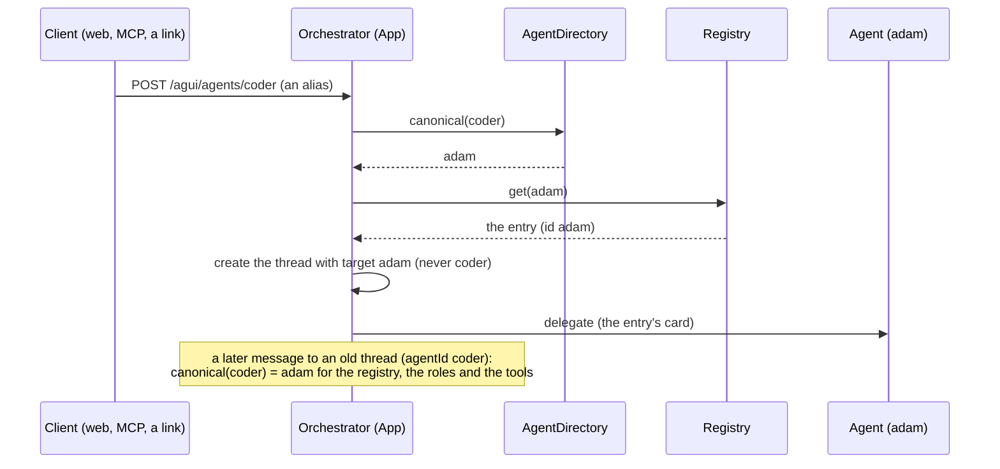
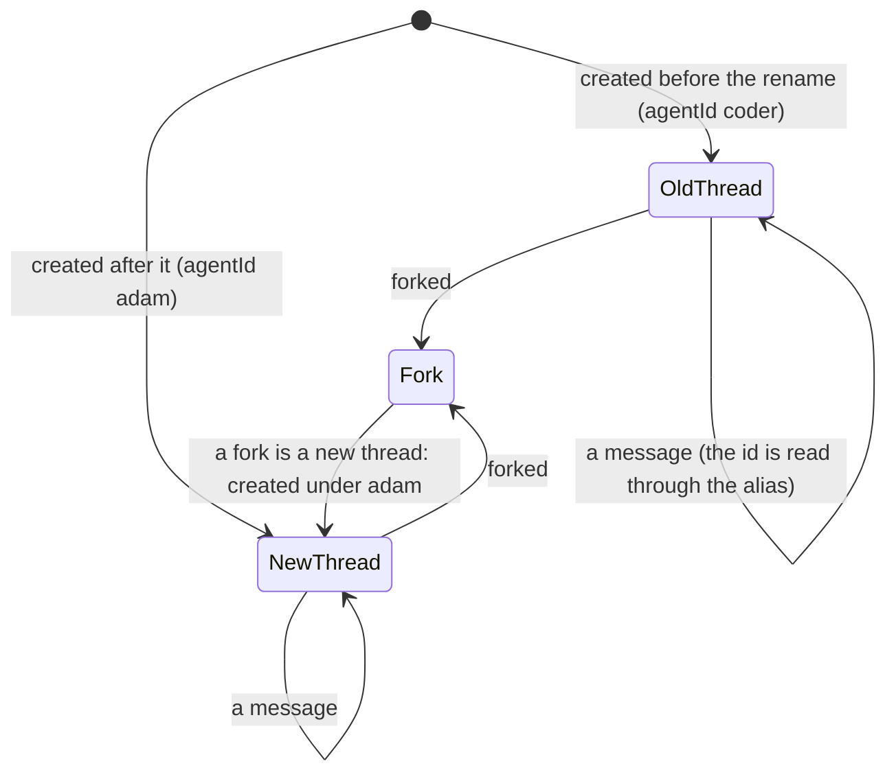

# ADR 0049 — The coder is shown as Adam, an agent may have aliases, and a step may carry the OpenCode icon

- **Status:** accepted (2026-10-06), on the owner's decision of that day: *"It's coder, but just because it can code."* The
  agent that this repository called `coder` is **Adam**. adam-rs makes the same change on its side (the card's name
  `Adam`, adam-rs's ADR 0021, [`docs/decisions/`](https://github.com/vymalo/another-adam-rs/blob/main/docs/decisions/) there;
  the file's name is *unverified*: it was **not merged** when this was written). The owner added, for the step that hands work to
  OpenCode over ACP: *"Just a logo or icon is enough. The title can be something else."* Built here on mocks and unit tests;
  nothing was tried against a real deployment. Extends [ADR 0014](0014-adam-coder-default-agent-over-a2a.md) (the default agent) and
  [ADR 0025](0025-nested-steps-events-carry-their-source-path.md) (the icon vocabulary of `steps/v1`).

## Context

The default agent is the adam-rs coder, and "coder" is the word the whole system uses for it: its id in `AGENTS_FILE`, the name
the web lists, the label of a mention (`@coder`), the words of the roles, the tool servers and the scripts. The owner does not want
the agent to be *a coder*: it can code, and that is one thing it does (a chat, a research, a document are asked of the other
agents, and Adam is the one that works on a repository). The name is the agent's, so it changes where a person reads it.

Three things stand in the way of a plain rename of the id.

1. **A thread keeps the id it was created with.** The log says `agentId: "coder"` for every thread that exists, and the id is
   also in the outbox, in a thread's mentions, in the tokens the orchestrator minted for `thread-tools/v1`
   (`claims.agent`) and in the asked agents of a job (`job.mentioned`). Rewriting the log is not an option (ADR 0001: the log is
   the truth; no migration rewrites an event), and a thread that stops working because its agent was renamed is a bug the person sees.
2. **Other people's links name the old id**: a bookmarked `/?agent=coder`, a client that posts to `/agui/agents/coder`, an
   `agent` argument of the MCP `start_job`, a role (`agents: [coder]`) or a tool server (`agents: [chat, coder]`) in a deployment's
   own values.
3. **The image, the chart, the Service and the environment variables of the coder are adam-rs's**, are not ours to rename here,
   and nobody asked for it (`ghcr.io/vymalo/another-adam-rs/coder`, release `coder`, `CODER_A2A_TOKEN`).

OpenCode is the tool the coder hands a coding task to over ACP; its step is a sub-agent step. The orchestrator cleans every icon an
agent names to a fixed vocabulary (`STEP_ICONS`, 14 names), and the web draws from the same set, so a new icon has to be added to
both. adam-rs is adding the name `opencode` to its `steps/v1` vocabulary for that step (not merged when this was written).

## Decision

1. **The agent is shown as Adam.** Its `id` in the agents file is `adam` and its `name` is `Adam`. The web needs no change to say
   so: it draws the names `GET /api/agents` lists. The labels of a mention become `@adam`.
2. **An entry of the agents file may have `aliases`**: other names of the agent, each an agent id (`^[a-z0-9][a-z0-9-]{0,62}$`).
   - A request, a mention, a path (`/agui/agents/{agentId}`, `/agui/agents/{agentId}/capabilities`), a `start_job`'s `agent`, the
     `agent` of `ask_agent` and the `?agent=` of a link that names an alias is about the agent it names.
   - **The API lists only the canonical id**, with its `aliases` (`GET /api/agents`, `Agent.aliases`, omitted when there are none).
   - **A new thread is always created with the canonical id**: the target of a created thread or of a fork, and every mention
     written to the log (the label is the person's text and stays `@coder`).
   - **A thread keeps the id it was created with.** What reads it is alias-aware: the registry lookup, the check of `agent.invoke`
     (a role names the canonical id; `App::new` replaces an alias in a role by the id it names), the tool servers offered for the
     agent (`App::new` lists each server's `agents` under every name of each agent), a run on the URL of either name (no 409 for a
     thread made under the other one), the asked agent of `ask_agent`, and the web (`aliases` give the names and the
     selection of an agent a person chose before the rename).
   - **A collision is a startup error (78)**: an alias that is the entry's own id, another entry's id (wherever it is in the file),
     another entry's alias or twice in one entry's list (`ConfigError::AliasCollision`, `ConfigError::InvalidAgent`). A role's
     `agents` and a tool server's `agents` may name an alias; an agent that is not in the file is as unknown as before.
   - An alias is a name of an agent **of the agents file**. A platform registry's agent has no aliases, and an alias that equals a
     platform agent's id answers for the static agent (the first source wins, as for an id both list); a platform that lists an id
     that is also an alias of a static agent is the deployment's mistake to avoid, not something the system detects.
3. **The step icon `opencode`** is part of `steps/v1`'s vocabulary (`STEP_ICONS` in `orch-core`, `STEP_ICONS` in the web). The web
   draws it as a **neutral glyph, a terminal in a frame** (`SquareTerminalIcon`, the icon set the web already uses), and says
   OpenCode in the glyph's tooltip and to a screen reader unless the step's own label already does. OpenCode's own logo is not
   bundled: OpenCode is MIT-licensed *(the owner's word, not checked here)*, but the terms of its **logo** are *unverified* and
   a logo is not code under the licence. Replacing the glyph with the logo is a change of one entry of the web's icon table, once
   the terms are known. The icon is drawn **only once adam-rs sends it**, which is the next bump of the pin.
4. **What does not change.** The image `ghcr.io/vymalo/another-adam-rs/coder`, the coder's own chart and release, the Service
   named `coder`, the compose service `coder`, `CODER_A2A_TOKEN`, `dev/coder/` and the mock agents' ids (`mock-coder`,
   `mock-coder-gated`, ... : WireMock stand-ins of *a* coding agent, not Adam). In the dev stack `coder-share` keeps its id
   (the scripts, the model script directory `dev/wiremock/coder-share` and the CI that names it); it is shown as "Adam (hands over
   files)". What the vendored folder of the coder says in its own words ("I'm Coder") is the agent's and stays until the bump that
   brings adam-rs's rename.

## Consequences

- A deployment renames the agent in one entry: `id: adam`, `aliases: [coder]`, `name: Adam`; its roles and tool servers may keep
  writing `coder` (read as `adam`), and threads, links and mentions of before keep working. `dev/agents.yaml` and
  `dev/agents.live.yaml` do it. **The chart does it in two steps**, because the orchestrator image it pins must read every key it
  writes (`deploy.yml`, "The orchestrator image reads the rendered configuration": the pinned image refuses `aliases` with exit
  78): this change shows the coder as `name: Adam` under `id: coder`, and the pull request after the bump of
  `orchestrator.image.tag` past this ADR moves it to `id: adam`, `aliases: [coder]`. The chart already refuses an alias that is an
  id or another's alias, and lets a tool server name one.
- The log is not rewritten. A thread made before the rename shows `agentId: coder` in `GET /api/threads` and the export; a client
  that wants the agent resolves it through `Agent.aliases` (the web does, for the names, the selection and the mention search).
- `AgentInfo` gains `aliases` (a new member of the wire type, omitted when empty: older clients read the same document).
  `AgentDirectory::with_aliases`, `canonical` and `aliases_of`, `App::canonical_agent` and `Policy::with_canonical_agents` are new;
  no existing trait changed, so no implementer breaks (`FixedRegistry` and `RegistryEntry` are untouched: the alias lives in the
  directory, which the application asks before the registry).
- A step icon the orchestrator does not know is dropped (the step stays): an adam-rs that sends `opencode` before this is deployed
  shows the step with no icon, and an orchestrator that knows it before adam-rs sends it changes nothing. **Roll this out first.**
- The per-owner coders of [ADR 0045](0045-admin-dashboard-in-the-web-and-agent-access-from-the-registry.md) (`coder-vymalo`, ...)
  are ids of their own and are not renamed by this ADR: whether they become `adam-<owner>` is the owner's to say (open point).
- Fail-closed is kept: an unknown agent, with or without an alias, is the same 4xx, and an alias grants nothing a role does not.

## Alternatives rejected

- **Rename the id and migrate the log.** The log is append-only truth; a migration that rewrites `agentId` in events, outbox rows,
  mentions and tokens in flight is a risk with nothing to gain over a lookup.
- **Keep the id `coder`, change only the name.** The label of a mention (`@coder`) is the id, and an id the person reads is a name.
- **Aliases in the registry port** (`RegistryEntry.aliases`): a field every implementer and test double builds by literal, and a
  platform registry that does not know the word. The static file is where a deployment renames its own agent.
- **Bundle OpenCode's logo now.** Its terms are unverified; a neutral glyph is as readable and removes the question.

### Status note, 2026-10-07: adam-rs's rename and the `opencode` icon are in the pin (adam-rs 8e1133d)

The pin (`compose.yaml`, `dev/coder/UPSTREAM`, the chart's `chat.image`) is adam-rs `8e1133d` ([ADR 0014](0014-adam-coder-default-agent-over-a2a.md),
its note of this day). adam-rs's side of this decision is its ADR 0021, `docs/decisions/0021-the-coder-is-adam-a-general-agent-that-can-code.md`
(*verified 2026-10-07* by reading adam-rs at `d9d5ea4` and `8e1133d`, which changes none of it): the card's name and `display_name` of the coder's folder are `Adam`, so the vendored folder says
"I'm Adam" and `dev/greeting-e2e.sh` and `dev/agents-e2e.sh` expect it. The coder's `delegate_to_opencode` step carries the icon `opencode`
(`bin/adam-coder/src/tools/delegate.rs` there) and is labelled `Hand to OpenCode` (adam-rs ADR 0027; it was `OpenCode`), so the web draws the glyph of
point 3 from this pin on. *Unverified*: the glyph on a real coder's step (the Coder E2E workflow asserts the label, not the icon).
