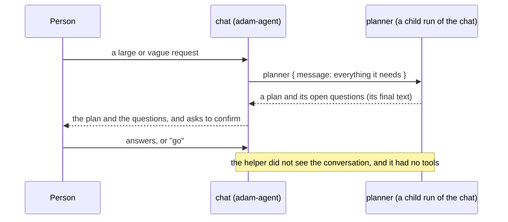
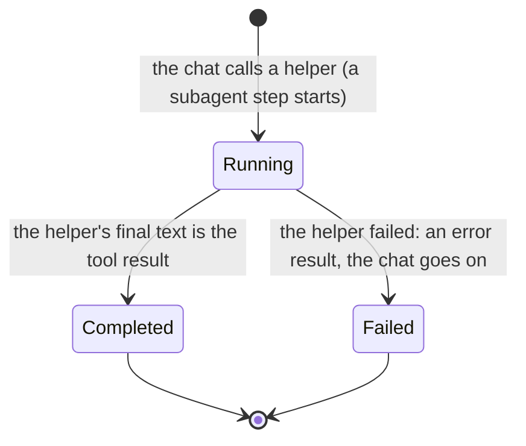

# ADR 0050 — The chat agent has sub-agents: a researcher, a writer and a planner

- **Status:** accepted (2026-10-06), on the owner's decision of that day: *"We also need a way to have sub-agents without the acp.
  So that even a simple chat shall some"*, and, asked which, his choice of **researcher**, **writer** and **planner**. Built and
  proven on mocks (the scripted model, the chart's render checks); no real model, search or sub-agent run of a real adam-agent was
  tried. Uses what adam-rs already has (sub-agents as files, [`docs/authoring.md`](https://github.com/vymalo/another-adam-rs/blob/6478fbcf0003f939c32c8f5602fe94c25eff974a/docs/authoring.md)
  at the pinned revision `6478fbc`); nothing here changes the pin.

## Context

The coder's sub-agent is OpenCode, which it starts over ACP. The owner wants the same *shape* without ACP: a sub-agent is a
folder-agent's own helper, run by the same process. adam-agent supports it as files: `agent/subagents/<name>.md` (the Claude
Code format: `name`, `description`, `tools`, `limits`; the body is the prompt) or `agent/subagents/<name>/instructions.md` with an
`mcp.json` of its own. Each is **one tool of its parent** (`SubagentTool`, input `{message}`) and a **child run** with its own
prompt, tools and limits; the call is a `subagent` step.

*Verified 2026-10-06 by reading adam-rs at `6478fbc`* (not by running it): **a sub-agent inherits nothing from its parent**
(`docs/authoring.md`: "A subagent inherits nothing from its parent, and omitting `tools:` gives it no tools"), and
`ToolCtx::start_child(agent, message)` (`crates/adam-llm-agent/src/tool.rs`) starts the child with the one message
(`user_message(message)`): no `context`, and the grant of the conversation's tools (`thread-tools/v1`) travels in the run's context
(`crates/adam-ui`, "No grant, or an expired one, offers nothing"). So **the tools a person attaches to a conversation (the
relayed web search) do not reach a sub-agent.** A sub-agent has the tools its own `tools:` names, from its own `mcp.json`.

## Decision

1. The chat agent's folder gets three sub-agents (`dev/agents/chat/agent/subagents/`, the same files in the chart's `files/chat/`):
   - **`researcher`** (`researcher/instructions.md` and its own `mcp.json`): answers a question with the sources it found, as
     links, from the search tools **it** has (`tools: ["search__*"]`); it says in its first sentence that it could not search
     when it has no search tool, and does not answer a fact from memory as if it were checked. Its `mcp.json` names the stack's mock
     web search in the dev stack (the live override: `searxng-mcp`) and the **search pod** in the chart, when `webSearch.enabled`.
     Without a search pod the chart renders the researcher **without** `tools:` and without an `mcp.json` (a pattern that matches
     no tool is refused at startup), so it exists and says it cannot search.
   - **`writer`** (`writer.md`): turns notes, an outline or facts into one Markdown document; no tools; adds nothing it was not given.
   - **`planner`** (`planner.md`): breaks a large or vague request into a short numbered plan with open questions; no tools.
2. The chat's `instructions.md` says **when** to use each one: a question that must be checked, to the researcher; a document to
   write, to the writer; a large or vague request to the planner, whose plan and questions the chat shows and **confirms with the
   person** before it does anything on the strength of it. A helper does not see the conversation, so the chat puts everything in
   `message`; what a helper returns is for the chat to read and use, not to forward.
3. The researcher's search is **its own**, not the conversation's: in the chart the chat pod gets the search pod's bearer
   (`SEARCH_MCP_TOKEN`, the same AWS property as the orchestrator's) and the search pod's NetworkPolicy admits the chat pod; in compose
   the chat has the variable and waits for `mock-mcp-search`. A person who attaches a web search to a conversation still gives it to
   the chat's own model, not to the researcher.
4. Proof: the scripted model has a script `[mock:plan]` (the chat calls `planner`; the helper's own run answers with a plan; the chat
   shows the goal and the questions and says it will not start before the person says go), played plain and as its SSE twin by
   `dev/check-agent-mocks.sh` and driven through the orchestrator by `dev/agents-e2e.sh`, which also asserts that the chat is offered
   its three helpers. The chart's render checks assert the folder's files in the ConfigMap, the researcher's `mcp.json`, the bearer
   and the policy.

## Consequences

- The chat's tool list gains `researcher`, `writer` and `planner`; a script that asserts the list exactly would break, and the
  existing ones assert only what the chat must **not** have (a code tool, a search tool) and that it has `turn_output`: unchanged.
  The persona rules of the scripted model stand aside for the markers `[mock:plan]` and `[mock:plan-sub]`.
- A call of a helper is one more model run (its turns and tokens, bounded by its own `limits`) and a `subagent` step in the thread.
  The helper's label in the step list is adam-rs's (*unverified*: `dev/agents-e2e.sh` matches the planner by its name in the step's
  label or id).
- The chart's researcher needs the search pod, an AWS property the chat reads (`search_mcp_token`, already the orchestrator's and the
  pod's), and an ingress rule. Without `webSearch.enabled` nothing of it is rendered.
- Sub-agents that **inherit** the conversation's tools would need adam-rs to start the child with the parent's context. That is
  adam-rs's decision (a child with a credential in its context is a bigger question than a helper); until then the answer is the
  researcher's own server.
- No new port, no new trait, no change to the orchestrator: the sub-agents are files of an agent folder.

## Alternatives rejected

- **A remote (A2A) sub-agent** (`a2a:` in the file) for each helper: three more services for what is a prompt.
- **The researcher as the existing `researcher` agent**, asked with `ask_agent` (ADR 0026): it needs the person to mention it, and is
  a thread of its own. A helper is the chat's, called by the model when it fits.
- **Giving the sub-agents the conversation's tools** by passing the parent's grant in the message: the grant is a credential, and
  adam-rs deliberately starts a child with the message alone.
