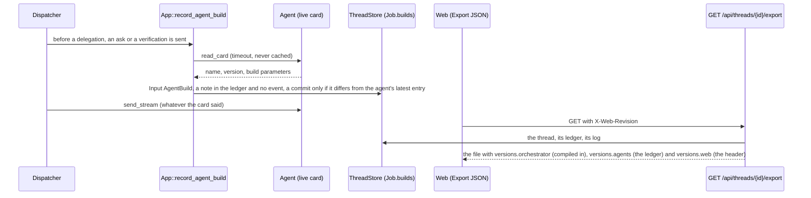
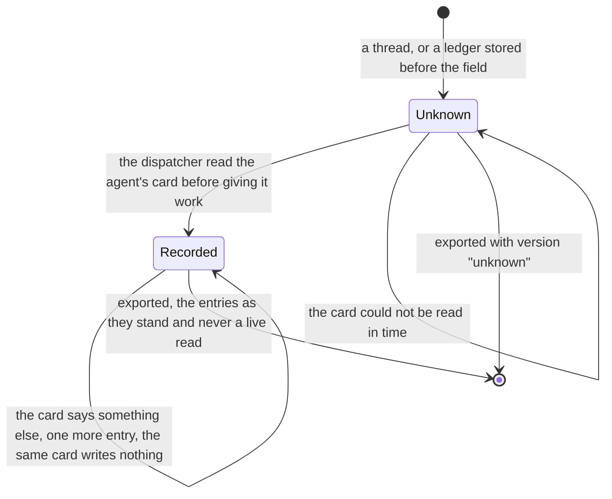

# ADR 0053 — A thread export says which builds made it

- **Status:** accepted (2026-10-07), on the owner's request of the same day, reading the production exports of
  2026-10-06 and 2026-10-07: *"check these chats exports. I think they should also include versions"*. Built on mocks and unit
  tests; nothing was tried against a deployment. Extends the export of [`docs/orchestrator.md`](../orchestrator.md#exporting-a-thread)
  (the format is unchanged: `version` stays 1) and builds on [ADR 0008](0008-platform-integration-via-a2a-extension.md) (the live
  card is read, never cached).

## Context

An export is what the owner sends a developer. The three exports that were read on 2026-10-06 and 2026-10-07 each showed behaviour
that could be a bug of the orchestrator, of the agent or of the web, and the file did not say which build had produced it: the
orchestrator image is a tag, the agent is another image (adam-rs's, [ADR 0014](0014-adam-coder-default-agent-over-a2a.md)), and
the web is a third. Whether a fix is in the thing that ran is the first question about a log, and nothing in the file answered it.
Which build **worked in the thread** is not what is deployed when the file is read: the agent may have been upgraded since, so a
live read at export time would say the wrong thing about an old thread.

## Decision

The document gains a `versions` member. `format` and `version: 1` do not move (a member was added: a reader ignores what it does not
know, the rule the document already states), and no member is ever absent: what is not known says `unknown`.

```json
"versions": {
  "orchestrator": { "version": "0.1.0", "revision": "9f1c2ab…" },
  "agents": [
    { "agent": "adam", "name": "Adam", "version": "0.3.0+abc1234", "build": { "revision": "abc1234" }, "fromJob": 1 },
    { "agent": "chat", "name": null, "version": "unknown" }
  ],
  "web": { "revision": "9f1c2ab…" }
}
```

1. **`orchestrator`** is compiled in: `version` is the crate version, `revision` is `option_env!("ORCH_BUILD_REVISION")`, which
   `orchestrator/Dockerfile` takes from a build argument of that name and `.github/workflows/orchestrator.yml` fills with the commit
   sha (`github.sha`: the merge commit on a pull request, the pushed commit on `main`). The argument is declared after the dependency
   layer, so a new commit rebuilds the orchestrator and not its dependencies. A build that was given none (a local `cargo build`, the
   compose stack) says `unknown`.
2. **`agents`** lists every agent that worked in the thread (the binding's, the actors of the log, the agents it asked), in the order
   the log names them. What each said it was is what its **live card said when the orchestrator was about to give it work**: the
   dispatcher calls `App::record_agent_build` just before a delegation, an ask and a verification are sent. It reads the card
   (`read_card`, as it is read for every send: ADR 0008) and applies `Input::AgentBuild`, which writes a note in the job ledger
   (`Job.builds`: the card's `name`, `version`, the parameters of a build extension if it lists one, and the first job it was seen in).
   The note is **not an event**. Three things decided that against the first idea, a field on an existing event:
   the first job of a thread has no start event to carry it; the events a dispatcher causes are written by the core from what an
   agent *reports*, and a card is not a report; and a new event kind needs a migration of the `events.kind` constraint and an arm in
   every projection, for a fact that never draws a card. The ledger already travels in the export (`job`) and is a JSON column, so
   the field needs no migration: a ledger stored before it has none, and the export says `version: unknown` for the agents of that
   thread. An agent whose card says something different from its latest entry gets another entry (an upgrade between two jobs
   shows twice); the same card again writes nothing, not even a commit. The next job keeps the entries (it is the conversation's,
   like the catalogs and the attached servers); a fork starts with none and records its own. At most 32 entries are kept (the newest).
3. **`web`** is the revision of the web that **asked for the file**. The export is assembled by the server, so the web cannot add to
   it after the fact: it sends `X-Web-Revision` with the request, its `NEXT_PUBLIC_BUILD_REVISION` (a build argument of
   `web/Dockerfile`, which Next inlines, and `.github/workflows/web.yml` passes the commit sha). The header is the caller's word and
   authorises nothing, like a `User-Agent`: it is written down only when it is 1 to 64 characters of letters, digits and `._+-`,
   and `unknown` otherwise, so it cannot carry anything into a file the person then sends on. A web built with none sends no header.

**What a card is.** The card is the agent's own text and untrusted: `name`, `version` and each parameter are cut to 128, 128 and 256
bytes, at most 8 parameters (`AgentBuild::new`, and again by the core when it records the note), and none is ever read as an
instruction. adam-rs puts its revision in the card's `version` as semver build metadata (`0.3.0+<sha>`, **unverified** on
2026-10-07: it is what the owner described, and a search of the adam-rs checkout read for this (`588e9b5`, not the pinned `6478fbc`) found
no such code: the change is adam-rs's, not merged); a build **extension** is
read leniently, because nothing of it is specified yet: the first entry of `capabilities.extensions` whose URI has a path
segment `build` has its scalar `params` recorded as text. Neither is required: a card that says nothing is an entry with `unknown`.

**Failure.** Recording never delays a send beyond the card timeout (3 s by default, the one every card read has) and never fails
one: a card that cannot be read records nothing, and the export then says `unknown` rather than guess.





## Consequences

- A developer who gets a file knows which orchestrator commit, which agent version and which web build produced it, without asking.
  The three are different questions and have three sources (compiled in, the agent's own card at the time, the caller's header),
  each of which can be absent and says so.
- `Input` gained a variant (`AgentBuild`), `Job` a field (`builds`, omitted when empty, so an older reader of the ledger sees what it
  always saw), `AgentCardInfo` two (`name`, `build`: a required field for whoever builds one by hand, say so in the PR), and
  `orch_api::export::document` a parameter. No event kind, no wire event, no migration.
- One more card read per delegation, ask and verification, in the dispatcher and not in the person's request: the send path already
  reads the card, so this is a second GET of a small document (bounded by the card timeout) and not a new dependency. A deployment
  whose agent's card is slow pays up to 3 s per send for a note that may then say nothing; the alternative (taking the identity
  from the card the adapter read for the send) changes the adapter port for every implementation and was left for when a
  measurement asks for it.
- The web's `X-Web-Revision` is the browser's word: a person can send any revision (a plain one) in the file they download. The file
  is theirs, and it is not a source of authority anywhere.
- Open: whether adam-rs gives its card a build extension, and its URI; this reads whatever has a `build` path segment and is
  changed when that is specified.

## Alternatives rejected

- **A field on an event** (`job_started`, or the first `agent_status`). The first job has no start event, a status is the agent's report,
  and old events would carry nothing for the threads that matter most (the ones already exported). A ledger entry costs the same and
  rewrites no log.
- **A live card read at export time.** It would say what runs now, not what ran: a thread exported a week after an upgrade would
  carry the wrong version, which is worse than `unknown`.
- **The web adds its revision to the blob it saves.** It would have to parse and rewrite a file up to 32 MiB in the browser, and the
  server's file would differ from the web's; a header costs one line and keeps one writer of the document.
- **The revision in the image tag only.** The tag is not in the file, and a rebuilt image under the same tag says nothing.

### Status note, 2026-10-07: adam-rs says its build (adam-rs 8e1133d)

The open question above is answered by adam-rs ADR 0028, in adam-rs since `d9d5ea4`, and the pin is `8e1133d` ([ADR 0014](0014-adam-coder-default-agent-over-a2a.md), its note of this
day). *Verified 2026-10-07* by reading adam-rs at `d9d5ea4` and `8e1133d`, which changes none of it (not by running it): the card's `version` is `0.1.0+<first 7 characters of the revision>`
(`0.1.0+unknown` for a build without one), and the card lists the optional extension `https://agents.vymalo.com/a2a/extensions/build/v1`
(`adam_a2a::BUILD_EXTENSION`), whose `params` are `revision` (the whole sha) and `folderDigest` (`sha256:...` of the agent's files). Its URI has the path
segment `build` and both parameters are strings, so the lenient reading of this ADR records them as they are and needs no change. *Unverified*: an
export of a thread on the new image (no stack was started).
