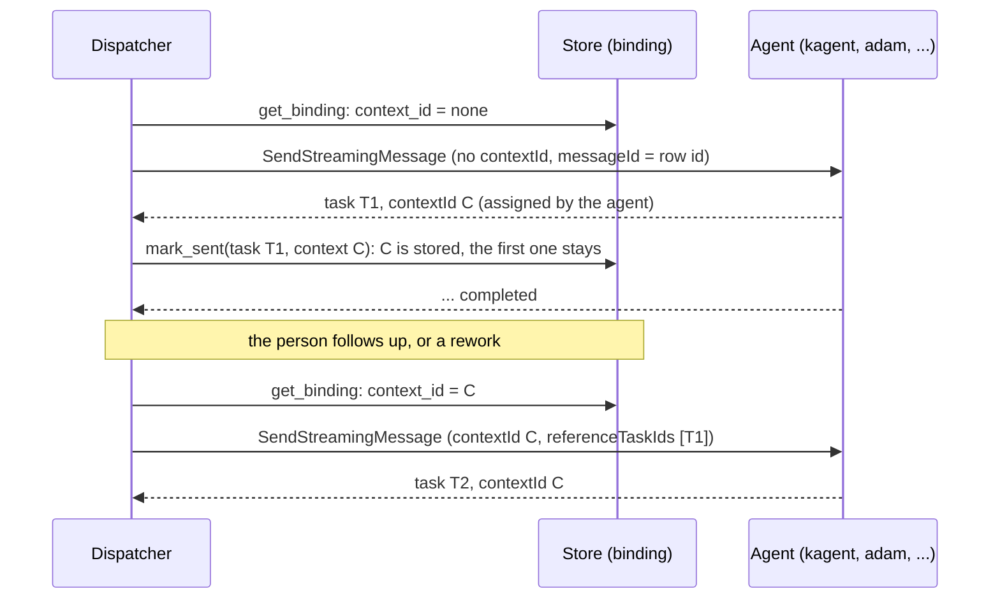
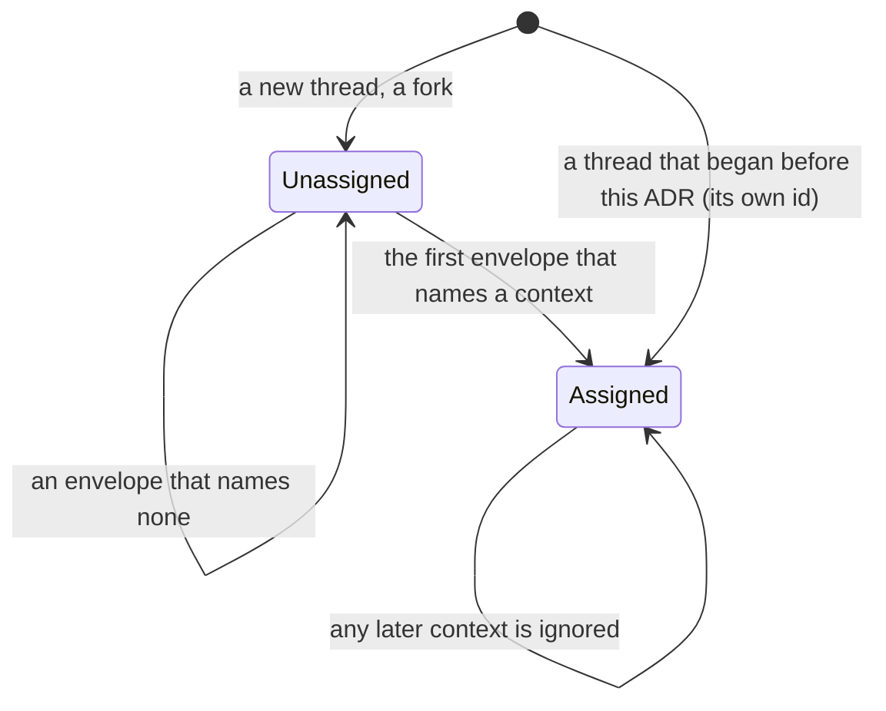

# ADR 0055 — The agent assigns the A2A context: a thread's first message names none, and the binding adopts what the agent answers

- **Status:** accepted (2026-10-07), on the owner's approval of the same day. Refines [ADR 0021](0021-context-across-a2a-tasks.md) (which
  said the thread's id is the context of every message) and [ADR 0029](0029-forking-a-thread-copies-its-log.md) (a fork's context). Built
  and proven on mocks and unit tests, including agents that **refuse a context they did not create**; the kagent scenarios that prove it
  against kagent itself ([`dev/kagent-e2e.sh`](../../dev/kagent-e2e.sh)) have **not run yet**, CI is their first run.

## Context

[ADR 0021](0021-context-across-a2a-tasks.md) made the thread's id the `contextId` of every message of the thread, the first included,
and the verifier's and an asked agent's contexts derived names (`<thread>-verify-<n>-<m>`, `<thread>-ask-<agent>`). That is a client
inventing the context. The protocol says the other way round: *verified 2026-10-07*
(<https://a2a-protocol.org/latest/topics/life-of-a-task/>, "ContextId Generation"): "When a client sends a message for the first time,
the agent responds with a new `contextId`." Most agents tolerate an invented one (adam-rs does: it takes the context a message names and
makes one when it names none, `crates/adam-a2a-runtime/src/backend.rs`, *verified 2026-10-07* at adam-rs `origin/main`, and at the pinned
`6478fbc`). **kagent does not**: its `resolveSend` loads the Session of a message's `contextId` and answers `ErrUnauthorized` when there is
none; only a message with no `contextId` and no `taskId` creates a conversation (*verified 2026-10-07 by reading kagent 1.x's source*,
`go/core/internal/service/session/interactions.go`; not run). So a thread whose agent is kagent could never get its first message
through. The orchestrator also never adopted a context an agent returned.

## Decision

1. **The first message to an agent in a conversation names no `contextId`.** `SendRequest.context_id` is `Option<String>`; both adapters
   (A2A and the in-process adam) put it in the message only when it is `Some`. A message that continues a task still names its
   `taskId`.
2. **The binding adopts the agent's context, once.** The thread's binding (`a2a_bindings`, the job ledger that already holds the task, its
   state and the revision, written in the commit that causes it or by `mark_sent`) gets `context_id` as `Option`: `None` from creation;
   `BindingUpdate.context_id` carries the `contextId` of the first envelope the dispatcher reads (the one that records the message as
   sent) and of every envelope after, and **the store sets it only while it is `None`** (`COALESCE(context_id, $new)`; the in-memory
   store the same; an empty string is none). The first context stands: a poll that names another one changes nothing. Every later
   message of the thread, a follow-up, a rework, an answer, a steer, a new job, is sent in it. A fork is a thread: its binding starts
   empty and adopts its own context with its agent's first answer.
3. **Where it lives.** Not an event: the log is the conversation, and a context is the A2A side of it, like the task id and the state
   that the binding keeps beside it (ADR 0001 counts the job ledger as persistent state). The pure core never sees it; the dispatcher
   reads it from the binding for every send, so a restarted or second process sends what the first one learned. `Store` gains no method:
   `NewThreadRecord.context_id` and `AgentBinding.context_id` become `Option<String>` and `BindingUpdate` gains a field (an implementer of
   `ThreadStore` must apply it with the once-only rule; the conformance case `the_binding_adopts_the_agents_context_once` says how).
   Migration `0019_binding_context_assigned.sql` drops `NOT NULL` from the column.
4. **A thread that began before this ADR keeps its context.** Its binding holds its own id, which is not `None`, so it is sent as before
   and never replaced. Roll the build out to every replica **before** any of them creates a thread: an older build fails to read a
   binding whose context is `NULL`.
5. **The verifier names no context.** A verification is one message in a conversation of its own, and nothing is ever sent into it
   again, so there is nothing to record: the request names none and the verifier starts one. `orch_core::verifier_context` is no longer
   sent (it stays, with its tests, as the name an older build used).
6. **An asked agent's context is kept on the ask ledger, per job.** The first ask of an agent in a job names no context; the dispatcher
   tells the core the context the agent answered in with the task (`Input::AskSent.context_id`, recorded once on the `Ask`), and the
   next ask of the same agent **in the job** is written with it (`Command::Ask.context`, `OutboxPayload::Ask.context`) and goes on in it.
   A later job starts a new conversation with the agent: the ledger is forgotten with the job, and the context
   `<thread>-ask-<agent>` (`ask_context`), which used to survive jobs, no longer names a new ask's. A row written by an older build that continues or refers to a task, and so names no context, is
   sent in `ask_context`, where its earlier tasks live.
7. **The lookup after a crash works without a context.** `AgentClient::find_task_by_message` takes `Option<&str>`: a message sent with no
   context is looked up by its id alone (`ListTasks` unfiltered, bounded by the same page limit; the in-process adam adapter derives the
   task id from a missing context, which is exactly what the runtime does). The mocks and the conformance suite say what an adapter must do.
8. **No agent is asked to change.** An agent that accepts a made-up context also accepts none, and answers with its own. The conformance
   case `a_message_with_no_context_starts_one` says it for every adapter and for the scripted agent.

## Consequences

- A thread's agent can be kagent, and any agent that creates its own conversations. The scenario against kagent 0.10 and 1.x is the
  proof; until CI runs it, kagent is proven only by reading its source.
- The binding's context is `null` in the thread export (`binding.contextId`, `docs/api/chat-api.yaml`) until the agent's first answer.
- **A send that reached the agent but whose first envelope was never read** (the process died, the stream broke before the first
  event) leaves the binding without a context, and the retry sends the first message again with none. adam-rs derives the task's id from
  the message id, so the retry reaches the same task; another agent may start a second conversation and leave the first idle. The lookup
  by message id (decision 7) is what narrows it; it is best-effort, as it always was.
- The mock agents (`dev/wiremock/*`) answer a request that names no context with one of their own, the message id (`default=msgId`), and
  echo one it is given; the scenario scripts that found a thread's requests by its context find them by the first message's words and
  then by that context.
- The in-memory `ScriptedAgent` and the test fake (`orch-testsupport`) can be made strict (`reject_unknown_contexts`,
  `FakeAgentOptions::strict_contexts`): they refuse a context they did not assign, as kagent does, so a test proves the orchestrator never
  names one it was not given.

## Alternatives rejected

- **Keep the thread id and tell kagent's operators to accept it.** It is kagent's, not ours, and the protocol puts the context on the
  agent's side.
- **An event field the core folds** (`agent_context_assigned`): the log would carry A2A bookkeeping no reader wants, and the core has no
  use for it; the binding is where the task id, the task state and the revision already are.
- **Rewriting a started thread's context** to an agent-assigned one: there is nothing to rewrite to; the agent already knows the thread
  id as its context.
- **Sending no context ever** and relying on `taskId`: a rework and a follow-up after the turn is over start a new task, and without
  the context the agent cannot say the new task belongs to the conversation.

## Verified

- *Verified 2026-10-07* (<https://a2a-protocol.org/latest/topics/life-of-a-task/>): the agent responds with a new `contextId` to a
  first message.
- *Verified 2026-10-07* (adam-rs `origin/main`, `crates/adam-a2a-runtime/src/backend.rs`, `ids.rs`): a message without a `contextId`
  gets `a2a::new_context_id()`, the task is `task_id_for(agent, subject, None, messageId)`, and a repeat of the same message finds the
  run it made; `6478fbc`, the revision this repository pins, has the same.
- *Verified 2026-10-07 by reading, not running* (kagent 1.x, the owner's reading of `resolveSend`): a `contextId` that is no Session
  of its own is `ErrUnauthorized`; no `contextId` and no `taskId` creates a conversation.
- *Unverified:* kagent 0.10's behaviour for the same (the scenario reads it).
