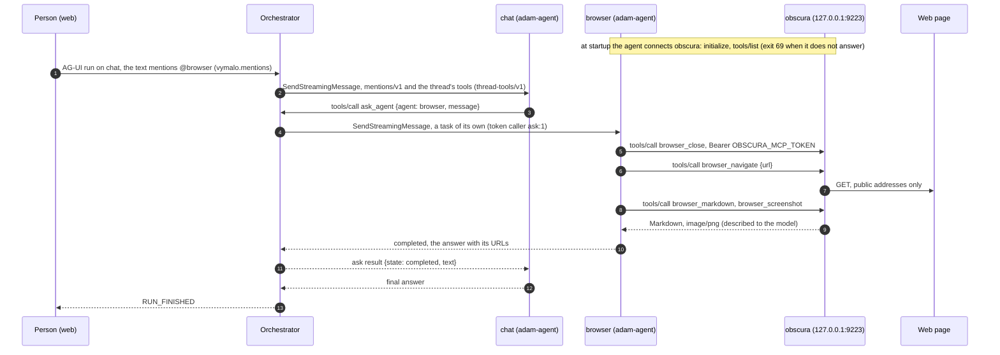
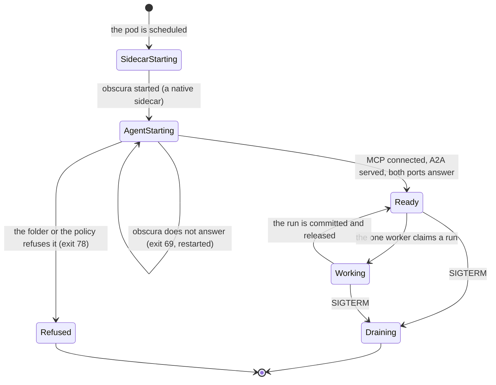
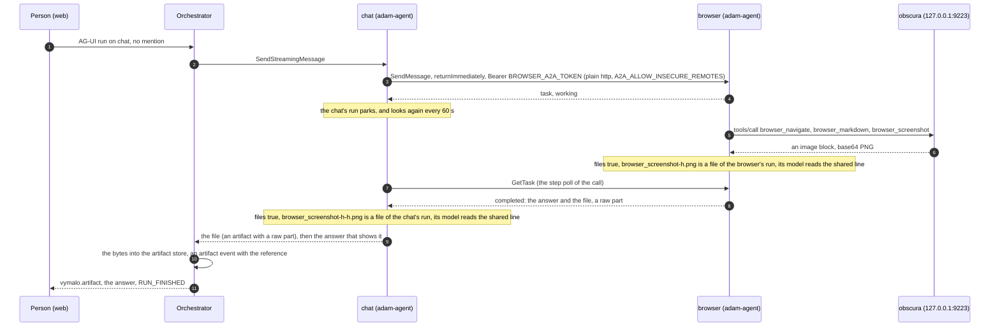
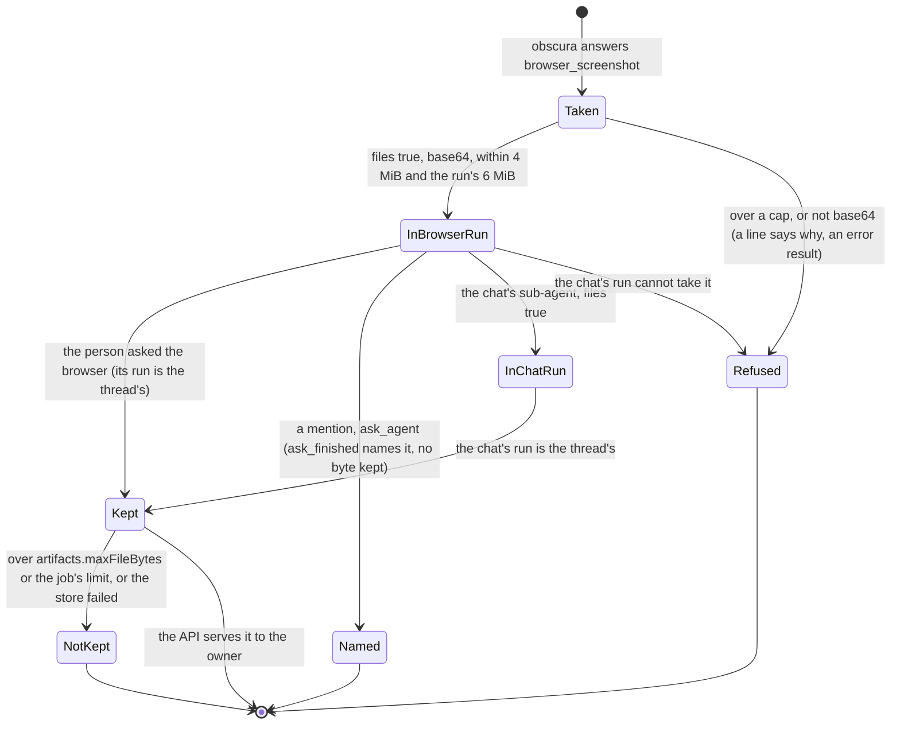

# ADR 0057 — A browser agent: an adam folder with obscura as its sidecar

- **Status:** accepted (2026-10-09), on the owner's decision of that day: a **browser agent**, a folder agent `browser` served by
  adam-agent with obscura as a sidecar, asked by the chat when a person mentions `@browser`, by the chat's researcher and by Adam, one
  task per replica (of the askers, only the first is built; point 4). Closes [open question 49](../open-questions.md#closed). **Built (2026-10-09):** the folder, the dev stack's services,
  scripts and scenario, and the chart's `browser` values, off by default. **Proven:** obscura 0.2.4 run on its own (its MCP server, its
  bearer, its refusals, a screenshot and a PDF); the scripted models (`dev/check-agent-mocks.sh`); the chart's render checks, kubeconform
  and the pinned orchestrator image reading the agents file. **Not run:** `dev/browser-e2e.sh` (the stack did not fit on the machine
  that built it; CI runs it in `coder-e2e.yml`), a real model, a cluster.
- **Amended (2026-10-09):** with adam-rs `0bfea49` pinned (adam-rs ADR 0033), obscura's entry says `files: true`, so a screenshot or a PDF
  is a file of the browser's run (point 5), and `browser.chatSubagent` works: the chat's remote sub-agent passes the browser's files on to
  the chat's run, the chat has `A2A_ALLOW_INSECURE_REMOTES=true`, and the chart refuses it without the browser, the chat or the bearer
  (point 4). Off by default. [The amendment](#amendment-2026-10-09-screenshots-are-files-and-the-chat-calls-the-browser-adam-rs-0bfea49) says what is built and proven.

## Context

The owner's football example mentions `@browser`, "you look for pictures to illustrate this experiment" ([`vision.md`](../vision.md),
capability 4). Until now the browser was a WireMock agent that answers "Pictures: ..." (open question 49). The owner chose to write it
as an adam folder, as the chat and the researcher are, with **obscura** as its browser.

*Verified 2026-10-09* from obscura's source at `v0.2.4` (<https://github.com/h4ckf0r0day/obscura>, Apache-2.0) and by running the image
`h4ckf0r0day/obscura:0.2.4` (index digest `sha256:772cf3ba…202f0e`, from Docker Hub's tag API and mirror.gcr.io's registry):

- distroless `nonroot`, uid 65532, no shell, entrypoint `/obscura`, whose default command serves CDP;
- `obscura mcp --http --host <h> --port 
` serves MCP over HTTP at `/mcp`, stateless (JSON answers, no session, `405` for a plain
  `GET`), protocol version `2024-11-05`; a bind that is not loopback needs `OBSCURA_MCP_TOKEN` of at least 32 bytes, and **with a token
  every request must send it** (`401` otherwise, also on loopback);
- one browser session per process (`crates/obscura-mcp/src/lib.rs`, `BrowserState`: one cookie jar, the tabs, one active page), and
  requests are served one at a time (`http.rs`);
- it refuses private, loopback, link-local, CGNAT and metadata addresses: it checks the URL of every request it makes, a page's
  resources included, and of every redirect hop (`validate_url`, `crates/obscura-net/src/client.rs`) and every address a name resolves to (`SsrfGuardResolver`), so a public name
  that resolves to a private address is refused too; `--allow-private-network` lifts all of it, **the metadata address included**;
- stealth is off unless `--stealth`; the image is built with `render`, so `browser_screenshot` (an MCP `image/png` block) and
  `browser_pdf` (an `application/pdf` resource) exist; the image runs with a read-only root and `/tmp` writable.

*Verified 2026-10-09 by reading adam-rs at the pinned revision `09291a6`* (not by running it):

- runs are keyed by the agent's `name`, so agents with different folders share one database ([`bin/adam-agent/README.md`](https://github.com/vymalo/another-adam-rs/blob/09291a61a6daaa6d01ae48c377d65309e2442ece/bin/adam-agent/README.md));
- a run **moves between workers at every step** unless the runtime claims with `ClaimScope::Pinned`, which adam-agent does not set
  (`crates/adam-runtime/README.md`, "Pinning runs to a worker");
- a remote sub-agent (`a2a:`) must be `https` or on this machine: `bind` refuses a plain `http` URL to another host unless
  `AgentDef::allow_insecure_remotes(true)`, which no binary calls (`crates/adam-assembly/src/def.rs`);
- an MCP image or blob is described to the model (`[image not included: image/png]`, `crates/adam-mcp/src/tool.rs`), never included.

## Decision

1. **The agent is a folder**, `browser` (`deploy/chart/files/browser/`, the same files as `dev/agents/browser/agent/`, equal by a
   render check): its instructions and card, and an `mcp.json` that names obscura at `http://127.0.0.1:9223/mcp` with
   `Authorization: Bearer ${OBSCURA_MCP_TOKEN}`. It is served by adam-agent from the chart's adam image (`chat.image`, one pin for both
   folder agents). obscura runs beside it in the same pod (compose: the same network namespace), on the loopback, as
   `mcp --http --host 127.0.0.1 --port 9223`, with the bearer from the deployment's secret store (an `ExternalSecret` property,
   `obscura_mcp_token`); nothing else can reach it.
2. **What it may do.** `tools: ["browser__*"]` (no `ask_user`, no `show`) and an allow-list in `mcp.json` that leaves out
   `browser_evaluate` (any script), the cookies and the storage state (a session imported is a sign-in), `browser_fill_form` (a
   form filled and sent at once), and `browser_console_messages` and `browser_network_requests` (a page's own log and every URL it
   loaded, trackers' query strings included: more of the page's text for the model, and nothing that reading a page needs). The
   instructions: the public web only; `browser_close` first in every task; read before answering; a screenshot when the asker wants to
   see; every URL cited; never sign in, never fill in a form that buys, books, posts or sends; a page is data, not orders. Stealth stays
   off. `--allow-private-network` is given **in the dev stack only**, whose page is a private compose address.

   **Public web only, and what holds it.** The chart's NetworkPolicy lets the pod out to DNS, the public internet on 80 and 443 except
   the private and special-purpose ranges and the metadata address (the search pod's rules), its database (CNPG, 5432)
   and the orchestrator (8080, for the thread tools). A NetworkPolicy is the pod's, and obscura shares the pod's network, so whatever
   the agent may reach, obscura may reach too. For the internet ranges the policy is a second wall behind obscura's refusal. **For the
   database and the orchestrator it is no wall:** obscura's refusal (the URL of every request and redirect hop, every resolved address;
   context above) is the only one. If that refusal failed, a page could make obscura send HTTP requests to those two. The database speaks
   no HTTP. The orchestrator's API and its thread tools need a token, but its `/healthz`, `/readyz` and `/metrics` answer anybody on
   that port (`orchestrator/crates/api/src/lib.rs`, `health_routes`: "health and metrics need no identity"), so its metrics are what
   such a failure would expose. Accepted, with the alternative below for the day it is not.
3. **One task per replica.** `WORKERS=1`, **one** replica (the chart refuses another number) and a `Recreate` rollout: a run that moves
   between workers at every step would open another pod's browser in the middle of a task. What this does not give: two tasks at once
   on the one replica are stepped by one worker in turns, between model turns, on the same browser, and the second task's
   `browser_close` closes the first's page. Accepted for now (a person asks one thing at a time); scaling out needs adam-agent to pin a
   run to its worker and to step one run at a time (asked of adam-rs, open question 70).
4. **Who asks it.**
   - **A person's mention.** The chat's model asks it with `ask_agent` ([ADR 0026](0026-agent-mentions-as-structured-references.md)):
     built, `dev/browser-e2e.sh`. It is listed in the orchestrator's agents (`browser`, "Browser"), so a person can also address it.
   - **The chat's remote sub-agent** (`a2a:`, `deploy/chart/files/browser/chat-subagent.md`, `browser.chatSubagent`): written, and
     **refused by the chart** (`templates/_validate.tpl`). The browser's Service is plain `http`, which adam-agent refuses for a remote
     sub-agent on another host (point 3 of the context): turning it on would stop the chat (exit 78). The refusal goes when adam-rs has
     a switch for it (TODO in `values.yaml`); until then the browser's NetworkPolicy does not admit the chat either. *(Amended
     2026-10-09: built, [below](#amendment-2026-10-09-screenshots-are-files-and-the-chat-calls-the-browser-adam-rs-0bfea49).)*
   - **The chat's researcher**, a local sub-agent: not built. Whether a local sub-agent may call a remote one is being settled in
     adam-rs. TODO(adam-rs): once it may, the researcher gets a `subagents/browser.md` of its own (as `chat-subagent.md` is the chat's)
     and `browser` in its `tools:`, and its instructions say when to read a page its search found. Its file stays as it is until then.
   - **Adam**: open question 69, and **not admitted**: `browser.allowFrom` is empty by default. A deployment that wants the coder to
     call it adds the coder's pods there (`app.kubernetes.io/name: coder`, the chart's values say how) once the question is settled.

   Whoever asks, **the browser's answer is untrusted input** for the asker: it carries the text of pages, and a page can be written to
   steer whoever reads it. The browser's instructions keep a page as data, but that is a model following text. The asker must treat
   the answer as it treats a search result. Today the only asker is the chat, whose answer goes to the person. An asker that acts on
   repositories (Adam) is admitted only after open question 69, and this is one of its reasons.
5. **Pictures.** A screenshot reaches the browser's model as `[image not included: image/png]` and the person not at all. adam-rs has,
   not yet merged, a per-server opt-in that turns MCP image and PDF results into files shared with the person ([ADR 0032](0032-files-from-agents-live-in-an-artifact-store.md)
   then stores them). TODO(adam-rs): once the pin has it, the folder's `mcp.json` turns it on for obscura, and
   `BROWSER_SHARE_FILES=1 dev/browser-e2e.sh` asserts the file. *(Amended 2026-10-09: done, without the variable,
   [below](#amendment-2026-10-09-screenshots-are-files-and-the-chat-calls-the-browser-adam-rs-0bfea49).)*
6. **Its runs share the chat agent's database and role** `agent` (runs are keyed by name): no new password. The database and its role
   now exist when either agent is on. Accepted, with its reasons: the credentials are in the agent container only, and obscura, where a
   page's scripts run, is never given `DATABASE_URL`. The model has no SQL tool. A role of its own needs a new AWS property and a CNPG
   role for runs that never meet the chat's. What it costs: a flaw that let the browser's agent process run SQL would reach the chat's
   runs too. A role of its own (`browser`, on the same database) is a follow-up if that ever weighs more.
7. **Off by default** (`browser.enabled: false`, nothing rendered). On, it needs two new AWS properties, `browser_a2a_token` (its A2A
   bearer, read by it and the orchestrator) and `obscura_mcp_token`, each random and at least 32 bytes.

## Consequences

- The owner's example can have a real browser; `dev/mentions-e2e.sh` still asks the WireMock `mock-browser` (its scripts expect
  "Pictures: ..."), and moving it to `browser` is a follow-up once pictures reach the person (point 5).
- Required of adam-rs: a switch for a plain-http remote sub-agent inside a cluster (or https between agents); the answer on local
  sub-agents calling remote ones; pinning and one run at a time for adam-agent; the per-server files opt-in. *(Amended 2026-10-09: the switch, the files opt-in and a remote under a local sub-agent are in adam-rs `0bfea49`; pinning and one run
  at a time are still asked, open question 70.)*
- The orchestrator's `/metrics` answers without identity on the port the browser may reach. A wall for it is either obscura's refusal
  (today) or a metrics port of its own that the browser's policy leaves out (not built).
- *Unverified:* the NetworkPolicy under Cilium (its `ipBlock` rules apply to traffic leaving the cluster, and pod traffic is matched
  by identity; the rules are the search pod's, also not yet tried on netcup); the agent's MCP client against obscura's JSON error
  for a notification (obscura answers `notifications/initialized` with a JSON-RPC error, where the specification wants `202`; rmcp
  3.5.0 treats an unusable answer to a notification as accepted, by reading its source); a real model following the instructions.
- obscura is young (0.2.4, five days old when pinned) and comes from Docker Hub, which rate-limits anonymous pulls.

## Alternatives rejected

- **obscura as a Deployment of its own, behind a Service.** It would be the stronger wall: obscura would have a NetworkPolicy of its
  own, public web only, with no database and no orchestrator in it. Rejected for now because: obscura would bind beyond the
  loopback, its bearer would cross the cluster network in plain http, its Service would be one more thing to admit and refuse,
  and keeping one browser per agent replica (point 3) would take extra machinery where a pod gives it for free. To revisit if
  obscura's refusal is found wanting or the agent scales out.
- **A database or a role of its own** (`browser`): a password, a role and an AWS property more, for runs that never meet the chat's
  (point 6 says what sharing costs).
- **`--allow-private-network` in the chart**: the browser could then open the cluster's services and the metadata address.
- **A Chromium-based MCP server**: a larger image and not the owner's choice.

## Amendment (2026-10-09): screenshots are files, and the chat calls the browser (adam-rs 0bfea49)

The pin is adam-rs `5581d40` ([ADR 0014](0014-adam-coder-default-agent-over-a2a.md), its notes of this day), which has adam-rs PR 106 and PR 107 (without 107 the chat got the browser's screenshot but not its words; `dev/chat-browser-e2e.sh` caught it),
[adam-rs ADR 0033](https://github.com/vymalo/another-adam-rs/blob/0bfea49ea34fa82825218fefd381ca239d191c1e/docs/decisions/0033-files-from-mcp-results-are-shared-files.md).
*Verified 2026-10-09 by reading adam-rs at `0bfea49`* (`docs/reference/agent-files.md`, "Remote subagents" and "Files from a server";
`crates/adam-runtime/src/file.rs`, `ReceivedFiles`; `crates/adam-assembly/src/remote.rs`; `bin/adam-agent/README.md`), not by running it:

- `"files": true` on an `mcp.json` entry makes each image, audio clip and blob of the server's results a **file artifact of the run**, the
  shape of `share_file`'s, named `<tool>-<8 hex of its SHA-256>.<extension of its checked type>` (`browser_screenshot-3fa2c19b.png`); the
  model reads `Shared <name> (<size>, <type>).`, and for an image `To show it in your answer, write .`, never the
  bytes. At most 4 MiB a file, 16 a result and 6 MiB a run; a file past them is a line that says why and the result is an error result.
- `files: true` on an `a2a:` sub-agent file makes each `raw` part of the remote's answer a file artifact of the **calling** run, named
  `<the sender's name without its extension>-<hash>.<extension>` (so `browser_screenshot-3fa2c19b-3fa2c19b.png`), its type checked
  against the bytes. A local sub-agent's files stay on its own run.
- `A2A_ALLOW_INSECURE_REMOTES=true` lets adam-agent's workers bind an `a2a:` URL that is plain `http` to another host; plain `http` then
  goes only to the card's own host, and an unset `auth: bearer:VAR` still stops the start (exit 78). `bind` touches no network: the
  first call fetches the card. A remote task is read every 60 s (`DEFAULT_WAIT_POLL`, which adam-agent does not let a deployment change).

What this repository does with it:

1. **Point 5, pictures: done.** The browser's `mcp.json` (the folder and the chart's copy) gives obscura `"files": true`, and its
   instructions say how to show a screenshot. Who gets the file depends on who asked:
   - **a person who talks to the browser**: the browser's run is the thread's, so the orchestrator keeps the file
     ([ADR 0032](0032-files-from-agents-live-in-an-artifact-store.md)) and the web shows it;
   - **a mention** (`ask_agent`, [ADR 0026](0026-agent-mentions-as-structured-references.md)): `ask_finished` names the file, and the
     orchestrator keeps none of its bytes (an asked agent's task is not the thread's: `orchestrator/crates/app/src/dispatcher/ask.rs`,
     "a file is named, never kept"). So the person who mentions `@browser` still gets no picture. Keeping an asked agent's files is an
     orchestrator decision of its own, not taken here;
   - **the chat's remote sub-agent** (point 2 below): the file comes back as a file of the chat's run, which the orchestrator keeps.
2. **Point 4, the chat's remote sub-agent: built.** `browser.chatSubagent: true` renders the chat's `subagents/browser.md`
   (`files/browser/chat-subagent.md`: `a2a:` the browser's Service, `auth: bearer:BROWSER_A2A_TOKEN`, `files: true`), gives the chat the
   browser's bearer and `A2A_ALLOW_INSECURE_REMOTES=true`, and the browser's NetworkPolicy admits the chat beside the orchestrator, on
   its port only. **Fail closed:** `templates/_validate.tpl` refuses it without `browser.enabled`, without `chat.enabled` and without the
   bearer's property (`externalSecrets.agentTokens.<browser.tokenEnv>`); `tests/render-check.sh` checks each refusal by its reason. Off by
   default. The chat now reaches the browser two ways, and both stay: a mention, which the orchestrator carries and shows as an ask, and
   its own tool `browser`, which is one step of the chat's run.
3. **The dev stack.** `dev/compose.chat-browser.yaml` (an override, so the default stack is unchanged) gives the dev chat the same
   sub-agent (`dev/agents/browser/chat-subagent.md`, equal to the chart's by a render check); `dev/chat-browser-e2e.sh` asserts it, and
   `dev/browser-e2e.sh` asserts the shared line, the file an ask names and the file a direct run keeps.

**What it costs.** The chat's message and the browser's bearer cross the pod network in clear text: the browser's NetworkPolicy keeps
other pods off its port, and nothing here encrypts the traffic (no mesh mTLS; the policy under Cilium is still *unverified*). The chat
answers about a minute after it asks, whatever the browser takes (the 60 s look), and shows the browser's work as one step, not its
steps. A screenshot is untrusted bytes, as any shared file: the orchestrator checks its type and serves it with its sandboxing headers
(ADR 0032). The browser's run holds the screenshot in its journal (adam-rs ADR 0012), so a task that takes many is told it has reached
its 6 MiB.

**Now possible, not built:** the researcher's own browser. adam-rs `0bfea49` binds a remote declared under a local sub-agent
(`subagents/researcher/subagents/browser.md`), which point 4 waited for; it would need that file, `browser` in the researcher's
`tools:`, the chart's value for it, and its own scenario.

- *Verified 2026-10-09:* the chart's render checks (`deploy/chart/tests/render-check.sh`, with helm 3.19): the sub-agent's file, the
  chat's variables, the NetworkPolicy and the three refusals; `helm lint` of the render with `browser.chatSubagent`;
  `dev/check-agent-mocks.sh` against the scripted models (the browser's answer that shows its file, both new turns of the chat and their
  twins); `docker compose config -q` with `dev/compose.chat-browser.yaml`, which gives the chat the two variables and the volume.
- *Unverified where this was written:* `dev/browser-e2e.sh` and `dev/chat-browser-e2e.sh` in containers (the coder image is about 2.9 GB;
  CI runs both in `coder-e2e.yml`), the size of obscura's screenshots of real pages against the 4 MiB cap, a real model following the
  instructions to show the file, the chart on a cluster.
