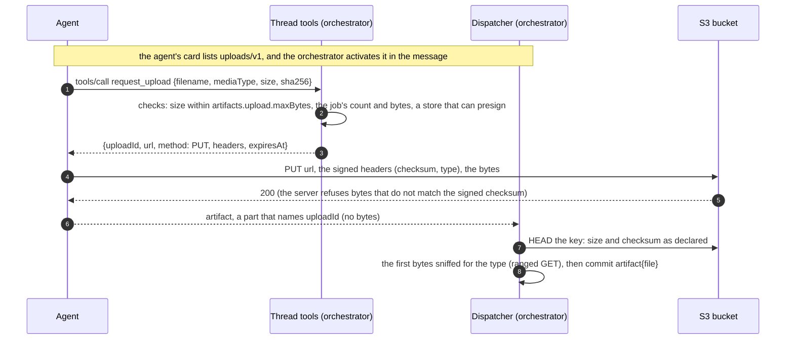

# ADR 0058 — Large files go up through a presigned URL the orchestrator gives the agent

- **Status:** proposed (2026-10-09), on the owner's request of that day; **design only, nothing is built**. It is the "presigned
  upload minted by a thread tool" that [ADR 0032](0032-files-from-agents-live-in-an-artifact-store.md) (decision 5) leaves for later,
  and it needs the S3 store (that ADR's amendment of 2026-10-09).

## Context

A file reaches the thread as an A2A artifact whose part holds the bytes (`raw`, base64 in the JSON-RPC message), at most
`artifacts.maxFileBytes` (10 MiB) and 100 MiB a job ([ADR 0032](0032-files-from-agents-live-in-an-artifact-store.md), decision 7).
adam-rs keeps a file in its journal and caps it at 4 MiB, 6 MiB a run (`MAX_ARTIFACT_FILE_BYTES`, `MAX_RUN_FILE_BYTES` of
`crates/adam-runtime`, *verified 2026-10-09* by reading adam-rs at `09291a6`). A report of 30 MB, a data set or a recording does not
fit, and should not cross the message, the agent's journal and the worker's memory at all.

`object_store` 0.14.2, which the S3 store is built on, presigns a request: `Signer::signed_url_opts(method, path, expires_in,
SignedUrlOptions)` folds query parameters and **headers** into a SigV4 query signature, for example `x-amz-checksum-sha256` and
`content-type`, which the recipient must then send as signed (*verified 2026-10-09* by reading `src/signer.rs` and `src/aws/mod.rs`).

## Decision (proposed)

```mermaid
stateDiagram-v2
  [*] --> Issued: request_upload accepted
  [*] --> Refused: too large, over the job's limits, no store that presigns
  Issued --> Uploaded: the agent's PUT (the URL works until it expires)
  Issued --> Expired: no PUT before expiresAt
  Uploaded --> Referenced: the artifact names it and the object is as declared
  Uploaded --> Unreferenced: never named; left to the orphan sweep (open question 46, not built)
  Expired --> [*]
  Refused --> [*]
  Referenced --> [*]
  Unreferenced --> [*]
```

1. **An optional extension, `uploads/v1`** ([ADR 0008](0008-platform-integration-via-a2a-extension.md)): an agent that can upload lists it on its card;
   the orchestrator activates it on the messages it sends, with its limits (`maxBytes`, `ttlSecs`) in the message's metadata. An agent
   that does not list it is unchanged, and so is a deployment whose store cannot presign (the directory store): the extension is not
   activated, and `raw` stays the only way.
2. **The agent asks for a slot over the thread's own tools** (`thread-tools/v1`, already authenticated by the per-thread token):
   `request_upload {filename, mediaType, size, sha256}`. The key is the content's hash, `threads/<thread>/<sha256>`, as for every file,
   so the agent declares the hash and the size first. The answer is a **presigned `PUT` for that one key**, its signed headers
   (`x-amz-checksum-sha256` of the declared hash, `content-type`), and its expiry: **five minutes** by default. The agent never holds a
   store credential, and the URL opens one key, for one method, for minutes.
3. **"One-time" is what the key makes it.** S3 has no single-use URL: within its few minutes the URL can be used again. Because the
   key is the hash and the checksum is signed, a second `PUT` can only write the same bytes again, which is harmless, and nothing else.
4. **The agent hands back a reference, not bytes**: its artifact's part names the `uploadId` (in the extension's metadata). The
   dispatcher checks the object before it commits, as it checks inline bytes ([ADR 0032](0032-files-from-agents-live-in-an-artifact-store.md),
   decision 6): a `HEAD` (the size, the checksum), the first bytes read for the type, then `artifact{file}`. An object that is not as
   declared is deleted and the turn says "the file could not be kept".
5. **The port grows by two optional calls**, `presign_put(key, meta, ttl)` and `head(key)`, each with a default that says
   "not supported" (a store that cannot presign is not broken by it; [ADR 0009](0009-swappable-implementations-at-build-time.md)).
   The S3 store implements them with `object_store`'s signer.
6. **Limits** are configuration: `artifacts.upload.maxBytes` (a GiB, say), `artifacts.upload.ttlSecs` (300), and the job's existing
   count and bytes, which now count uploaded files too.
7. **The agent must reach the bucket.** An agent in the cluster reaches the release's RustFS only if its NetworkPolicy lets it in
   (today it admits the orchestrator alone); an agent outside needs the bucket at a public https address. The deployment decides which
   agents get the extension.

## Consequences

- A file of any size the deployment allows, with no bytes in A2A, in the agent's journal or in the orchestrator's memory.
- adam-rs needs a client side: a `share_file` that, past its inline cap, asks for a slot, uploads and hands back the reference.
- *Unverified:* that RustFS refuses a `PUT` to a presigned URL without the signed checksum header, or with other bytes (it checks
  a checksum header on an ordinary signed request, the amendment of ADR 0032 says); presigned URLs through an ingress for agents outside.

## Alternatives rejected

- **The orchestrator receives the upload and streams it to the store** (a `PUT /uploads/<id>` of its own): no store reachable by
  agents, but every large file through the orchestrator's pods and its edge, which is what this avoids. Kept as the fallback for a
  store that cannot presign, if one is ever needed.
- **Store credentials for the agent** (a key per agent): a credential an agent could leak, for a whole bucket.
- **A multipart upload** for very large files: `object_store` presigns one request only (its signer's documentation); to be added if
  files over five gigabytes (S3's limit for one `PUT`) are ever wanted.
