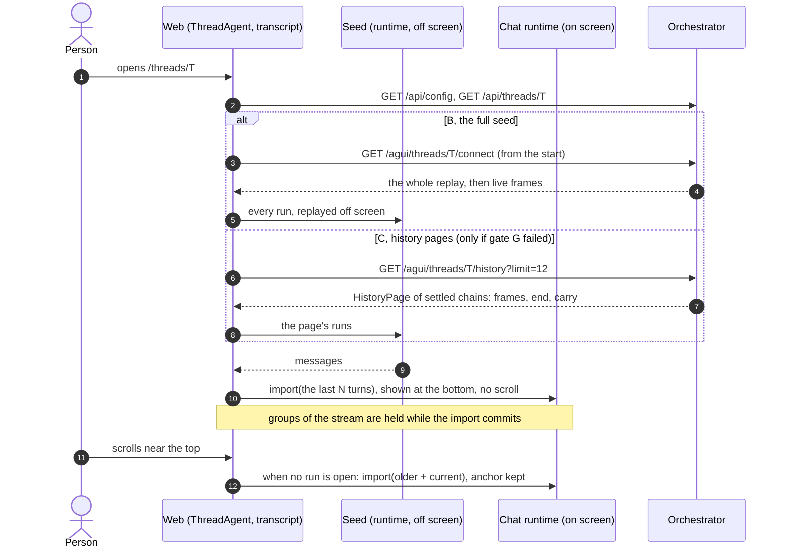
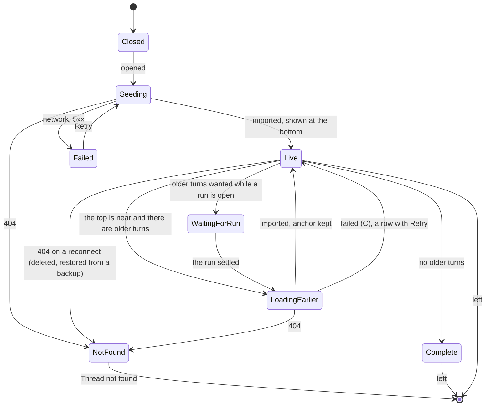

# ADR 0059 — A thread opens at its end: the transcript is seeded off screen and shown at the bottom; a paged history read is built only if that is not enough

- **Status:** proposed (2026-10-09, revised the same day after a review), on the owner's words of that day: *"load messages from the bottom, so that
  long sessions won't load in front of the eyes of the user, while scrolling down – it takes 3-4s for long chats and it's annoying."* **Design only;
  nothing is built.** The names, defaults and limits are the planner's and the owner may revisit them. It builds on the static export and the desktop
  app of the open pull request (`wip/tauri`), cited below as "after the static-export PR". Extends [ADR 0012](0012-ag-ui-user-facing-protocol.md) and
  [ADR 0029](0029-forking-a-thread-copies-its-log.md) (a fork's log is a copy, so a fork is shown like any thread). The copy that a device keeps is
  [ADR 0060](0060-the-client-keeps-a-bounded-copy-of-recent-threads-behind-a-chatstore-port.md). The paged read, if it is built, is specified in
  [`docs/api/history.md`](../api/history.md) (proposed, not in `chat-api.yaml`).
  *What the review changed:* a full replay seeded off screen is now the first thing built after the web-only fix, and the orchestrator's cursor waits
  for a measured need (gate G); pages cover settled chains only and the stream says the open one; the fold's cost when reading back is named;
  the seed's safety conditions are listed; the slices are reordered so that nothing ships before the panels are right.
- **Amended (2026-10-09, measured):** slices 0 and 1 are built, and a spike of option B was measured; [below](#measured-2026-10-09-slice-0-slice-1-and-a-spike-of-b).
  **Gate G fails for B**, so C (the history read) is the path after slice 1.
- **Amended (2026-10-09, built, slices 4 and 5):** the fold (`orch_agui_projection::History`), the three routes (`getThreadHistory`, `getSharedThreadHistory`,
  `getPublicSharedThreadHistory`, in `surface-agui`, not in `orch-api`, beside the connect routes they share their authorisation with), the configuration
  (`ui.history`, `server.history`) and the contract (`chat-api.yaml`, [`docs/api/history.md`](../api/history.md) now the rules of a built contract) are
  built; the `carry`, the web and the measurement follow in the slices below. The server's cost-lowering option is the **web's growing pages**, measured
  [below](#measured-2026-10-09-the-history-read).

## Context

What happens when a person opens a long thread, from reading the code on 2026-10-09 (a claim not read is marked *unverified*):

1. **There is one read, and it is everything.** The only way for a client to get a thread's events is `connectThread`
   (`GET /agui/threads/{id}/connect`), from `Last-Event-ID` or from the first event. The server reads the log from event 1 and folds all of it,
   writing frames only after the cursor ([`agui.md`](../api/agui.md#connect-binding): "a connect reads the thread's log from the start, even for a
   cursor at its end"; `orchestrator/crates/agui-projection/src/connect.rs`). `exportThread` is the whole log as a file. The store's `list_events`
   is forward only (`after`, `limit`: `orchestrator/crates/ports/src/store.rs`).
2. **The web applies the runs one after the other.** `ThreadAgent` (`web/src/features/chat/lib/agui/thread-agent.ts`) turns the stream into
   `ExternalRun`s and `driveExternalRuns` (`live-runs.ts`) applies each: wait until the transcript shows the earlier runs (`untilShown`, a React
   render), `thread.append` the person's message, wait again, `thread.startRun`. Its comment says why: `append` hangs a message off the transcript
   the runtime shows, and a run applied too early would start a branch and replace the earlier runs. A thread of *R* runs is *R* sequences of renders
   over a transcript that grows, and `useTurnSteps` and `useThreadFilesList` (and `useSources` while the panel is open) read all the messages on
   every change. *Unverified:* that this is where the 3 to 4 seconds go. The owner measured the symptom; we have not (slice 0).
3. **The page scrolls while it fills.** The viewport is `ThreadPrimitive.Viewport` with the class `scroll-smooth` and no scroll prop
   (`web/src/components/assistant-ui/elements/thread.aui.tsx`). `@assistant-ui/react` 0.15.22 defaults `scrollToBottomOnRunStart` and
   `scrollToBottomOnInitialize` to true and calls `scrollTo({top: scrollHeight, behavior})`, with `behavior: "auto"` on a run start, which the CSS
   turns into a smooth scroll (`useThreadViewportAutoScroll.ts` in the installed package; props documented at
   <https://www.assistant-ui.com/docs/api-reference/primitives/thread>; *verified 2026-10-09*). The transcript is drawn from the first replayed run
   (`Thread loading={!loaded}` shows a skeleton only while there are no messages), so the person sees turns arrive and the page chase the bottom.
   *Unverified:* that `thread.runStart` fires for every replayed run; slice 1 finds out.
4. **Panels read the whole transcript.** Sources (`features/panel/lib/sources.ts`) is derived from every message, including the links in the
   agents' words; the steps tree numbers turns by position ("Turn 3"); the usage ring folds every `vymalo.usage` frame
   (`features/chat/lib/usage.ts`); an A2UI `Image` may only name a file that some message of the thread kept
   (`features/chat/lib/a2ui/prepare.ts`, `checkImage`). A transcript that holds only the end of a thread shows these wrongly unless something else
   supplies the rest.
5. **Reading back a thread in pages costs a fold each time.** Every `STATE_SNAPSHOT` carries state built from the start of the log (job number,
   catalog, tools, fork origin, usage), and the `Projector` keeps every message id, text record and run id it has seen (`message_ids`, `texts`,
   `run_ids`: `projector.rs`). A page of older turns therefore needs a fold of the whole prefix before it, and a store index of where turns start
   cannot skip it. Reading a thread of *L* events back in pages of *p* events costs *L²/p* event folds: 20 000 events in pages of 200 is two million.

## Options considered

| | What | Verdict |
|---|---|---|
| A | **Web only.** Hold the transcript back until the replay is applied, then show it at the bottom; no smooth scroll except the button. | Removes the scroll the owner complains of, none of the cost. **Slice 1.** |
| B | **Seed the full replay off screen in one import, and show only its tail.** The whole log comes as today, is replayed in a runtime nobody sees, and the visible runtime is given the last *N* turns in a single `import`; older turns are in the off-screen transcript and join it on scroll-up. | **No server change**, one mechanism (the seed) that C and ADR 0060 need anyway. Its cost is the wire and the off-screen replay; if that meets the target it is the whole answer. **Slices 2 and 3, then gate G.** |
| C | **A finite `history` read of the same projection**, from the newest settled chain back, and the stream resumed at its `end`. | The orchestrator's cursor. More work on both sides, and each older page folds the prefix again (context 5). **Built only if B misses gate G.** |
| D | `?tail=<n>` on `connectThread`. | Older turns need a second mechanism anyway, and a cached open and a first open would differ. Rejected. |
| E | Offset paging of raw events, or of REST messages, projected in the browser. | The projection is Rust and golden-tested (ADR 0012); a second one in TypeScript is a second truth. Rejected. |
| F | One `MESSAGES_SNAPSHOT` for the old turns. | A message list has no run, subagent or actor markers, which the turns and the steps tree read. Rejected. |

## Decision (proposed)

1. **Order, and gate G.** Measure (slice 0). Stop the visible scroll (slice 1). Build the seed (slice 2) and open threads with it (slice 3). **Gate
   G:** on a thread of 1 000 turns whose turns are as large as slice 0 found real ones to be, the person has a usable page at the bottom within
   **1 second of navigating** (p50, a mid-range laptop, the compose stack), no `scroll` event follows, and the memory held is below a figure we
   write down. If B meets it, C is not built: `docs/api/history.md` stays as a rejected proposal, and the slices 4 to 9 below are dropped. If it
   misses, C is built, and **its target is stricter, because it adds a request**: the response in **300 ms** at the server for a thread of 10 000
   events (the fold, the read and the serialisation, p50), and the page usable **500 ms after it arrives**.
2. **Chains and turns (for C).** A *chain* is the events from one that opens a run while none is open to the first event after which no run is open (a
   steered message extends it: the projector closes the open run and opens its own in one event, `RunClose::Superseded`, so no settled point lies
   between). A *turn* is a chain that starts with a person's message. A page is a whole number of **settled** chains, never the open one, so its last
   event is a settled point, `end`, which is a clean `Last-Event-ID`; the stream says the chain in progress, in full. Cuts fall at chain starts only,
   including for the byte cap, so a thread with no person's message is bounded too ([`history.md`](../api/history.md#chains-turns-and-what-a-page-holds)).
3. **The read (for C).** `getThreadHistory` and the two shared operations: `before`, `limit` or `since`, or `after` for a catch-up; the answer is
   JSON with `start`, `end`, `head`, `earlier`, `projection`, `frames` and, for a page that is not a catch-up, a `carry`; `after` brings an `anchor`.
   Pages tile a **replay** over a fixed `ThreadMeta`, not "the stream": a live stream's frames are rewritten by `LiveOverlay::logged`
   (`live.rs`: the continued message loses its `START`, its `CONTENT` is cut to the unsaid words, a given-up message is renamed `<id>~final`) and the
   early snapshots carry the thread's current title and description (`meta_of`). So a client **stores only what a page returned**, never a frame
   written after a stream caught up, and takes the title, description and share from the resource.
4. **What the fold costs, and what would lower it.** The pure fold keeps a ring of chain buffers, so memory is bounded by the page and nothing in the
   core, the store port or the event model changes. The cost per page is a connect's (a read and a fold of the prefix), and reading back is *L²/p*
   (context 5). Options that work, in the order we would try them: **(a)** the web asks for pages that grow (20, 40, 80 turns), which makes the sum
   *L log L*; **(b)** a silent fold that builds no frames before the page (the work is the state, not the output); **(c)** a short-lived in-process
   cache of projector states at chain starts, per replica, as a latency optimisation only (the log decides, invariant 3); **(d)** a stored projector
   checkpoint, which is as large as the thread, so only at coarse intervals and only if the state is first made bounded; **(e)** a projection change
   that makes the state at a settled point small (the dedupe sets limited to the job, the catalog and usage read from their own columns), which is
   the real fix and a change of every golden. A stored index of where turns start is **not** on the list: it names where to stop reading, not what
   the state is. Slice 0 measures the cost of reading a 10 000-event thread back to its start, with and without (a).
5. **Capability by configuration (for C).** `GET /api/config` gains `ui.history` (`initialTurns` 12, `pageTurns` 20, `projection`); its presence
   means the route exists, so a static web, an app built last month and an orchestrator that has not rolled out all work together, falling back to
   the full replay of B. `server.history.maxTurns` and `maxPageBytes` bound a page; the newest chain is returned whole.
6. **The web opens at the end.** *With B:* the stream is read as today but into the **off-screen** runtime; when it has caught up, the last *N*
   turns are imported into the visible runtime in one step and shown at the bottom. The skeleton shows until then; nothing moves on screen because
   nothing is on screen while it happens. The off-screen transcript stays in memory (this is the "memory held" of gate G) and serves scroll-up, the
   usage fold, the files an `Image` may name, the labels and Sources. *With C:* the page's frames are seeded the same way and the stream resumes at
   `end`.
7. **The seed is the one mechanism, and it has conditions.** The runtime has no "insert before". `useAgUiRuntime` passes `onImport` and `setMessages`
   to `applyExternalMessages`, so `thread.import(repository)` replaces the transcript with a linear chain of the messages given, keeping their ids;
   `thread.export()` gives the current ones (`@assistant-ui/react-ag-ui` 0.0.62, `@assistant-ui/core` 0.3.21, *verified 2026-10-09*). The messages must
   be built by the library's own aggregator, or the turns would differ from the live ones: a **scratch runtime**, a second `useAgUiRuntime`
   mounted without a view, driven by the same `ExternalRun` replay, whose `export()` is imported into the visible one. `applyExternalMessages` does
   more than replace: it clears `pendingA2uiAction` and `pendingA2uiResumeOwner`, drops the resume target if its message is missing, and can
   **hard-replace** the session when an existing message's parent differs (`AgUiThreadRuntimeCore.js`, *verified 2026-10-09*). So:
   - **When.** An import is made only when no message is streaming, **no interrupt or form is pending and no A2UI action is staged**
     (`unstable_getPendingInterrupts()` is empty, `ThreadAgent` has no staged action), and no send is in flight. Otherwise it waits.
   - **Older turns wait for the end of a run.** While a run is open, scroll-up shows the turns already in the visible runtime and a row that says the
     rest will load when the agent is done; the import happens at the next settled point. (With B they are already in memory, so only the import waits.)
   - **Nothing is delivered during an import.** `ThreadAgent` holds the stream's groups from the moment an import begins until it has committed, then
     releases them in order; the connect is opened, or resumed, only after the first seed (ADR 0060's reader follows the same rule).
   - **Repeated ids.** `applyExternalMessages` keeps the *first* copy of a repeated message id (`seen.has(id)`), so an older page put in front would
     hide a newer copy. The merge of `older ++ current` removes a repeated id **keeping the newest**. This matters for exactly the activities that
     are said again, whole, by a later event: an A2UI surface keeps the id `a2ui-<seq of its first event>` and is snapshotted again by every event
     that touches it, in later turns too, until a new job clears it (`projector.rs`, `surfaces`, `forget_job`). C's tests list every such id
     ([`history.md`](../api/history.md#rules), rule 5).
   - **Gate of slice 2**, on every golden and on generated logs: the transcript built by replaying one run at a time equals the seeded one (message by
     message, part by part, ids aside); this includes **a surface updated in a later turn**, **a steering message** (two runs in one event), a fork, a
     pending question and a staged action (the import waits and loses nothing), and a run in flight (its message keeps streaming, groups held during
     the import arrive after it). A seed of 20 turns takes a time we write down. If it fails: first a small patch that exports the aggregator
     (`web/patches/UPSTREAM.md` shows the package is patched already), then a converter of our own checked against the goldens.
8. **Older turns on scroll-up, without a jump.** A sentinel above the first turn (an `IntersectionObserver` with a margin of about a screen) asks
   for the next older turns when there are any; one at a time; a row says "Loading earlier messages" and, on failure (C only), offers Retry. The
   position is kept by an **anchor**: before the import the first turn in view and its offset from the top of the viewport are noted, after the
   commit (a layout effect, before paint) the viewport is moved so the same turn has the same offset, `behavior: "instant"`. The browser's scroll
   anchoring is not relied on: `overflow-anchor` reached Safari in 27 (MDN browser-compat-data, *verified 2026-10-09*), and older iOS web views are
   Safari's. `scroll-smooth` stays only on the "Scroll to bottom" button; the run-start scroll is off while a seed is applied.
9. **The live stream continues as before.** Nothing in `connectThread`, the run route, `ThreadAgent`'s grouping, reconnect and backoff, live text,
   steering or cancel changes. A run from another tab or a webhook arrives as an `ExternalRun` and is appended after the seed, as now.
10. **Forks and edits need nothing special.** A fork's log holds the parent's events up to the cut with the same `seq`, then `thread_forked`, then its
    own: its end is its own turns and the marker, and its older turns are the parent's conversation. `seqOfUser` and `endOfRun`, which "fork from
    here" and "Edit" read, exist for the turns that were delivered, and the buttons exist for those. The versions picker (`listBranches`, REST) is
    untouched; a link to another version (`/threads/<id>#m-<seq>`) may name a message far from the end: see 13.
11. **Panels.**

    | Readout | With B (full seed) | With C (pages) |
    |---|---|---|
    | Transcript, the steps of a turn | the visible runtime holds the last *N* turns; the rest is in the off-screen transcript | the loaded turns |
    | Token ring, totals, groups | the usage fold has seen every run (the off-screen replay folds them) | **server:** `carry.usage` is the *initial state* of the fold, then the loaded pages' usage frames; the invariant is that `summarize` equals the whole thread's |
    | Files an `Image` may name | all the thread's files, from the off-screen transcript | **server:** `carry.files` (at most 500) unioned with the loaded pages' |
    | Turn labels ("Turn 3") | exact: all turns are known | **server:** `carry.turns` offsets the position (default until the owner decides: the server's numbering; it counts chains with agent output and may differ from the web's `drawsPart` by an odd card-only run; question 71) |
    | Sources | on demand, from the off-screen transcript and the visible one | **lazy:** from the loaded turns, "Sources from the last N turns" and a button that loads the rest; no automatic crawl (default until the owner decides; question 72) |
    | Branch versions, Export JSON, fork, edit | REST and the server | unchanged |

12. **Shared and public readers** are shown by B exactly as the owner's thread (their stream is the reader's projection). With C they get the same
    routes over their projections; the public one holds one of the link's stream permits for as long as it folds, and is rate limited like its
    connect. Nothing is stored for them (ADR 0060).
13. **Links to an old message.** `useScrollToMessage` waits for `#m-<seq>` in the DOM. With B the message is in the off-screen transcript and is
    imported with the turns around it; with C the web asks for `since=<seq>` until it is loaded or `maxTurns` turns are reached; beyond that it opens
    at the end and offers "Load earlier". The visible transcript stays contiguous.

### Measured (2026-10-09): slice 0, slice 1, and a spike of B

*Measured 2026-10-09* with the slice-0 harness (`web/e2e/open-long-thread.spec.ts`, `web/e2e/open-probe.ts`, the mock's
`POST /__mock/long-thread?turns=n`), unthrottled headless Chromium on a shared, loaded 4-core machine. The absolute numbers are that machine's;
their shape is the finding.

- **The replay is quadratic, and it is the client's.** The last turn is in the page after 4.1 s for 20 turns, 12.4 s for 50, 36 s for 100 and
  139 s for 200. The wire and parsing cost 98 ms for 200 turns, and layout and style 3%. The rest is the runtime applying run after run.
- **Slice 1 (built): the transcript is not drawn while the log replays,** then is drawn whole and scrolled at once. Scroll events after the first
  turn drop from 58 and 158 (40 and 200 turns) to 0. First paint and final scroll go from 9.2 s / 9.7 s to 6.3 s at 40 turns, and from
  75.9 s / 77.0 s to 39.1 s at 200. Hiding a mounted transcript removed the scroll but not the cost, so the hold does not mount it.
- **The spike of B (measured, not merged):** `thread.import` itself takes 1 to 7 ms and one draw of the imported transcript 0.36 s to 2 s. The
  scratch runtime that makes the transcript costs 230 to 270 ms a run, so a full seed is slower than slice 1 (40 turns: 10.7 s against 6.3 s; 200:
  46.5 s against 39.1 s). It also logged React error #185 14 to 19 times per 200-turn open, and 1 open in 6 never finished. **B misses gate G by far.**
- **What `import` resets**, as measured (`runtime-import.dom.test.tsx` on the spike branch):
  - the transcript is replaced, with its ids kept;
  - a pending interrupt survives only if its message is in the import;
  - an open run is not canceled, but the person's message that opened it is lost and its reply comes back as a new last message;
  - a queued A2UI click is forgotten.

  `thread.startRun` resolves before the run ends, so a replay counts as done when its last run *starts*.

So the cost is per run applied, and it grows with the transcript. The next step is C: the history read, so that a first open applies at most
*N* turns, plus slices 4 to 9 behind the flag.

### Measured (2026-10-09): the history read

*Measured 2026-10-09* on the same shared 4-core machine, release build, a synthetic thread of 12 000 events (1 000 turns of a message, two steps, a usage report,
the agent's words, a file and the end): `orchestrator/crates/agui-projection/tests/history_cost.rs`.

- **The server.** The newest 12 turns fold in **61 ms** (p50 of 9), well inside the 300 ms the target allows for the read, the fold and the serialisation, so
  neither a cache of projector states (option c) nor a silent fold (option b) is built.
- **Reading back.** Pages of 20 turns back to the start of the thread fold 306 000 events in 1.33 s over 50 pages (*L²/p*); pages that grow (20, 40, 80, 100)
  fold 85 000 in 0.49 s over 12 pages. The option built is **(a): the web asks for growing pages**.

### What a first open costs

| | Today | B, the full seed | C, history pages |
|---|---|---|---|
| Orchestrator reads and folds | the whole log | the same | the same, and again for each older page (context 5) |
| On the wire | every frame | every frame | the frames of *N* turns and the carry |
| In the browser | *R* runs applied one by one on screen | *R* runs replayed off screen, one import of *N* turns | at most *N* runs seeded, one import |
| Memory | the transcript | the transcript off screen and on | the loaded turns |
| Unknown until slice 0 | how the 3 to 4 seconds divide between the fold, the wire and the renders | whether the wire and the replay of a 1 000-turn thread of real size fit one second | the fold's share on 10 000 events, and the cost of reading back |

## Consequences

- The visible scroll goes in slice 1 whatever else happens; the wait is cut by B if its numbers allow, and by C if they do not.
- The seed is a second instance of a library hook and a set of conditions around `import`. If the gate of slice 2 fails, the cost moves to a patch of
  `@assistant-ui/react-ag-ui`.
- If C is built, the projection gets a **version** and a digest table, the contract gains three operations and the web a generated client, and
  `GET /api/config` gains `ui.history`; an older orchestrator or web keeps working.
- Turn labels, Sources and `Image` get server help or a visible "from the last N turns" only with C; each is a rule to keep equal to the web's, and
  the tests that compare a windowed reading with the whole one are the guard.
- The loaded transcript grows as the person scrolls back and is not windowed out of view. Virtualising turns out of view (`@tanstack/react-virtual`
  is already a dependency, used by the steps tree) is a later slice if measured, and it costs browser find-in-page.
- A device copy (ADR 0060) needs canonical frames: with C they come from `history`; without C, from the replay phase of a connect (before it caught up).

## Facts

- *Verified 2026-10-09:* the connect route folds from event 1 (`surface-agui/src/connect.rs`, `app.rs` `events_after`); `list_events` is forward only;
  `events` has the primary key `(thread_id, seq)` (`0001_init.sql`); the web's replay path (`live-runs.ts`); `scroll-smooth` and the library's scroll
  defaults; `thread.import` reaches `applyExternalMessages`, which clears the pending action and owner, may hard-replace, and keeps the first copy
  of a repeated id; the projector closes an open run and opens another in one event for a steering message (`projector.rs`); a surface keeps
  `a2ui-<first seq>` (`projector.rs`); `LiveOverlay::logged` rewrites logged frames (`live.rs`); the projector is built from the thread's current title
  and description (`surface-agui/src/run.rs`, `meta_of`); `overflow-anchor` support starts at Chrome 56, Firefox 66, Safari 27
  (<https://github.com/mdn/browser-compat-data>, `css/properties/overflow-anchor.json`).
- *Unverified:* where the 3 to 4 seconds go; that `thread.runStart` fires for each replayed run; that `import` is safe while a run streams (the
  conditions above are what we expect it takes); the fold time of a 10 000-event thread and of reading it back; the size of a real turn (the goldens
  are mocks) and so the wire cost of B; that the scratch runtime's messages equal the live ones; that the runtime gives each message an id that the
  merge can dedupe.

## Open questions for the owner

[`open-questions.md`](../open-questions.md) 71 and 72, with the defaults used here **until the owner decides**: turn labels keep the server's
numbering (71); Sources loads on demand (72).

## Implementation plan

Thin slices, each with the test that closes it. Slices 0 to 3 need no server change.

| # | Slice | Done when |
|---|---|---|
| 0 | **Measure.** Generators of long threads (200, 1 000, 5 000 turns) for the web's mock and `orch-testsupport`; the byte size of real turns from exported threads; timings of the fold, of **reading a 10 000-event thread back to its start page by page**, of the wire and of the first paint; a Playwright spec counting `scroll` events during an open. | The numbers are in this ADR's status; the spec fails today on "no scroll after the transcript is shown". |
| 1 | **Hold and reveal (web only).** The transcript is not shown until `loaded && !replaying`, then shown at the bottom; `scroll-smooth` only on the button; `scrollToBottomOnRunStart` off while replaying. | The slice-0 spec passes; the existing specs pass; a jsdom test of the reveal gate. |
| 2 | **The seed.** The scratch runtime, `export` + `import`, the conditions of decision 7 (when, deferral, held groups, newest copy of a repeated id). | The equality on every golden and generated log, including a surface updated in a later turn, a steering message, a fork, a pending form and a staged action, and a run in flight; the timing of a 20-turn seed is recorded. |
| 3 | **Open with the full seed.** Replay into the scratch runtime, import the last *N* turns, scroll-up from memory with the anchor, the 404 path. | Playwright against the mock: a 1 000-turn thread opens at the bottom with at most *N* turns in the DOM and no `scroll` event; scroll-up moves the anchor at most 1 px; a live run continues; **gate G is read from the slice-0 harness and written into this ADR.** |
| 4 | *(only if G fails)* **The fold.** `orch-agui-projection::history`: chains, the ring, the byte cap, `settled`, `anchor`, the digest table with its CI check. | The tiling and self-containment properties of `history.md` over every golden and generated logs (steer, fork, open chain at the end, no person's message, frameless tail). |
| 5 | *(only if G fails)* **The routes and the configuration.** `App::history`, the three operations, `ui.history`, `server.history.*`, metrics (pages, events folded, fold seconds), the cost-lowering option of decision 4 that slice 0 chose; the contract moves into `chat-api.yaml`. | `surface-agui` contract test; authorisation and 400 cases; the public route's permit; `config.md` and the schema. |
| 6 | *(only if G fails)* **The web's transport and window.** The generated client, a pure `Transcript` (pages, continuity), growing page sizes, the mock server answers `history`; scroll-up from pages. | Vitest on the pure part (a gap or an overlap between pages is an error); the mock's contract test; Playwright scroll-up over the mock's pages. |
| 7 | *(only if G fails)* **The carry.** `usage`, `files`, `turns` on the server; the web builds its folds from them. | Rust: carry plus page equals the whole on the usage goldens; vitest: `summarize` equal; labels stable when an older page loads. |
| 8 | *(only if G fails)* **Sources on demand, deep links.** "Load earlier turns"; `since` for `#m-<seq>`. | Playwright: a link to a message 300 turns back lands on it; beyond the cap it opens at the end and says so. |
| 9 | *(only if G fails)* **Open from the tail, behind `ui.history.windowed` (off by default) until 7 and 8 are in**, then on. | Playwright: with the flag on, a long thread opens from `history`; with `ui.history` removed, the full seed runs; the flag flips in the same change that lands the last of 7 and 8. |
| 10 | **Docs.** `agui.md`, `web/README.md`, `architecture.md` (diagrams), `docs/api/README.md` status. | `node tools/docs-check/check-docs.mjs` is green; every diagram node exists in the code. |
