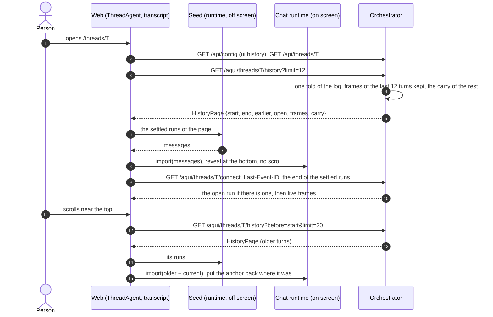
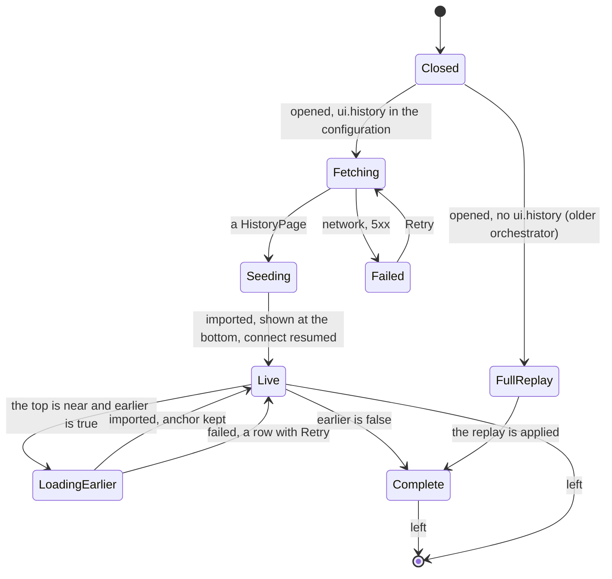

# ADR 0059 — A thread opens at its end: the log is read in pages from the newest turn back, older turns load on scroll-up

- **Status:** proposed (2026-10-09), on the owner's words of that day: *"load messages from the bottom, so that long sessions won't load in front
  of the eyes of the user, while scrolling down – it takes 3-4s for long chats and it's annoying."* **Design only; nothing is built.** The names,
  defaults and limits are the planner's and the owner may revisit them. It builds on the static export and the desktop app of the open pull request
  (`wip/tauri`), cited below as "after the static-export PR". Extends [ADR 0012](0012-ag-ui-user-facing-protocol.md) (the connect stream stays
  the way to follow a thread; this adds a second, finite read of the same projection) and [ADR 0029](0029-forking-a-thread-copies-its-log.md)
  (a fork's log is a copy, so a fork is paged like any thread). The copy of these pages that a device keeps is
  [ADR 0060](0060-the-client-keeps-a-bounded-copy-of-recent-threads-behind-a-chatstore-port.md). The contract is
  [`docs/api/history.md`](../api/history.md) (proposed, not in `chat-api.yaml`).

## Context

What happens when a person opens a long thread, from reading the code on 2026-10-09 (a claim not read is marked *unverified*):

1. **There is one read, and it is everything.** The only way for a client to get a thread's events is `connectThread`
   (`GET /agui/threads/{id}/connect`), from `Last-Event-ID` or from the first event. The server reads the log from event 1 and folds all of it,
   writing frames only after the cursor ([`agui.md`](../api/agui.md#connect-binding): "a connect reads the thread's log from the start, even for a
   cursor at its end"; `orchestrator/crates/agui-projection/src/connect.rs`). `exportThread` is the whole log as a file. The resource API lists
   threads, not events, and the store's `list_events` is forward only (`after`, `limit`: `orchestrator/crates/ports/src/store.rs`).
2. **The web applies the runs one after the other.** `ThreadAgent` (`web/src/features/chat/lib/agui/thread-agent.ts`) turns the stream into
   `ExternalRun`s and `driveExternalRuns` (`live-runs.ts`) applies each: wait until the transcript shows the earlier runs (`untilShown`, a React
   render), `thread.append` the person's message, wait again, `thread.startRun`. Its comment says why: `append` hangs a message off the transcript
   the runtime shows, and a run applied too early would start a branch and replace the earlier runs. A thread of *R* runs is *R* sequences of renders
   over a transcript that grows, and `useTurnSteps` and `useThreadFilesList` (and `useSources` while the panel is open) read all the messages on every change. *Unverified:*
   that this is where the 3 to 4 seconds go. The owner measured the symptom; we have not (slice 0).
3. **The page scrolls while it fills.** The viewport is `ThreadPrimitive.Viewport` with the class `scroll-smooth` and no scroll prop
   (`web/src/components/assistant-ui/elements/thread.aui.tsx`). `@assistant-ui/react` 0.15.22 defaults `scrollToBottomOnRunStart` and
   `scrollToBottomOnInitialize` to true and calls `scrollTo({top: scrollHeight, behavior})`, with `behavior: "auto"` on a run start, which the CSS
   turns into a smooth scroll (`useThreadViewportAutoScroll.ts` in the installed package; props documented at
   <https://www.assistant-ui.com/docs/api-reference/primitives/thread>; *verified 2026-10-09*). The transcript is drawn from the first replayed run
   (`Thread loading={!loaded}` shows a skeleton only while there are no messages), so the person sees turns arrive and the page chase the bottom.
   *Unverified:* that `thread.runStart` fires for every replayed run; slice 1 finds out.
4. **Panels read the whole transcript.** Sources (`features/panel/lib/sources.ts`) is derived from every message, including the links in the
   agents' words; the steps tree numbers turns by position ("Turn 3"); the usage ring folds every `vymalo.usage` frame
   (`features/chat/lib/usage.ts`); an A2UI `Image` may only name a file that some message of the thread kept
   (`features/chat/lib/a2ui/prepare.ts`, `checkImage`). A transcript that holds only the end of a thread would show these wrongly.

## Options considered

| | What | Verdict |
|---|---|---|
| A | **Web only.** Hold the transcript back until the replay is applied, then show it at the bottom; no smooth scroll except the button. | Removes the scroll the owner complains of, none of the cost, and the person still waits. Kept as slice 1: it is small and ships first. |
| B | `?tail=<n>` on `connectThread`: the stream starts at the *n*th turn from the end and goes on live. | One request, but the stream is the only way in and older turns need a second mechanism anyway. A cached thread (ADR 0060) and a first open would then differ. Rejected. |
| C | **A finite `history` read of the same projection**, from the end or before a cursor, and the stream resumed at its `end`. | **Chosen.** One way to get any part of the log; a first open, a cached open and a reconnect all end in "connect from the cursor I hold". |
| D | Offset paging of raw events, or of REST messages, projected in the browser. | The projection is Rust and golden-tested (ADR 0012); a second one in TypeScript is a second truth. Rejected. |
| E | One `MESSAGES_SNAPSHOT` for the old turns. | The runtime would take it, but a message list has no run, subagent or actor markers, which the turns and the steps tree read; it is a projection of its own. Rejected. |

## Decision (proposed)

**The orchestrator needs a new cursor.** What exists cannot do it: `Last-Event-ID` can start a stream at a `seq`, but a client does not know where
the *n*th turn from the end begins (a `seq` is not a turn: events with no frame are in the numbering), and a cut inside a run reopens an empty one.
The change is additive, pure and small: one fold, three routes, and nothing in the core, the store port or the event model.

1. **A turn is a person's message and what follows it** until the next one; what precedes the first message is part of the first turn. A
   `user_message` always opens its own run (ADR 0036: a steering message closes the open run first), so a page is cut exactly before the
   `RUN_STARTED` of a message and never inside a run.
2. **One new read, three operations**, `getThreadHistory` (`GET /agui/threads/{id}/history`) and the two shared ones (`/agui/shared/{token}/history`,
   `/agui/public/shared/{token}/history`), specified in [`docs/api/history.md`](../api/history.md): `before` (a `seq`, the `start` of the page you
   hold), `limit` (turns) or `since` (back to the turn that holds a `seq`); the answer is JSON: `start`, `end`, `head`, `earlier`, `open`,
   `projection`, `frames` (the connect stream's frames, byte for byte, with their `id`s) and, when `earlier`, a `carry`. Authorisation, 404 and the
   public route's rate limit are those of connect. `no-store`.
3. **Pages tile the stream.** For any thread, `limit` and chain of `before`, the pages concatenated are exactly the frames of the connect stream
   from the first event. This one property is what makes the rest safe, and it is the test of the pure part (slice 2) on every golden.
4. **The server folds once and keeps a ring.** In `orch-agui-projection` a new pure fold (`history.rs`) runs the viewer's `Projector` over the
   events from the first to `end`, starts a turn buffer at the first `RUN_STARTED` a `user_message` produces, and keeps the last *limit* buffers.
   Memory is bounded by the page, not by the thread. `App::history` reads with the existing `list_events`; **no store method, no migration, no change
   to the core** (rules 5 and 6 of the invariants hold). The cost on the orchestrator equals a connect's today: a read of the log and a fold. A
   checkpoint of the projector is rejected for now: it holds every message id, text record and run id it has seen (`Projector`'s `message_ids`,
   `texts`, `run_ids`), so it is as large as the thread. If slice 0 shows the fold is the cost, the answer is a stored index of turn starts (a
   `ThreadStore` method with a testkit case), decided then.
5. **Capability by configuration.** `GET /api/config` gains `ui.history` (`initialTurns` 12, `pageTurns` 20, `projection`). Its presence means the
   route exists; without it the web opens the thread as it does today (FullReplay above), so a static web, a desktop app built last month and an
   orchestrator that has not rolled out yet all work in every combination. `server.history.maxTurns` (100) and `maxPageBytes` (4 MiB) bound a page;
   the newest turn is always returned whole.
6. **The web opens at the end.** It reads the configuration and the thread, asks for `initialTurns` turns, cuts the page at its last settled
   run (the last `RUN_FINISHED` or `RUN_ERROR` group; an open run is left to the stream, which says it in full from its `RUN_STARTED`), builds the
   messages **off screen**, imports them in one step, shows the transcript already at the bottom, and connects with `Last-Event-ID` at the end of
   the settled part. The skeleton shows until then; there is no scrolling to see because nothing is on screen while it happens.
7. **Seeding is one mechanism for first open, cached open and older pages (the open risk, slice 6).** The runtime has no "insert before". What
   exists, read in `@assistant-ui/react-ag-ui` 0.0.62 and `@assistant-ui/core` 0.3.21 (*verified 2026-10-09*): `useAgUiRuntime` passes
   `onImport` and `setMessages` to `applyExternalMessages`, so `thread.import(repository)` replaces the transcript with a linear chain of the
   messages given, keeping their ids; `thread.export()` gives the current ones. Prepending is therefore `export()`, put the older messages in
   front, `import()`. The messages must be built by the library's own aggregator, or the turns would differ from the live ones (actor markers,
   purposes, subagents, activities). The plan: a **scratch runtime**, a second `useAgUiRuntime` mounted without a view, driven by the same
   `ExternalRun` replay (public APIs only), whose `export()` is imported into the visible one. Gate for slice 6: on every golden the transcript
   built by replay one run at a time and the one built by seeding are equal (message by message, part by part, ids aside), a run in flight
   survives an `import` (its message keeps streaming), and a seed of 20 turns takes a time we write down. If the gate fails, in this order: a
   small patch to `@assistant-ui/react-ag-ui` that exports the aggregator (the repository patches this package already:
   `web/patches/UPSTREAM.md`), then a converter of our own checked against the goldens. Nothing else in this ADR depends on which one.
8. **Older turns on scroll-up, without a jump.** A sentinel above the first turn (an `IntersectionObserver` with a margin of about a screen) asks
   for the next page when `earlier` is true; one request at a time; a row says "Loading earlier messages" and, on failure, offers Retry; at the
   start of the log it says so. The position is kept by an **anchor**: before the import the first turn in view and its offset from the top of
   the viewport are noted, after the commit (a layout effect, before paint) the viewport is moved so that the same turn has the same offset, with
   `behavior: "instant"`. The browser's own scroll anchoring is not relied on: `overflow-anchor` reached Safari in 27 (MDN browser-compat-data,
   *verified 2026-10-09*), and the web views of older iOS versions are Safari's. `scroll-smooth` stays only on the "Scroll to bottom" button; the
   run-start scroll is off while a seed is applied.
9. **The live stream continues as before.** Nothing in `connectThread`, the run route, `ThreadAgent`'s grouping, reconnect and backoff, live
   text, steering or cancel changes. The stream resumes at a cursor the page gave; the orchestrator already guarantees "exactly the remaining frames"
   for any cursor. A run from another tab or a webhook arrives as an `ExternalRun` and is appended after the seed, as now.
10. **Forks and edits need nothing special.** A fork's log holds the parent's events up to the cut with the same `seq`, then `thread_forked`, then its
    own, so its tail page ends in its own turns and the marker, and its older pages are the parent's conversation; the "forked from" divider is the
    marker's run and loads when it is reached. `seqOfUser` and `endOfRun`, which "fork from here" and "Edit" read, exist for the turns that were
    delivered, and the buttons exist for those. The versions picker (`listBranches`, REST) is untouched; a link to another version
    (`/threads/<id>#m-<seq>`) may name a message far from the end: see 12.
11. **Panels: what the server computes and what is read lazily.**

    | Readout | Today | With pages |
    |---|---|---|
    | Transcript, the steps of a turn | all messages | the loaded turns; the steps of an older turn arrive with its page |
    | Token ring: latest call | fold of all `vymalo.usage` | the newest agent call: in the page, else `carry.usage.latest` |
    | Token totals and the per-agent groups | fold of all | **server:** `carry.usage` (per task, per group), merged with the page by a rule that makes `summarize(carry ⊕ page)` equal `summarize(whole)`; one pass, exact, a few hundred bytes per task |
    | Files an `Image` may name | files of all messages | **server:** `carry.files` (at most 500, newest last), unioned with the page's |
    | Turn labels ("Turn 3") | position among all agent turns | **server:** `carry.turns` offsets the position, so labels do not restart or move when an older page loads; it counts the runs the projector sees with agent output, which may differ from the web's `drawsPart` by an odd card-only run, and the label is cosmetic (open question 71) |
    | Sources | derived from all messages, links in the agents' words | **lazy:** from the loaded turns, with a line "Sources from the last N turns" and a button that loads the rest in pages of `maxTurns`; no automatic crawl. The links are parsed from Markdown in the browser; moving that to Rust would move UI rules to the server |
    | Versions of a message, branches | REST | unchanged |
    | Export JSON, fork, edit | the server | unchanged (the server holds the whole log) |

12. **Links to an old message.** `useScrollToMessage` waits for `#m-<seq>` in the DOM. With pages the web asks for `since=<seq>` until the message
    is loaded or `maxTurns` turns (or `maxPageBytes`) are reached; beyond that it opens at the end and offers "Load earlier". The window stays
    contiguous: the web never holds the target and the end with a hole between them.
13. **Shared and public readers** get the same routes over their projections and the same behaviour; the public one is rate limited like its
    connect. Nothing is stored for them (ADR 0060).

### What a first open costs

| | Today | With history pages |
|---|---|---|
| Orchestrator reads | the whole log (⌈L/500⌉ queries) | the same, once |
| Orchestrator folds | all *L* events | all *L* events, keeps the last *N* turns |
| On the wire | every frame of the thread | the frames of *N* turns and the carry |
| In the browser | *R* runs applied one by one while the page scrolls | at most *N* runs seeded off screen, one import |
| Time to a usable page | after the whole replay | one request, one seed; independent of *R* |
| Unknown until slice 0 | how the 3 to 4 seconds divide between the fold, the wire and the renders | the fold's share on a thread of 10 000 events (if it matters, a stored turn index, see 4) |

Targets for acceptance, the planner's: a thread of 1 000 turns shows its last 12 within 500 ms of the response arriving on a mid-range laptop;
zero `scroll` events after the transcript is shown; after an older page is imported the anchor turn moves by at most 1 px.

## Consequences

- A long thread opens in time that does not depend on its length in the browser, and the first thing the person sees is the end of the
  conversation, still. The orchestrator's cost per open is unchanged until measured otherwise; it is paid once per open and per older page.
- The projection gets a **version** (`projection`) and a rule: changing the frames of an event already in a log needs a new number, enforced by a
  golden digest test. This is also what makes a stored copy (ADR 0060) safe.
- `chat-api.yaml` gains three operations and the web a generated client for them; `GET /api/config` gains `ui.history`. An orchestrator without
  the route keeps working with every new web. A web without it keeps working with every new orchestrator.
- `LiveRuns` stops being the path of the first paint (it stays the path for runs nobody here started). A scratch runtime is a second instance of a
  library hook; if slice 6 fails its gate the cost moves to a patch.
- Turn labels, Sources and `Image` get server help or a visible "from the last N turns"; each is a rule to keep equal to the web's. The tests that
  compare a windowed reading with the whole one are the guard.
- The loaded transcript grows as the person scrolls back and is not windowed out of view. Unbounded memory in a 5 000-turn session is possible;
  virtualising turns out of view (`@tanstack/react-virtual` is already a dependency, used by the steps tree) is a later slice if measured, and
  it costs browser find-in-page.

## Facts

- *Verified 2026-10-09:* the connect route folds from event 1 (`surface-agui/src/connect.rs`, `app.rs` `events_after`); `list_events` is forward
  only; `events` has the primary key `(thread_id, seq)` (`0001_init.sql`); the web's replay path (`live-runs.ts`); `scroll-smooth` and the
  library's scroll defaults (above); `thread.import` reaches `applyExternalMessages` (`useAgUiRuntime.js`, `external-store-thread-runtime-core.ts`);
  `ThreadViewportAutoScroll` props are documented; `overflow-anchor` support starts at Chrome 56, Firefox 66, Safari 27
  (<https://github.com/mdn/browser-compat-data>, `css/properties/overflow-anchor.json`).
- *Unverified:* where the 3 to 4 seconds go; that `thread.runStart` fires for each replayed run; that `import` is safe while a run streams;
  the fold time of a 10 000-event thread; the size of a real turn (the goldens are mocks); that the scratch runtime's messages equal the live
  ones. Slices 0, 1 and 6 each turn one of these into a measured fact.

## Open questions for the owner

Added to [`open-questions.md`](../open-questions.md): **71** turn labels in a window; **72** Sources and totals on a very long thread (load on
demand or in the background, and on mobile data).

## Implementation plan

Thin slices, each with the test that closes it. 0 to 1 need no server change.

| # | Slice | Done when |
|---|---|---|
| 0 | **Measure.** A generator of long threads (200, 1 000, 5 000 turns) for the web's mock and for `orch-testsupport`; timings of the fold and of the first paint; a Playwright spec that counts `scroll` events during an open. | The baseline numbers are in this ADR's status; the spec fails today on "no scroll after the transcript is shown". |
| 1 | **Hold and reveal (web only).** The transcript is not shown until `loaded && !replaying`, then shown at the bottom; `scroll-smooth` only on the button; `scrollToBottomOnRunStart` off while replaying. | The slice-0 spec passes; the existing specs pass; a jsdom test of the reveal gate. |
| 2 | **The fold.** `orch-agui-projection::history`: the ring of turn buffers, the byte cap, `projection` and its digest test. | The tiling property over every golden and generated logs; `earlier`, the steering case, a fork, a thread with no message, an open run at the end. |
| 3 | **The routes and the configuration.** `App::history`, `getThreadHistory`, `ui.history`, `server.history.*`, metrics (pages, events folded, fold seconds); the contract moves from `docs/api/history.md` into `chat-api.yaml`. | `surface-agui` contract test (statuses answered = documented); authorisation and 400 cases; `config.md` and the schema updated. |
| 4 | **The shared routes.** The two reader operations and the public rate limit. | The sharing tests of connect, repeated for history; the same 404 body. |
| 5 | **The web's transport and window.** The generated client, a pure `Transcript` (pages, `settledPrefix`, continuity check, `earlier`), `ThreadAgent` option for a starting cursor; the mock server answers `history` from `web/mock/projection.ts`. | Vitest on the pure part (a gap or an overlap between pages is an error); the mock's contract test. |
| 6 | **Seeding (the gate of decision 7).** The scratch runtime, `export` + `import`. | The equality on every golden; a run in flight survives an import; the timing is recorded. |
| 7 | **First paint from the tail.** The chat shell asks for `initialTurns`, seeds, connects at the settled cursor; fallback when `ui.history` is absent. | Playwright against the mock: a long thread opens with at most 12 turns in the DOM, at the bottom, no `scroll` event; a live run continues; with `ui.history` removed the old path runs. |
| 8 | **Scroll-up.** Sentinel, anchor, rows, Retry. | Playwright: scroll to the top loads a page, the anchor turn moves at most 1 px; `earlier: false` says so; an error row retries; a jsdom test of the anchor arithmetic. |
| 9 | **The carry.** `usage`, `files`, `turns` on the server; the merge in `usage.ts`, `files.ts` and the labels. | Rust: carry ⊕ page = whole on the usage goldens; vitest: `summarize` equal; labels stable when an older page loads. |
| 10 | **Sources on demand, deep links.** "Load earlier turns" in Sources; `since` for `#m-<seq>`. | Playwright: a link to a message 300 turns back lands on it; beyond the cap it opens at the end and says so. |
| 11 | **Docs.** `agui.md` (a History section), `web/README.md`, `architecture.md` (diagrams), `docs/api/README.md` status to built. | `node tools/docs-check/check-docs.mjs` is green; every diagram node exists in the code. |
