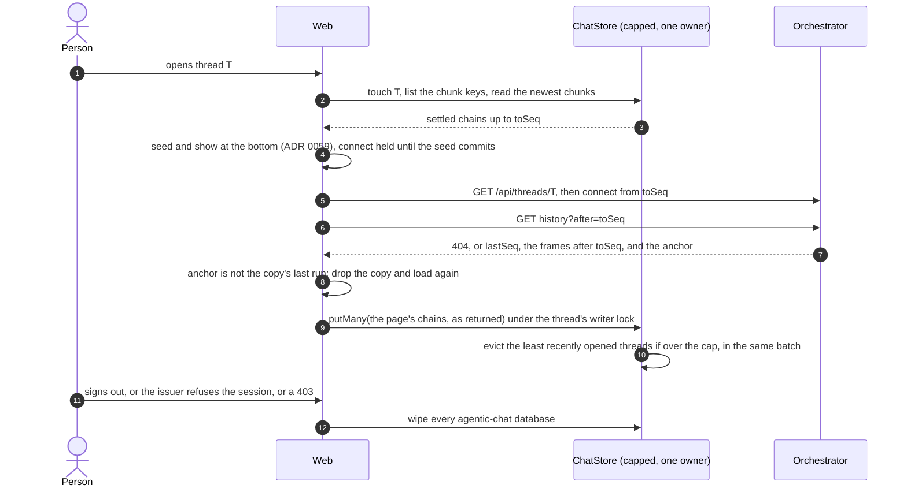
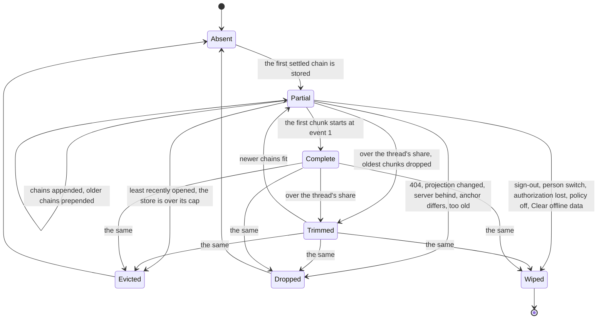

# ADR 0060 — The client keeps a bounded copy of recent threads behind a `ChatStore` port

- **Status:** proposed (2026-10-09, revised the same day after a review), on the owner's words of that day: *"we need to save some chat sessions on
  the client (with a dedicated store interface, to adapt to tauri mobile/desktop and web) with a max size cap to 15Mb/256Mb/128Mb on
  web/desktop/mobile."* **Design only; nothing is built, and only slice 0 is near-term:** the rest waits for [ADR 0059](0059-a-thread-opens-at-its-end-and-older-turns-load-on-scroll-up.md)'s
  gate G and, if its history read is built, for that read, and for this revision to be accepted. The names, defaults and limits are the planner's and
  the owner may revisit them. It builds on the static export and the desktop app of the open pull request (`wip/tauri`), cited as "after the
  static-export PR". Proposes an answer to open question 58; [ADR 0043](0043-deleting-a-thread-erases-it.md) and
  [ADR 0039](0039-nobody-reads-another-persons-thread.md) bind it, and the amendments it proposes to 0043 and 0001 are at the end.
  *What the review changed:* the writer stores only frames a page returned (never the streamed ones); the stored range is derived from the chunk keys,
  one chunk per settled chain, one writer per thread, with an atomic batch in the backend; the owner key comes from `/api/me`, so edge mode works,
  and the copy is wiped when authorization is lost, not only on sign-out; `ui.clientCache` fails closed; the rollout goes desktop, then web, then mobile.

## Context

- **What a copy is for.** The orchestrator's log is the truth ([ADR 0001](0001-rust-state-machine-on-postgres.md)). A copy on the device is for
  **latency** (a thread opened before paints at once, then catches up) and **reading without a network** (the apps, a train). It never answers a
  write, and nothing is queued for the server while offline.
- **What exists.** The web keeps the sign-in in IndexedDB through Dexie (`dexie` 4.4.6, `web/src/lib/auth/db.ts`, [ADR 0054](0054-the-web-holds-its-own-tokens-dpop-bound-in-indexeddb.md));
  `fake-indexeddb` (^6.2.5) is a dev dependency and `web/src/lib/auth/harness.ts` gives each test a database of its own. After the static-export PR
  the page reads a runtime `config.json` (`web/src/lib/runtime-config.ts`: `apiOrigin`, `clientId`, `signIn`, `organisation`; the image ships `{}`,
  `apps/tauri/scripts/build-web.mjs` writes the desktop's) and runs in a Tauri 2 window whose only plugin is `tauri-plugin-opener` and whose capability
  file grants `core:default` (`apps/tauri/src-tauri`), with the tokens in the **webview's IndexedDB**, not the OS keychain
  ([ADR 0047](0047-one-ui-for-web-desktop-and-mobile-each-signs-in-as-a-public-oauth-client.md), amendment of 2026-10-09). A Tauri webview has a profile
  of its own and never shares storage with a browser page; two builds of the app for different deployments do share one (same identifier, the origin
  `tauri://localhost`). Mobile is not scaffolded (`apps/tauri/README.md`, "Not yet").
- **Two ways in.** In browser mode the page holds the tokens. With an **edge** (the chart's default) it holds none: the cookie is oauth2-proxy's, and
  signing out is `signOutNow()` going to the edge's `sign_out` (`web/src/lib/api/session.ts`, after the static-export PR), or the "Sign out at the edge"
  link of `/auth/sign-out` (`web/src/features/session/components/sign-out.tsx`). Anything keyed to a token, or wiped only by `signOut()` of
  `lib/auth/sign-out.ts`, covers browser mode alone.
- **What a copy risks.** Conversations are at rest on a device outside the log and its deletion. Question 58 says it plainly: *if anything is cached,
  sign-out and deletion must clear it.* ADR 0043 lists what stays out of reach of a delete; a device that was offline when a thread was deleted would
  be one more. A script that runs in the page can read the copy as it can read the tokens.
- **Browsers are not the limit, the owner's numbers are.** An origin may use about 60 % of the disk in Chromium and in Safari's own app, about 15 % in
  an app that embeds WKWebView, and the lesser of 10 % of the disk and 10 GiB in Firefox, as best effort; best-effort data can be evicted by
  least-recently-used origin under storage pressure, and `navigator.storage.estimate()` "only returns the estimated usage value, not the actual
  value" (MDN, Storage quotas and eviction criteria, and the WebKit post "Updates to Storage Policy", *verified 2026-10-09*). So the caps are ours to
  count and enforce, and the store must live with its data disappearing.

## Decision (proposed)





1. **A port, `ChatStore`, in `web/src/lib/chat-store/`.** Values are already-serialised strings or bytes: the store never parses them and knows
   nothing of threads except that an entry belongs to a *group* (a thread), the unit of eviction. This is the contract, not code to paste:

   ```ts
   type Bytes = string | Uint8Array;
   type PutResult = { stored: true; evicted: string[] } | { stored: false; reason: "too_large" | "closed" | "failed" };
   interface ChatStore {
     readonly capBytes: number;
     get(key: string): Promise<Bytes | undefined>;
     put(key: string, value: Bytes, opts: { group: string }): Promise<PutResult>;
     putMany(items: { key: string; value: Bytes }[], opts: { group: string }): Promise<PutResult>;  // all or nothing
     delete(target: { key: string } | { group: string }): Promise<void>;
     list(filter?: { group?: string; prefix?: string }): Promise<{ key: string; group: string; bytes: number; storedAt: number }[]>; // metadata, key order, no values
     groups(): Promise<{ group: string; bytes: number; entries: number; openedAt: number }[]>;
     touch(group: string): Promise<void>;
     evict(needBytes: number, protect: ReadonlySet<string>): Promise<{ freed: number; groups: string[] }>;
     size(): Promise<{ bytes: number; entries: number }>;
     clear(): Promise<void>;                                    // everything of this owner
     close(): void;
   }
   ```

   `get`, `put`, `list`, `evict` and `size` are the owner's five; the rest is what purging, atomic chunk writes, the settings page and sign-out need.
   Like every infrastructure boundary here ([ADR 0009](0009-swappable-implementations-at-build-time.md)) it has a testkit (decision 14) and no
   driver type in its signatures.
2. **One policy, many backends.** The cap, the LRU order, the protection of open threads, the share of one thread and the "too large" rule are the same
   on every platform, so they are written once, in `CappedChatStore(backend, capBytes, protect)`, over a smaller `Backend`: `get`, **`putMany(puts,
   deletes)` as the one write, atomic** (a transaction in IndexedDB; a chunk, the group's row and the groups it evicts commit together or not at
   all, so the count and the data never disagree), `scan` of metadata, `clear`, `close`. The brief's "three adapters with caps" is one policy, a
   backend each, and a cap each.
3. **What is stored, and what is not.**

   | Stored | Not stored |
   |---|---|
   | The log as immutable **chunks, one per settled chain** (events `[from, to]`, a run or a chain of steered runs, [`history.md`](../api/history.md#chains-turns-and-what-a-page-holds)), each with a header `{from, to, turns, projection, lastRunId, carry?}` and the frames **exactly as a history page returned them** | Raw log events: the web never reads them. **The "event log" a device keeps is the AG-UI frames up to a `seq`**, the orchestrator's own projection |
   | The `ApiThread` the resource last gave (advisory: the title, state, target) | The chain that is open, live text, anything a stream wrote after it caught up, **any frame the writer did not get from a page** (decision 7) |
   | The first page of the thread list (id, title, state, update time) for the offline sidebar | **Files**: one is up to `artifacts.maxFileBytes` (10 MiB) and would eat the web's cap; a card shows the name and size and says "not available offline" (default until the owner decides: question 75) |
   | The system keys (decision 10) | Tokens (they stay in the auth database, ADR 0054), drafts, unsent messages, anything of a shared or public page |

4. **Keys and layout.** One IndexedDB database per owner, `agentic-chat-<h>`, `h` the first 32 hexadecimal digits of SHA-256 over `apiOrigin` and the
   `user` of **`GET /api/me`** joined by a newline. `user` is "the key of everything the person owns: the e-mail, lower-cased" (`chat-api.yaml`,
   `getMe`, ADR 0033): the orchestrator's own answer, the same with a bearer or with an edge, and what `session-refresh.ts` already compares
   (the e-mail, else `sub`). The origin is in the hash because two builds of the app for different deployments share a profile. A one-row
   `agentic-chat-index` database holds `current`, the hash of the last person `/api/me` named here, for an offline start. Two tables, `entries`
   (`key`, `group`, `bytes`, `storedAt`, `value`) and `groups` (`group`, `bytes`, `openedAt`). Keys: `t/<threadId>/info`, `t/<threadId>/log/<from, 12
   digits>-<to, 12 digits>`, `list/recent`, `policy`, `v`. **A thread's range is what its chunk keys say, never a stored field**: the range is the
   longest run of keys ending at the highest `to` in which each `from` is the previous `to` plus one (pages partition the log, so a gap is a damaged
   range and everything before it is deleted); `toSeq` is that `to`, the copy is *complete* when the first `from` is 1, and `lastRunId` and
   `projection` are read from the newest chunk's header. Eviction can therefore never leave a record that lies.
5. **The server is the truth: how a copy is kept honest.**

   | A copy is dropped (the thread's group) when | It is noticed by |
   |---|---|
   | The thread is gone: 404 | `GET /api/threads/{id}` or the connect, on open |
   | The server is *behind* the copy: `lastSeq < toSeq` | the thread on open |
   | The server tells another story: the `anchor` of the catch-up (`history?after=toSeq`) names a run other than the newest chunk's `lastRunId` (a restore from a backup, then new events) | the catch-up on open |
   | The frames' version changed: the newest chunk's `projection` is not `ui.history.projection` | the configuration on open |
   | The gap between `toSeq` and `lastSeq` is more than 5 000 events (catching up costs more than starting again) | the thread on open |
   | The copy was last opened more than 30 days ago | the sweep at start |
   | The layout changed | Dexie's version, or `v` |

   A copy that is merely *behind* is normal: the stream resumes at `toSeq`, the catch-up stores the rest. A title, a description or a share in stored
   frames may be stale: the web takes them from the resource and from the frames after the cursor. What these checks miss is cured by **Clear
   offline data** (decision 13). Without ADR 0059's history read the `anchor` does not exist and the check falls back to `lastSeq` alone, a weaker
   guarantee that is stated, not hidden.
6. **Identity, sign-out and loss of authorization, in both modes.** The store is opened only for the person `/api/me` names and never for a share
   link. **Everything is wiped** (every `agentic-chat-*` database of the origin, and the index) when:
   - the person signs out: in browser mode in `signOut()` (beside the rows it clears), with an edge in **`signOutNow()` before it navigates to the
     edge** and in the click handler of the "Sign out at the edge" link;
   - a **person switch**: `/api/me` names another `user` than `current`, or the existing check of `session-refresh.ts` fires;
   - **authorization is lost**: the issuer refuses the refresh token (`invalid_grant`, the `SessionEndedError` of reason `ended`); a request still
     answers 401 after the refresh or the edge's re-authentication; or an answer is 403 for a thread read (`forbidden`, `no_access`). An edge
     sign-out reached some other way (a typed address, another tab, the idle timeout) shows up as that 401 on the next call. **Only a failed network
     (a rejected fetch, a 5xx or 503) keeps the copy**, and an offline start opens the copy of `current`;
   - the deployment's answer is not `ui.clientCache: true` (decision 11), or the person presses **Clear offline data**.

   A sweep at sign-in deletes any database that is not the signed-in person's, from `indexedDB.databases()` (Chrome 72, Firefox 126, Safari 14, MDN
   browser-compat-data, *verified 2026-10-09*) or the index. Other tabs hear of a wipe on the existing `BroadcastChannel`, close their connections
   (Dexie closes on `versionchange`, *unverified*, asserted by a test) and never reopen a store without an identity. A page that holds no sign-in (a
   public link) never calls `indexedDB.open` for the cache, as it does not for the auth database (`authDbExists()`). A person who comes back after
   the refresh token lapsed loses the copy: the price of not leaving a conversation with someone the issuer no longer admits.
7. **The writer stores what a page returned, once a chain has settled.** A stream is for the screen: `LiveOverlay::logged`
   (`orchestrator/crates/agui-projection/src/live.rs`) rewrites the log's frames while a reply is being written (it drops the `TEXT_MESSAGE_START` of
   the message it continues, cuts its `CONTENT` to the words not yet said, renames a given-up message `<id>~final`), and the projector's early
   snapshots carry the thread's current title and description. Stored, they would replay as damaged messages. So the writer never takes a frame from
   the stream. When the thread has settled (no run open) for 3 seconds, or the page is hidden, or the thread is closed, it asks `history?after=toSeq`
   (ADR 0059), splits the answer into chains with a pure function (a chain ends at a group after which no run is open; a steered run does not end it),
   and writes them with one `putMany`, in key order, with the header. The first time, with no copy, it stores the tail page a first open fetched.
   Without the history read (ADR 0059 gate G passed with the full seed) the writer takes the settled chains of the **replay phase** of a connect, the
   events up to the head it had when it opened, which no overlay has touched; the catch-up is then the next open. **One writer per thread:** the tab
   that has the thread open holds the Web Lock `agentic-chat:writer:<h>:<threadId>` (a request that queues, so another tab takes over when it leaves);
   a tab without it reads and does not write. The eviction decision takes the lock `agentic-chat:evict:<h>`.
8. **No encryption at rest, for now, and why.** The data is what the person's screen shows; the refresh token already sits in the same profile
   (ADR 0054, ADR 0047), protected by a non-extractable key and by the file permissions of the user. A key for the copy has to live somewhere: in
   IndexedDB beside the data it protects nothing against a program that can read the profile; in the OS keychain (a native plugin; ADR 0047 says to
   revisit it with mobile) it protects a copied database file and costs a bridge on every read. Three more things bound the exposure and are named
   because they are not obvious: **(a) a script in the page** can read the copy as it reads the tokens; the static export's hashed-script policy
   (`script-src 'self'` and the hashes of its own inline scripts, ADR 0047's amendment) and the file route's refusal to serve script types (ADR 0054's
   correction) are what stand in the way, and the copy adds a readable history to what an injection would take, one more reason for the small cap and
   the age limit; **(b) device backups**: the mobile build excludes the webview's storage from iOS and Android backups where the platform allows it
   (*unverified* that it can for WebView data; if it cannot, the SQLite fallback in a directory the platform excludes is opened, slice 11); **(c)
   `navigator.storage.persist()` is not requested** (Chrome 55, Firefox 57, Safari 15.2): a persistent copy cannot be evicted by the browser, and this
   one is disposable. The origin's eviction is all-or-nothing and would also delete the tokens; whether to request persistence for that reason is a
   decision for ADR 0054's store, not this one. The decision is reversible without touching callers: encryption is a decorator
   `EncryptedBackend(inner, key)`.
9. **Adapters, caps and the choice between them.**

   | | Web | Desktop | Mobile |
   |---|---|---|---|
   | Cap | **15 MiB** | **256 MiB** | **128 MiB** |
   | Backend | IndexedDB through Dexie | the same, in the webview | the same, in the webview |
   | Per thread at most | half the cap | half | half |

   *Mb* is read as MiB (2^20 bytes), per person per device: each person on a device has the cap to themselves (default until the owner decides:
   question 73). The three platforms use **one backend** because a comparison of what is available for 256 MiB says so:

   | | Webview IndexedDB (Dexie) | `tauri-plugin-store` | `tauri-plugin-sql` (SQLite) | Own Rust commands over SQLite |
   |---|---|---|---|---|
   | Platforms | the browser and every Tauri webview | Linux, Windows, macOS, Android, iOS | Linux, Windows, macOS, Android; **not iOS** | wherever the app's Rust builds (mobile *unverified*) |
   | Shape | rows and indexes, written per row, a transaction per batch | **one JSON file, the whole map in memory**, `save()` rewrites it all (pretty-printed), autosave after 100 ms | tables; SQL sent from the page, JSON over IPC | tables; a handful of commands, bytes over IPC |
   | At 256 MiB | engine-managed | 256 MiB in memory and rewritten on every change: unusable | fine | fine |
   | Can be emptied by | the person clearing site data; best-effort eviction under pressure | the app's data folder | the app's data folder | the app's data folder |
   | New native code | none | plugin, capability, JS package | plugin, capability: **the page may run any SQL on a database it opens** | about 150 lines, a capability for six commands |
   | Code shared with the web | all | none | none | none |
   | Tests | the same suite on `fake-indexeddb` and on real engines | Rust and JS | Rust and JS | `cargo test` on in-memory SQLite, the suite over a fake `invoke` |

   The plugin facts are *verified 2026-10-09* in the plugins' READMEs and `store.rs` (<https://github.com/tauri-apps/plugins-workspace>, branch
   `v2`). **IndexedDB for all three**: it is the only one on every platform, needs no native code, shares the backend and its tests with the web, and
   sits where the tokens already are. `tauri-plugin-store` is rejected at this size. SQLite is the fallback, and if it comes it is **our own
   commands, not `tauri-plugin-sql`**: the plugin has no iOS, and its API lets any script of the page run any statement. What would bring it is
   measurable (slice 0): a webview whose IndexedDB cannot hold the cap or loses it across a restart (the iOS WKWebView is the suspect,
   *unverified*); a `get` of a 1 MiB chunk slower than 50 ms at the cap; a platform that backs the webview's storage up and cannot exclude it; or an
   owner's decision to encrypt with a keychain key.
10. **At the cap.** The cap counts **logical bytes**: the UTF-8 length of each string or the `byteLength` of each array, plus the key's length and a
    fixed 256 bytes per row so that many small rows cannot hide, summed in the `groups` table. It is not `navigator.storage.estimate()` (an estimate,
    padded, shared with the auth database); that is only a guard: the effective cap is `min(cap, ½ × estimate().quota)` when the browser gives one.
    Disk use exceeds the logical count by the engine's overhead (*unverified*, slice 0 measures it). `putMany` works like this:
    1. A batch with a chunk larger than half the cap is refused (`too_large`); the thread goes on uncached beyond what it holds.
    2. If the thread's group would exceed half the cap, its **oldest chunks** are dropped until it fits, so the range stays contiguous and ends at the
       newest settled chain; a chunk that would itself be the oldest is not stored (no thrashing while the person reads back).
    3. If the store would exceed the cap, whole groups are evicted **least recently opened first**, skipping the thread being written and every group
       in `protect`: the open threads of this tab and of other tabs (`navigator.locks.query()` lists the held `agentic-chat:writer:` and
       `agentic-chat:open:` locks: Chrome 69, Firefox 96, Safari 15.4, *verified 2026-10-09*; where it is missing only this tab's thread is
       protected), and the **system group** (`v`, `policy`, `list/recent`, at most 64 KiB, counted in the size, never evicted or trimmed).
    4. If that is still not enough, the batch is refused with `too_large`.
    5. A `QuotaExceededError` from the engine (Dexie names it `QuotaExceededError`, possibly inside an `AbortError`,
       <https://dexie.org/docs/DexieErrors/Dexie.QuotaExceededError>) is treated as the cap: evict one more group and retry once; if it fails again the
       store goes read-only for the session and logs once.
    **Recency** is `openedAt`, set by `touch` when a thread is opened and again when it is left or hidden; reading older chunks or receiving a run in
    the open thread does not touch (the open thread is protected anyway, and a long-open thread must not look old when it closes).
11. **Which backend and cap: the build says; the deployment can forbid; nothing is assumed.** After the static-export PR the page reads `config.json`
    once per load. It gains `cache`: `{ "store": "indexeddb" | "off", "maxBytes": <1 MiB to 1 GiB> }`, parsed like its other keys (a wrong value is
    dropped: `indexeddb` and 15 MiB). The web image ships nothing and gets 15 MiB; `apps/tauri/scripts/build-web.mjs` writes `268435456` for the
    desktop; the mobile build will write `134217728`. **`isTauri()` is not used to choose** (it exists since Tauri 2.0.0, *verified 2026-10-09*; one
    rule a test can set beats sniffing a platform). **The deployment decides, and fails closed:** the store is created only when `GET /api/config`
    has answered with **`ui.clientCache: true` explicitly and `ui.history.projection` present** (an orchestrator that does not know the key, or
    cannot say which frames it writes, gets no copy). The answer is kept in the store's `policy` key, so an offline start honours the last one it saw;
    a later `false`, or the key gone, clears everything. **The owner's file route stops being a second cache:** signed-in file downloads answer
    `Cache-Control: private, no-store` instead of `private, max-age=31536000, immutable` (`orchestrator/crates/api/src/artifacts.rs`, `CACHE_CONTROL`;
    the shared routes already say `no-store`), so a sign-out leaves no file in the browser's HTTP cache. This is the **default until the owner decides**
    (question 74). Files are fetched again on each view; a page keeps the object URL it made (`use-object-url.ts`). It is an orchestrator change of one
    constant and its test, separable from the rest (slice 3b).
12. **With ADR 0059: a copy paints at once, then reconciles from its last `seq`.** Opening a thread asks the store first. The newest chunks that make up
    the first `initialTurns` turns are seeded and shown (ADR 0059's seed, **before** the connect is opened, and the connect's groups are held until
    the seed commits); then `GET /api/threads/{id}`, the connect with `Last-Event-ID: toSeq` and the catch-up run. The checks of decision 5 drop the
    copy, and the thread is loaded from the network as if there were none. Scrolling up reads the next older chunk from the store, and from the
    network only when the store has run out (`history?before=<first from>` or the full seed's memory), prepending what it gets under ADR 0059's
    rules (no import while a run is open or a form pends). **Offline**: the connect fails, the header says "Showing the copy saved on this device", the
    composer and every action that writes are off, and the sidebar lists the cached threads. A message is never queued.
13. **Privacy rules, together.** A shared or public page never reads or writes the store (the writer is attached only to the owner's route; a test
    opens a share link and asserts that no `agentic-chat-*` database exists). History responses are `no-store`, files will be, so the browser's HTTP
    cache keeps no second copy. Deleting a thread from the UI deletes its group first. The person sees the size and can **Clear offline data** (an item
    of the account menu, `web/src/features/session/components/account-menu.tsx` after the static-export PR). **Known gap, not solved here:** a thread
    deleted on another device stays in this device's copy until it is opened (404), evicted, or 30 days pass.
14. **Tests.** The port has a **conformance suite**, `chatStoreConformance(make)` in `web/src/lib/chat-store/testkit.ts`, in the spirit of
    `store_conformance!` and `notifier_conformance!`: it takes a factory of `ChatStore` and is run against the memory backend, against the IndexedDB
    backend on `fake-indexeddb` (the harness of `lib/auth/harness.ts`, the node environment, a fresh `IDBFactory` per test), and, in the browser specs,
    against the real engines of Playwright (Chromium, and WebKit if CI installs it, *unverified*). The cases: put/get round trip for a string and for
    bytes; `size` equals the sum of `bytes`; overwrite replaces and frees; **`putMany` is atomic: a quota error injected on the third item leaves
    neither the first two nor a changed count, and an eviction in the same batch is undone with it**; `delete` by key and by group; `list` by group and
    prefix in key order and without values; the range derived from the keys (a gap deletes what precedes it); eviction order is `openedAt`, and
    `touch` is what moves a group; `protect` and the system group are respected; a thread above half the cap loses its oldest chunks and keeps the
    newest; a chunk above half the cap is `too_large`; the cap holds under `Promise.all` of many writes; a quota error evicts and retries, then goes
    read-only; two owners' stores do not see each other; `clear` leaves nothing and the database is gone from `indexedDB.databases()`; a reopened
    backend has what it had; a closed store refuses writes. The pure parts are plain Vitest: the key builder, the owner hash, `chainsOf`, the
    config parser, the invalidation table. **Identity is tested in both modes:** browser mode (sign-out, `invalid_grant`) and edge mode (`signOutNow()`,
    the edge link, a 401 after a typed `sign_out`, a 403), a person switch, an offline start that keeps the copy, a failed network that keeps it, and a
    public link that creates no database. The writer is tested against a stream whose live text was rewritten by the overlay: the store holds the
    page's frames, not the stream's. The desktop is run by hand under Xvfb as `apps/tauri/README.md` already records for sign-in, and the same suite is run
    once in the webview; the mobile gate is a device run: write to the cap, kill the app, reopen, read, and check the backup exclusion.

## Amendments this ADR proposes (to be written as dated notes when it is accepted)

- **ADR 0043, decision 7** ("What stays out of reach"): add *a copy kept by a client device (ADR 0060): wiped on sign-out and when authorization is
  lost, evicted by use and by age, and gone on the next open of a deleted thread (404); a device that was offline when the thread was deleted keeps it
  for at most 30 days.*
- **ADR 0001 and invariant 3** (`CLAUDE.md`): add *a client's copy of a thread (ADR 0060) is derived from the log, disposable, and never a source of
  state: it answers no write, nothing is queued for the server, and the log decides.*

## Consequences

- A thread opened before paints from the device and catches up; one opened without a network can be read. The first open of a thread is no slower.
- The cap and the policy are one piece of code with one suite, three numbers in three `config.json` files. A second backend is a file and the same suite.
- The web gains a database it must delete reliably in two modes: each wipe has a test, a failure to delete is shown and retried, never silent. A person
  whose session lapsed finds the copy gone.
- `config.json` gains `cache`, `GET /api/config` gains `ui.clientCache` (fail closed) and, from ADR 0059, `ui.history.projection`. The file route's
  cache header changes. An older web or orchestrator simply has no copy.
- The writer costs one `history?after=` per settled chain and stores nothing it did not get from a page.
- A copy on a device is real data at rest; the privacy rules are the whole mitigation, and one gap is named. Half the cap per thread means a single
  enormous thread keeps only its newest part on a small device.

## Alternatives rejected

- **The webview's `localStorage`**: synchronous, about 5 MiB, strings only.
- **Cache API / service worker**: a second, URL-keyed store the page cannot count or evict per thread, and a service worker is another origin-wide
  script to put under the policy of ADR 0054.
- **`tauri-plugin-store`** (the whole map in memory, rewritten per change) and **`tauri-plugin-sql`** (no iOS; arbitrary SQL from the page).
- **Storing the frames the stream wrote**: they are rewritten for the screen (decision 7).
- **The browser's quota as the cap**: not what the owner asked, and estimates are padded.
- **Storing `ThreadMessage`s instead of frames**: paints without a seed, but couples the copy to assistant-ui's message shape; frames are the
  orchestrator's documented, versioned output.
- **Keying the copy by the token's `sub`**: there is no token with an edge.
- **Queueing unsent messages**: a second source of truth for the log and a conflict model; not asked.

## Facts

- *Verified 2026-10-09:* the Dexie, plugin and browser facts above, each with its source where it is used; `getMe`'s `user` is the lower-cased e-mail;
  `signOutNow()` and the edge link on `wip/tauri`; `LiveOverlay::logged` rewrites frames; the early snapshots use the thread's current title and
  description; the owner's files are served `private, max-age=31536000, immutable`; the repository's `fake-indexeddb` harness; `web/src/lib/auth/db.ts`
  is Dexie; `applyExternalMessages` behaves as ADR 0059 says.
- *Unverified:* IndexedDB durability and quota in the iOS and Android web views and in WebKitGTK; whether Safari's seven-day cap on script-written
  storage applies to a WKWebView app; whether the webview's storage can be excluded from iOS and Android backups; Web Locks in WebKitGTK; Dexie's
  behaviour on `versionchange`; the byte size of a real chain (the goldens are mocks of 3 to 10 KB a thread) and so how many threads fit in 15 MiB;
  whether compressing chunks (`CompressionStream`) is available in every webview and worth it; `rusqlite` on iOS and Android.

## Open questions for the owner

[`open-questions.md`](../open-questions.md) 73 to 75 and 58, with the defaults used here **until the owner decides**: the caps are MiB, per person per
device (73); signed-in file downloads answer `Cache-Control: private, no-store` (74); no files offline (75).

## Implementation plan

**Near-term: slice 0 only.** Slices 1 and after wait for ADR 0059's gate G (and, if its history read is built, for that read) and for this revision's
acceptance. Rollout order: **desktop, then web, then mobile.**

| # | Slice | Done when |
|---|---|---|
| 0 | **Measure the backend.** A page that writes chunks to the cap, reopens, reads, **in the desktop app's webview under Xvfb first**, then Chromium and WebKit; the engine's overhead over the logical bytes; the latency of a 1 MiB `get` at the cap. | The numbers are in this ADR; decision 9 stands or the SQLite fallback is opened with a reason. |
| 1 | **The port, the policy and the testkit** with a memory backend, `putMany` included. | `chatStoreConformance` passes on `CappedChatStore(Memory)`; the policy of decision 10 has a case each, atomicity too. |
| 2 | **The IndexedDB backend** (Dexie, one database per owner, the index database). | The suite passes on `fake-indexeddb`, including reopen, the range from keys, and `clear` removing the database. |
| 3 | **Identity, isolation, wipe, in both modes.** The owner hash from `/api/me`, the sweep, the hooks (`signOut()`, `signOutNow()`, the edge link, the person switch, `invalid_grant`, a 401 after refresh, a 403), the cross-tab message. | The tests of decision 14: both modes, an offline start and a failed network keep the copy, a public link creates no database, a write after a wipe does nothing. |
| 3b | **The file route is `private, no-store`** (separable; closes a gap that exists today). | `api/tests/artifacts.rs` asserts the header on the owner's route; `artifacts.rs` documents it; `agui.md`/`chat-api.yaml` text updated. |
| 4 | **Configuration.** `cache` in `config.json`, `ui.clientCache` (explicit `true`) and the projection check, the desktop build's `256 MiB`. | Parser tests; `build-web.mjs` writes the number; a missing or `false` key creates no store and clears a populated one. |
| 5 | **The writer.** Catch-up reads, `chainsOf`, one `putMany` per page, the writer lock, `touch`. Needs ADR 0059's history read, or the replay-phase fallback. | After a chain settles the store holds the page's frames and not the stream's (a test with an overlay-rewritten stream); a cut connection leaves no half chain; two tabs write once. |
| 6 | **The reader and the reconcile.** Paint from the copy, connect held until the seed commits, the invalidation table, the anchor check. Needs ADR 0059's seed (its slice 2). | Playwright against the mock with a delayed network: the second open shows the thread before the network answers; 404, `lastSeq < toSeq`, another `projection`, another anchor and a gap each drop the copy. |
| 7 | **The offline surface.** The header, the disabled composer, the sidebar from the copy, **Clear offline data** with the size; scroll-up through the store. | A browser spec with the network off; the account-menu spec. |
| 8 | **Enable on the desktop.** `256 MiB` in the app, the by-hand run recorded in `apps/tauri/README.md`, a soak. | The suite and the by-hand run pass in the webview. |
| 9 | **Enable on the web** (15 MiB) after the desktop has been used; the deployment sets `ui.clientCache: true`. | The browser specs; the chart documents the key. |
| 10 | **Mobile** (128 MiB), when it is scaffolded: the device gate and the backup exclusion. | Passes on one iOS and one Android device, or slice 11 is opened. |
| 11 | **Only if slice 0 or 10 says so: a SQLite backend**, our own commands. | The same suite through a fake `invoke`; `cargo test` on in-memory SQLite; a capability for the six commands and nothing else. |
