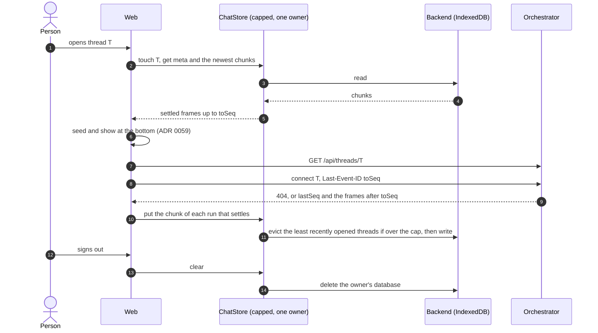
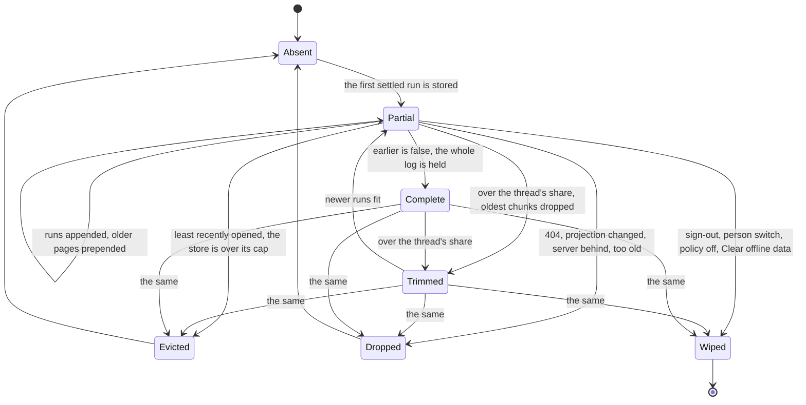

# ADR 0060 — The client keeps a bounded copy of recent threads behind a `ChatStore` port

- **Status:** proposed (2026-10-09), on the owner's words of that day: *"we need to save some chat sessions on the client (with a dedicated store
  interface, to adapt to tauri mobile/desktop and web) with a max size cap to 15Mb/256Mb/128Mb on web/desktop/mobile."* **Design only; nothing is
  built.** The names, defaults and limits are the planner's and the owner may revisit them. It builds on the static export and the desktop app of the
  open pull request (`wip/tauri`), cited below as "after the static-export PR", and on [ADR 0059](0059-a-thread-opens-at-its-end-and-older-turns-load-on-scroll-up.md)
  (the pages it stores). Proposes an answer to open question 58 (offline behaviour of the apps); [ADR 0043](0043-deleting-a-thread-erases-it.md)
  and [ADR 0039](0039-nobody-reads-another-persons-thread.md) bind it, and it does not amend them.

## Context

- **What a copy is for.** The orchestrator's log is the truth ([ADR 0001](0001-rust-state-machine-on-postgres.md)). A copy on the device is for
  **latency** (a thread opened before paints at once, then catches up) and **reading without a network** (the apps, a train). It never answers a
  write, and nothing is queued for the server while offline.
- **What exists.** The web keeps the sign-in in IndexedDB through Dexie (`dexie` 4.4.6, `web/src/lib/auth/db.ts`, [ADR 0054](0054-the-web-holds-its-own-tokens-dpop-bound-in-indexeddb.md));
  `fake-indexeddb` (^6.2.5) is a dev dependency and `web/src/lib/auth/harness.ts` already gives each test a database of its own. After the
  static-export PR the page reads a runtime `config.json` (`web/src/lib/runtime-config.ts`: `apiOrigin`, `clientId`, `signIn`, `organisation`;
  the image ships `{}`, `apps/tauri/scripts/build-web.mjs` writes the desktop's) and runs in a Tauri 2 window whose only plugin is
  `tauri-plugin-opener` and whose capability file grants `core:default` (`apps/tauri/src-tauri`), with the tokens in the **webview's IndexedDB**,
  not the OS keychain ([ADR 0047](0047-one-ui-for-web-desktop-and-mobile-each-signs-in-as-a-public-oauth-client.md), amendment of 2026-10-09).
  Mobile is not scaffolded (`apps/tauri/README.md`, "Not yet").
- **What a copy risks.** Conversations are at rest on a device outside the log and its deletion. Question 58 says it plainly: *if anything is
  cached, sign-out and deletion must clear it.* ADR 0043 lists what stays out of reach of a delete (backups, the model's provider, an agent's own
  store); a device that was offline when a thread was deleted would be one more.
- **Browsers are not the limit, the owner's numbers are.** An origin may use about 60 % of the disk in Chromium and in Safari's own app, about 15 %
  in an app that embeds WKWebView, and the lesser of 10 % of the disk and 10 GiB in Firefox, as best effort; best-effort data can be evicted by
  least-recently-used origin under storage pressure, and `navigator.storage.estimate()` "only returns the estimated usage value, not the actual
  value" (MDN, Storage quotas and eviction criteria, and the WebKit post "Updates to Storage Policy", *verified 2026-10-09*). So the caps are
  ours to count and enforce, and the store must live with its data disappearing.

## Decision (proposed)





1. **A port, `ChatStore`, in `web/src/lib/chat-store/`.** Values are already-serialised strings or bytes: the store never parses them and
   knows nothing of threads except that an entry belongs to a *group* (a thread), which is the unit of eviction. This is the contract, not code to
   paste:

   ```ts
   type Bytes = string | Uint8Array;
   type PutResult = { stored: true; evicted: string[] } | { stored: false; reason: "too_large" | "closed" | "failed" };
   interface ChatStore {
     readonly capBytes: number;
     get(key: string): Promise<Bytes | undefined>;
     put(key: string, value: Bytes, opts: { group: string }): Promise<PutResult>;
     delete(target: { key: string } | { group: string }): Promise<void>;
     list(filter?: { group?: string; prefix?: string }): Promise<{ key: string; group: string; bytes: number; storedAt: number }[]>; // metadata, key order, no values
     groups(): Promise<{ group: string; bytes: number; entries: number; openedAt: number }[]>;
     touch(group: string): Promise<void>;                       // "opened now": the only thing that moves a thread in the LRU order
     evict(needBytes: number, protect: ReadonlySet<string>): Promise<{ freed: number; groups: string[] }>;
     size(): Promise<{ bytes: number; entries: number }>;
     clear(): Promise<void>;                                    // everything of this owner
     close(): void;
   }
   ```

   `get`, `put`, `list`, `evict` and `size` are the owner's five; `delete`, `groups`, `touch`, `clear` and `close` are what purging, the settings
   page and sign-out need. Like every infrastructure boundary here ([ADR 0009](0009-swappable-implementations-at-build-time.md)) it has a testkit
   (decision 13) and no driver type in its signatures.
2. **One policy, many backends.** The cap, the LRU order, the protection of open threads, the share of one thread and the "too large" rule are
   the same on every platform, so they are written once, in `CappedChatStore(backend, capBytes, protect)`, over a smaller `Backend` (`get`, `put`
   with its byte count, `delete`, `scan` of metadata, `clear`, `close`) that is the only part that differs per platform. The brief's "three adapters
   with caps" is therefore one policy, a backend each, and a cap each.
3. **What is stored, and what is not.**

   | Stored | Not stored |
   |---|---|
   | A thread record: the `ApiThread` the resource gave, the range of the log held (`fromSeq`, `toSeq`), `settledSeq`, the `projection` of the frames, whether the range is the whole log, and the carry ([ADR 0059](0059-a-thread-opens-at-its-end-and-older-turns-load-on-scroll-up.md)) | Raw log events: the web never reads them. **The "event log" a device keeps is the AG-UI frames up to a `seq`**, the orchestrator's own projection |
   | The log as immutable **chunks** of consecutive frames of settled runs (`{from, to, turns, frames}`), at most 1 MiB each, appended at the end and, when an older page is read, at the start | The run that is open, live text, anything after the last settled run: the stream says them again |
   | The first page of the thread list (id, title, state, update time) for the offline sidebar | **Files** (images, downloads): each is up to `artifacts.maxFileBytes` (10 MiB), one would eat the web's cap; a card shows the name and size and says "not available offline". See open question 75 |
   | The last answer of `ui.clientCache` (decision 10) | Tokens (they stay in the auth database, ADR 0054), drafts, unsent messages, anything of a shared or public page |

4. **Keys and layout.** One IndexedDB database per owner, `agentic-chat-<h>`, with `h` the first 32 hexadecimal digits of SHA-256 over
   `apiOrigin`, the issuer and the token's `sub` joined by newlines (the `sub` is what the person switch of `session-refresh.ts` already knows; the
   origin and issuer are in the hash because a desktop build and a web page may share one webview origin and point at different deployments). Two
   tables, `entries` (`key`, `group`, `bytes`, `storedAt`, `value`) and `groups` (`group`, `bytes`, `openedAt`). Keys are `v`, `policy`,
   `list/recent`, `t/<threadId>/meta` and `t/<threadId>/log/<fromSeq as 12 digits>`, so key order is log order and a range read is one query.
5. **The server is the truth: how a copy is kept honest.**

   | A copy is dropped (the whole thread's group) or the store cleared when | It is noticed by |
   |---|---|
   | The thread is gone: 404 | `GET /api/threads/{id}` or the connect, on open |
   | The server is *behind* the copy: `lastSeq < toSeq` (a restore from a backup) | the thread on open |
   | The frames' version changed: `meta.projection` is not `ui.history.projection` ([`history.md`](../api/history.md), rule 5) | the configuration on open |
   | The copy is older than 30 days since it was last opened | the sweep at start |
   | The layout changed | the database's Dexie version, or `v` |
   | The deployment forbids copies: `ui.clientCache` is `false` | the configuration |

   A copy that is merely *behind* is the normal case: the stream resumes at `toSeq` and the rest is appended. A title, a description or a share
   in a copy's frames may be stale; the web takes them from the resource and from the frames after the cursor, never from a copy. A copy that is
   wrong in a way none of these catch is cured by **Clear offline data** (decision 12), which is also the person's control.
6. **Isolation, sign-out and the other person.** The database is the owner's by its name; the store is opened only for the signed-in person and
   never for a share link. **Sign-out deletes every `agentic-chat-*` database of the origin** before the page leaves (`signOut()` in
   `web/src/lib/auth/sign-out.ts`, beside the rows it already clears), and a **person switch** (the check `session-refresh.ts` already makes)
   deletes the previous person's. A sweep at sign-in deletes any database that is not the signed-in person's, from `indexedDB.databases()` (Chrome 72,
   Firefox 126, Safari 14, MDN browser-compat-data, *verified 2026-10-09*) or, where it is missing, from a one-row index database. A session that
   merely *ended* (the refresh token was refused) is not a sign-out: the copy stays, the person signs in again and finds it. Other tabs hear of a
   wipe on the existing `BroadcastChannel`, close their connections (Dexie closes on `versionchange`, *unverified* and asserted by a test) and
   never reopen a store without an identity. A page that holds no sign-in (a public link) never calls `indexedDB.open` for the cache, as it does not
   for the auth database (`authDbExists()`).
7. **No encryption at rest, for now, and why.** The data is what the person's screen shows; the refresh token already sits in the same profile
   (ADR 0054, ADR 0047), protected by a non-extractable key and by the file permissions of the user. A key for the copy has to live somewhere: in
   IndexedDB beside the data it protects nothing against a program that can read the profile; in the OS keychain (a native plugin; ADR 0047 says to
   revisit it with mobile) it protects a copied database file and costs a bridge on every read. What bounds the exposure is what this ADR already
   does: sign-out wipes, a copy is per person, it expires, the cap is small, and the deployment can forbid it. The decision is reversible without
   touching callers: encryption is a decorator `EncryptedBackend(inner, key)`, and the port sees opaque values.
8. **Adapters, caps and the choice between them.**

   | | Web | Desktop | Mobile |
   |---|---|---|---|
   | Cap | **15 MiB** | **256 MiB** | **128 MiB** |
   | Backend | IndexedDB through Dexie | the same, in the webview | the same, in the webview |
   | Per thread at most | half the cap | half | half |

   *Mb* is read as MiB (2^20 bytes) throughout; open question 73. The three platforms use **one backend** because a comparison of what is available
   for 256 MiB says so:

   | | Webview IndexedDB (Dexie) | `tauri-plugin-store` | `tauri-plugin-sql` (SQLite) | Own Rust commands over SQLite |
   |---|---|---|---|---|
   | Platforms | the browser and every Tauri webview | Linux, Windows, macOS, Android, iOS | Linux, Windows, macOS, Android; **not iOS** | wherever the app's Rust builds (mobile *unverified*) |
   | Shape | rows and indexes, written per row | **one JSON file, the whole map in memory**, `save()` rewrites it all (pretty-printed), autosave after 100 ms | tables; SQL sent from the page, JSON over IPC | tables; a handful of commands, bytes over IPC |
   | At 256 MiB | engine-managed | 256 MiB in memory and rewritten on every change: unusable | fine | fine |
   | Can be emptied by | the person clearing site data; best-effort eviction under pressure | the app's data folder | the app's data folder | the app's data folder |
   | New native code | none | plugin, capability, JS package | plugin, capability: **the page may run any SQL on a database it opens** | about 150 lines, a capability for six commands |
   | Code shared with the web | all | none | none | none |
   | Tests | the same suite on `fake-indexeddb` and on real engines | Rust and JS | Rust and JS | `cargo test` on in-memory SQLite, the suite over a fake `invoke` |

   The plugin facts are *verified 2026-10-09* in the plugins' READMEs and `store.rs` (<https://github.com/tauri-apps/plugins-workspace>, branch
   `v2`). **IndexedDB for all three**, because it is the only one that is on every platform, needs no native code, shares the backend and its tests with
   the web, and sits where the tokens already are. `tauri-plugin-store` is rejected at this size. SQLite is the fallback, and if it comes it is
   **our own commands, not `tauri-plugin-sql`**: the plugin has no iOS, and its API lets any script of the page run any statement. The conditions
   that would bring it are measurable (slice 0): a webview whose IndexedDB cannot hold the cap or loses it across a restart (the iOS WKWebView is
   the suspect, *unverified*); a `get` of a 1 MiB chunk slower than 50 ms at the cap; or an owner's decision to encrypt with a keychain key.
9. **At the cap.** The cap counts **logical bytes**: the UTF-8 length of each string or the `byteLength` of each array, plus the key's length and a
   fixed 256 bytes per row so that many small rows cannot hide, summed in the `groups` table. It is not `navigator.storage.estimate()` (an estimate,
   padded, shared with the auth database); that is only a guard: the effective cap is `min(cap, ½ × estimate().quota)` when the browser gives one.
   Disk use exceeds the logical count by the engine's overhead (*unverified*, to be measured in slice 0). `put` works like this:
   1. A chunk larger than half the cap is refused (`too_large`) and the thread goes on uncached beyond what it holds.
   2. If the thread's group would exceed half the cap, its **oldest chunks** are dropped until it fits, so the range stays contiguous and ends at
      the newest settled run; a chunk that would itself be the oldest is not stored (no thrashing while the person reads back).
   3. If the store would exceed the cap, whole groups are evicted **least recently opened first** (`touch` on open, not on read), skipping the
      thread being written and every group in `protect`: the open threads of this tab, and of other tabs through Web Locks (`navigator.locks.query()`
      lists the held ones: Chrome 69, Firefox 96, Safari 15.4, MDN, *verified 2026-10-09*; where it is missing only this tab's thread is protected).
   4. If that is still not enough (the open thread alone, within its share, plus the protected ones), the write is refused with `too_large`.
   5. A `QuotaExceededError` from the engine (Dexie names it `QuotaExceededError`, possibly inside an `AbortError`, <https://dexie.org/docs/DexieErrors/Dexie.QuotaExceededError>)
      is treated as the cap: evict one more group and retry once; if it fails again the store goes read-only for the session and logs once.
   Writes are queued in one promise chain per store and, for the eviction decision, under a Web Lock, so two tabs do not both think there is room.
10. **Which backend and cap: the build says, not the platform.** After the static-export PR the page already reads `config.json` once per load. It
    gains `cache`: `{ "store": "indexeddb" | "off", "maxBytes": <1 MiB to 1 GiB> }`, parsed like its other keys (a wrong value is dropped: the
    default is `indexeddb` and 15 MiB). The web image ships nothing and gets the web's 15 MiB; `apps/tauri/scripts/build-web.mjs` writes
    `268435456` for the desktop; the mobile build will write `134217728`. **`isTauri()` is not used to choose** (it exists since Tauri 2.0.0,
    *verified 2026-10-09*, but one rule that a test can set beats sniffing a platform, and a Tauri build with no key gets the conservative cap). The
    deployment has the last word: `ui.clientCache` in the orchestrator's configuration (`GET /api/config`, default `true`). The store is created only
    after a configuration that allows it has been read once; the answer is kept in the store, so an offline start honours the last one it saw, and a
    later `false` clears everything.
11. **With ADR 0059: a copy paints at once, then reconciles from its last `seq`.** Opening a thread asks the store first. The store holds the range
    `[fromSeq, toSeq]` of **settled** runs (a run is stored when its group with `RUN_FINISHED` or `RUN_ERROR` has been delivered; coalesced for a
    second and flushed on `pagehide`), so `toSeq` is always a resume point at which no run is open. The newest chunks that make up the first
    `initialTurns` turns are seeded and shown; `GET /api/threads/{id}` and `connect` with `Last-Event-ID: toSeq` run at once, and what arrives is
    appended. Scrolling up reads the next older chunk from the store, and from the network only when the store has run out (`history?before=fromSeq`),
    prepending what it gets. If the gap between `toSeq` and the thread's `lastSeq` is more than 5 000 events, the copy is dropped and the tail is
    fetched, because catching up would cost more than starting again. A first open on a device is ADR 0059's path with a writer behind it.
    **Offline**: the connect fails, the header says "Showing the copy saved on this device", the composer and every action that writes are off,
    and the sidebar lists the cached threads (`list/recent`, or the groups when it is missing). A message is never queued.
12. **Privacy rules, together.** A shared or public page never reads or writes the store (the writer is attached only to the owner's route; a test
    opens a share link and asserts that no `agentic-chat-*` database exists). The history responses are `no-store`, so the browser's HTTP cache does
    not keep a second copy. Deleting a thread from the UI deletes its group first. A deployment can forbid copies. The person sees the size and can
    **Clear offline data** (an item of the account menu, `web/src/features/session/components/account-menu.tsx` after the static-export PR).
    **Known gaps**, not solved here: a thread deleted on another device stays in this device's copy until it is opened (404), evicted, or 30 days
    pass; and **files** are in the browser's HTTP cache, not in this store, because the file route answers `Cache-Control: private,
    max-age=31536000, immutable` (`orchestrator/crates/api/src/artifacts.rs`), which sign-out does not clear (the desktop app could call
    `clearAllBrowsingData()`, which needs `core:webview:allow-clear-all-browsing-data`, *verified 2026-10-09* in Tauri's JavaScript reference). Open
    question 74.
13. **Tests.** The port has a **conformance suite**, `chatStoreConformance(make)` in `web/src/lib/chat-store/testkit.ts`, in the spirit of
    `store_conformance!` and `notifier_conformance!`: it takes a factory of `ChatStore` and is run against the memory backend, against the
    IndexedDB backend on `fake-indexeddb` (the harness of `lib/auth/harness.ts`, the node environment, a fresh `IDBFactory` per test), and, in the
    browser specs, against the real engines of Playwright (Chromium, and WebKit if CI installs it, *unverified*). The cases:
    put/get round trip for a string and for bytes; `size` equals the sum of `bytes`; overwrite replaces and frees; `delete` by key and by group;
    `list` by group and prefix in key order and without values; eviction order is `openedAt`, and `touch` is what moves a group; `protect` is
    respected; a thread above half the cap loses its oldest chunks and keeps the newest; a chunk above half the cap is `too_large`; the cap holds
    under `Promise.all` of many puts; a quota error from an injected backend evicts and retries, then goes read-only; two owners' stores do not see each
    other; `clear` leaves nothing and the database is gone from `indexedDB.databases()`; a reopened persistent backend has what it had; a closed
    store refuses writes. The pure parts are plain Vitest: the key builder, the owner hash, `settledPrefix`, the config parser, the invalidation table.
    The desktop is run by hand under Xvfb as `apps/tauri/README.md` already records for sign-in, and the same suite is run once in the webview;
    the mobile gate is a device run: write to the cap, kill the app, reopen, read (slice 9).

## Consequences

- A thread opened before paints from the device and catches up; one opened without a network can be read. The first open of a thread is no slower.
- The cap and the policy are one piece of code with one suite, three numbers in three `config.json` files. A second backend is a file and the same suite.
- The web gains a database it must delete reliably: sign-out, the person switch and the sweep each have a test. A failure to delete is shown
  and retried, never silent.
- `GET /api/config` gains `ui.clientCache`, `config.json` gains `cache`, and the projection gains a version (ADR 0059). An older web or
  orchestrator simply has no copy or no switch.
- A copy on a device is real data at rest; the privacy rules above are the whole mitigation, and two gaps are named.
- The limit "half the cap per thread" means a single enormous thread keeps only its newest part on a small device.

## Alternatives rejected

- **The webview's `localStorage`**: synchronous, about 5 MiB, strings only.
- **Cache API / service worker**: a second, URL-keyed store whose entries the page cannot count or evict per thread, and a service worker is another
  origin-wide script to put under the policy of ADR 0054.
- **`tauri-plugin-store` for the apps**: the whole map in memory and a full rewrite per change (above).
- **`tauri-plugin-sql`**: no iOS; the page gets arbitrary SQL.
- **The browser's quota as the cap**: not what the owner asked, and estimates are padded.
- **Storing `ThreadMessage`s instead of frames**: paints without a seed, but couples the copy to assistant-ui's message shape, which changes with the
  library; frames are the orchestrator's documented, versioned output.
- **Queueing unsent messages**: a second source of truth for the log and a conflict model; not asked.

## Facts

- *Verified 2026-10-09:* the Dexie, plugin and browser facts above, each with its source where it is used; the owner's files are served `private,
  max-age=31536000, immutable`; the repository's `fake-indexeddb` harness; `web/src/lib/auth/db.ts` is Dexie.
- *Unverified:* IndexedDB durability and quota in the iOS and Android web views and in WebKitGTK; whether Safari's seven-day cap on script-written
  storage applies to a WKWebView app; Web Locks in WebKitGTK; Dexie's behaviour on `versionchange`; the byte size of a real turn (the goldens
  are mocks of 3 to 10 KB a thread, real turns with step input and output are larger) and so how many threads fit in 15 MiB; whether compressing
  chunks (`CompressionStream`) is available in every webview and worth it; `rusqlite` on iOS and Android.

## Open questions for the owner

Added to [`open-questions.md`](../open-questions.md): **73** the unit of the caps and whether they are per person or per device; **74** the file
route's `Cache-Control` and sign-out; **75** whether files, or small ones, should be kept for offline reading. Question 58 now points here.

## Implementation plan

Thin slices; each ends with its test. Slice 0 can start today, the rest wait for ADR 0059's slices 5 to 7 only where marked.

| # | Slice | Done when |
|---|---|---|
| 0 | **Measure the backend.** A page that writes 64 KiB chunks to the cap, reopens, reads, in Chromium, WebKit, the desktop app under Xvfb; the overhead of the engine over the logical bytes. | The numbers are in this ADR; the decision of 8 stands or the SQLite fallback is opened with a reason. |
| 1 | **The port, the policy and the testkit** with a memory backend. | `chatStoreConformance` passes on `CappedChatStore(Memory)`; the policy table of 9 has a case each. |
| 2 | **The IndexedDB backend** (Dexie, one database per owner). | The suite passes on `fake-indexeddb`, including reopen and `clear` removing the database. |
| 3 | **Identity, isolation, wipe.** The owner hash, the sweep, the hooks in `signOut()` and the person switch, the cross-tab message. | Two people in one profile never read each other's; sign-out leaves no `agentic-chat-*`; a write after a wipe does nothing; a public link creates no database. |
| 4 | **Configuration.** `cache` in `config.json`, `ui.clientCache` in the orchestrator, the desktop build's `256 MiB`. | Parser tests; `build-web.mjs` writes the number; `false` clears a populated store; `off` never opens one. |
| 5 | **The writer.** Settled runs become chunks (coalesced, flushed on `pagehide`), the thread record, `touch`. | After a live run settles the store holds it and not the open run; a cut connection leaves no half run. Needs ADR 0059 slice 5. |
| 6 | **The reader and the reconcile.** Paint from the copy, connect at `toSeq`, the invalidation table, the 5 000-event gap rule. | Playwright against the mock with a delayed network: the second open shows the thread before the network answers; 404 purges; `lastSeq < toSeq`, another `projection` and a gap each drop the copy. Needs ADR 0059 slices 6 and 7. |
| 7 | **Scrolling back through the store.** Older chunks from the store first, then the network. | Scroll-up with the network cut loads cached chunks, then says "not available offline" at the edge of the range. Needs ADR 0059 slice 8. |
| 8 | **Offline surface.** The header, the disabled composer, the sidebar from the copy, **Clear offline data** with the size. | A browser spec with the network off; the account-menu spec. |
| 9 | **Desktop and mobile.** The desktop run by hand and recorded in `apps/tauri/README.md`; for mobile, when it is scaffolded, the device gate and the `134217728` build. | The suite and the by-hand run pass in the webview; the device gate passes on one iOS and one Android device, or slice 10 is opened. |
| 10 | **Only if slice 0 or 9 says so: a SQLite backend**, our own commands. | The same suite passes through a fake `invoke`; `cargo test` on in-memory SQLite; a capability for the six commands and nothing else. |
