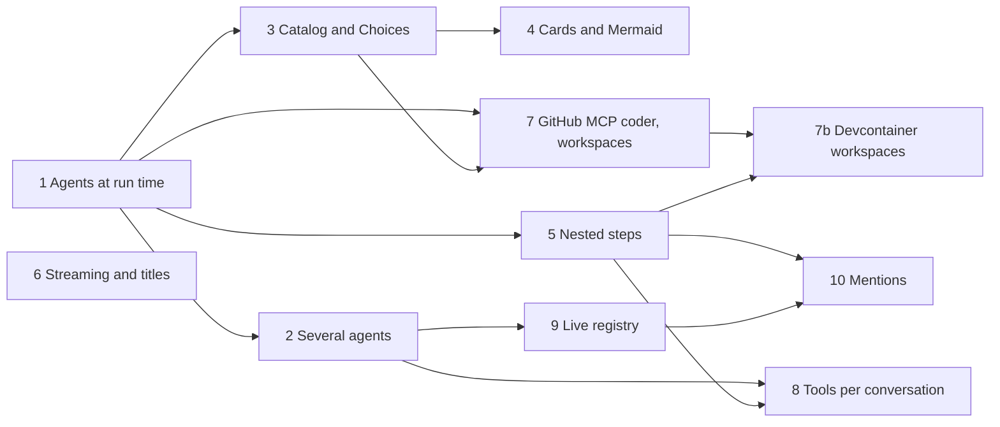

# MVP — build order

> Re-planned 2026-10-01. Steps 1 and 2 of the first plan delivered the plumbing; the owner judged
> the MVP **not ready**. This page says why, then gives the new build order toward the
> [vision](vision.md). The first plan and its slices are kept below as a record:
> [the first plan](#the-first-plan-a-record).
>
> **Update, 2026-10-03: the MVP is complete against this build order** ([ADR 0037](decisions/0037-the-mvp-is-complete-against-its-build-order.md),
> proposed): every slice below, 1 to 10 and 7b, is built, and so is what the owner added on 2026-10-02 ([Plan 11](#plan-11-finish-the-mvp)).
> **Complete is not accepted**: all of it is proven on mocks, the owner has not tried this state, and
> [what is explicitly post-MVP](#post-mvp) includes live verification. The rows below keep their text of the day they were built.

## Where we are

*As of 2026-10-01, the day of the re-plan; the table below says what happened since, and
[the MVP is complete](#the-mvp-is-complete) says where it stands now.*

The first plan built a working loop: chat → orchestrator → one A2A agent → pushed branch → CI result,
behind a verification gate, durable across restarts, driven from the web over AG-UI and from other
systems over MCP and webhooks. Diagrams: [Architecture: as built](architecture.md#as-built). That
work stands and the vision builds on it.

The owner tested it on 2026-10-01 (orchestrator, web chat, adam-coder as the only agent) and
concluded: "the adam part is not complete; the system part is not even 10% in the direction I
thought it would be. The MVP is not ready." What they met:

- **One hard-wired agent.** Agents come from a static file; the platform appears only as a release
  picker ([ADR 0008](decisions/0008-platform-integration-via-a2a-extension.md)). The system is "not
  simply a chat for testing, it's a 'system'."
- **A coder for every chat.** Asked "hi", it answered "give me a repo". It could not work without a
  repository, explain its tools in plain words, or say its name (adam-rs
  [#52](https://github.com/vymalo/another-adam-rs/issues/52) to
  [#55](https://github.com/vymalo/another-adam-rs/issues/55)).
- **Plain answers, plain questions.** Agents cannot show cards, choices, a graph, or ask through a
  component; `ask_user` takes and returns text.
- **Unreadable steps.** 7 messages gave 336 status events, 197 of them OpenCode's, in one flat list.
- **No streaming, no titles.** A reply appears 2–8 s later in one piece; every thread is called "Hi"
  (system [#65](https://github.com/vymalo/another-agentic-system/issues/65) and
  [#66](https://github.com/vymalo/another-agentic-system/issues/66), adam-rs
  [#51](https://github.com/vymalo/another-adam-rs/issues/51)).
- **No tools from the person, no second agent.** Tools cannot be attached to a chat; nobody can be
  mentioned.
- **Prompts compiled in.** Changing the coder's instructions means rebuilding adam-coder.

## The new build order

Thin vertical slices: each one goes from the agent to the screen and can be shown to the owner on its
own. Repositories: **sys** is this one, **adam** is vymalo/another-adam-rs, **platform** is
vymalo/another-agentic-platform. The order follows dependencies: agents that can be configured come
first, because every later slice needs more than one kind of agent to show anything.

| # | Slice | Where | Done when | Needs | Issues, ADRs |
|---|---|---|---|---|---|
| 0 | **This plan**: the [vision](vision.md), ADRs 0022–0026, open questions 34–39 | sys | The owner reads it and recognises what they asked for. | — | — |
| 1 | **Agents configured at run time.** adam-coder reads its `agent/` folder (instructions, skills, subagents, `mcp.json`) from a directory at run time, with the embedded copy as fallback (`adam-agent-fs` already has the run-time `Dir` path); adam-coder moves from `crates/` to `bin/`; it answers a greeting with a greeting, says its name and explains itself in plain words. Compose mounts the folder. **Built (2026-10-01).** adam: [#56](https://github.com/vymalo/another-adam-rs/pull/56) (the move to `bin/`) and [#57](https://github.com/vymalo/another-adam-rs/pull/57) (`ADAM_AGENT_DIR`, the coder named `Coder` that greets; adam [ADR 0004](https://github.com/vymalo/another-adam-rs/blob/7b2d8f95ffd9abe8af990bd79d7d690e8183c392/docs/decisions/0004-agent-folders-at-run-time.md)). sys: the coder is pinned to adam-rs `7b2d8f9`, compose mounts the vendored folder `dev/coder/agent/` at `/etc/adam/agent` (drift-checked, [ADR 0014](decisions/0014-adam-coder-default-agent-over-a2a.md#status-note-2026-10-01-the-dev-stack-also-vendors-the-coders-agent-folder)), and the scenarios `greeting` and `folder` (`dev/greeting-e2e.sh`, `dev/agent-folder-e2e.sh`) assert the done-when below; how to edit it: [`dev/README.md`](../dev/README.md#change-what-the-coder-says). A real model's greeting is *unverified* (the mocks prove the folder reaches the model); the new scenarios ran in CI only. | adam, sys | Editing `instructions.md` in the mounted folder changes the answer without a rebuild; "hi" gets a greeting, not "give me a repo". | — | adam [#55](https://github.com/vymalo/another-adam-rs/issues/55) |
| 2 | **Agents for several uses.** A general adam agent served from any folder; compose and the live example run a chat agent and a researcher (on a mocked web-search MCP server) beside the coder. Compose runs the general agents from the existing adam-coder image, whose `adam-agent` binary ships beside `adam-coder`: no new image package (a new GHCR package must pass an anonymous-pull check first, [another-agentic-images](https://github.com/vymalo/another-agentic-images)). **Built (2026-10-01).** adam: [#58](https://github.com/vymalo/another-adam-rs/pull/58) (`adam-agent`, the `mcp.json` tools, `adam-service`; adam [ADR 0005](https://github.com/vymalo/another-adam-rs/blob/f882b910b620ea583130a0517b4e52c5f7939179/docs/decisions/0005-one-binary-serves-any-agent-folder.md)). sys: the one image pin is adam-rs `f882b91`, the folders `dev/agents/chat/agent/` and `dev/agents/researcher/agent/` (the researcher's `mcp.json` names the mock web search), the services `chat` and `researcher` on one `agents-postgres` and the scripted `mock-model`, the three agents in `dev/agents.yaml` and `dev/agents.live.yaml`, the scenario `agents` (`dev/agents-e2e.sh`) and the model probes in `dev/check-agent-mocks.sh`; how to add a fourth: [`dev/README.md`](../dev/README.md#add-a-fourth-agent-by-writing-a-folder), [ADR 0014](decisions/0014-adam-coder-default-agent-over-a2a.md#status-note-2026-10-01-agents-that-are-only-a-folder-run-from-the-same-pinned-image). The live researcher still searches the mock (no search credential); a real model's behaviour is *unverified*; the new scenario ran in CI only. | adam, sys | The local stack lists three agents and each answers in its role on mocks; `dev/README.md` says how to add a fourth by writing a folder. | 1 | — |
| 3 | **The catalog handshake and Choices.** The web's catalog (Choices first) goes at conversation start and again on a new digest; the `ui_catalog` event; the extension with `inlineCatalogs`; the refetch seam; adam-rs turns the catalog into model tools and `ask_user` with options into Choices; the answer comes back as the person's. **Built (2026-10-01).** sys: [#69](https://github.com/vymalo/another-agentic-system/pull/69) (the web's catalog and the `Choices` component), [#71](https://github.com/vymalo/another-agentic-system/pull/71) (the `ui_catalog` event, the run checks, `ui-catalog/v1` to agents), [#74](https://github.com/vymalo/another-agentic-system/pull/74) (the thread tools and their grants, `thread-tools/v1`), and the change that pins adam-rs `c13ddf1` (the coder's `ask_user` with `choices`, adam [#59](https://github.com/vymalo/another-adam-rs/pull/59)), vendors the mock model's `[mock:choices]` script and adds the scenario `choices` ([`dev/choices-e2e.sh`](../dev/README.md#choices-the-coder-asks-with-a-form)): one form of three questions drawn from the web's catalog, the answers as one action, a newer catalog recorded on the same thread. A live model's use of `choices` and the click in a browser against the coder in containers are *unverified*; the new scenario ran in CI only. | sys, adam | The coder asks three questions as radio lists, the person answers by clicking, and the agent continues with the answers; one thread opened in two UI versions gets the newer catalog. | 1 | [ADR 0023](decisions/0023-ui-component-catalog-as-an-a2a-extension.md), question 36 |
| 4 | **Cards and Mermaid.** Two output components, and one answer that combines text, cards and a graph. **Built (2026-10-01).** sys: [#75](https://github.com/vymalo/another-agentic-system/pull/75) (catalog version 3: `Cards` and `Mermaid` in the web, a surface that breaks a component's schema is refused visibly), and the change that pins adam-rs `c13ddf1` (the researcher's folder with its paragraph on showing sources, adam [#60](https://github.com/vymalo/another-adam-rs/pull/60)), adds the `[mock:cards]` script of the researcher's model, an `async` keyword to the mock web search and the scenario `cards` ([`dev/cards-e2e.sh`](../dev/README.md#cards-and-mermaid-the-researcher-answers-with-cards-and-a-graph)): one surface of a Text, three cards and a graph beside the researcher's words, an older screen leaving the thread's catalog alone, words only for a screen without `Cards`. A live model's choice to show cards and the pictures in a browser against the researcher in containers are *unverified*; the new scenario ran in CI only. | sys, adam | The researcher answers with cards and a mermaid graph in one message; a surface that breaks a component's schema is refused visibly. | 3 | ADR 0023 |
| 5 | **Nested steps.** Steps carry their source path; `agent_step`; AG-UI subagents nested by `parentSubagentRunId`; the web's collapsible tree with progressive disclosure and spinners; adam-rs reports OpenCode's tool calls as child steps. **Built (2026-10-01).** sys: [#78](https://github.com/vymalo/another-agentic-system/pull/78) (the `agent_step` event with its path and a bounded log, AG-UI subagents and `vymalo.step` activities, `steps/v1` read from the card), [#82](https://github.com/vymalo/another-agentic-system/pull/82) (the step tree in the side panel, one line per turn in the chat). adam: [#61](https://github.com/vymalo/another-adam-rs/pull/61) (every tool call a step, `delegate_to_opencode` a sub-agent step labelled OpenCode with OpenCode's own tool calls as child steps; adam [ADR 0007](https://github.com/vymalo/another-adam-rs/blob/cf6ddbb45a44afce99f437dbd370ef59bdf095d0/docs/decisions/0007-progress-as-steps-and-streamed-text.md)). The coder side is pinned here: the image and the mocks are adam-rs `cf6ddbb`, and the scenario `coder` ([`dev/coder-e2e.sh`](../dev/README.md#steps-and-live-text-the-coder-shows-its-work-as-a-tree-and-its-words-as-it-writes-them)) asserts the tree the coder's run leaves (an OpenCode sub-agent step with a command step under it, ended, the log bounded to six events per step). What a real OpenCode reports for its bash call and the picture in a browser against the coder in containers are *unverified*; the new assertions ran in CI only. *Update 2026-10-02 (plan 10 S4):* the coder is now pinned at adam-rs `d56dd94` ([#69](https://github.com/vymalo/another-adam-rs/pull/69)), whose tool steps carry their `input` and `output` ([ADR 0030](decisions/0030-a-step-carries-its-input-and-output-bounded-and-redacted.md)) and label an MCP tool's step with its `title`; the scenarios `agents` and `coder` assert both ([`dev/README.md`](../dev/README.md#what-was-checked); *unverified* in containers, CI runs them). | sys, adam | A coder turn with an OpenCode delegation reads as one collapsed line per level; each click shows a little more; the log keeps a bounded number of updates per step. | 1 | [ADR 0025](decisions/0025-nested-steps-events-carry-their-source-path.md) |
| 6 | **Streaming and titles.** The model's answer streams over A2A and grows in the chat; only the final text is stored; threads get a short title. **Titles: built in sys (2026-10-01).** A person renames a thread (`PATCH /api/threads/{id}`, the `thread_titled` event, the thread menu in the web) and the rename is final; after the agent's first reply the orchestrator asks its own model for a 3 to 6 word title, the first model call the orchestrator makes itself ([ADR 0005](decisions/0005-openai-compatible-model-endpoint.md) amended, the `ChatModel` port, `orch-model-openai`, `ORCH_TITLE_MODEL`), and the first words of the first message stay when there is no model, it says `NONE` or it fails; the scenario `title` ([`dev/title-e2e.sh`](../dev/README.md#thread-titles-the-orchestrator-asks-a-model)). **Streaming: built in the orchestrator and in the coder (2026-10-01).** sys: [#80](https://github.com/vymalo/another-agentic-system/pull/80) (`text-stream/v1` read from the card, the words relayed between processes and never stored, the AG-UI live frames, the log's one final message completing them, [ADR 0027](decisions/0027-live-text-relayed-not-stored.md)). adam: [#63](https://github.com/vymalo/another-adam-rs/pull/63) (the coder and `adam-agent` stream their model calls and say the answer once, adam [ADR 0007](https://github.com/vymalo/another-adam-rs/blob/cf6ddbb45a44afce99f437dbd370ef59bdf095d0/docs/decisions/0007-progress-as-steps-and-streamed-text.md), closes adam [#51](https://github.com/vymalo/another-adam-rs/issues/51)). The coder side is pinned here with the steps (adam-rs `cf6ddbb`), the mock models of the chat and the researcher gain SSE twins because they stream too, and the scenario `coder` asserts the live words on the run stream (a message marked `vymalo.live` that grows in several pieces from offset 0 and is completed by the log's final message under the same id; the log holds it once; a later connection reads it plain). The web showing the words as they come is the part of the slice that is still open ([#65](https://github.com/vymalo/another-agentic-system/issues/65)); a reconnect mid-stream and the `split` profile are asserted by `split-e2e.sh` against the mock agent. | adam, sys | The scenarios of the three issues pass, including a reconnect mid-stream and the `split` profile. | — | adam [#51](https://github.com/vymalo/another-adam-rs/issues/51), sys [#65](https://github.com/vymalo/another-agentic-system/issues/65), [#66](https://github.com/vymalo/another-agentic-system/issues/66) |
| 7 | **The GitHub MCP coder and workspaces.** GitHub through MCP servers; the trusted parts (sandbox preparation, the named-repository rule, check runs bound to the pushed commit) in a small server of our own; workspaces of several repositories that grow with the person's permission; ephemeral scratch workspaces; credentials per installation (GitHub App or PAT); direct file tools; creating a repository on request. **Built (2026-10-01).** adam: [#64](https://github.com/vymalo/another-adam-rs/pull/64) (the coder reads, writes and patches files itself; a workspace of several repositories and scratch projects, swept when its run ends; the `Environment` seam slice 7b builds on), [#65](https://github.com/vymalo/another-adam-rs/pull/65) (a scratch project published to a repository the person names later; GitHub as an App installation), [#66](https://github.com/vymalo/another-adam-rs/pull/66) (GitHub read over MCP, `request_repository` and `create_repository`, each asking the person first); adam ADRs [0002](https://github.com/vymalo/another-adam-rs/blob/1021836a1887610c4639de15f2289b26245b9ce4/docs/decisions/0002-workspace-placement.md), [0008](https://github.com/vymalo/another-adam-rs/blob/1021836a1887610c4639de15f2289b26245b9ce4/docs/decisions/0008-a-workspace-holds-several-repositories.md) and [0009](https://github.com/vymalo/another-adam-rs/blob/1021836a1887610c4639de15f2289b26245b9ce4/docs/decisions/0009-github-per-installation-read-through-mcp.md). sys: the coder is pinned to adam-rs `1021836` with its mocks re-vendored (`mock-github` gains repository creation and the App's token trade, the new `mock-github-mcp`, `git-server` seeds `local/library` and makes the repositories of `scratch` on first use), `dev/compose.github-app.yaml` runs the coder as a GitHub App, `compose.live.yaml` takes a token or an App from `.env`, `mock-ci` watches every repository of `scratch`, and the scenario `workspace` ([`dev/workspace-e2e.sh`](../dev/README.md#workspaces-github-over-mcp-and-a-github-app-the-coder-without-a-repository)) drives it through the web's own path: scratch work, a repository created after a yes to a form (and none after a no), a second repository added only after a yes, the gate and the pull request on the repository the work reached; `dev/coder-e2e.sh` also asserts the read over MCP and the credential (`GITHUB_AUTH=token` or `app`), and CI runs the coder scenarios in both modes. The orchestrator did not change ([ADR 0014](decisions/0014-adam-coder-default-agent-over-a2a.md#status-note-2026-10-01-workspaces-github-per-installation-and-repositories-created-on-request)). The trusted tools stay inside adam-coder, GitHub is read-only over MCP (the official server). A job that pushes to several repositories has the gate judge only the last `branch` (question 42). A GitHub App against github.com, the real `github-mcp-server` and a live model's use of the consent tools are *unverified*; the new scenario ran in CI only. | adam, sys | Scratch work → a named repository → a pull request behind the gate; a second repository is pulled only after the person agrees; the stack runs once with a GitHub App mock and once with a PAT. | 1, 3 (permission as Choices) | adam [#52](https://github.com/vymalo/another-adam-rs/issues/52), [#53](https://github.com/vymalo/another-adam-rs/issues/53), [#54](https://github.com/vymalo/another-adam-rs/issues/54); questions 24, 35 |
| 7b | **Devcontainer workspaces.** A repository's `.devcontainer/devcontainer.json` ([containers.dev](https://containers.dev/implementors/spec/)) is its work environment. The coder builds and starts it with the official devcontainer CLI against a **rootless Podman** service, never the host's Docker socket, and runs `run_command`, `run_checks`, OpenCode and every command OpenCode starts inside it. A repository without one gets another-agentic-images' `workspace` image, published as a devcontainer (images [#9](https://github.com/vymalo/another-agentic-images/pull/9), merged 2026-10-01, tag `workspace:1.98.1-ee2273e`). With several repositories in one workspace, the first repository's devcontainer is used and the others are mounted into it. On Kubernetes the coder stays as it is until the platform has a sandbox provider. adam-rs builds the `Environment` seam in slice 7; slice 7b builds the `DevContainer` side. **Built (2026-10-02).** adam: [#67](https://github.com/vymalo/another-adam-rs/pull/67) (the `adam-devcontainer` crate and its rootless Podman service) and [#68](https://github.com/vymalo/another-adam-rs/pull/68) (the coder's commands, checks and OpenCode run in the environment, with `rebuild_environment`; adam ADR 0010), both in the pin `c0f12dd`. sys: the override `dev/compose.devcontainer.yaml` (a rootless Podman service built from `dev/coder/podman/`, vendored from adam-rs and covered by `dev/coder/check-vendored.sh`, with **no `privileged`, `cap_add` or `devices`**; the coder is pointed at it, and `mock-ci` also watches `local/devbox`, where the gate waits for CI) and the scenario `devcontainer` ([`dev/devcontainer-e2e.sh`](../dev/README.md#devcontainers): items 1 to 6 below, through the web's own path), which CI runs on every Coder E2E run on the small MCR base image after setting the AppArmor sysctl where it exists; the orchestrator and the web did not change ([ADR 0028](decisions/0028-devcontainer-json-is-the-workspace-environment-contract.md#status-note-2026-10-02-built-the-stack-and-its-scenario)). The scenario had not run when this was written (no container could be started where it was): the Coder E2E job is its proof, and the runners' AppArmor setting is *unverified*. | adam, images, sys | Each item is proven by this system's end-to-end script through the web (AG-UI) and by adam's end-to-end test over A2A. (1) **A repository with a devcontainer.** The fixture `local/devbox` ships `devbox-tool`, which only its devcontainer has. `run_command`, `run_checks` and OpenCode's own bash command all use it. The pull request passes the gate (`agent_checks` bound to the pushed commit, plus `ci`), and the step `Building the environment from .devcontainer/devcontainer.json` completes. (2) **A repository without one.** `local/sandbox` runs in the configured default image: the probe `test -d /opt/flutter && echo coder-env \|\| echo devcontainer-env` prints `devcontainer-env` (only the coder's own image has `/opt/flutter`), and the step `Using the default environment (<image>)` is shown. (3) **No runtime.** With the Podman service stopped, the run goes on in the coder's own environment, a step says so, and `devbox-tool` is reported as a missing tool. (4) **A broken devcontainer.json.** With the fixture `local/devbox-broken`, the person sees a failed step that names the file and the problem, and the coder asks how to go on; there is no silent fallback. The fixture's hostile parts do nothing: `initializeCommand` never runs, and `${localEnv:GITHUB_TOKEN}` resolves to an empty value. (5) **Teardown.** After the run ends, the janitor removes its container and its built image, and Podman lists none with the run's label. (6) **Least privilege.** The compose Podman service has no `privileged`, no `cap_add` and no `devices`; nothing mounts a Docker socket; `env` inside the devcontainer has no `GITHUB_TOKEN`, `DATABASE_URL` or `A2A_BEARER_TOKENS`. | 7 (the `Environment` seam, the slot order and the janitor), 5 (child steps); images #9 published (done) | [ADR 0028](decisions/0028-devcontainer-json-is-the-workspace-environment-contract.md), question 41 |
| 8 | **MCP tools per conversation.** The person attaches a listed MCP server to a thread; the agent gets it through the extension; tool steps show the tool's icon. **Built (2026-10-02, plan 11).** sys: [#116](https://github.com/vymalo/another-agentic-system/pull/116) (`tools_attached` and `tools_detached`, `PUT /api/threads/{id}/tools`, the `toolServers` configuration, `GET /api/tool-servers`), [#118](https://github.com/vymalo/another-agentic-system/pull/118) (the `ToolServerClient` port and its MCP client `orch-tools-mcp`), [#119](https://github.com/vymalo/another-agentic-system/pull/119) (the relay: each call one step with the server's icon, its input and output, credentials held by the orchestrator), [#121](https://github.com/vymalo/another-agentic-system/pull/121) (the pin that lets the chat agent use it, and the scenario `tools`, [`dev/tools-e2e.sh`](../dev/README.md#tools-per-conversation)), [#123](https://github.com/vymalo/another-agentic-system/pull/123) (the web's Tools menu, the chips, the flag for an agent that cannot use them). Tests: `crates/e2e/tests/tool_relay.rs` and `tools.rs`, `web/e2e/tools.spec.ts`. Not built: a person's own server URL, an icon from a URL (question 38). The relay is proven against a mock search only; a real server, and a live model's use of it, are *unverified*. | sys, adam | The chat agent answers with web search the person attached, and the step shows the tool's icon; an agent without the extension is flagged before sending. | 2, 5; question 35 decided | [ADR 0024](decisions/0024-mcp-tools-attached-per-conversation.md) |
| 9 | **The live registry.** The `AgentRegistry` port; the static file as one implementation, the platform as another; a registry mock in compose. **Built (2026-10-01).** sys: the port `AgentRegistry` with `FixedRegistry`, `CompositeRegistry` and its conformance testkit (`orch-ports`); `orch-registry-platform`, the live reader of the platform's `agent-registry/v1` (the contract and AD-021 are in another-agentic-platform: [#8](https://github.com/vymalo/another-agentic-platform/pull/8)), with `AGENT_REGISTRY_URL` and its companions; `GET /api/registry`; the picker's notice and its refresh on focus; `mock-registry` in compose and `dev/registry-e2e.sh`. The file's agents come first and stay the default (question 23 stays open); a registry agent runs under the deployment's gate, since gate layers and the verifier belong to the file's agents. | sys, platform | An agent added to the mock registry appears in the picker without a restart; a registry that is down leaves the static agents and the UI says so; releases still come from each card. | 2; question 39 agreed | [ADR 0022](decisions/0022-platform-provisions-agents-system-discovers-them.md), questions 23, 39 |
| 10 | **Mentions.** Autocomplete from the registry; structured references in the message; the chosen coordination; mentioned agents nested in the steps. **Built (2026-10-02 and 2026-10-03, plan 11).** sys: [#127](https://github.com/vymalo/another-agentic-system/pull/127) (the references: [`api/mentions-v1.md`](api/mentions-v1.md), the checks before anything is written, `user_message.mentions`, the metadata to an agent that lists `mentions/v1`), [#129](https://github.com/vymalo/another-agentic-system/pull/129) (the composer: autocomplete, keyboard only, a refused send shown), then PR-19 ([#130](https://github.com/vymalo/another-agentic-system/pull/130): asked agents in the job ledger, migration `0014`), PR-20 ([#131](https://github.com/vymalo/another-agentic-system/pull/131): the dispatcher's ask path), PR-21 ([#132](https://github.com/vymalo/another-agentic-system/pull/132): `ask_agent` on the thread tools, `App::ask`, `asks.*`, the AG-UI subagents `sub-ask-<n>`), PR-22 ([#134](https://github.com/vymalo/another-agentic-system/pull/134): the web draws an asked agent nested under the step that asked) and PR-23 ([#135](https://github.com/vymalo/another-agentic-system/pull/135): the football example, [`dev/mentions-e2e.sh`](../dev/README.md#mentions-one-sentence-three-agents)). The coordination is [ADR 0026](decisions/0026-agent-mentions-as-structured-references.md) option A: the addressed agent asks, through `ask_agent`. **The done-when is met on mocks, with one reading:** in `mentions-e2e.sh` the owner's sentence mentions `@researcher`, `@browser` and `@coder`; the chat's model (a script) asks `mock-researcher`, `mock-browser` and `mock-coder` (WireMock agents) in that order, and the script asserts three `ask_started` and `ask_finished`, each agent sent only its own request, and three `SUBAGENT_STARTED` under the chat's run. What is nested under the step that asked is **the ask and its answer**: an asked agent's own steps are not copied into the thread (ADR 0026), so no child step is asserted by the scenario (the Rust test `ask_agent.rs` asserts one for a relayed tool). The web's nesting is `web/e2e/asks.spec.ts`, against the web's mock server. There is **no real browser agent**; the browser here is a mock, by the owner's decision. A real model's use of `ask_agent` is *unverified*. | sys, adam | The owner's football example runs on mocked researcher, browser and coder agents, each agent's work nested under the step that asked for it. | 5, 9; question 34 decided | [ADR 0026](decisions/0026-agent-mentions-as-structured-references.md) |

Slice 6 depends on nothing and can run beside any other. 3 → 4 and 5 can run in parallel after 1.

**After these slices (as written on 2026-10-01; the list now stands under [Post-MVP](#post-mvp)):** the remaining components (List, Stepper, Agent suggestion, Skill request,
then Web view after question 38, Notification opt-in after question 37; Image was built with ADR 0032); the first plan's
steps 4 (planner and parallel agents) and 5 (reviewers), which the coordination choice of slice 10
reshapes. (OIDC for MCP, the first plan's slice 14, is replaced by [ADR 0033](decisions/0033-the-orchestrator-is-an-oauth2-resource-server.md): the orchestrator validates bearer tokens for every route, MCP's included: S15 maps an MCP token to a role.)

**From the owner's feedback of 2026-10-02:** "a custom model for title, description … using a yaml". One YAML
configuration file for the orchestrator, secrets by reference, the environment variables kept for one release
([ADR 0034](decisions/0034-one-yaml-configuration-secrets-by-reference.md), keys in
[`api/config.md`](api/config.md)), then the title and a new thread description as utility model tasks, each with its
endpoint, model, prompt and language rule ([ADR 0035](decisions/0035-utility-model-tasks.md)). The file is built (S9), and so are the tasks (S18).

And: "We need RBAC. We'll keep an OAuth2 proxy on top of the web and ensure the backend is an OAuth2 resource server."
[ADR 0033](decisions/0033-the-orchestrator-is-an-oauth2-resource-server.md): an `Authenticator` port, JWT validation against the
issuer's JWKS (`auth.mode`, built in S14, default `proxy_header` so nothing changes), then roles, permissions and their
enforcement (built in S15), the web's `/api/me` (built in S17) and the dev stack with a mock issuer and oauth2-proxy (built in S16).

## Plan 11: finish the MVP

Plan 11 built what was left of the table above. Evidence is the pull request (`#N`, merged to `main`) and the scenario
script or test that asserts it. Every script runs on mocks, in the `Coder E2E` workflow.

| What | Built in | Asserted by |
|---|---|---|
| The contracts: tools per conversation, mentions, sending while an agent works ([ADR 0036](decisions/0036-sending-while-an-agent-works.md)) | [#114](https://github.com/vymalo/another-agentic-system/pull/114) | `tools/docs-check` (documents only) |
| Devcontainer workspaces (slice 7b) | [#115](https://github.com/vymalo/another-agentic-system/pull/115) | `dev/devcontainer-e2e.sh` |
| Tools per conversation (slice 8) | #116, #118, #119, #121, #123 (row 8) | `dev/tools-e2e.sh`, `web/e2e/tools.spec.ts` |
| Write while the agent works: Send steers the running task, Stop & send starts the next job; question 33 closed | [#120](https://github.com/vymalo/another-agentic-system/pull/120) (core), [#122](https://github.com/vymalo/another-agentic-system/pull/122) (the AG-UI `vymalo.send`), [#124](https://github.com/vymalo/another-agentic-system/pull/124), [#125](https://github.com/vymalo/another-agentic-system/pull/125) (web), [#126](https://github.com/vymalo/another-agentic-system/pull/126) (`steer/v1`), [#128](https://github.com/vymalo/another-agentic-system/pull/128) (the pin adam-rs `af1e715`, with its scenario; moved by #136 below); adam-rs [#75](https://github.com/vymalo/another-adam-rs/pull/75) | `dev/steer-e2e.sh`, `crates/e2e/tests/steer.rs`, `web/e2e/steer.spec.ts` |
| Mentions: the references and the composer (slice 10) | [#127](https://github.com/vymalo/another-agentic-system/pull/127), [#129](https://github.com/vymalo/another-agentic-system/pull/129) | `crates/e2e/tests/mentions.rs`, `web/e2e/mentions.spec.ts` |
| PR-19: asked agents in the job ledger (core, migration `0014`) | [#130](https://github.com/vymalo/another-agentic-system/pull/130) | core and store tests on both stores |
| PR-20: the dispatcher's ask path | [#131](https://github.com/vymalo/another-agentic-system/pull/131) | `crates/e2e/tests/asks.rs` (two fake agents, both stores) |
| PR-21: `ask_agent`, `App::ask`, `asks.*`, asked agents as AG-UI subagents | [#132](https://github.com/vymalo/another-agentic-system/pull/132) | `crates/e2e/tests/ask_agent.rs`, the ask-agent goldens read by `tools/agui-conformance` |
| A core fix: an agent's first step report on a queued thread logs `agent_status: working` ([ADR 0036](decisions/0036-sending-while-an-agent-works.md) "Built after PR-16"), and two test-flake fixes | [#133](https://github.com/vymalo/another-agentic-system/pull/133) | the test `an_agent_that_reports_only_steps_is_working_and_can_be_steered` in `orch-app` |
| PR-22: the web draws asked agents nested under the step that asked | [#134](https://github.com/vymalo/another-agentic-system/pull/134) | `web/e2e/asks.spec.ts`, the `asks` screens |
| PR-23: the owner's football example | [#135](https://github.com/vymalo/another-agentic-system/pull/135) | `dev/mentions-e2e.sh` |
| The pin to adam-rs `b64e3fe`, image `coder:sha-b64e3fe`: a task reads `working` from the moment a worker claims its run (adam-rs [#77](https://github.com/vymalo/another-adam-rs/pull/77), `7e5dcc3`, plus the test-only fix [#78](https://github.com/vymalo/another-adam-rs/pull/78)); the `adam-host` crates of `agent-local` at the same commit | [#136](https://github.com/vymalo/another-agentic-system/pull/136) | `dev/steer-e2e.sh` (Coder E2E); that a steer is read during the first model call is *unverified* by a script ([ADR 0036](decisions/0036-sending-while-an-agent-works.md)) |
| adam-rs as a skills provider ([adam-rs #79](https://github.com/vymalo/another-adam-rs/pull/79), `3f47a08`): the skills `adam-agent-folder`, `adam-a2a-extensions`, `adam-embed`, `adam-upgrade` and `adam-coder-deploy` installed, the repo skill `bump-adam`, the vendored skills updated | [#137](https://github.com/vymalo/another-agentic-system/pull/137) | `skills-lock.json`, the agent guide's skills table (documents only) |

Before plan 11, on 2026-10-02, plan 10 built the owner's second round of feedback: forks and edits
([#89](https://github.com/vymalo/another-agentic-system/pull/89) to [#94](https://github.com/vymalo/another-agentic-system/pull/94), `dev/fork-e2e.sh`), a step's
input and output ([#95](https://github.com/vymalo/another-agentic-system/pull/95), [#97](https://github.com/vymalo/another-agentic-system/pull/97)), working text and the turn's answer
([#99](https://github.com/vymalo/another-agentic-system/pull/99) to [#101](https://github.com/vymalo/another-agentic-system/pull/101)), the YAML configuration
([#102](https://github.com/vymalo/another-agentic-system/pull/102)), files from agents ([#103](https://github.com/vymalo/another-agentic-system/pull/103),
[#107](https://github.com/vymalo/another-agentic-system/pull/107), [#108](https://github.com/vymalo/another-agentic-system/pull/108),
[#110](https://github.com/vymalo/another-agentic-system/pull/110), `dev/artifact-e2e.sh`), the OAuth2 resource server and its roles
([#105](https://github.com/vymalo/another-agentic-system/pull/105), [#111](https://github.com/vymalo/another-agentic-system/pull/111) to
[#113](https://github.com/vymalo/another-agentic-system/pull/113), `dev/rbac-e2e.sh`), and the utility models with the thread's description
([#106](https://github.com/vymalo/another-agentic-system/pull/106), [#109](https://github.com/vymalo/another-agentic-system/pull/109), `dev/description-e2e.sh`).

Outside this repository, adam-rs [#77](https://github.com/vymalo/another-adam-rs/pull/77) (a task reads `working` from the moment a worker claims its run,
`7e5dcc3`) is in the compose pin, adam-rs `b64e3fe` ([#136](https://github.com/vymalo/another-agentic-system/pull/136)).

## The MVP is complete

*Declared 2026-10-03 by the planner, [ADR 0037](decisions/0037-the-mvp-is-complete-against-its-build-order.md) (proposed; the owner has not agreed).*

**What "complete" means here:** every slice of the build order above (1 to 10 and 7b) is built, and every row of the requirement
tables in [`vision.md`](vision.md) is built with a script or test that asserts it, or is listed under [Post-MVP](#post-mvp) with a
reason. The check is those tables against [`dev/e2e-all.sh`](../dev/e2e-all.sh), `orchestrator/crates/e2e/tests/` and `web/e2e/`.

**What it does not claim:**

- **Live behaviour.** Everything is proven on mocks: WireMock agents, a scripted model, a mock search, mock GitHub and GitHub App, a mock registry, a mock OIDC
  issuer. No scenario has run against a real model, GitHub.com, a search provider, an identity provider or the platform (which has no code).
- **The web against the real stack.** Playwright runs Chromium against the web's mock server; the scenarios speak HTTP and AG-UI to the real
  orchestrator and no browser. No test drives the real web against the compose stack.
- **A green CI run that nobody saw.** Several scenarios were written where no container could start (each says so in [`dev/README.md`](../dev/README.md)); CI
  is their proof, and this page cannot report it.
- **The owner's acceptance.** Their verdict of 2026-10-01 stands until they try this state.

## Post-MVP

Each entry is not built on purpose; the reason follows it.

| What | Why not now | Where it is tracked |
|---|---|---|
| The components List, Stepper, Agent suggestion, Skill request | Additive catalog versions; the build order asked for one input component (Choices) and the output components needed for a combined answer | [`api/ui-catalog-v1.md`](api/ui-catalog-v1.md) |
| Web view, and remote images in markdown text | Need the Content-Security-Policy decision first | question 38 |
| Notification opt-in | Needs an ADR on where a push subscription is stored and how consent is withdrawn | question 37 |
| A person's own MCP server URL; a tool icon from a URL | Off by default in ADR 0024, and a remote image can track the person | question 38 |
| A **real browser agent**; the real researcher and coder in the football example | None exists: the owner chose a mock browser; the example needs answers a script can tell apart | [`vision.md`](vision.md) capability 4 |
| A planner agent and parallel agents; reviewers | The first plan's steps 4 and 5, reshaped by the coordination choice (the addressed agent asks) | [ADR 0026](decisions/0026-agent-mentions-as-structured-references.md) option B |
| An asked agent's own steps in the thread | A decision, not a gap: an asked agent must not write the thread's transcript | ADR 0026 status note of 2026-10-03 |
| Reading a real platform | The platform has no code (*verified 2026-10-03*, its `CLAUDE.md`) | question 10 |
| Devcontainers on Kubernetes | Needs a sandbox provider the platform does not have yet | question 41 |
| The coder's checks as GitHub check runs; a job that pushes to several repositories under the gate | Needs a real case | question 42 |
| Thread deletion and the retention of files, the local agents' journal and the inbox | Nothing deletes a thread yet | questions 28, 29, 46 |
| Hot reload of the configuration; one file for processes that differ in a key | A restart is acceptable until a deployment restarts often | questions 43, 44 |
| Token budgets; a data-flow rule for utility models; trace context | Need gateway usage data or a real deployment | questions 6, 45, 27 |
| Slack webhooks; an explicit default agent | Not designed; a reorder has not hurt | question 23 |
| **Live verification:** the stack on a real model, GitHub.com (token and App), a search provider, an identity provider, and the web in a browser against it | Needs credentials and a person to watch; the offline stack is what CI can run | [`dev/README.md`](../dev/README.md#going-live) |

## Out of scope for the MVP

- Hosting agents, sandboxes or runtimes (another-agentic-platform's job).
- Managing agents (system prompts, revisions, promotion, tags): the platform does it; the system
  reads the result ([ADR 0022](decisions/0022-platform-provisions-agents-system-discovers-them.md)).
- Multi-tenant auth beyond "you, via Keycloak". *(Narrowed 2026-10-02: roles and an OAuth2 resource server are built, [ADR 0033](decisions/0033-the-orchestrator-is-an-oauth2-resource-server.md); tenancy is not.)*

## The first plan, a record

The plan as it stood on 2026-09-30, with the status of each step and slice. It is kept as written;
the new order above replaces its later steps.

This system needs agents to drive but does not host them. The first coding
agent is built **once** as another-agentic-platform's scenario-B harness
(ADK-Rust + `opencode acp`, toolchain image from vymalo/another-agentic-images) and
run **standalone** until the platform exists — the same A2A endpoint either
way.

*Note (2026-09-29):* the first agent is adam-coder from
[`vymalo/another-adam-rs`](https://github.com/vymalo/another-adam-rs), a plain A2A agent listed
first in `AGENTS_FILE` ([ADR 0014](decisions/0014-adam-coder-default-agent-over-a2a.md)). The
platform harness remains the way to host agents later.

| Step | Delivers | Done when | Status (checked against the code, 2026-09-29) |
|---|---|---|---|
| 1. **Skeleton** | Postgres schema (jobs, inbox, outbox, events, timers), stateless orchestrator, chat surface; model calls to a configured OpenAI-compatible endpoint | A job typed in the chat appears in the event log, and a second orchestrator replica takes over when the first is killed. | **Built, except the model endpoint.** Schema: `threads` (with the job ledger), `events`, `a2a_bindings`, `outbox`, `inbox` and `watches` (timers are inbox rows); there is no job table: a thread is the unit. Orchestrator, resource API, AG-UI surface and `web/` exist. "Second replica takes over" is tested: `orch-e2e` `restart` and `replicas`, and the binary's SIGKILL smoke test. Nothing calls a model yet. |
| 2. **One agent, end to end** | Chat → orchestrator → one A2A coding agent → pushed branch → CI result (webhook) streamed into the chat | A job ends as a pushed branch plus a CI result card, and survives an orchestrator restart mid-job. | **Built.** Chat → orchestrator → one A2A agent works end to end, streams its status and artifacts into the chat, and survives a restart mid-task (`orch-e2e` `restart`). The pushed branch is the agent's job. CI results arrive as a signed webhook, GitHub or a generic shape ([ADR 0017](decisions/0017-ci-results-by-webhook.md), [`api/webhooks.md`](api/webhooks.md)), through the inbox ([ADR 0016](decisions/0016-inbox-timers-and-job-ledger-on-the-thread.md)), and reach the chat as `vymalo.ci` activities (slices 5 to 7 and 9). **The local stack runs it (slice 13, 2026-09-30):** `docker compose --profile app up --build`, then `dev/coder-e2e.sh`, is chat → coder → branch → `mock-ci` → green → pull request; `dev/e2e-all.sh` runs every scenario. Its first run in containers is the `Coder E2E` workflow: *unverified* where this was written (no Docker daemon). |
| 3. **Verify/rework loop** | Checks gate the job; failures loop back with findings, bounded by attempts | A deliberately failing task reworks and goes green, or ends `Failed` with findings — never "done" while red. | **Built for the agent's own checks (2026-09-30, slices 2 and 3), for a verifier agent (slice 10) and for CI (slices 5, 6 and 9).** [ADR 0018](decisions/0018-verification-gate-and-rework-loop.md): the gate, the rework and the attempts are in the pure core and configurable (`ORCH_GATE`, `ORCH_MAX_ATTEMPTS`, `ORCH_MAX_ATTEMPTS_CAP`, an `AGENTS_FILE` `gate`, `forwardedProps["vymalo.gate"]`); a run stays open while the job is verified, and `orch-e2e` proves red once → rework in a new task → green, and red always → `Failed` with `checks_failed`. With a verifier (`ORCH_VERIFIER`, `ORCH_VERIFIER_TIMEOUT_SECS`) the dispatcher asks the verifier agent over A2A and its `verdict` decides, the same way, and a verifier that is down or too slow holds the thread (`Blocked`, no attempt spent). CI is a source of the gate too: a job waits for a signed report about the commit the agent pushed, and a red one reworks like a failed check (a gate that requires `ci` names the checks that count, `ci.required`; the coder of the local stack is gated on its own checks and CI, since adam-rs `ae540e9` reports them as a `checks` artifact). **The web renders it (slice 4, 2026-09-30):** a `verifying` badge, the attempt counter, a card per source with its findings, the rework divider and "Checks failed after N attempts". |
| 4. **Planner + parallel agents** | A planner agent splits the job; agents run in parallel; results merge into one PR | A two-part task produces two branches worked in parallel and one PR. | Planned |
| 5. **Reviewers** | Any A2A agents as reviewers | A reviewer's change request sends the job back to `Working` with its findings. | Planned |
| 6. **More inputs/outputs** | MCP server (`start_job`), GitHub/Slack webhooks, timers | A job started from Claude Code via MCP reports progress back to Claude Code. | **Built, except Slack webhooks and OIDC tokens for MCP (2026-09-30).** The MCP server over streamable HTTP with static bearer tokens ([ADR 0019](decisions/0019-mcp-server-over-streamable-http.md), slices 11 and 12): `start_job` and `wait_for_job` with progress notifications, tested with rmcp's own client and by `dev/mcp-e2e.sh`; against Claude Code it is *unverified*. GitHub webhooks for CI results (slice 9), timers (slice 5). OIDC tokens are slice 14, after the MVP; Slack webhooks are not designed. *Amended:* the note "also needs the inbox" no longer holds for MCP, which goes straight to `App`; the inbox and timers ([ADR 0016](decisions/0016-inbox-timers-and-job-ledger-on-the-thread.md)) serve the webhooks and the CI deadline, slices 5 to 9. GitHub webhooks are designed for CI results only; Slack webhooks are not designed. |
| 7. **Platform integration** | Release picker via the release-channels A2A extension (ADR 0008) | For a platform-hosted target, the dropdown lists channels and revisions from the live agent card, and the chat shows the revision that actually ran; a plain A2A target shows no picker. | **The picker is built, ahead of order**, and tested against the WireMock and in-process agents only; against a real platform it is *unverified* (open question 10). |

Diagrams of what is built: [Architecture: as built](architecture.md#as-built).

### The slices of steps 2, 3 and 6

**Slices 2 to 13 are built (2026-09-30); slice 14 (OIDC bearer tokens for MCP, after the MVP) is replaced by ADR 0033 (2026-10-02)** (owner decisions and design of 2026-09-30: [ADR 0016](decisions/0016-inbox-timers-and-job-ledger-on-the-thread.md),
[ADR 0017](decisions/0017-ci-results-by-webhook.md), [ADR 0018](decisions/0018-verification-gate-and-rework-loop.md),
[ADR 0019](decisions/0019-mcp-server-over-streamable-http.md)). One pull request each; size S < M < L.
Slice 1 is the documentation these ADRs are in.

| # | Slice | Size | Builds and tests | Depends on |
|---|---|---|---|---|
| 1 | `docs`: ADRs 0016–0019, this page, the orchestrator and architecture docs, open questions 6 and 8, [`api/webhooks.md`](api/webhooks.md) | S | Documents only | none |
| 2 | **Built.** Job ledger and the verification gate in the pure core | L | `Snapshot`/`Job`, `Verifying`, the agent-checks source, rework, attempts, the new events. Migration `0003`: `threads.job`, `state` and event-kind `CHECK`s widened to every new kind, outbox `verify` + `task_id`. Transition-table rows; property tests (never `Done` while a required source is failed or pending; attempts never exceed the maximum; terminal states absorb; replay is deterministic); store conformance for `job` | 1 |
| 3 | **Built.** Gate configuration and the AG-UI projection of verification | M | The gate variables, `AGENTS_FILE` `gate`, `forwardedProps["vymalo.gate"]`, `vymalo.check`/`vymalo.rework`, a run open while verifying, `chat-api.yaml`. Goldens `verify-green`, `verify-red`; conformance; end-to-end tests. Dev stack: mock-agent `red-once`/`red-always`, `mock-coder-gated`, `dev/verify-e2e.sh`. *As built:* `ci` and `verifier` were refused in every layer until their slices (they needed commands the application dropped); `pending_reason` in `orch-app` is the one place that decides, and slice 10 changed its `verifier` arm | 2 |
| 4 | **Built.** Web: verification states, attempt counter and findings | M | The `verifying` badge, the attempt counter, the `vymalo.check` card and `vymalo.rework` divider (findings as plain text, long ones expandable), "Checks failed after N attempts". The mock replays `verify-green` and `verify-red` (and the mock-only `verify-ci`, `verify-wait`). Unit and DOM tests (a reconnect mid-verification, findings as text), mock Playwright with axe, and the system suite against the real orchestrator with the gated fake agent | 3 |
| 5 | Inbox, watches and timers | M–L | **Built (2026-09-30).** Migration `0004`; `ThreadStore` inbox methods; `Commit.{watches,timers,inbox}`; `InboxWorker`; `Watch`/`Schedule`/`TimerFired`. Conformance (dedupe, park and re-arm in one transaction, fencing, expiry, a timer not due, a replayed commit arms no second timer); end-to-end on both stores: a deadline fires and blocks the thread, a restart mid-inbox, a report received before its watch. Configuration: `INBOX_LEASE_SECS`, `INBOX_POLL_SECS`, `INBOX_PARKED_TTL_SECS`, `INBOX_MAX_ATTEMPTS`. What differs from the design: [ADR 0016](decisions/0016-inbox-timers-and-job-ledger-on-the-thread.md#built-in-slice-5) | 2 |
| 6 | **Built.** CI results in the core and the generic signed webhook | M–L | `CiReported`, `ci_result`, the CI source, the CI deadline to `Blocked` (the core was complete after slices 2 and 5; the slice's tests drive it through the route), `SurfaceRoutes::machine`, the generic route of `orch-surface-webhook`, `ORCH_CI_TIMEOUT_SECS`, `WEBHOOK_GENERIC_SECRETS` / `_MAX_SKEW_SECS`; `ci` is honoured by the gate. HMAC and skew vectors ([`api/webhooks.md`](api/webhooks.md#known-answer-vectors)); 401 with no write; duplicate to 202; parked then matched, a red report reworks, a deadline blocks (end to end on both stores with a clock the test holds); a binary smoke test that posts a signed report. Dev stack: Caddy `handle /webhooks/*` without an identity, `mock-coder-ci`, `dev/ci-webhook.sh`, `dev/ci-e2e.sh`. What differs from the design: [ADR 0017](decisions/0017-ci-results-by-webhook.md#built-slice-6). **Review fixes (2026-09-30):** a gate that requires `ci` names its checks (`ci.required`, `ORCH_CI_REQUIRED`) or startup fails, `ci` is refused where no webhook surface is mounted, the generic key is a digest of the signed string, a read timeout and an incremental body read, secrets of at least 32 bytes (see the [ADR 0017 status note](decisions/0017-ci-results-by-webhook.md#status-note-2026-09-30-review-fixes)) | 5 |
| 7 | **Built.** CI result card in AG-UI | S | The `vymalo.ci` activity (id `ci-<provider>-<sha>-<name>-<seq>`, unique per report, never `replace`d), goldens `ci` (`ci.events.json`, `ci.agui.json`, `run-ci`, `connect-ci`), conformance expectations, projection tests. The web's mock replays the golden as `verify-ci`. Schema in [`api/agui.md`](api/agui.md#ci-results-vymalo-ci); what differs from the design: [ADR 0017](decisions/0017-ci-results-by-webhook.md#built-slice-7) | 6 |
| 8 | **Built.** Web: CI result card | S | `vymalo.ci` card: the conclusion in words with an icon (all nine of the schema), the check name, the short sha (full in `title`), provider and repository, branch, the summary as text (long ones expandable), and "View run" only for an http(s) url (checked again in the web). `parseCi` next to `parseCheck`; a card is kept under the id on the wire, one per report. The mock's `verify-ci-stale` also emits a `vymalo.ci` card per report. Unit and DOM tests (every conclusion, a missing url, a `javascript:` url, markup as text, the golden through `ChatShell`), mock Playwright with axe, both schemes | 7 |
| 9 | **Built.** GitHub webhook adapter | M | `/webhooks/github` (`webhook-github`, `WEBHOOK_GITHUB_SECRETS`, `WEBHOOK_GITHUB_MAX_AGE_SECS`), `ping` (204), `check_run` and `workflow_run` (`check_suite` is not accepted: it is named by an app, not a check), **synthetic** fixtures (no real delivery was available: what GitHub's payloads carry stays *unverified*, see [ADR 0017](decisions/0017-ci-results-by-webhook.md#built-slice-9)); end to end on both stores; a binary smoke test. Dev stack: `mock-ci`, coder `gate: {require: [ci], ci: {required: [mock-ci/build]}}`, `dev/coder-e2e.sh` asserts the gate and the CI card (not run: needs Docker), `ci-webhook.sh --shape github` | 6 |
| 10 | **Built.** Verifier agent in the gate | L | **Built (2026-09-30).** Outbox `verify` (`outbox.task_id` now used, `ThreadStore::mark_verify_sent`), the dispatcher's verifier path (read, never applied as the worker's; one `VerifierReported` from the `verdict` artifact, or `VerifierFailed`), the verifier deadline (`ORCH_VERIFIER_TIMEOUT_SECS`, the slice 5 timer), the verifier subagent in the projection; `ORCH_VERIFIER`, the `verifier` key and source honoured. Tests: dispatcher cases against a scripted verifier (verdicts, no verdict, a broken or unreachable verifier, a lost claim, a crash), `orch-e2e` `verifier` on both stores (findings → rework → pass at attempt 2, out of attempts, no verdict, a timeout to `Blocked`, a message that abandons a verification, a crash mid-verify with one verdict), a binary smoke test. Goldens `verify-verifier-green`, `verify-verifier-red`. Dev stack: `mock-verifier`, `mock-coder-verified`, `dev/verifier-e2e.sh`. What differs from the design: [ADR 0018](decisions/0018-verification-gate-and-rework-loop.md#built-slice-10) | 3, 5 |
| 11 | MCP server with `start_job` and static bearer tokens | L | **Built (2026-09-30).** `orch-surface-mcp`; `list_agents`, `start_job`, `get_job`, `answer`, `cancel_job`; `MCP_TOKENS_FILE`, `MCP_ALLOWED_HOSTS`, `ORCH_PUBLIC_URL`; `origin`; `SurfaceRoutes::machine`. 401 paths, idempotent `start_job`, an in-process rmcp client on the memory store and on Postgres, a binary smoke test. Dev stack: Caddy `handle @mcp`, `dev/mcp-tokens.yaml`, `dev/mcp.json.example`, `dev/mcp-e2e.sh`. rmcp's stateless mode is checked with rmcp's own client only; against Claude Code it is *unverified*. **Review fixes (2026-09-30):** `start_job.gate`, a retry that says something else is refused, job ids of UUID version 8 reserved, caps on open waits, a token-less wait capped at one heartbeat, `MCP_ALLOWED_ORIGINS` and the 32-byte token minimum (see the [ADR 0019 status note](decisions/0019-mcp-server-over-streamable-http.md#status-note-2026-09-30-review-fixes)) | 2 (3 for the gate) |
| 12 | `wait_for_job` with MCP progress notifications | M | **Built (2026-09-30).** Progress stream, heartbeat, timeout, shutdown; `MCP_WAIT_MAX_SECS`; increasing progress then the result; a timeout and a re-call with `after_seq` that lose nothing; a finished job at once; a shutdown; a replica killed mid-wait and the call repeated on another (two `App`s over one Postgres). The wait loop is tested on a paused clock. Dev stack: `dev/mcp-e2e.sh` reads the progress from the SSE response | 11 |
| 13 | **Built.** Complete local stack for the MVP | M | **Built (2026-09-30).** The `app` profile stays offline and deterministic, one script per scenario (chat to PR: `coder-e2e.sh`; `red-once` reworks to green and `red-always` fails: `verify-e2e.sh`; a signed CI report reworks then ends the job: `ci-e2e.sh`; verifier findings rework: `verifier-e2e.sh`; MCP `start_job` with progress: `mcp-e2e.sh`) and `dev/e2e-all.sh`, which runs them all and prints a summary; "Test it locally" at the top of [`dev/README.md`](../dev/README.md); `compose.live.yaml` (a real model and GitHub from `.env`, [`.env.example`](../.env.example), `dev/agents.live.yaml`); the opt-in `smee` profile (a pinned smee-client behind a Caddy that passes only `/webhooks/github`; smee.io is a third party); the optional `local-agent` profile (the orchestrator built with `agent-local`); the coder re-pinned to adam-rs `ae540e9`, whose `checks` artifact the coder's gate now requires (`agent-checks` and `ci`). The compose config of every profile and of the live override is checked in CI; the images and the stack in containers were *not run* where this was written (no Docker daemon). | 4, 8, 9, 10, 12 |
| 14 | **Replaced** by [ADR 0033](decisions/0033-the-orchestrator-is-an-oauth2-resource-server.md) (2026-10-02): OIDC bearer tokens for every route, not MCP alone. JWT validation against a JWKS is **built** (PR S14, `orch-auth-jwt`, tested against a local issuer over HTTP); the MCP tokens' mapping to roles is **built** (PR S15: the `role` of an entry of the tokens file) | M | JWKS validation against a local issuer | 11 |

After slice 2, {3 → 4}, {5 → 6 → 7, 8, 9} and {11 → 12} can run in parallel; 10 can start after 3 and
5. Migration numbers are fixed now (`0003` in slice 2, which widens every `CHECK` once; `0004` in
slice 5). Slice 2 blocks everything and changes the signature of `transition`, so its tests are the
largest change. The shared files are `config.rs`, `compose.yaml`, the Caddyfile, `dev/README.md` and
`transition.rs`: rebase before merging. **Cross-repository:** adam-coder emits a `checks {passed, commit, tree, summary, findings}` artifact from `run_checks`
and again, bound to the pushed commit, from `commit_and_push` (adam-rs `ae540e9`, 2026-09-30), so the coder's dev gate is its
own checks and CI.

### Beyond the numbered steps: AG-UI

The user-facing protocol moves to AG-UI 1.0 ([ADR 0012](decisions/0012-ag-ui-user-facing-protocol.md),
binding in [`api/agui.md`](api/agui.md)). It is a set of slices, not an MVP step:

| Slice | Status |
|---|---|
| Wire types with schema conformance (`orch-agui-proto`) | Built |
| `message_id` and `run_id` in the event log, `auth_required` status | Built |
| Configuration with clap; surfaces mounted by `ORCH_SURFACES` (the chat API moved into `orch-surface-chat-api`, since removed) | Built |
| The pure projection, both directions (`orch-agui-projection`) | Built |
| Goldens read through the reference client in CI (`tools/agui-conformance`) | Built |
| The AG-UI run route (`orch-surface-agui`): `POST /agui/agents/{agentId}` | Built |
| The AG-UI connect stream and capabilities (`GET /agui/threads/{id}/connect`, `GET /agui/agents/{agentId}/capabilities`) | Built |
| The AG-UI operations in `chat-api.yaml` (the vendored schema by reference); the four legacy operations `deprecated: true` and answering with `Deprecation` (RFC 9745), until they were removed | Built |
| The web on `@assistant-ui/react-ag-ui` (`ThreadAgent` over the connect stream, live runs, interrupts by `resume`, patched `cancelled` outcome; the REST interaction path removed) | Built |
| The legacy chat API surface off by default (`ORCH_SURFACES` defaults to `agui`; `agui,chat-api` keeps the legacy routes; compose and the dev scripts run on AG-UI only) | Built |
| The legacy chat API surface removed (2026-09-30): the crate `orch-surface-chat-api`, its feature `surface-chat-api`, the four operations and their schemas in `chat-api.yaml`; `ORCH_SURFACES` naming `chat-api` fails closed at startup (exit 78) and points to AG-UI; the resource API stays | Built |
| A2UI on the orchestrator: surfaces from agents, actions from users, capability detection ([ADR 0013](decisions/0013-a2ui-generative-ui.md)) | Built |
| A2UI rendering in the web: the validator (64 KiB, 400 components, 2000 nodes after expansion, 100 per template, depth 24, a ten-component vocabulary, http(s) links only), the shadcn vocabulary, actions on a user gesture only, the mock and the system tests ([`web/README.md`](../web/README.md#a2ui-surfaces)) | Built |
