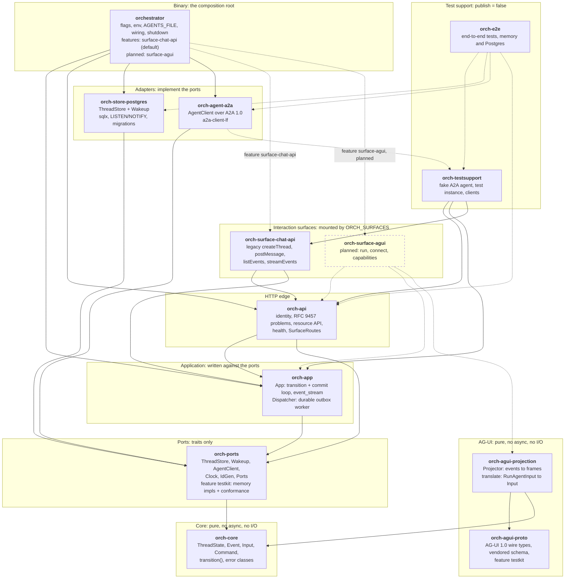
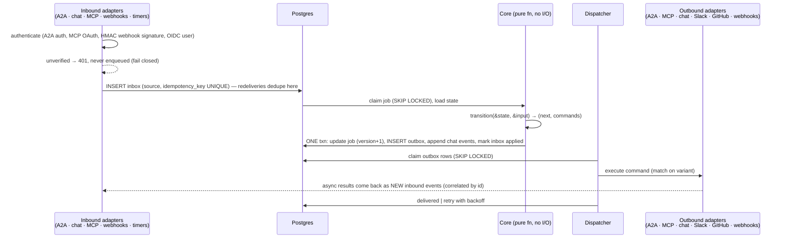
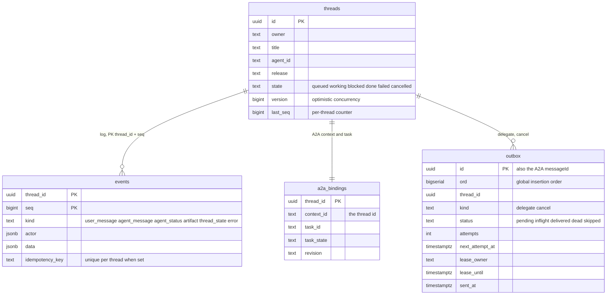

# Orchestrator

The orchestrator is a Rust service that owns every thread's state. Its replicas
are stateless; all state is in Postgres (ADR 0001, ADR 0007). The design is that
it accepts input from **anything** (A2A, the chat, MCP, webhooks, timers, …) and
produces output to **anything** (A2A, MCP tools, the chat, Slack, GitHub,
webhooks, …). The way to get that without rewriting the core per protocol is
**ports and adapters**:

- Every input is translated at the edge into one canonical `Input`.
- Every output is one canonical `Command`.
- In the middle sits one **pure** function: `(state, input) → (next state, commands)`.

Adding a protocol means adding an adapter crate. The state machine does not
change.

> **What is built.** Facts in this page are marked **Built** (present in
> `orchestrator/` and checked against the code on 2026-09-29) or **Planned**
> (design only). Today: the chat surface's API, the pure core, the Postgres
> store, the durable dispatcher, the A2A client adapter, the AG-UI wire types
> and the pure AG-UI projection. Not yet: the AG-UI HTTP surface, an A2A or MCP
> server, webhooks, timers, an inbox, MCP tools, and the model endpoint. The
> whole picture, with diagrams, is in [Architecture: as built](architecture.md#as-built).

## It is symmetric

The orchestrator is meant to be simultaneously a server and a client of each
protocol:

| Protocol | As a server (input) | As a client (output) | Status |
|---|---|---|---|
| A2A | Other agents hand it jobs | Delegates each thread to a configured A2A agent, whatever hosts it | Client **built** (`orch-agent-a2a`); server **planned** (`orch-surface-a2a`, ADR 0012) |
| MCP | Claude Code, opencode or any MCP client can `start_job`, `get_job`, `answer` | Calls tools: GitHub, docs, search, … | **Planned** |
| Chat | The web posts user messages | Appends messages and cards to the thread | The chat API is **built** (`orch-surface-chat-api`, deprecated); AG-UI wire types and projection **built**, its HTTP surface **planned** |
| Webhooks | GitHub, CI, Slack events | Slack posts, outgoing webhooks | **Planned** |
| Timers | Scheduled events (timeouts, reminders, cron) | Schedules new timers | **Planned** |

The chat row's user-facing protocol is **AG-UI 1.0**, a pure projection of the event log, with a
small REST resource API beside it ([ADR 0012](decisions/0012-ag-ui-user-facing-protocol.md),
binding in [`api/agui.md`](api/agui.md)). Each inbound surface (AG-UI, the legacy chat API, later
A2A) is an adapter crate behind a Cargo feature, and which ones are mounted is configuration
(`ORCH_SURFACES`). **Built:** the mechanism and the `chat-api` surface (the default and the only
name the binary accepts today). **Planned:** `agui` and `a2a`.

*Design, not built:* every event records its **origin**, and a `Reply` command goes back to
wherever the request came from: a job started over A2A gets A2A task updates; one started over MCP
gets MCP progress notifications; one started in the chat gets chat messages. Today every log event
records an `Actor` (`user`, `agent` or `system`), and the only reply channel is the thread's own
event log, which every surface reads.

## Crate layout

**Built.** The workspace (`orchestrator/Cargo.toml`, `members = ["crates/*", "bin/*"]`) has eleven
library crates and one binary. Dependencies below are read from the `Cargo.toml` files. Each crate has
a README with its API, environment and tests; the [workspace README](../orchestrator/README.md#crates)
has the same map with one line per crate.



How to read it: an arrow points from a crate to a crate it depends on; a dotted arrow is a
dependency behind a Cargo feature, a dev-dependency (tests only), or a planned one. To keep it
readable the graph omits the `orch-core` edge of every crate but `orch-agui-proto` (which has no
`orch-*` dependency at all) and the `orch-ports` edge of the binary, the surface crate and the test
crates.

Rules the graph enforces, each checkable in the manifests:

- **`orch-core` and `orch-agui-projection` are pure.** Neither depends on `tokio`, `sqlx`, `axum` or an
  HTTP client, so the compiler keeps the state machine and the AG-UI view a function of their
  inputs (ADR 0001, ADR 0004, ADR 0012).
- **Adapters depend on `orch-core` and `orch-ports` only.** `orch-store-postgres` and
  `orch-agent-a2a` name no other orchestrator crate (ADR 0009, rule 5: no implementation type in a
  port signature).
- **`orch-app` and `orch-api` name no adapter.** Only `bin/orchestrator` depends on
  the Postgres and A2A crates and chooses them (`type Stack = PortSet<PgStore, PgWakeup,
  A2aAgentClient, SystemClock, UuidV7Ids>` in `boot.rs`).
- **A surface depends on `orch-app` and `orch-api`, never on an adapter.** `orch-api` names no surface.
- **`orch-agui-proto` depends on nothing of ours**, so it can be checked against the vendored
  AG-UI schema and moved on its own.

| Crate (directory) | Role | Status |
|---|---|---|
| `orch-core` (`crates/core`) | Contract types and `transition` | **Built** |
| `orch-ports` (`crates/ports`) | `ThreadStore`, `Wakeup`, `AgentClient`, `Clock`, `IdGen`, the `Ports` bundle; feature `testkit`: `MemoryStore`, `MemoryWakeup`, `ScriptedAgent` and the conformance macros `thread_store_conformance!`, `wakeup_conformance!` | **Built** |
| `orch-store-postgres` (`crates/store-postgres`) | `ThreadStore` + `Wakeup` on Postgres | **Built** |
| `orch-agent-a2a` (`crates/agent-a2a`) | `AgentClient` over A2A 1.0 | **Built** |
| `orch-app` (`crates/app`) | `App`, `Dispatcher` | **Built** |
| `orch-api` (`crates/api`) | HTTP edge, resource API, `SurfaceRoutes` | **Built** |
| `orch-surface-chat-api` (`crates/surface-chat-api`) | Legacy interaction routes; deprecated | **Built** |
| `orch-agui-proto` (`crates/agui-proto`) | AG-UI 1.0 wire types, conformance testkit | **Built** |
| `orch-agui-projection` (`crates/agui-projection`) | `Projector`, `translate` | **Built** |
| `orch-surface-agui` | Run, connect and capabilities routes over the projection | **Planned** ([ADR 0012](decisions/0012-ag-ui-user-facing-protocol.md)) |
| `orch-surface-a2a` | A2A inbound | **Planned** (ADR 0012) |
| MCP client and server, webhook, timer, GitHub and Slack adapters | The other rows of the table above | **Planned** |
| `orch-testsupport`, `orch-e2e` (`crates/testsupport`, `crates/e2e`) | Test-only | **Built** |
| `orchestrator` (`bin/orchestrator`) | The composition root | **Built** |

### Cargo features

| Crate | Feature | Default | Effect |
|---|---|---|---|
| `orchestrator` | `surface-chat-api` | yes | Compiles in `orch-surface-chat-api`; it decides what *can* be mounted, `ORCH_SURFACES` what *is* |
| `orch-ports` | `testkit` | no | In-memory implementations and the conformance testkit; enable as a dev-dependency feature in adapter crates |
| `orch-agui-proto` | `testkit` | no | `assert_conforms` and friends against the vendored schema (`jsonschema`); enable as a dev-dependency feature |

There is no Cargo feature that selects the store or the A2A client: the binary depends on
`orch-store-postgres` and `orch-agent-a2a` unconditionally, because there is one implementation of
each. ADR 0009 says the built-in implementations are features of the default binary; that switch
is not built (see the status note in [ADR 0009](decisions/0009-swappable-implementations-at-build-time.md)).

## Event flow

**Design.** This is the flow for every input, including webhooks and MCP, which need the inbox to
dedupe redeliveries:



**Built today** differs in four places, all consequences of having one input path (a person using
the chat API) and one output (an A2A agent):

| Design | Built |
|---|---|
| Inbound adapters write an `inbox` row; a worker claims it and runs the transition | No inbox table. The request handler runs `transition` itself inside `App::apply` and commits state, events and outbox rows in one transaction, so a redelivery cannot happen on this path. The inbox arrives with the webhook and MCP inputs |
| Inbound events are deduplicated by `UNIQUE (source, idempotency_key)` | Events carry an optional `idempotency_key`, unique per thread (`events_idempotency`); the dispatcher derives keys from the agent's own ids, so a resumed or replayed stream never duplicates an event |
| The job row holds the state as `jsonb` | The `threads` row holds `state` as text with a `CHECK`; the state has no payload |
| Async results re-enter as new inbound events | The dispatcher turns everything the agent reports into `Input::Agent` and calls `App::apply`, the same entry point the chat API uses |

The turn as the code runs it, step by step, is a sequence diagram in
[Architecture: a chat turn](architecture.md#a-chat-turn).

## Command (outbox) lifecycle

**Built.** Two outbox kinds exist: `delegate` (send the user's text to the agent) and `cancel`
(ask the agent to cancel its task). Rows have the statuses below (`outbox.status`, `OutboxStatus`
in `orch-ports`):

```mermaid
stateDiagram-v2
  [*] --> Pending: inserted in the same txn as the state change
  Pending --> Inflight: claimed (FOR UPDATE SKIP LOCKED), lease taken, attempts + 1
  Inflight --> Inflight: heartbeat renews the lease
  Inflight --> Inflight: lease expired (worker died): another replica re-claims
  Inflight --> Pending: transient error, attempts < max, backoff
  Inflight --> Delivered: the turn ended (done, blocked, failed, cancelled), or a cancel went through
  Inflight --> Dead: permanent error, attempts exhausted, or the agent lost the task
  Pending --> Skipped: a cancel arrived before the message was sent
  Inflight --> Skipped: same, with an expired lease; or the thread was already finished
  Dead --> [*]: DeliveryFailed applied to the thread
  Delivered --> [*]
  Skipped --> [*]
```



`Dead → DeliveryFailed` is the fail-closed edge: a delegation that could not be delivered re-enters
the state machine as `Input::DeliveryFailed { reason, retryable }`, so the thread goes `blocked` (a
retryable failure: the user can send another message) or `failed` instead of carrying on as if the
step happened. The dispatcher applies it with the idempotency key `dead:<row id>`.

What the diagrams cannot say:

- **Per-thread order.** A `delegate` row is claimable only if no older `pending` or `inflight`
  `delegate` row exists for the same thread; `cancel` rows are not held back.
- **Resume, not resend.** `sent_at` is set when the agent's first frame arrives (with the A2A task
  id). A worker that re-claims a row with `sent_at` set resumes the task (`SubscribeToTask`, then
  polling `GetTask`) instead of sending the message again. On a later attempt of a row whose `sent_at` was
  never set, the worker first asks the agent whether the message id, which is the outbox row id, already
  created a task (`find_task_by_message`).
- **Defaults** (`DispatcherConfig::default()`, verified in the code 2026-09-29): 32 concurrent rows,
  30 s lease renewed every 10 s (the binary sets the lease from `OUTBOX_LEASE_SECS` and renews at a
  third of it), 5 send attempts, retry delay 1 s doubling to 60 s (or the agent's `Retry-After`
  when longer), `GetTask` polling from 1 s to 10 s with at most 10 consecutive failures, 10 cancel
  attempts, a 2 s outbox poll as a safety net under `LISTEN/NOTIFY`.
- **Shutdown.** The dispatcher stops its workers and sets `lease_until = now` on its rows, so another
  replica takes them at once ([`orchestrator/README.md`](../orchestrator/README.md#shutdown)).

## Thread state and transitions

**Built.** The states, the events they append and the pure function that decides both are in
`orch-core`. The state diagram is in [Architecture: thread state](architecture.md#thread-state);
this is the same machine as a table (`crates/core/tests/transition_table.rs` has one test per row):

| Input | `queued` / `working` | `blocked` | `done` / `failed` / `cancelled` |
|---|---|---|---|
| `UserMessage` | State kept; append `user_message`, `Delegate` | → `queued`; same commands | `Err(Finished)` (HTTP 409) |
| `Cancel` | State kept; `RequestCancel` | State kept; `RequestCancel` | No-op |
| Agent status `submitted` | Nothing | Nothing | `Err(InvalidInState)`, dropped as late |
| Agent status `working` | `queued` → `working`; append `agent_status`. Repeated in `working`: shown only with a detail | → `working` | `Err(InvalidInState)` |
| Agent status `input_required`, `auth_required` | → `blocked`; append `agent_status`, `thread_state` | State kept; shown again only with a detail | `Err(InvalidInState)` |
| Agent status `completed` | → `done`; `agent_status`, `thread_state` | → `done` | `Err(InvalidInState)` |
| Agent status `failed`, `rejected` | → `failed` (`rejected` prefixes the detail); `agent_status`, `thread_state` | → `failed` | `Err(InvalidInState)` |
| Agent status `canceled` | → `cancelled`; `agent_status`, `thread_state` | → `cancelled` | `Err(InvalidInState)` |
| Agent artifact, agent message | State kept; append `artifact` or `agent_message` | Same | `Err(InvalidInState)` |
| `DeliveryFailed`, retryable | → `blocked`; append `error`, and `thread_state` on entering | State kept; append `error` | State kept; append `error` |
| `DeliveryFailed`, permanent | → `failed`; `error`, `thread_state` | → `failed` | State kept; append `error` |
| `CancelledBeforeStart` | → `cancelled`; `thread_state` | → `cancelled` | No-op |
| `CancelRejected` | State kept; append `error` | Same | No-op |

`thread_state` is appended only when the thread *enters* `blocked`, `done`, `failed` or
`cancelled`; entering `queued` or `working` is implied by `user_message` and `agent_status`. The
property test (`tests/properties.rs`) checks that terminal states absorb, that a `thread_state`
event names the state the thread entered, and that `completed` reaches `done` from every open state.

## Core types

**Built.** A separate crate with no async, no sqlx and no HTTP, so purity is enforced by the
compiler, not by convention. The public surface that matters, as in `crates/core/src`:

```rust
// crate `orch-core` — types + one function. No I/O.

pub enum ThreadState { Queued, Working, Blocked, Done, Failed, Cancelled }

/// Everything that can happen to a thread, already protocol-neutral.
pub enum Input {
    UserMessage { user: UserId, text: String, message_id: Option<String>, run_id: Option<String> },
    Cancel { user: UserId },
    Agent { agent: AgentId, revision: Option<String>, update: AgentUpdate },
    DeliveryFailed { reason: String, retryable: bool },
    CancelledBeforeStart,
    CancelRejected { reason: String, retryable: bool },
}

/// What the application must do. The application turns these into ONE store commit.
pub enum Command {
    Append(EventDraft),          // → an event in the thread's log
    Delegate { text: String },   // → an outbox row, kind `delegate`
    RequestCancel,               // → an outbox row, kind `cancel`
}

/// The log the chat renders: `seq`, thread, time, `Actor { user | agent | system, name, revision? }`, body.
pub enum EventBody { UserMessage(_), AgentMessage(_), AgentStatus(_), Artifact(_), ThreadState(_), Error(_) }

pub enum TransitionError {
    Finished { state: ThreadState },                        // a user message on a finished thread
    InvalidInState { state: ThreadState, input: &'static str }, // a late agent update
}

pub fn transition(state: &ThreadState, input: &Input)
    -> Result<(ThreadState, Vec<Command>), TransitionError>;
```

An agent is a configured A2A agent-card URL and nothing host-specific (`AgentEndpoint { id,
card_url, bearer }` in `orch-ports`); a release selection travels as `AgentTarget.release` and is
only accepted when the *live* card advertises the release-channels extension (ADR 0008).

**Planned** (in the earlier design, not in the code): an `Origin` on every input (user, A2A, MCP,
webhook, timer), inputs for `Approval`, `CheckCompleted`, `ToolResult` and `TimerFired`, and the
commands `CallTool`, `Reply`, `Notify` and `Schedule`. They arrive with the MCP, webhook and timer
steps ([MVP](mvp.md)); the closed enums make the compiler list every `match` that must handle them
(ADR 0004). The AG-UI design adds `ui_surface` and `ui_action` events ([ADR 0013](decisions/0013-a2ui-generative-ui.md)).

## Design choices

- **Closed enums + `match`, not a `dyn Adapter` registry. Built.** The set of
  channels is compiled in; nothing is loaded at runtime. Adding a channel adds
  a variant, and the compiler points at every `match` that must handle it —
  the exhaustiveness is what we want as the list grows. Every `match` over
  `ThreadState`, `Input`, `AgentUpdate` and `AgentTaskState` in `orch-core` has no wildcard arm.
  The ports use `impl Future` methods and static dispatch (`Ports` with associated types), so
  there is no vtable and no `async-trait` boxing on the hot path.
- **Authentication at the edge, authorization in the core.** The edge half is **built**: `orch-api`
  reads `X-Auth-Request-Email` (set by oauth2-proxy), answers 401 without it on every path but
  `/healthz` and `/readyz`, and a surface cannot forget it because `router_with_surfaces` wraps every
  route. The core half is **partly built**: `App` scopes every read and write to the owner (someone
  else's thread is a 404, never a 403), but `transition` does not yet decide by origin, because
  only a signed-in user and the delegated agent can send inputs. *Planned:* a webhook must not be
  able to approve a PR.
- **Request/response protocols return immediately. Built.** `postMessage` answers 202 with the
  `user_message` event and the work continues in the dispatcher; `createThread` answers 201. A2A
  has this built in (`SendStreamingMessage` streams the task; `SubscribeToTask` and `GetTask`
  resume it). For MCP, *planned*: `start_job` returns a job id at once.
- **Optional protocol extensions are capability-detected. Built.** The A2A adapter reads each agent
  card live on every call, never caches it, and offers release selection only when the card declares
  the release-channels extension with well-formed parameters; a selected release is refused, never
  run as the default, when the live card no longer offers it. A selection is sent as the
  `A2A-Extensions` header plus namespaced message metadata (ADR 0008).
- **Idempotency. Built, and different from the design.** Redeliveries are absorbed by the
  per-thread `events.idempotency_key` (unique index) and, towards the agent, by the A2A `messageId`,
  which is the outbox row id. The inbox table with `UNIQUE (source, idempotency_key)` is *planned*
  with webhooks.
- **Optimistic concurrency on threads. Built.** `threads.version`; `ThreadStore::commit` takes the
  expected version, and `App::apply` re-reads and retries a lost race up to `max_commit_attempts`
  (8), then answers 503 (`Conflict`).
- **At-least-once outbound. Built.** A delegation is retried until it is delivered or dead-lettered;
  the message id makes a repeat harmless where the agent records it.
- **One error model. Built.** Every error enum implements `orch_core::Classify`; retry, HTTP status
  and exit code decide by `ErrorClass`, never by variant ([`orchestrator/README.md`](../orchestrator/README.md#errors)).

## Data model

**Built.** One migration, `crates/store-postgres/migrations/0001_init.sql`, applied at boot by every
replica (sqlx takes an advisory lock; an applied migration is never edited).



| Table | Holds | Key points |
|---|---|---|
| `threads` | Owner, title, target agent and release, current state, `version`, `last_seq` | The snapshot; the state is also implied by the log. `last_seq` is the per-thread counter row: it is bumped in the transaction that inserts the events, under the row lock, so `seq` has no gaps and no duplicates |
| `events` | The append-only event log | **This is the chat.** Primary key `(thread_id, seq)`; cascade-deleted with the thread |
| `a2a_bindings` | The A2A context id (the thread id), the current task id and state, the serving revision | Written with the commit that causes it, or by `mark_sent` |
| `outbox` | Commands to dispatch (`delegate`, `cancel`) | Status, attempts, `next_attempt_at`, lease owner and expiry, `sent_at`; two partial indexes over the open rows |

**Planned** tables of the design: `inbox` (received, authenticated events, for webhooks and MCP),
`timers` (scheduled events) and a job-level snapshot for multi-step jobs. The chat API needs none of
them.

**Live updates.** Postgres `LISTEN/NOTIFY` carries hints, never data. `PgStore` sends
`pg_notify` inside the writing transaction (channels `orch_thread` with the thread id as payload,
and `orch_outbox`), and every orchestrator replica holds one `LISTEN` connection (`PgWakeup`) that
fans the hints out to its own subscribers: its dispatcher (claim outbox rows) and its open SSE
streams (`App::event_stream`). After a reconnect of the listener, or when a subscriber lags, every
subscriber receives `Topic::Resync` and re-reads the store. A stream also polls every 5 s and the
dispatcher every 2 s, so a lost notification costs latency, not correctness. The stream is served
by the orchestrator: the web has no server-side code and never touches Postgres. No separate broker.

## Testing

**Built.**

- **Replay and determinism:** because `transition` is pure, folding the same inputs twice gives the
  same state and the same commands (`replay_is_deterministic`).
- **Transition table and properties:** one test per row of the table above; `proptest` over random
  input sequences checks that terminal states absorb, that `thread_state` events mark entry and
  that every open state can reach `done`.
- **Wire shapes:** `orch-core`'s JSON must match the schemas of [`api/chat-api.yaml`](api/chat-api.yaml);
  `orch-surface-chat-api` drives every operation and validates each response against them.
- **Conformance testkit per port:** `thread_store_conformance!` and `wakeup_conformance!` run
  against the in-memory implementations and against Postgres, so "does my store behave" is a test,
  not a reading exercise (ADR 0009, rule 3). There is no testkit for `AgentClient` yet; the A2A
  adapter is tested against an in-process A2A 1.0 agent over real HTTP.
- **End to end, on both stores:** `orch-e2e` runs each scenario as `<name>::memory` and
  `<name>::postgres` (chat API, dispatcher, A2A adapter, a fake agent): restart mid-stream with no
  gap and no duplicate, several replicas on one database, SSE resume, blocked and follow-up, cancel,
  releases, agent auth. The binary is also tested as a process, including a SIGKILL of one of two
  replicas mid-task.
- **Golden transcripts:** [`api/examples`](api/examples/README.md) pin what the orchestrator emits;
  the web and its mock replay them, and `orch-agui-projection` projects them to AG-UI streams that
  `tools/agui-conformance` reads through the reference client (`@ag-ui/client` 1.0.0) in CI.
- **AG-UI:** every emitted event is validated against the vendored AG-UI 1.0 JSON Schema; property
  tests check that streams are well formed at every prefix and that resuming from any resume point
  yields exactly the remaining suffix.

**Planned:** contract tests per further protocol against recorded fixtures, and a conformance
testkit for `AgentClient`.

## Libraries

Versions are from `orchestrator/Cargo.toml` (*verified* 2026-09-29, from the repository).

| Need | Choice | Status |
|---|---|---|
| A2A client | [`a2aproject/a2a-rs`](https://github.com/a2aproject/a2a-rs): `a2a-lf` 0.3.1, `a2a-client-lf` 0.2.5 (`a2a-server-lf` 0.4.4 in the test fake agent only) | In use since MVP step 2. Protocol notes in `orch-agent-a2a` are *verified* against the SDK sources on 2026-09-29 by that crate's author; not re-checked for this page. Maturity: open question 4 |
| A2A server | Not chosen yet | **Planned** (`orch-surface-a2a`). The SDK's server crate, `a2a-server-lf`, is used today only by the test fake agent |
| Postgres | `sqlx` 0.9 with rustls; `jiff-sqlx` | In use |
| HTTP | `axum` 0.8, `tower-http` | In use |
| Configuration | `clap` 4 with environment fallback | In use (`bin/orchestrator`) |
| Errors | `thiserror` in library crates, `anyhow` in the binary | House rule, in use |
| Time | `jiff`; no `f64` durations | In use |
| AG-UI schema validation | `jsonschema` 0.58, test-only, against the vendored 1.0 schema | In use (tests) |
| Model endpoint | Any OpenAI-compatible endpoint (ADR 0005) | **Planned**: nothing in the workspace calls a model yet |
| Durable execution engine | none — Postgres state machine | Restate considered; BSL server + extra stateful system. Revisit only if waits/timers get complex. |
