# Orchestrator

The orchestrator is a Rust service that owns every thread's state. Its replicas
are stateless; all state is in Postgres (ADR 0001, ADR 0007). The design is that
it accepts input from **anything** (A2A, the chat, MCP, webhooks, timers, …) and
produces output to **anything** (A2A, MCP tools, the chat, Slack, GitHub,
webhooks, …). The way to get that without rewriting the core per protocol is
**ports and adapters**:

- Every input is translated at the edge into one canonical `Input`.
- Every output is one canonical `Command`.
- In the middle sits one **pure** function: `(state, input) → (next state, commands)`.

Adding a protocol means adding an adapter crate. The state machine does not
change.

> **What is built.** Facts in this page are marked **Built** (present in
> `orchestrator/` and checked against the code on 2026-09-30) or **Planned**
> (design only). Today: the pure core, the Postgres store, the durable dispatcher,
> the A2A client adapter, and one interaction surface over `App`: AG-UI
> (the wire types, the pure projection, and the run, connect and capabilities
> routes, with A2UI surfaces and actions). The legacy chat API surface was
> removed on 2026-09-30. Not yet: an A2A or MCP server, webhooks,
> timers, an inbox, MCP tools, and the model endpoint. The
> whole picture, with diagrams, is in [Architecture: as built](architecture.md#as-built).
>
> **Partly built (design accepted 2026-09-30).** The job ledger and the gate in the core (MVP slice 2), and the
> gate's configuration and its AG-UI projection (slice 3) are built, with the agent's own checks as the only
> source the build honours ([The gate's configuration](#the-gates-configuration-and-its-projection-mvp-slice-3)).
> The rest, the inbox, timers, CI webhooks, the verifier and the MCP server, is planned. They are all designed in
> [ADR 0016](decisions/0016-inbox-timers-and-job-ledger-on-the-thread.md),
> [ADR 0017](decisions/0017-ci-results-by-webhook.md),
> [ADR 0018](decisions/0018-verification-gate-and-rework-loop.md) and
> [ADR 0019](decisions/0019-mcp-server-over-streamable-http.md), and built in the slices of
> [`mvp.md`](mvp.md#the-slices-of-steps-2-3-and-6). Every passage below marked **Planned** describes that
> design; none of it is in the code.

## It is symmetric

The orchestrator is meant to be simultaneously a server and a client of each
protocol:

| Protocol | As a server (input) | As a client (output) | Status |
|---|---|---|---|
| A2A | Other agents hand it jobs | Delegates each thread to a configured A2A agent, whatever hosts it | Client **built** (`orch-agent-a2a`); server **planned** (`orch-surface-a2a`, ADR 0012) |
| MCP | Claude Code, opencode or any MCP client can `start_job`, `get_job`, `wait_for_job`, `answer`, `cancel_job`, `list_agents` | Calls tools: GitHub, docs, search, … | **Planned**: the server as `orch-surface-mcp`, over streamable HTTP with bearer tokens, going straight to `App` and not through the inbox ([ADR 0019](decisions/0019-mcp-server-over-streamable-http.md)); the client side is not designed yet |
| AG-UI | The web, or any AG-UI client, `POST`s a `RunAgentInput` (a message, an answer by `resume`, an A2UI action) and attaches to a thread's connect stream | Streams the event log as AG-UI events: text, activities (status, artifacts, A2UI surfaces), interrupts, subagent invocations, run outcomes | **Built** (`orch-surface-agui` over `orch-agui-projection` and `orch-agui-proto`; the default surface). See [Live updates](#live-updates) |
| Chat API (legacy) | Old clients `POST` messages (`createThread`, `postMessage`) | Served the log as its own `Event` JSON over SSE (`listEvents`, `streamEvents`) | **Removed** on 2026-09-30 (`orch-surface-chat-api` and its feature are gone; naming `chat-api` in `ORCH_SURFACES` is a startup error). AG-UI is the one user-facing door |
| Webhooks | CI results: GitHub (HMAC) and a generic signed shape, through the inbox; Slack events are not designed yet | Slack posts, outgoing webhooks | **Planned**: `orch-surface-webhook` ([ADR 0017](decisions/0017-ci-results-by-webhook.md), [`api/webhooks.md`](api/webhooks.md)) |
| Timers | Scheduled events: the CI and verifier deadlines first; reminders and cron later | Schedules new timers (`Schedule`) | **Planned**: timers are inbox rows ([ADR 0016](decisions/0016-inbox-timers-and-job-ledger-on-the-thread.md)) |

The chat's user-facing protocol is **AG-UI 1.0**, a pure projection of the event log, with a
small REST resource API beside it (agents, threads, cancel, health: always mounted) ([ADR 0012](decisions/0012-ag-ui-user-facing-protocol.md),
binding in [`api/agui.md`](api/agui.md)). Each inbound surface (AG-UI, later
A2A) is an adapter crate behind a Cargo feature, and which ones are mounted is configuration
(`ORCH_SURFACES`, default `agui`). **Built:** the mechanism, the `agui` surface (the run route, the connect
stream and the capabilities document). **Planned:** `a2a`. The legacy `chat-api` surface was removed on
2026-09-30 ([ADR 0012](decisions/0012-ag-ui-user-facing-protocol.md#the-legacy-interaction-endpoints-are-deprecated-by-the-flag)).

*Design, not built:* every event records its **origin**, and a `Reply` command goes back to
wherever the request came from: a job started over A2A gets A2A task updates; one started over MCP
gets MCP progress notifications; one started in the chat gets chat messages. The first step toward it is
planned: `user_message` gains `origin: agui | mcp`
([ADR 0019](decisions/0019-mcp-server-over-streamable-http.md)). Today every log event
records an `Actor` (`user`, `agent` or `system`), and the only reply channel is the thread's own
event log, which every surface reads.

## Crate layout

**Built.** The workspace (`orchestrator/Cargo.toml`, `members = ["crates/*", "bin/*"]`) has fourteen
library crates (two of them test-only) and one binary. Dependencies below are read from the `Cargo.toml` files. Each crate has
a README with its API, environment and tests; the [workspace README](../orchestrator/README.md#crates)
has the same map with one line per crate.

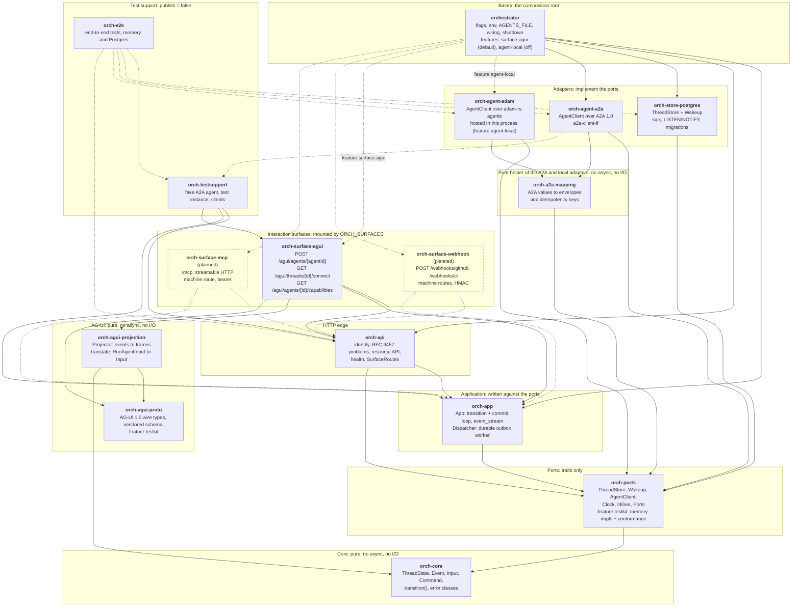

How to read it: an arrow points from a crate to a crate it depends on; a dotted arrow is a
dependency behind a Cargo feature, a dev-dependency (tests only), or a planned one. To keep it
readable the graph omits the `orch-core` edge of every crate but `orch-agui-proto` (which has no
`orch-*` dependency at all) and the `orch-ports` edge of the binary, the surface crate and the test
crates.

Rules the graph enforces, each checkable in the manifests:

- **`orch-core` and `orch-agui-projection` are pure.** Neither depends on `tokio`, `sqlx`, `axum` or an
  HTTP client, so the compiler keeps the state machine and the AG-UI view a function of their
  inputs (ADR 0001, ADR 0004, ADR 0012).
- **Adapters depend on `orch-core` and `orch-ports` only.** `orch-store-postgres`,
  `orch-agent-a2a` and `orch-agent-adam` name no other orchestrator crate (ADR 0009, rule 5: no
  implementation type in a port signature), except that the last two use `orch-a2a-mapping`, their
  shared pure helper (the mapping from A2A values to envelopes, itself depending on `orch-core` and
  `orch-ports` only and on no HTTP client), not another adapter.
- **`orch-agent-adam` is the only crate that names an adam-rs agent, runtime or store crate**
  (ADR 0015), and the binary links it only with the feature `agent-local`, off by default: with
  the feature off, `cargo tree -p orchestrator -i adam-runtime` finds nothing.
- **`orch-app` and `orch-api` name no adapter.** Only `bin/orchestrator` depends on
  the Postgres and agent crates and chooses them (`type Stack = PortSet<PgStore, PgWakeup, Agents,
  SystemClock, UuidV7Ids>` in `boot.rs`, where `Agents` is `A2aAgentClient`, or with `agent-local`
  `ByTransport<A2aAgentClient, LocalAgentClient>`, defined in `local.rs`).
- **A surface depends on `orch-app` and `orch-api`, never on an adapter.** `orch-api` names no surface.
- **`orch-agui-proto` depends on nothing of ours**, so it can be checked against the vendored
  AG-UI schema and moved on its own.

| Crate (directory) | Role | Status |
|---|---|---|
| `orch-core` (`crates/core`) | Contract types and `transition` | **Built** |
| `orch-ports` (`crates/ports`) | `ThreadStore`, `Wakeup`, `AgentClient`, `ByTransport` (one `AgentClient` from two, routed by `AgentTransport`), `Clock`, `IdGen`, the `Ports` bundle; feature `testkit`: `MemoryStore`, `MemoryWakeup`, `ScriptedAgent` and the conformance macros `thread_store_conformance!`, `wakeup_conformance!`, `agent_client_conformance!` | **Built** |
| `orch-store-postgres` (`crates/store-postgres`) | `ThreadStore` + `Wakeup` on Postgres | **Built** |
| `orch-agent-a2a` (`crates/agent-a2a`) | `AgentClient` over A2A 1.0 | **Built** |
| `orch-agent-adam` (`crates/agent-adam`) | `AgentClient` over adam-rs agents hosted in the orchestrator's own process: `LocalAgents`, `LocalAgentClient`, the closed `LocalKind` (`Echo`); journal in the orchestrator's Postgres under `orch_agent_`; feature `testkit` | **Built** (ADR 0015) |
| `orch-a2a-mapping` (`crates/a2a-mapping`) | Pure mapping of A2A stream items and tasks to `AgentEnvelope`s and idempotency keys; no I/O, no async | **Built** |
| `orch-app` (`crates/app`) | `App`, `Dispatcher` | **Built** |
| `orch-api` (`crates/api`) | HTTP edge, resource API, `SurfaceRoutes` | **Built** |
| `orch-agui-proto` (`crates/agui-proto`) | AG-UI 1.0 wire types, conformance testkit | **Built** |
| `orch-agui-projection` (`crates/agui-projection`) | `Projector`, `translate`, `Connect` (the connect fold), `agent_capabilities` | **Built** |
| `orch-surface-agui` (`crates/surface-agui`) | The run route `POST /agui/agents/{agentId}`, the connect stream `GET /agui/threads/{threadId}/connect` and the capabilities document `GET /agui/agents/{agentId}/capabilities`, over the projection | **Built** ([ADR 0012](decisions/0012-ag-ui-user-facing-protocol.md)) |
| `orch-surface-a2a` | A2A inbound | **Planned** (ADR 0012) |
| `orch-surface-webhook` | `POST /webhooks/github` and `POST /webhooks/ci`: HMAC on the raw body, normalise to a `CiReport`, `App::receive`; feature `surface-webhook`, on by default | **Planned** ([ADR 0017](decisions/0017-ci-results-by-webhook.md)) |
| `orch-surface-mcp` | The MCP server at `/mcp` (`rmcp`, streamable HTTP, stateless): `list_agents`, `start_job`, `get_job`, `wait_for_job`, `answer`, `cancel_job` | **Planned** ([ADR 0019](decisions/0019-mcp-server-over-streamable-http.md)) |
| MCP client, Slack adapters | The client side of the MCP row and the Slack rows of the table above | **Planned**, not designed |
| `orch-testsupport`, `orch-e2e` (`crates/testsupport`, `crates/e2e`) | Test-only | **Built** |
| `orchestrator` (`bin/orchestrator`) | The composition root | **Built** |

### Cargo features

| Crate | Feature | Default | Effect |
|---|---|---|---|
| `orchestrator` | `surface-agui` | yes | Compiles in `orch-surface-agui`, the AG-UI routes (run, connect, capabilities); it decides what *can* be mounted, `ORCH_SURFACES` what *is*. (`surface-chat-api` and its crate were removed on 2026-09-30.) |
| `orchestrator` | `agent-local` | no | Compiles in `orch-agent-adam` and the adam-rs runtime: `transport: local` agents in `AGENTS_FILE` are served in this process (below). Without it such an entry is refused at startup (exit 78) and nothing of adam-rs's runtime is linked |
| `orch-agent-adam` | `testkit` | no | The scripted agent, `LocalFixture` (the `AgentFixture` of the conformance suite), `LocalWorld` (processes sharing a journal) and a private Postgres schema; enable as a dev-dependency feature |
| `orch-ports` | `testkit` | no | In-memory implementations and the conformance testkit; enable as a dev-dependency feature in adapter crates |
| `orch-agui-proto` | `testkit` | no | `assert_conforms` and friends against the vendored schema (`jsonschema`); enable as a dev-dependency feature |

Planned, not built: the features `surface-webhook` (on by default; selects `orch-surface-webhook`, whose
surfaces are the `ORCH_SURFACES` names `webhook-github` and `webhook-generic`) and a feature for the MCP
surface. Its name is left to slice 11; `surface-mcp` by analogy.

There is no Cargo feature that selects the store or the A2A client: the binary depends on
`orch-store-postgres` and `orch-agent-a2a` unconditionally, because there is one implementation of
each. ADR 0009 says the built-in implementations are features of the default binary; that switch
is not built (see the status note in [ADR 0009](decisions/0009-swappable-implementations-at-build-time.md)).

## Event flow

**Design (planned, [ADR 0016](decisions/0016-inbox-timers-and-job-ledger-on-the-thread.md)).** This is
the flow for **unsolicited machine input**: webhooks and timers. The inbox exists to answer fast, to
dedupe redeliveries and to park a report that cannot be matched to a thread yet. Requests from an
authenticated caller who waits for the answer do **not** go through it: the chat (AG-UI, the legacy
chat API) keeps its idempotency key on the event, and **MCP goes straight to `App`**
([ADR 0019](decisions/0019-mcp-server-over-streamable-http.md)). The earlier text of this page said
"every input goes through the inbox"; that is withdrawn.

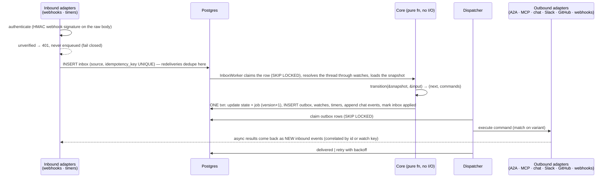

**Built today** differs in four places, all consequences of having one input path (a person in the chat, over AG-UI) and one output (an A2A
agent):

| Design | Built |
|---|---|
| Inbound adapters write an `inbox` row; a worker claims it and runs the transition | No inbox table. The request handler runs `transition` itself inside `App::apply` and commits state, events and outbox rows in one transaction, so a redelivery cannot happen on this path. The inbox arrives with the webhook and timer inputs (planned); MCP does not use it |
| Inbound events are deduplicated by `UNIQUE (source, idempotency_key)` | Events carry an optional `idempotency_key`, unique per thread (`events_idempotency`); the dispatcher derives keys from the agent's own ids, so a resumed or replayed stream never duplicates an event |
| The job row holds the state as `jsonb` | The `threads` row holds `state` as text with a `CHECK`; the state has no payload |
| Async results re-enter as new inbound events | The dispatcher turns everything the agent reports into `Input::Agent` and calls `App::apply`, the same entry point every surface uses |

The rows of the inbox have their own lifecycle (pending, inflight, applied, parked, expired, dead) and
their own state diagram in [ADR 0017](decisions/0017-ci-results-by-webhook.md#diagrams); timers are inbox
rows that become due at `available_at`, so the core never reads a clock
([ADR 0016](decisions/0016-inbox-timers-and-job-ledger-on-the-thread.md)). The `InboxWorker` lives in
`orch-app` and runs wherever the dispatcher runs (`worker`, `all`).

The turn as the code runs it, step by step, is a sequence diagram in
[Architecture: a chat turn](architecture.md#a-chat-turn).

## Command (outbox) lifecycle

**Built.** Two outbox kinds exist: `delegate` (send the user's text to the agent) and `cancel`
(ask the agent to cancel its task). Rows have the statuses below (`outbox.status`, `OutboxStatus`
in `orch-ports`):

```mermaid
stateDiagram-v2
  [*] --> Pending: inserted in the same txn as the state change
  Pending --> Inflight: claimed (FOR UPDATE SKIP LOCKED), lease taken, attempts + 1
  Inflight --> Inflight: heartbeat renews the lease
  Inflight --> Inflight: lease expired (worker died): another replica re-claims
  Inflight --> Pending: transient error, attempts < max, backoff
  Inflight --> Delivered: the turn ended (done, blocked, failed, cancelled), or a cancel went through
  Inflight --> Dead: permanent error, attempts exhausted, or the agent lost the task
  Pending --> Skipped: a cancel arrived before the message was sent
  Inflight --> Skipped: same, with an expired lease; or the thread was already finished
  Dead --> [*]: DeliveryFailed applied to the thread
  Delivered --> [*]
  Skipped --> [*]
```

`Dead → DeliveryFailed` is the fail-closed edge: a delegation that could not be delivered re-enters
the state machine as `Input::DeliveryFailed { reason, retryable }`, so the thread goes `blocked` (a
retryable failure: the user can send another message) or `failed` instead of carrying on as if the
step happened. The dispatcher applies it with the idempotency key `dead:<row id>`.

What the diagrams cannot say:

- **Per-thread order.** A `delegate` row is claimable only if no older `pending` or `inflight`
  `delegate` row exists for the same thread; `cancel` rows are not held back.
- **Resume, not resend.** `sent_at` is set when the agent's first frame arrives (with the A2A task
  id). A worker that re-claims a row with `sent_at` set resumes the task (`SubscribeToTask`, then
  polling `GetTask`) instead of sending the message again. On a later attempt of a row whose `sent_at` was
  never set, the worker first asks the agent whether the message id, which is the outbox row id, already
  created a task (`find_task_by_message`).
- **Defaults** (`DispatcherConfig::default()`, verified in the code 2026-09-29): 32 concurrent rows,
  30 s lease renewed every 10 s (the binary sets the lease from `OUTBOX_LEASE_SECS` and renews at a
  third of it), 5 send attempts, retry delay 1 s doubling to 60 s (or the agent's `Retry-After`
  when longer), `GetTask` polling from 1 s to 10 s with at most 10 consecutive failures, 10 cancel
  attempts, a 2 s outbox poll as a safety net under `LISTEN/NOTIFY`.
- **Shutdown.** The dispatcher stops its workers and sets `lease_until = now` on its rows, so another
  replica takes them at once ([`orchestrator/README.md`](../orchestrator/README.md#shutdown)).

### Fenced commits

A lease is a promise that lapses, not a lock: a worker paused past its lease (a stopped process, a
long GC or network stall) resumes believing it still owns the row, while another worker has claimed
it and is streaming the same task. Renewing the lease cannot help, because the paused worker cannot
renew. So the store, not the worker, decides. Every claim hands out a **fencing token**, the row's
`attempts` counter, which grows on each claim. A `Lease { id, owner, attempt }` is good only while
the row is `inflight`, held by `owner`, at exactly `attempt`. Every write a worker makes on behalf
of its row carries the lease: `renew_lease`, `mark_sent`, `retry_outbox`, `complete_outbox`, and the
thread `commit` that records what the agent reported (`Commit.lease`). A commit under a stale lease
writes nothing and answers `CommitOutcome::Fenced`; `App::apply` reports it as
`ApplyOutcome::Fenced` without retrying, and the worker logs `lease lost; the late agent result was
dropped` and stops.

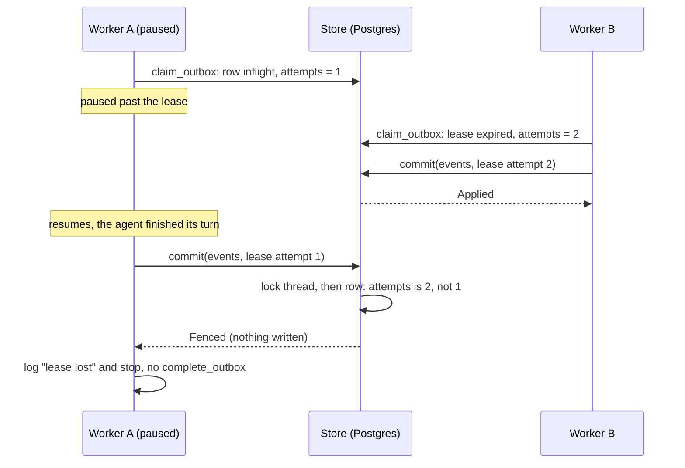

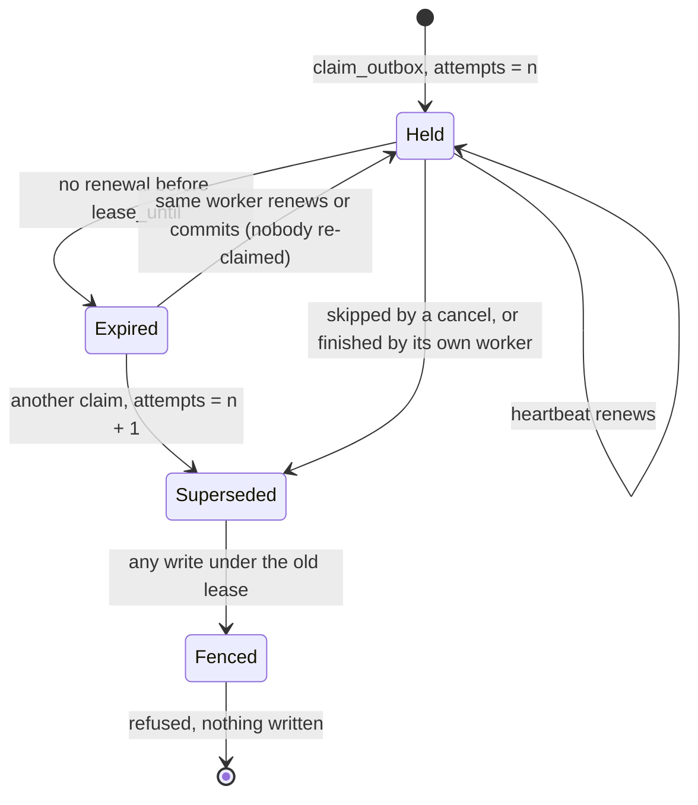

What the diagrams cannot say:

- **Expiry alone does not fence.** A lapsed lease that nobody claimed again is still the current
  claim, so the worker's late result is kept: throwing it away would only redo work. What revokes a
  lease is a later claim, and a row that left `inflight` (delivered, dead, retried, skipped).
- **The same owner name is not enough.** The owner is one name per process, and a process that
  re-claims its own expired row is "the same owner" again. Only `attempt` tells the two claims apart.
- **Postgres.** `commit` locks the thread row, then checks the claim with
  `SELECT 1 FROM outbox WHERE id = $1 AND thread_id = $2 AND lease_owner = $3 AND attempts = $4 AND
  status = 'inflight' FOR SHARE`, before the version and idempotency checks. The share lock keeps a
  claimer out until the commit ends (`claim_outbox` skips locked rows), so the check cannot go stale.
  Lock order is thread, then outbox row, then binding; no statement takes a thread lock while
  holding an outbox row lock, so the two cannot deadlock. No migration: `attempts` and
  `lease_owner` were already there.
- **API commits carry no lease** (`None`): a user's message or a cancel is not a claim, and
  `create_thread` ignores the field.
- **What is not fenced.** `skip_unsent_delegates` and `release_leases` take no lease; they act on
  the thread's rows by status and time.

## Local agents

**Built** (`orch-agent-adam`, behind the binary's Cargo feature `agent-local`, off by default; [ADR 0015](decisions/0015-control-plane-and-workers-on-adam-rs.md)).
An `AGENTS_FILE` entry with `transport: local` and `agent: <kind>` is an agent that runs in the
orchestrator's own process, on the durable runtime of adam-rs. Remote agents stay plain A2A. The kinds are
a closed enum (`LocalKind`, today `Echo`, which repeats the message back); the endpoint carries only the
kind's name (`AgentTransport::Local`), and the binary's configuration maps its own `LocalAgentKind` to the
crate's.

The dispatcher calls one `AgentClient`. In a build with the feature it is
`ByTransport<A2aAgentClient, LocalAgentClient>`, which routes each endpoint by its transport and holds no
adam type. `LocalAgentClient` drives the runtime through the same seam an A2A server uses,
`adam_a2a::TaskBackend` (implemented over the runtime by `adam-a2a-runtime`), and maps its events with
`orch-a2a-mapping`, so an envelope has the idempotency key it would have from a remote agent. A task is a run
of the journal; its caller is `orch:<agent id>`, and its id is derived from the agent kind, the caller, the
thread's context and the message id, so sending the same outbox row twice reaches one task.

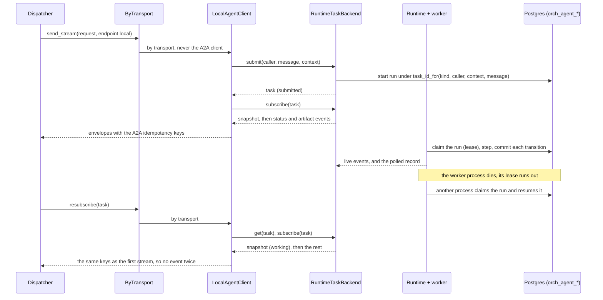

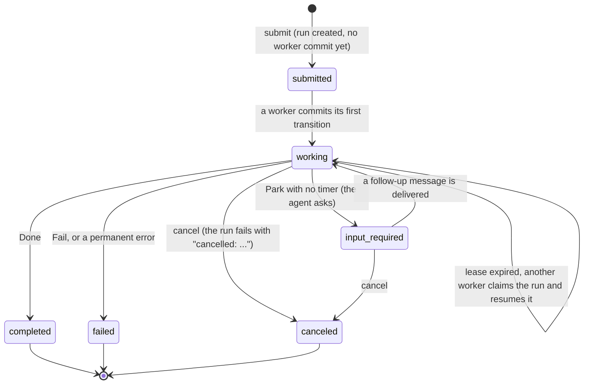

What the diagrams cannot say:

- **The journal is the orchestrator's Postgres** (the owner's decision of 2026-09-30). The store is
  `adam-store-postgres` on a pool of its own, with the table prefix `orch_agent_`: `orch_agent_runs`,
  `orch_agent_journal`, `orch_agent_meta`. The notifier (`adam-notify-postgres`) uses the channels
  `orch_agent_events` and `orch_agent_signals`, next to the orchestrator's `orch_thread`, `orch_outbox`
  and `orch_resync`. Nothing collides with `threads`, `events`, `a2a_bindings` and `outbox`. The migration is
  a `CREATE ... IF NOT EXISTS` in one transaction under an advisory lock of its own prefix, so every role and
  every replica may run it at boot.
- **A state machine of its own, under the thread's.** The runtime commits each transition by a version
  compare-and-swap and leases the run to one worker; a worker that dies loses at most the step it was in. Side
  effects go through the runtime's journal, so a replayed step gets the recorded result back (the agent's
  contract; `Echo` has none). The thread's own state is unchanged: it follows the envelopes as for any agent.
- **`resubscribe` is `TaskNotFound` for a finished task**, as with A2A; the dispatcher then polls `get_task`.
  `cancel` of a running task ends the run and the thread sees `canceled`; of a finished one it is refused
  (`NotCancelable`).
- **What a local agent refuses**: a selected release (no release channels) and an A2UI action (no surfaces).
  Both are `Rejected`, as the A2A adapter does when the card lacks the extension.
- **Roles.** `worker` and `all` run the agents' worker and its notifier beside the dispatcher; `control-plane`
  registers only the agents' starters (it can start and read a run, never step one) and runs neither. Each
  process that has a local agent configured opens `AGENT_LOCAL_CONCURRENCY + 4` connections of its own, on top of
  `DATABASE_MAX_CONNECTIONS`: one is the notifier's listener. `OUTBOX_LEASE_SECS` is also the lease of a local run.
- **Not built yet**: retention of the `orch_agent_*` tables (open question 28), and the coder kind, an agent
  with tools and a workspace, which is the next change of step 12.

## Thread state and transitions

**Built.** The states, the events they append and the pure function that decides both are in
`orch-core`. The state diagram is in [Architecture: thread state](architecture.md#thread-state);
this is the same machine as a table (`crates/core/tests/transition_table.rs` has one test per row):

| Input | `queued` / `working` | `blocked` | `done` / `failed` / `cancelled` |
|---|---|---|---|
| `UserMessage` | State kept; append `user_message`, `Delegate` | → `queued`; same commands | `Err(Finished)` (HTTP 409) |
| `Cancel` | State kept; `RequestCancel` | State kept; `RequestCancel` | No-op |
| Agent status `submitted` | Nothing | Nothing | `Err(InvalidInState)`, dropped as late |
| Agent status `working` | `queued` → `working`; append `agent_status`. Repeated in `working`: shown only with a detail | → `working` | `Err(InvalidInState)` |
| Agent status `input_required`, `auth_required` | → `blocked`; append `agent_status`, `thread_state` | State kept; shown again only with a detail | `Err(InvalidInState)` |
| Agent status `completed` | → `done`; `agent_status`, `thread_state` | → `done` | `Err(InvalidInState)` |
| Agent status `failed`, `rejected` | → `failed` (`rejected` prefixes the detail); `agent_status`, `thread_state` | → `failed` | `Err(InvalidInState)` |
| Agent status `canceled` | → `cancelled`; `agent_status`, `thread_state` | → `cancelled` | `Err(InvalidInState)` |
| Agent artifact, agent message, A2UI surface (`Ui`), refused A2UI part (`UiRejected`) | State kept; append `artifact`, `agent_message`, `ui_surface` or `error` | Same | `Err(InvalidInState)` |
| User's A2UI action (`UiAction`) | State kept; append `ui_action`, delegate the action | → `queued`; the same | `Err(Finished)` |
| `DeliveryFailed`, retryable | → `blocked`; append `error`, and `thread_state` on entering | State kept; append `error` | State kept; append `error` |
| `DeliveryFailed`, permanent | → `failed`; `error`, `thread_state` | → `failed` | State kept; append `error` |
| `CancelledBeforeStart` | → `cancelled`; `thread_state` | → `cancelled` | No-op |
| `CancelRejected` | State kept; append `error` | Same | No-op |

`thread_state` is appended only when the thread *enters* `blocked`, `done`, `failed` or
`cancelled`; entering `queued` or `working` is implied by `user_message` and `agent_status`. The
property test (`tests/properties.rs`) checks that terminal states absorb, that a `thread_state`
event names the state the thread entered, and that `completed` reaches `done` from every open state.

**Built in the core** (MVP slice 2; [ADR 0016](decisions/0016-inbox-timers-and-job-ledger-on-the-thread.md),
[ADR 0018](decisions/0018-verification-gate-and-rework-loop.md)): a seventh state, `verifying`, and
rows for the new inputs. With an empty gate the table above is unchanged, and the tests that pin it
run against the same expectations as before. The application does not yet execute `Watch`,
`Schedule` and `RequestVerification` (slices 5 and 10), and nothing yet produces `CiReported`,
`VerifierReported` or `TimerFired` (slices 5, 6 and 10); the core decides them already
(`crates/core/tests/gate.rs` has a row for each).

| Input | `verifying` |
|---|---|
| `CiReported` | The report is recorded as a `ci_result`. If it is about the pushed commit, CI is required and the report counts, it also settles the source: all required sources passed → `done`; a failure with `attempt < max` → `queued`, `attempt + 1`, a `rework` event and a `Delegate` with the findings; a failure on the last attempt → `failed`. A report for another commit or repository: the card only, nothing else changes |
| `VerifierReported` | Same, for the verifier source. Only the answer to the current `(attempt, verification)` counts; any other is recorded as a `check_result` marked `stale` and changes nothing |
| `TimerFired(CiDeadline)` | Current (`attempt` and `verification` match, CI still pending): → `blocked` (`ci_timeout`), no attempt spent. Stale: nothing |
| `TimerFired(VerifierDeadline)` | Current: → `blocked` (`verifier_timeout`). Stale: nothing |
| `UserMessage`, `UiAction` | The verification is abandoned; → `queued`, `Delegate`; no attempt counted. The facts about the pushed commit stay, so a CI result for it still counts in the next verification |
| `Cancel` | → `cancelled` at once (the agent's task is over, so there is nothing to ask it to cancel) |
| `DeliveryFailed`, retryable | → `blocked` (hold `verifier_failed`); permanent → `failed` |
| Agent artifact or message | Appended; the ledger is frozen (what is checked is what was pushed when the agent finished) |
| Agent status other than `failed`, `rejected`, `canceled` | Nothing: a repeat or a late update of a task that is over |
| `CiReported` on `done` / `failed` / `cancelled` | Only the `ci_result` card is appended |

The job also carries a `verification` counter that grows every time a thread enters `verifying`. A user
message abandons a verification without using an attempt, so the next one has the same `attempt`; timers
and verdicts name the `verification` they belong to, which is how a leftover of the abandoned one is
recognised as stale.

`completed` from `queued` or `working` goes to `verifying` instead of `done` when the gate requires
anything. There is no `reworking` state: a rework is `queued` or `working` with `attempt > 1`. The state
diagram is in [ADR 0018](decisions/0018-verification-gate-and-rework-loop.md#diagrams) and the job
lifecycle in [Architecture](architecture.md#job-lifecycle).

### The gate's configuration and its projection (MVP slice 3)

**Built** (2026-09-30). The policy a job runs under is resolved once, when the thread is created, from three layers
and then copied into `Job` ([ADR 0018](decisions/0018-verification-gate-and-rework-loop.md#configuration)). The
resolution is one set of rules, `GateRules` in `orch-app` (`gate_config.rs`), used by the binary at startup and by `App`
for a request, so the same thing is refused in the same words everywhere.

| Layer | Where | Members |
|---|---|---|
| Deployment | `ORCH_GATE` (comma list of `ci`, `agent-checks`, `verifier`; default none: today's behaviour), `ORCH_MAX_ATTEMPTS` (3), `ORCH_MAX_ATTEMPTS_CAP` (10), `ORCH_VERIFIER` | the base policy |
| Target | the `gate` key of an `AGENTS_FILE` entry, `deny_unknown_fields` | `require`, `maxAttempts`, `verifier`, `ci: {required, timeoutSecs}` |
| Thread | AG-UI `forwardedProps["vymalo.gate"]` on the run that creates the thread | `require`, `maxAttempts` |

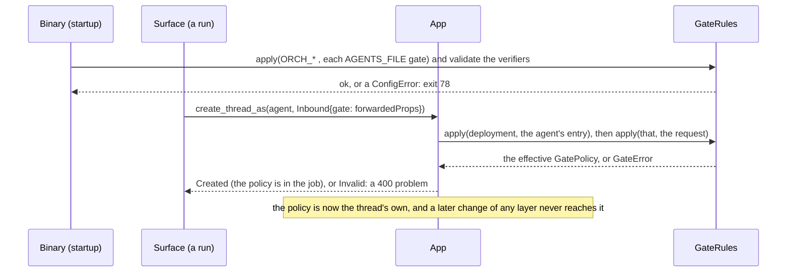

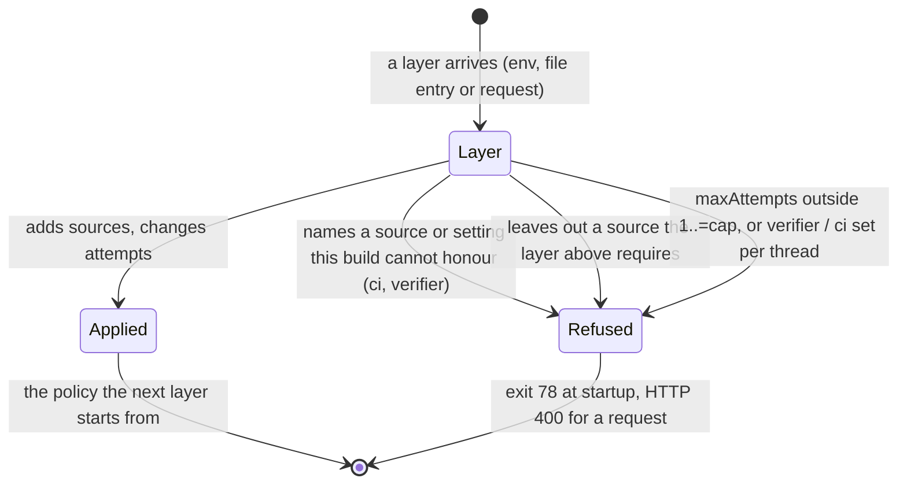

- **What this build honours is in one place.** `pending_reason` (a `match` over `CheckSource`, no wildcard) says why a
  source cannot be honoured yet; `GateRules::new` honours the rest. The application drops `Watch`, `Schedule` and
  `RequestVerification` until the inbox and timers (slice 5) and the verifier dispatch (slice 10) exist, so a gate that
  required `ci` or `verifier` would wait for a verdict that can never come. Configuration therefore **refuses** them in
  every layer, naming the slice that enables them: at startup with exit 78 (`ORCH_GATE`, `ORCH_VERIFIER`, an
  `AGENTS_FILE` entry, including its `ci` and `verifier` keys), and as a 400 for a request. Slices 6 and 10 change
  their arm of `pending_reason`; nothing else.
- **A layer may only tighten the one above.** The requested `require` is the whole list and must contain the layer
  above's; `maxAttempts` may be anything in `1..=ORCH_MAX_ATTEMPTS_CAP`; a thread cannot choose the verifier or the CI
  settings. The verifier must be another configured agent (checked at startup, for every agent's resolved gate).
- **The projection** (`orch-agui-projection`, [`api/agui.md`](api/agui.md#verification-the-gate)) keeps the run open
  while the thread is `queued`, `working` or `verifying`. It learns the gate from the thread record
  (`ThreadMeta.gate`, the job's copy) and everything else from the log: `SUBAGENT_FINISHED` and a `STATE_SNAPSHOT` with
  `job {attempt, maxAttempts, gate, sha}` at `completed`, `check_result` as the `vymalo.check` activity,
  `rework` as `vymalo.rework` plus the next attempt's `SUBAGENT_STARTED`, `RUN_FINISHED` at `done`, and `RUN_ERROR` with
  `checks_failed` when the attempts are out. The resource API's `Thread` carries the same `job` (`chat-api.yaml`).
- **A rework is a new A2A task in the same context.** The first task is `completed` and cannot be continued, so the
  dispatcher delegates the rework prompt without a task id (it continues a task only while it waits for the user); the
  agent sees the same `contextId`. `orch-e2e` (`verify.rs`) pins it.

## Core types

**Built.** A separate crate with no async, no sqlx and no HTTP, so purity is enforced by the
compiler, not by convention. The public surface that matters, as in `crates/core/src`:

```rust
// crate `orch-core` — types + one function. No I/O.

pub enum ThreadState { Queued, Working, Verifying, Blocked, Done, Failed, Cancelled }

/// Everything that can happen to a thread, already protocol-neutral.
pub enum Input {
    UserMessage { user: UserId, text: String, message_id: Option<String>, run_id: Option<String> },
    Cancel { user: UserId },
    Agent { agent: AgentId, revision: Option<String>, update: AgentUpdate },
    DeliveryFailed { reason: String, retryable: bool },
    CancelledBeforeStart,
    CancelRejected { reason: String, retryable: bool },
}

/// What the application must do. The application turns these into ONE store commit.
pub enum Command {
    Append(EventDraft),          // → an event in the thread's log
    Delegate { text: String },   // → an outbox row, kind `delegate`
    RequestCancel,               // → an outbox row, kind `cancel`
}

/// The log the chat renders: `seq`, thread, time, `Actor { user | agent | system, name, revision? }`, body.
pub enum EventBody { UserMessage(_), AgentMessage(_), AgentStatus(_), Artifact(_), ThreadState(_), Error(_),
                     /* UiSurface, UiAction, and the gate's: */ CiResult(_), CheckResult(_), Rework(_) }

pub enum TransitionError {
    Finished { state: ThreadState },                        // a user message on a finished thread
    InvalidInState { state: ThreadState, input: &'static str }, // a late agent update
}

pub fn transition(snapshot: &Snapshot, input: &Input)
    -> Result<(Snapshot, Vec<Command>), TransitionError>;   // Snapshot = state + job, below
```

An agent is a configured A2A agent-card URL and nothing host-specific. `AgentEndpoint { id, transport }`
in `orch-ports` says how to reach it, and `AgentTransport` is a closed enum (ADR 0004) with two
variants: `A2a { card_url, bearer }` and `Local { name }`, an agent hosted in the orchestrator's own
process, where `name` is the kind of local agent (`AgentEndpoint::local(id, name)`). It lives in the
ports, not in the core, because it carries a secret (the resolved bearer, redacted in `Debug`) that
`transition` never sees. Both variants are always compiled, whatever the Cargo features: what a build
can *serve* is decided at the composition root. The A2A adapter answers a `Local` endpoint with
`AgentError::Unsupported` on every operation, and the binary refuses a `Local` agent it cannot host
at startup (below). Which kinds exist is a second closed enum, `LocalAgentKind`, in the binary's
configuration (`Echo` is the only one so far), so the configuration can name and validate kinds
without depending on any implementation crate
([ADR 0015](decisions/0015-control-plane-and-workers-on-adam-rs.md), migration step 12).

In `AGENTS_FILE` an entry has an optional `transport`: `a2a` (the default when the key is absent, so
existing files are unchanged) needs `cardUrl` and takes an optional `tokenEnv`; `local` needs `agent`
(a `LocalAgentKind`) and refuses `cardUrl` and `tokenEnv` rather than ignoring them, so a lost
`transport: a2a` is a startup error, not a silently local agent. A `local` entry in a build without
local agents fails closed with `ConfigError::LocalAgentsNotCompiled` (exit 78), as an
`ORCH_SURFACES` name without its feature does. The Cargo feature `agent-local` (off by default)
compiles in the crate `orch-agent-adam` that implements them ([Local agents](#local-agents)); only a
build with it accepts a `transport: local` entry. The chat API's `AgentInfo.cardUrl` is optional
(`required: [id, name]`): an A2A agent has one, a local agent has none and the key is absent from
the JSON. A release selection travels as
`AgentTarget.release` and is only accepted when the *live* card advertises the release-channels
extension (ADR 0008).

**Built** (MVP slice 2; [ADR 0016](decisions/0016-inbox-timers-and-job-ledger-on-the-thread.md),
[ADR 0018](decisions/0018-verification-gate-and-rework-loop.md)): the core takes and returns a snapshot
that carries the job ledger, and the enums grew. As in `crates/core/src`:

```rust
pub struct Snapshot { pub state: ThreadState, pub job: Job }
pub fn transition(s: &Snapshot, i: &Input) -> Result<(Snapshot, Vec<Command>), TransitionError>;

pub struct Job {
    gate: GatePolicy, attempt: u32, verification: u32, task: Option<String>,
    pushed: Option<PushedRef>, results: Vec<CheckResult>, hold: Option<Hold>,
}
pub struct GatePolicy {
    require: BTreeSet<CheckSource>, max_attempts: u32, ci: CiPolicy /* required names, timeout */,
    verifier: Option<AgentId>, verifier_timeout: SignedDuration,
}
pub enum CheckSource { Ci, AgentChecks, Verifier }

ThreadState += Verifying
Input       += CiReported(CiReport) | VerifierReported { attempt, verification, verdict } | TimerFired(Timer)
Timer        = CiDeadline { attempt, verification } | VerifierDeadline { attempt, verification }
Command     += Watch { key } | Schedule { after: SignedDuration, timer }
             | RequestVerification { attempt, verification, verifier, pushed, text }
EventBody   += CiResult(CiReport) | CheckResult { source, attempt, status, findings, .. } | Rework { attempt, max_attempts, findings }
```

The gate policy is copied into `Job` at thread creation, so a configuration change never touches a running
job. Pure functions of the core recognise the agent's `branch` artifact (sets `pushed`, emits
`Watch { ci:<repo-key>@<sha> }`) and `checks` artifact (`recognise_artifact`), and normalise repository
keys (`repo_key`). Findings are capped at 20 items and 16 KiB per source (`cap_findings`) and quoted as
untrusted data in the rework prompt, which the core writes. `Job::default()` (the `{}` a row gets from the
database) has no gate. There is still no wildcard arm anywhere. Where the code differs from the ADR's
sketch: the `verification` counter and the `task` (the user's request, kept for the verifier's prompt)
are additions, and a `check_result` may carry `stale: true`.

**Planned, not yet specified** (in the earlier design): an `Origin` on every input (user, A2A, webhook,
timer; MCP's is `user_message.origin`, above), inputs for `Approval` and `ToolResult`, and the commands
`CallTool`, `Reply` and `Notify`. `CheckCompleted` is replaced by `CiReported` and `VerifierReported`;
`TimerFired` and `Schedule` are the ones above. They arrive with the later steps ([MVP](mvp.md)); the
closed enums make the compiler list every `match` that must handle them (ADR 0004). The AG-UI work has added `ui_surface` and `ui_action` events ([ADR 0013](decisions/0013-a2ui-generative-ui.md), built), with the agent update `AgentUpdate::Ui` / `UiRejected`, the input `Input::UiAction` and the command `DelegateAction`.

## Process roles

**Built** (checked against `bin/orchestrator/src/boot.rs` on 2026-09-29). One binary, one image. What a
process runs is its **role**, `ORCH_ROLE` or `--role` ([ADR 0015](decisions/0015-control-plane-and-workers-on-adam-rs.md)).
The enum, `Role`, and the supervisor, `Host`, come from the `adam-host` crate of adam-rs (a git
dependency pinned to a commit sha); this repository adds no role and no supervisor of its own.

| Role | Runs | Serves on `LISTEN_ADDR` |
|---|---|---|
| `control-plane` | migrations, the HTTP server: the resource API, the surfaces in `ORCH_SURFACES`, health. No dispatcher | the full API |
| `worker` | migrations, the dispatcher (including the transitions for agent updates), and in a build with `agent-local` the local agents' worker (see [Local agents](#local-agents)) | health and metrics only (`/healthz`, `/readyz`, `/metrics`), so probes and scrapes work; everything else is 404 |
| `all` (default) | both, as before the role existed (with the local agents' worker in a build with `agent-local`) | the full API |

The halves are already decoupled: the only things they share are the outbox, the thread version
compare-and-swap and `LISTEN/NOTIFY`, all in Postgres, so there is no new protocol between them and
`transition` stays the one pure function both call. A thread created through a control plane is
`queued` until a worker claims its outbox row; a control plane never calls an agent. Wake-ups
between processes are the ones the replicas already use (Postgres `LISTEN/NOTIFY`, backed up by the
dispatcher's and the streams' own polling), so a lost notification costs latency, not correctness.

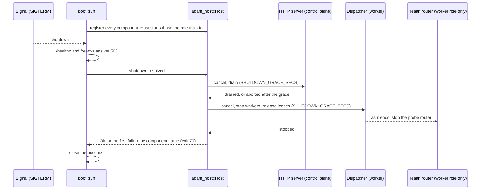

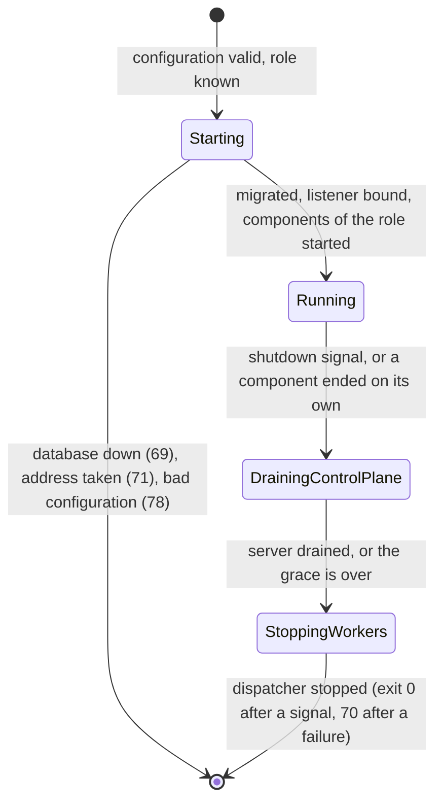

A worker is ready when the store answers and its dispatcher has started; the other roles are ready
once the database is migrated and answers. The probe router of a worker is a worker component that
ends after the dispatcher, so a draining worker answers 503 rather than refusing connections.

### Observability and scaling

**Built** (checked against `orchestrator/bin/orchestrator/src/logging.rs` and
`orchestrator/crates/api/src/metrics.rs` on 2026-09-29).

**Logs.** Every log line carries the process's `role` and `instance` (the id that owns its outbox
leases): the first two keys of the JSON object, or a `role=worker instance=w1 ` prefix in text
format. The event formatter adds them, not a root span, because the dispatcher runs each outbox
row in a spawned task that would not inherit one. Lines written while a row is processed also sit
in an `outbox` span (`id`, `thread`, `kind`, `attempt`). The configuration is read before logging
starts, so a line about an invalid configuration has no role yet.

**Metrics.** Every role serves `GET /metrics` on `LISTEN_ADDR`, without an identity (it is part of
the health routes). It reads the outbox from Postgres on each scrape (one aggregate over the open
rows, `ThreadStore::outbox_stats`), so the numbers are **global**: every replica reports the same
queue, whatever it runs itself.

| Sample | Meaning |
|---|---|
| `orch_outbox_rows{state="due"}` | claimable now: `pending` and due, or `inflight` with a lapsed lease |
| `orch_outbox_rows{state="waiting"}` | `pending` in retry backoff |
| `orch_outbox_rows{state="leased"}` | `inflight` under a live lease: a worker is on it |
| `orch_outbox_oldest_due_age_seconds` | whole seconds since the oldest due row became due, `0` when none |

The queue that matters for scaling is `due + leased`: rows waiting for a worker plus rows workers
are busy with. Because the values are global, an aggregation across the replicas that report them
takes `max`, never `sum` (three replicas would triple the count).

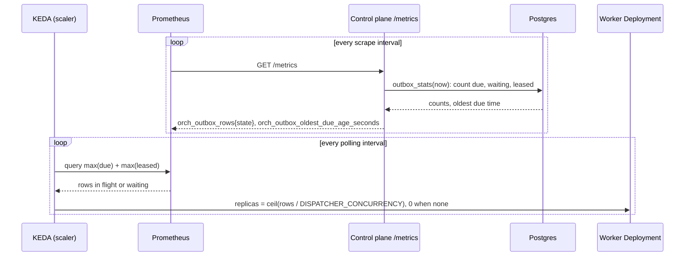

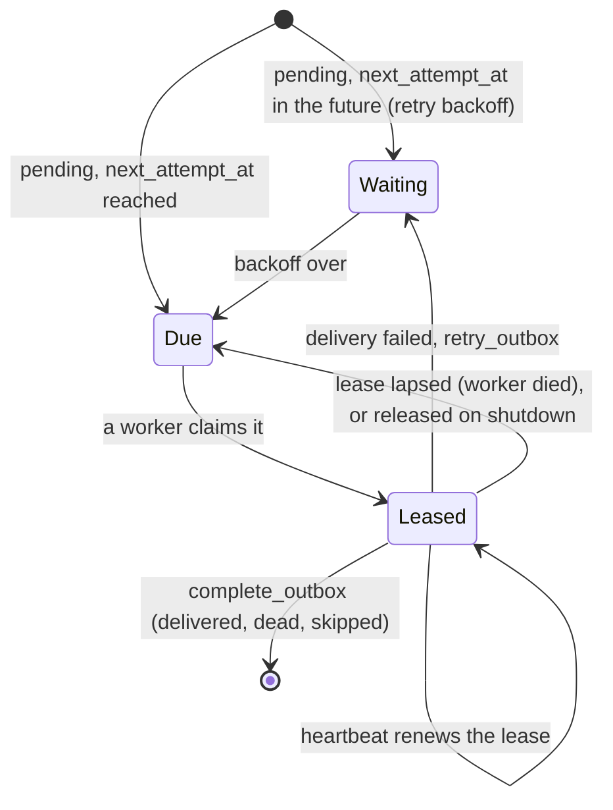

*Unverified* (KEDA and Prometheus behaviour from memory of their documentation, not checked
against a running cluster): a `prometheus` trigger with the query
`max(orch_outbox_rows{state="due"}) + max(orch_outbox_rows{state="leased"})` and a threshold equal to
`DISPATCHER_CONCURRENCY` (default 32) gives one worker per 32 open rows. Scaling a worker
Deployment **to zero** needs a control plane that stays up and is scraped, since a worker that does
not run cannot report the rows waiting for it. Without Prometheus, KEDA's `postgresql` scaler can
run the same count directly: `SELECT count(*) FROM outbox WHERE (status = 'pending' AND
next_attempt_at <= now()) OR (status = 'inflight')` (every `inflight` row is either leased or due,
so both are counted). The edge proxy of the compose stack routes only the application and does not
expose `/metrics`; scrape the pods, not the public ingress.

The `split` profile of the compose stack ([`dev/README.md`](../dev/README.md#the-split-profile-a-control-plane-and-two-workers))
runs a control plane and two workers, and `dev/split-e2e.sh` kills the worker that holds a task.

**Trace context** is not carried yet. A W3C `traceparent` would have to cross the outbox, which
means a column (a migration), and an OpenTelemetry exporter; see the open question in
[open-questions.md](open-questions.md).

**Testing.** `ThreadStore::outbox_stats` has a conformance case (`outbox_stats`, run by the memory
and Postgres stores: empty, due, backoff, live and lapsed leases, completed rows); the exposition
text is checked against a golden; `/metrics` is checked without identity on the full and the
health-only router; the binary's smoke tests read it from a control plane (one due row before a
worker exists, none after) and from a worker, and parse every JSON log line of a worker for its
`role` and `instance`.

## Design choices

- **Closed enums + `match`, not a `dyn Adapter` registry. Built.** The set of
  channels is compiled in; nothing is loaded at runtime. Adding a channel adds
  a variant, and the compiler points at every `match` that must handle it —
  the exhaustiveness is what we want as the list grows. Every `match` over
  `ThreadState`, `Input`, `AgentUpdate` and `AgentTaskState` in `orch-core` has no wildcard arm.
  The ports use `impl Future` methods and static dispatch (`Ports` with associated types), so
  there is no vtable and no `async-trait` boxing on the hot path.
- **Authentication at the edge, authorization in the core.** The edge half is **built**: `orch-api`
  reads `X-Auth-Request-Email` (set by oauth2-proxy), answers 401 without it on every path but
  `/healthz` and `/readyz`, and a surface cannot forget it because `router_with_surfaces` wraps every
  route. The core half is **partly built**: `App` scopes every read and write to the owner (someone
  else's thread is a 404, never a 403), but `transition` does not yet decide by origin, because
  only a signed-in user and the delegated agent can send inputs. *Planned:* a webhook must not be
  able to approve a PR. The planned webhook and MCP routes are **machine routes**
  (`SurfaceRoutes::machine(router, guard)`), the only routes outside the identity layer; they take a
  required authenticator (an HMAC check, a bearer check) and never read `X-Auth-Request-Email`
  ([ADR 0016](decisions/0016-inbox-timers-and-job-ledger-on-the-thread.md)). A `CiReported` input can only add a check
  result; it cannot approve or merge.
- **Request/response protocols return immediately. Built.** `postMessage` answers 202 with the
  `user_message` event and the work continues in the dispatcher; `createThread` answers 201. A2A
  has this built in (`SendStreamingMessage` streams the task; `SubscribeToTask` and `GetTask`
  resume it). For MCP, *planned*: `start_job` returns a job id at once, and `wait_for_job` follows it with
  progress notifications ([ADR 0019](decisions/0019-mcp-server-over-streamable-http.md)).
- **Optional protocol extensions are capability-detected. Built.** The A2A adapter reads each agent
  card live on every call, never caches it, and offers release selection only when the card declares
  the release-channels extension with well-formed parameters; a selected release is refused, never
  run as the default, when the live card no longer offers it. A selection is sent as the
  `A2A-Extensions` header plus namespaced message metadata (ADR 0008).
- **Idempotency. Built, and different from the design.** Redeliveries are absorbed by the
  per-thread `events.idempotency_key` (unique index) and, towards the agent, by the A2A `messageId`,
  which is the outbox row id. The AG-UI run route keys the event it writes
  `agui:<threadId>:msg:<messageId>` (`…:run:<runId>` for an answer with no message id of its own), so a
  retried POST is a no-op and attaches to the run instead. The inbox table with
  `UNIQUE (source, idempotency_key)` is *planned* with webhooks and timers
  ([ADR 0016](decisions/0016-inbox-timers-and-job-ledger-on-the-thread.md)); the AG-UI, chat API and MCP
  paths keep their keys on the event (MCP: the thread id is derived from `client_request_id`).
- **Optimistic concurrency on threads. Built.** `threads.version`; `ThreadStore::commit` takes the
  expected version, and `App::apply` re-reads and retries a lost race up to `max_commit_attempts`
  (8), then answers 503 (`Conflict`).
- **At-least-once outbound. Built.** A delegation is retried until it is delivered or dead-lettered;
  the message id makes a repeat harmless where the agent records it.
- **One error model. Built.** Every error enum implements `orch_core::Classify`; retry, HTTP status
  and exit code decide by `ErrorClass`, never by variant ([`orchestrator/README.md`](../orchestrator/README.md#errors)).

## Data model

**Built.** One migration, `crates/store-postgres/migrations/0001_init.sql`, applied at boot by every
replica (sqlx takes an advisory lock; an applied migration is never edited).

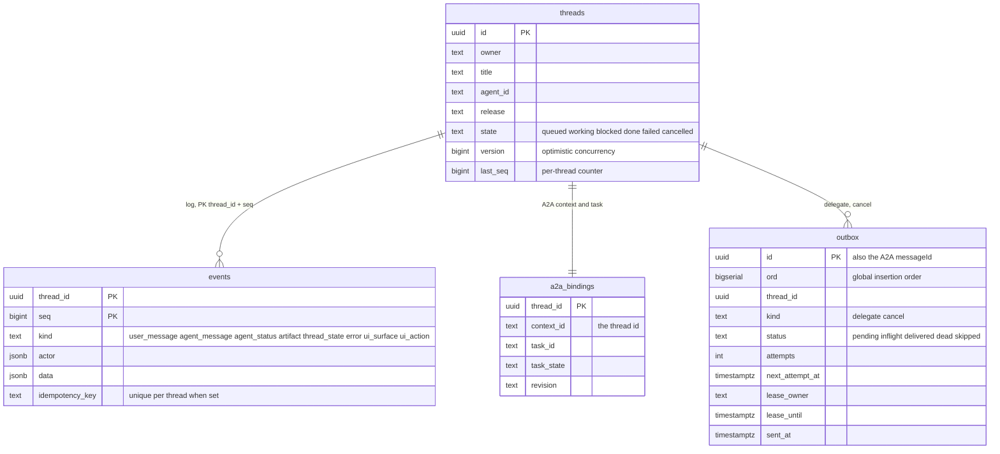

| Table | Holds | Key points |
|---|---|---|
| `threads` | Owner, title, target agent and release, current state, `version`, `last_seq` | The snapshot; the state is also implied by the log. `last_seq` is the per-thread counter row: it is bumped in the transaction that inserts the events, under the row lock, so `seq` has no gaps and no duplicates |
| `events` | The append-only event log | **This is the chat.** Primary key `(thread_id, seq)`; cascade-deleted with the thread |
| `a2a_bindings` | The A2A context id (the thread id), the current task id and state, the serving revision | Written with the commit that causes it, or by `mark_sent` |
| `outbox` | Commands to dispatch (`delegate`, `cancel`) | Status, attempts, `next_attempt_at`, lease owner and expiry, `sent_at`; two partial indexes over the open rows |

**Specified** ([ADR 0016](decisions/0016-inbox-timers-and-job-ledger-on-the-thread.md),
[ADR 0018](decisions/0018-verification-gate-and-rework-loop.md)). Two migrations, their numbers fixed
now so that parallel slices do not collide:

- **`0003` (slice 2, built):** `threads.job jsonb NOT NULL DEFAULT '{}'`, written in the same commit as
  `state` under the same `version` compare-and-swap (`Commit.job`); the `threads.state` and `events.kind`
  `CHECK`s widened once to every new value (`verifying`; `ci_result`, `check_result`, `rework`);
  `outbox.kind` gains `verify` and `outbox` gains a nullable `task_id`. The port types for the `verify`
  outbox kind come with the dispatcher's verifier path (slice 10).
- **`0004` (slice 5, planned):** the `inbox` and `watches` tables.

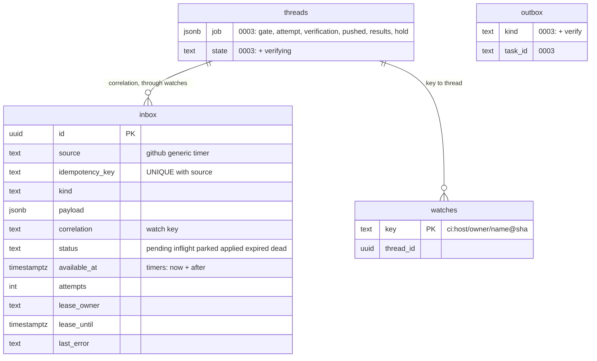

| Table or column | Holds | Key points |
|---|---|---|
| `threads.job` | The job ledger: the gate policy copied at creation, the attempt, the pushed commit, the check results, a hold | One thread, one job for steps 2 to 6; step 4's child jobs get a separate table later |
| `inbox` | Webhook reports and timers | `UNIQUE (source, idempotency_key)` dedupes; timers are rows with `source = 'timer'` and `available_at = now + after`; a row that matches no watch is `parked` and expires after `INBOX_PARKED_TTL_SECS`; claimed with `SKIP LOCKED` under a lease fenced like an outbox lease |
| `watches` | Which thread waits for which key | Inserted by a commit that carries `Watch { key }`, in the same transaction that re-arms parked rows with that key |
| `outbox.kind = 'verify'`, `outbox.task_id` | A verification request to the verifier agent, and its A2A task | The dispatcher never turns a verifier's envelopes into `Input::Agent` |

`Commit` gains `watches`, `timers` and `inbox: Option<Lease>`, and the inbox methods (`receive`,
`claim_inbox`, `park_inbox`, `retry_inbox`, `complete_inbox`) go on `ThreadStore` so that the commit stays
one transaction; the conformance cases join `thread_store_conformance!`. `user_message` gains an `origin`
field (no column; it is in the event's `data`). The chat needs none of this when the gate is empty.

### Live updates

Postgres `LISTEN/NOTIFY` carries hints, never data. `PgStore` sends
`pg_notify` inside the writing transaction (channels `orch_thread` with the thread id as payload,
and `orch_outbox`), and every orchestrator replica holds one `LISTEN` connection (`PgWakeup`) that
fans the hints out to its own subscribers: its dispatcher (claim outbox rows) and its open streams
(`App::event_stream`). After a reconnect of the listener, or when a subscriber lags, every
subscriber receives `Topic::Resync` and re-reads the store. A stream also polls every 5 s and the
dispatcher every 2 s, so a lost notification costs latency, not correctness. The streams are served
by the orchestrator: the web has no server-side code and never touches Postgres. No separate broker.

**How an AG-UI stream is produced.** `App::event_stream` is the only source of live events, and it
feeds the AG-UI run response and the AG-UI connect stream alike (and fed the legacy stream, removed on 2026-09-30). It is a read of
the log with a wake-up under it, not a subscription to a message bus, so a stream lives in the log
and not in the process. What differs per surface is the pure fold applied to the events: for the
connect stream, `orch_agui_projection::Connect` over a `Projector` in the *viewer* audience; for the
run response, the same `Projector` in the *requester* audience, from the first event the request's
input caused to the terminal event of that run.

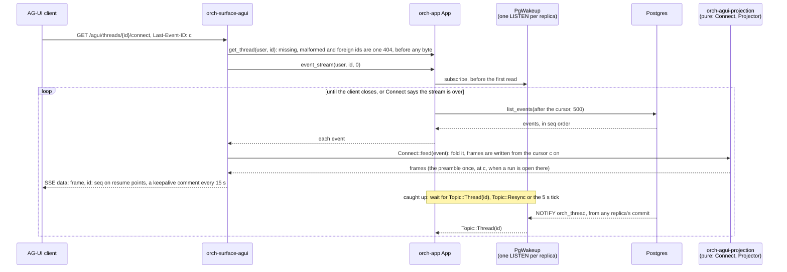

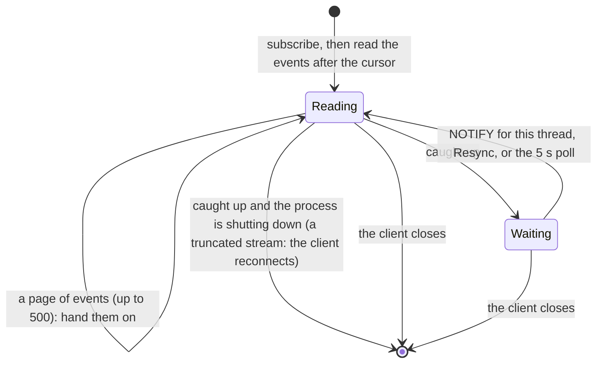

- **Nothing about a connection is kept.** There is no registry of connections or runs. A reconnect
  with `Last-Event-ID` builds a new `Connect` from the log: the events up to the cursor are folded
  and not written, so the projector's state at the cursor is the same on every replica, the
  preamble re-opens the run that is open there, and the rest is exactly what an uninterrupted stream
  would have written. Any replica serves any viewer, and a hundred viewers of a thread are a hundred
  independent folds. The cost is a read of the thread's log from its start on every connect.
- **Every id is derived from the log** (run, message, activity, subagent, interrupt), so replicas and
  replays emit identical frames; `id:` is the log's `seq`, written only on the last frame of an
  event and only when no text message is open, so a resume never splits a message.
- **A2UI travels the same way.** A `ui_surface` event becomes the *whole* surface as one
  `a2ui-surface` activity snapshot each time, so the last snapshot renders on the live stream, on
  replay and in history; a `ui_action` opens a run like a message does.
- **Closing a stream never cancels a run,** and a run started by the orchestrator itself (an event that
  arrives when no run is open) reaches a connect stream as a run of its own.

The routes, statuses and mapping tables are [`api/agui.md`](api/agui.md); the connect fold in
[`orch-agui-projection`](../orchestrator/crates/agui-projection/README.md) and the streaming code in
[`orch-surface-agui`](../orchestrator/crates/surface-agui/README.md).

## Testing

**Built.**

- **Replay and determinism:** because `transition` is pure, folding the same inputs twice gives the
  same state and the same commands (`replay_is_deterministic`).
- **Transition table and properties:** one test per row of the table above; `proptest` over random
  input sequences checks that terminal states absorb, that `thread_state` events mark entry and
  that every open state can reach `done`.
- **Wire shapes:** `orch-core`'s JSON must match the schemas of [`api/chat-api.yaml`](api/chat-api.yaml).
  `orch-api`'s `tests/contract.rs` drives every operation of the resource API and validates each
  response against them, and validates the events of a real thread, and the golden transcripts, against
  the contract's `Event` schema; `orch-surface-agui`'s `tests/contract.rs` does the same for the
  `/agui/*` operations.
- **Conformance testkit per port:** `thread_store_conformance!` and `wakeup_conformance!` run
  against the in-memory implementations and against Postgres, so "does my store behave" is a test,
  not a reading exercise (ADR 0009, rule 3). `agent_client_conformance!` does the same for
  `AgentClient`: twelve cases (a live card and a transient failure for an unreachable one; the first
  envelope names the task; unique idempotency keys; `get_task` agrees with the stream; a follow-up
  continues an `input-required` task; `resubscribe` yields the rest under the same keys, or says
  `Unsupported`; a finished or unknown task is not found; a turn outlives its dropped stream; a
  running task is cancelled and a completed one is refused; a failed task carries its message;
  `find_task_by_message` never names a wrong task; an unreachable send has a public detail without an
  address). Each has a 10 s timeout, and an implementation supplies an `AgentFixture`. It runs
  against the scripted in-memory agent and against the A2A adapter over real HTTP, with an in-process
  A2A 1.0 agent behind it.
- **End to end, on both stores:** `orch-e2e` runs each scenario as `<name>::memory` and
  `<name>::postgres` (the AG-UI run route and connect stream, the resource API, dispatcher, A2A adapter, a
  fake agent): restart mid-stream with no gap and no duplicate, several replicas on one database,
  resume of the connect stream, blocked and follow-up, cancel, releases, agent auth, a connect stream reconnected to
  another replica after the first is killed, A2UI surfaces and actions. The binary is also tested as a process, including a SIGKILL of one of two
  replicas mid-task.
- **Golden transcripts:** [`api/examples`](api/examples/README.md) pin what the orchestrator emits;
  the web and its mock replay them, and `orch-agui-projection` projects them to AG-UI streams that
  `tools/agui-conformance` reads through the reference client (`@ag-ui/client` 1.0.0) in CI.
- **AG-UI:** every emitted event is validated against the vendored AG-UI 1.0 JSON Schema; property
  tests check that streams are well formed at every prefix and that resuming from any resume point
  yields exactly the remaining suffix.

**Planned:** contract tests per further protocol against recorded fixtures.

## Libraries

Versions are from `orchestrator/Cargo.toml` (*verified* 2026-09-29, from the repository).

| Need | Choice | Status |
|---|---|---|
| A2A client | [`a2aproject/a2a-rs`](https://github.com/a2aproject/a2a-rs): `a2a-lf` 0.3.1, `a2a-client-lf` 0.2.5 (`a2a-server-lf` 0.4.4 in the test fake agent only) | In use since MVP step 2. Protocol notes in `orch-agent-a2a` are *verified* against the SDK sources on 2026-09-29 by that crate's author; not re-checked for this page. Maturity: open question 4 |
| A2A server | Not chosen yet | **Planned** (`orch-surface-a2a`). The SDK's server crate, `a2a-server-lf`, is used today only by the test fake agent |
| Postgres | `sqlx` 0.9 with rustls; `jiff-sqlx` | In use |
| HTTP | `axum` 0.8, `tower-http` | In use |
| Configuration | `clap` 4 with environment fallback | In use (`bin/orchestrator`) |
| Errors | `thiserror` in library crates, `anyhow` in the binary | House rule, in use |
| Time | `jiff`; no `f64` durations | In use |
| AG-UI schema validation | `jsonschema` 0.58, test-only, against the vendored 1.0 schema | In use (tests) |
| Model endpoint | Any OpenAI-compatible endpoint (ADR 0005) | **Planned**: nothing in the workspace calls a model yet |
| Durable execution engine | none — Postgres state machine | Restate considered; BSL server + extra stateful system. Revisit only if waits/timers get complex. |
