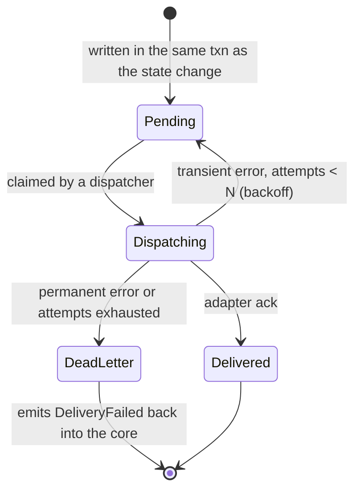

# Orchestrator

The orchestrator is a Rust service that owns every job's state. Its replicas
are stateless; all state is in Postgres (ADR 0001, ADR 0007). It accepts
input from **anything** (A2A, the chat, MCP, webhooks, timers, …) and produces
output to **anything** (A2A, MCP tools, the chat, Slack, GitHub, webhooks, …).
The way to get that without rewriting the core per protocol is **ports and
adapters**:

- Every input is translated at the edge into one canonical `Event`.
- Every output is one canonical `Command`.
- In the middle sits one **pure** function: `(state, event) → (next state, commands)`.

Adding a protocol means adding an adapter module. The state machine does not
change.

## It is symmetric

The orchestrator is simultaneously:

| Protocol | As a server (input) | As a client (output) |
|---|---|---|
| A2A | Other agents hand it jobs | Delegates steps to kagent agents and opencode workers |
| MCP | Claude Code, opencode or any MCP client can `start_job`, `get_job`, `answer` | Calls tools: GitHub, docs, search, … |
| Chat | assistant-ui posts user messages / approvals | Appends messages and cards to the thread |
| Webhooks | GitHub, CI, Slack events | Slack posts, outgoing webhooks |
| Timers | Scheduled events (timeouts, reminders, cron) | Schedules new timers |

Every event records its **origin**. A `Reply` command goes back to wherever
the request came from: a job started over A2A gets A2A task updates; one
started over MCP gets MCP progress notifications; one started in the chat gets
chat messages.

## Event flow


## Command (outbox) lifecycle



`DeadLetter → DeliveryFailed` is the fail-closed edge: a delegation that could
not be delivered re-enters the state machine as an event, so the job goes
`Blocked` or `Failed` instead of carrying on as if the step happened.

## Core types (sketch)

A separate crate with no async, no sqlx and no HTTP — so purity is enforced by
the compiler, not by convention.

```rust
// crate `core` — types + one function. No I/O.

/// Who sent an event — and therefore where the reply goes.
#[derive(Debug, Clone, PartialEq, Eq, Serialize, Deserialize)]
pub enum Origin {
    User { user_id: UserId },
    A2a { agent: AgentRef, task_id: A2aTaskId },
    Mcp { client: McpClientId, request_id: McpRequestId },
    Webhook { provider: WebhookProvider, delivery_id: DeliveryId },
    Timer { timer_id: TimerId },
}

/// Semantic, not protocol-shaped: a Slack approval and a chat approval are the same event.
#[derive(Debug, Clone, Serialize, Deserialize)]
pub enum EventKind {
    JobRequested { goal: String, repo: Option<RepoRef> },
    UserMessage { text: String },
    Approval { approved: bool },
    AgentProgress { step: StepId, update: AgentUpdate },
    AgentFinished { step: StepId, outcome: AgentOutcome },
    ToolResult { step: StepId, result: serde_json::Value },
    CheckCompleted { step: StepId, passed: bool, findings: Vec<Finding> },
    TimerFired { timer: TimerId },
    DeliveryFailed { command: CommandId, reason: String },
    Cancel,
}

pub struct Event { pub id: EventId, pub job: JobId, pub origin: Origin, pub kind: EventKind }

#[derive(Debug, Clone, Serialize, Deserialize)]
pub enum Command {
    Delegate { step: StepId, to: AgentRef, task: TaskSpec },   // → A2A client
    CallTool { step: StepId, server: McpServerRef, tool: String,
               args: serde_json::Value },                       // → MCP client
    Reply { to: Origin, message: Message },                     // → back where it came from
    Notify { channel: NotifyChannel, message: Message },        // → Slack, webhook, …
    Schedule { timer: TimerId, at: jiff::Timestamp },           // → timers table
}

pub struct Transition { pub next: JobState, pub commands: Vec<Command> }

/// An agent is an A2A agent-card URL — nothing host-specific.
pub struct AgentRef {
    pub card_url: Url,
    /// Only set when the card advertises the release-channels extension (ADR 0008).
    pub release: Option<ReleaseSelector>,
}

#[derive(Debug, thiserror::Error)]
pub enum TransitionError {
    #[error("{event} is not valid in state {state}")]
    InvalidInState { state: &'static str, event: &'static str },
    #[error("{origin} may not {action}")]
    Unauthorised { origin: &'static str, action: &'static str },
}

pub fn transition(state: &JobState, event: &Event) -> Result<Transition, TransitionError>;
```

## Design choices

- **Closed enums + `match`, not a `dyn Adapter` registry.** The set of
  channels is compiled in; nothing is loaded at runtime. Adding a channel adds
  a variant, and the compiler points at every `match` that must handle it —
  the exhaustiveness is what we want as the list grows. No vtables, no
  async-trait boxing.
- **Authentication at the edge, authorization in the core.** The edge proves
  *who* sent something (fail closed: unverified input is never enqueued). The
  core decides whether that origin *may* do it — e.g. only `Origin::User` with
  the right role can emit `Approval`, so a webhook cannot approve a PR.
- **Request/response protocols return immediately.** A2A has this built in
  (`message/send` returns a `working` task; updates follow by push or stream).
  For MCP, `start_job` returns a job id at once; progress arrives as MCP
  notifications or via a `get_job` tool.
- **Optional protocol extensions are capability-detected.** The A2A adapter
  reads each agent card; host-specific conveniences such as release selection
  (ADR 0008) are only used when the card advertises them, and are sent via the
  `A2A-Extensions` header plus namespaced message metadata.
- **Idempotency at the inbox.** Webhooks and push notifications are redelivered;
  `UNIQUE (source, idempotency_key)` makes a redelivery a no-op.
- **Optimistic concurrency on jobs.** `version` column; a transition that lost
  a race retries from the fresh state.
- **At-least-once outbound.** Outbound adapters send an idempotency key where
  the target supports one (A2A message ids, GitHub operations keyed by branch).

## Data model (sketch)

| Table | Holds | Key points |
|---|---|---|
| `jobs` | Current state (`jsonb`) + `version` | Snapshot for speed; rebuildable from `events`. |
| `inbox` | Received, authenticated events | `UNIQUE (source, idempotency_key)`; `applied_at` null until processed. |
| `events` | Applied events + produced messages | **This is the chat.** Append-only; assistant-ui renders it. |
| `outbox` | Commands to dispatch | `status`, `attempts`, `next_attempt_at`, `correlation_id`. |
| `timers` | Scheduled `TimerFired` events | Claimed with `SKIP LOCKED` when due. |

Live updates: `NOTIFY` on insert into `events` → the Next.js server `LISTEN`s
and streams to the browser over SSE. No separate broker.

## Crate layout

```
crates/
  core/            # pure types + transition(); no async, no I/O
  store/           # sqlx: jobs, inbox, outbox, events, timers
  adapters/
    a2a/           # server (agent card, message/send, tasks) + client (a2a-lf)
    mcp/           # server (start_job, get_job, answer) + client
    chat/          # HTTP API for the control plane
    github/  slack/  webhook/  timer/
bin/
  orchestrator/    # axum wiring for inbound + the dispatcher loop
```

## Testing

- **Replay:** because `transition` is pure, a recorded job's event log can be
  replayed and asserted to end in the same state and emit the same commands.
- **Property tests:** no sequence of events reaches an impossible state;
  every non-terminal state has a path to a terminal one.
- **Adapters:** contract tests per protocol against recorded fixtures; one
  end-to-end test per protocol against a real Postgres.

## Libraries

| Need | Choice | Status |
|---|---|---|
| A2A client + server | [`a2aproject/a2a-rs`](https://github.com/a2aproject/a2a-rs) (crate `a2a-lf`) | Official SDK per the A2A project — **unverified** in use |
| Postgres | `sqlx` | Standard |
| HTTP | `axum` | Standard |
| Errors | `thiserror` in library crates, `anyhow` in the binary | House rule |
| Time | `jiff` | No `f64` durations |
| Durable execution engine | none — Postgres state machine | Restate considered; BSL server + extra stateful system. Revisit only if waits/timers get complex. |
