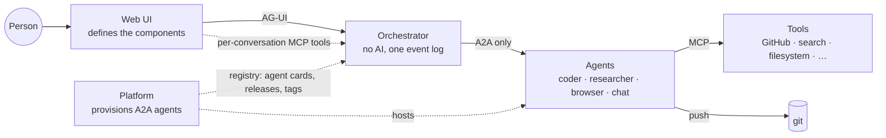
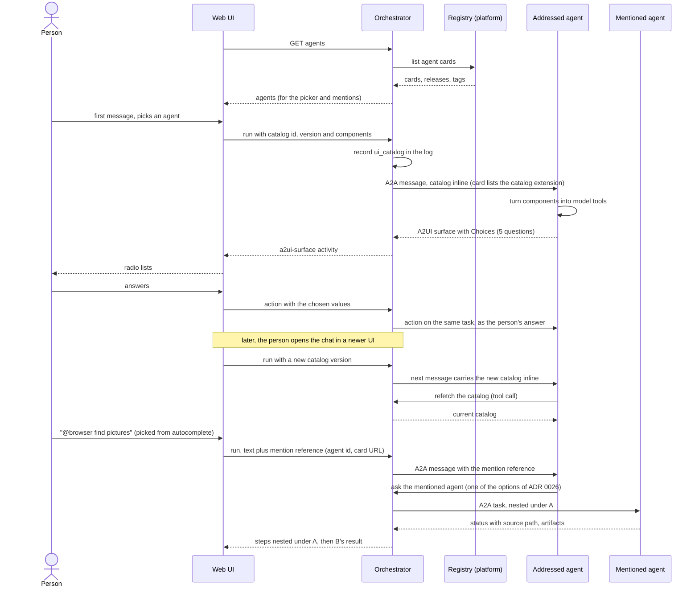
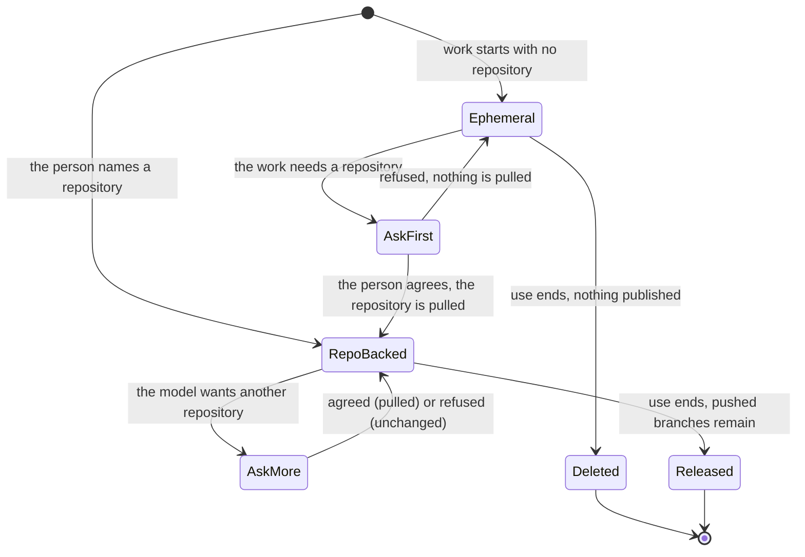

# Vision: the system

> Status: **written 2026-10-01 from the owner's review of the build.** This page says what the
> system is meant to be, in the owner's words where possible, and how far the code is from it. The
> build order toward it is the [MVP](mvp.md); the decisions it needs are proposed as ADRs
> [0022](decisions/0022-platform-provisions-agents-system-discovers-them.md) to
> [0026](decisions/0026-agent-mentions-as-structured-references.md). Statements about this
> repository's code were checked against `main` at `7b79f77` on 2026-10-01.
>
> **Update, 2026-10-01 (later the same day):** the owner delegated the open points, and the five ADRs are
> accepted, each with a dated status note; open questions 34, 35, 36 and 39 are closed. Where this page says
> "proposed" or "not decided" below, read those notes: it is kept as it was written.

## Why this page exists

The owner tested the build of MVP steps 1 and 2: the orchestrator, the web chat, and adam-coder as
the only agent. Their verdict:

> "the adam part is not complete; the system part is not even 10% in the direction I thought it
> would be. The MVP is not ready."

What exists today is plumbing. The orchestrator speaks A2A to the agents listed in a static YAML
file (`AGENTS_FILE`), the web chat speaks AG-UI, a verification gate checks the work, and one
coding agent is wired in. It works end to end, but it is a chat for testing one agent.

The system should be something else: **the person's whole environment, made known to agents.**
Which agents exist, which interface components the person's screen can show, which tools the person
has attached, which repositories they are working in. Agents should know all of it and use it.

> "The -system is not simply a chat for testing, it's a 'system'."

## The actors

- **The person** talks in the web UI, picks agents, mentions others, attaches tools, answers
  through components.
- **The web UI** owns the components (list, cards, choices, stepper, mermaid, web view, …) and
  describes them to the system. It knows nothing about any agent's internals.
- **The orchestrator** carries everything between the UI and agents and keeps the one event log
  ([ADR 0001](decisions/0001-rust-state-machine-on-postgres.md)). It has no model of its own.
  **It talks to agents only over A2A** ([ADR 0007](decisions/0007-protocol-only-dependencies.md)),
  and that stays true for everything on this page: every new capability is an optional A2A
  extension, detected from the agent card ([ADR 0008](decisions/0008-platform-integration-via-a2a-extension.md)
  pattern).
- **Agents** are A2A agents. Each does one kind of work well: coding, research, browsing, casual
  chat. adam-coder ([ADR 0014](decisions/0014-adam-coder-default-agent-over-a2a.md)) is the first.
- **The platform** (another-agentic-platform) provisions A2A agents and manages them: system prompt,
  configuration, revisions, promotion, tags. It is the registry the system reads. "The platform
  should not know about the UI normally, it just provisions A2A-capable Agents."
- **Tools** are MCP servers. Some belong to an agent; some the person attaches to a conversation.

## Capabilities

Each capability lists what exists today and what is missing. "Slice" refers to the build order in
the [MVP](mvp.md#the-new-build-order).

### 1. The platform is the agent registry

> another-agentic-platform "intend[s] to give a seam to manage (system prompt, configs, promote,
> tag, ...) multiple A2A dynamically, and -system should understand that."

**The rule:** the platform provisions A2A agents; the system discovers them and talks to them over
A2A. The platform never learns about the UI, the catalog or the chat. Management (editing a system
prompt, promoting a revision, tagging) happens in the platform; the system shows the result live.

**Today.**
- Agents come from a static file read at startup: `AGENTS_FILE`
  ([`orchestrator/agents.example.yaml`](../orchestrator/agents.example.yaml), parsed in
  [`config.rs`](../orchestrator/bin/orchestrator/src/config.rs)), served as `GET /api/agents`; the
  first entry is the default ([ADR 0014](decisions/0014-adam-coder-default-agent-over-a2a.md)).
- The system knows the platform only as a **release picker**: when an agent card lists the
  release-channels extension, the web offers channels and revisions
  ([ADR 0008](decisions/0008-platform-integration-via-a2a-extension.md),
  [`api/agui.md`](api/agui.md#capabilities-document)). It is tested against mocks only (open
  question 10).

**Missing.**
- A live registry: the list of agents read from the platform (which agents exist, their cards,
  releases and tags), refreshed without a restart. The static file stays as one implementation of
  the same port ([ADR 0009](decisions/0009-swappable-implementations-at-build-time.md)).
- An agreed discovery format. A2A does not standardise a registry API (*verified 2026-10-01*,
  <https://a2a-protocol.org/latest/topics/agent-discovery/>: "The current A2A specification does
  not prescribe a standard API for curated registries"). Proposed:
  [ADR 0022](decisions/0022-platform-provisions-agents-system-discovers-them.md); format is open
  question 39.

### 2. Rich output and rich input, through components the agent knows about

> The goal is "to make the agent also aware of the user's environment, e.g know that a component in
> the UI is available".

> "The answer of the chat should be rich. The user input should also be rich. So the UI should
> define components, e.g. by key and params, then let the A2A seam know about them."

The owner wanted OpenUI at first; "we can redo their semantic here ourselves". The components the
owner listed:

| Component | What it does | Direction |
|---|---|---|
| List | show the person a list | out |
| Choices | ask a radio list, e.g. 5 questions at once; the smarter `ask_user` | in |
| Stepper | walk the person through steps | out and in |
| Cards | show a list of cards | out |
| Web view | display a web rendering in the UI (e.g. an iframe) | out |
| Agent suggestion | propose another agent or a group of agents | in (the person accepts) |
| Skill request | ask for more skills | in (the person approves) |
| Mermaid | display a mermaid graph | out |
| Image | place a picture at the start, middle or end of a text, or in a list | out |
| Notification opt-in | ask at first open to be notified later about this chat, and tell the agent | in |

And: **combine all of these** in one answer.

**The owner's decision (2026-10-01):** "since the components are not dynamic, their params only are,
then it's safe to send the UI components once at the beginning, then have a seam to refetch them,
like a tool. So that a chat across multiple UI versions can get the newest UI items."

**Today.**
- A2UI is the generative-UI format, end to end ([ADR 0013](decisions/0013-a2ui-generative-ui.md)).
  Agents send A2UI surfaces; the web validates and renders them with a vocabulary of ten basic
  components ([`lib/a2ui/prepare.ts`](../web/src/features/chat/lib/a2ui/prepare.ts),
  [`components/surface/`](../web/src/features/chat/components/surface/)); clicks go back to the agent
  as actions.
- The orchestrator advertises only the A2UI **basic catalog**, in
  `message.metadata["a2uiClientCapabilities"]`, when the card lists the A2UI extension
  ([`agent-a2a/src/a2ui.rs`](../orchestrator/crates/agent-a2a/src/a2ui.rs)).
- `ask_user` in adam-coder takes a question as text and waits for text.

**Missing.**
- A catalog of **our own** components, each a key and a JSON Schema of its parameters, defined by the
  web. A2UI already allows this: catalogs are JSON Schema documents, and a client can send
  `inlineCatalogs` in its capabilities (*verified 2026-10-01*,
  <https://a2ui.org/specification/v0.9.1-a2ui/>). A2UI has no way for an agent to refetch a catalog
  (same source), so that seam is ours.
- The catalog sent at conversation start, and sent again when a newer UI joins the chat, plus a
  refetch seam an agent's model can call like a tool.
- Agents turning the catalog into something their model can call (for example one tool per
  component, or one `show` tool whose schema is the catalog), and emitting A2UI from the calls.
- Rich input sent back: a choice, a filled stepper, an accepted suggestion, as the person's answer.
- Proposed: [ADR 0023](decisions/0023-ui-component-catalog-as-an-a2a-extension.md); open questions
  36 (versioning), 37 (notifications) and 38 (web view and images).

### 3. Tools (MCP) per conversation, from the UI

> "I can imagine how A2A does coding, another does web research, ... And if I wanna do casual chat,
> I might use each one of them, pass in MCP tools for e.g. web search, e.g. from the UI directly,
> and let the agent somehow use it."

**Today.**
- The orchestrator **is** an MCP server for other systems (`start_job`, `wait_for_job`;
  [ADR 0019](decisions/0019-mcp-server-over-streamable-http.md)). It does not pass tools to agents.
- An agent's own MCP servers are part of its build (adam-rs `mcp.json`, compiled in; see 7).

**Missing.**
- Attaching MCP servers to a conversation from the UI, recording that in the thread, and passing
  them to the agent (an optional A2A extension; the platform already plans "caller-supplied tools"
  that pass policy, its §35).
- An icon per tool, shown as the step's trailing icon. MCP tool definitions carry optional `icons`
  (`src`, `mimeType`, `sizes`) since the 2025-11-25 revision (*verified 2026-10-01*,
  <https://modelcontextprotocol.io/specification/2025-11-25/server/tools>). Internal tools get an
  icon from configuration. Showing a remote icon needs the image decision of open question 38.
- Proposed: [ADR 0024](decisions/0024-mcp-tools-attached-per-conversation.md); credentials are open
  question 35.

### 4. Several agents in one message, by mention

> "Help me understand football in Europe from 2011 till 2019. @researcher first check for data from
> that period and @browser you look for pictures to illustrate this experiment. And then @coder will
> plot the whole thing."

**Today.** A thread has one agent, chosen when it starts
([`new-thread-panel.tsx`](../web/src/features/agents/components/new-thread-panel.tsx)). A verifier
agent can review the worker's commit ([ADR 0018](decisions/0018-verification-gate-and-rework-loop.md)),
but nobody can address a second agent from the chat.

**Missing.**
- The composer autocompletes mentions from the registry and sends a **structured reference** (the
  agent's id and card URL), never raw `@researcher` text.
- Someone coordinates the agents. The orchestrator has no AI, so this is a real choice: the
  addressed agent coordinates and calls the others through the orchestrator, a planner agent does,
  or the orchestrator runs an explicit sequence. **Not decided.**
- Proposed: [ADR 0026](decisions/0026-agent-mentions-as-structured-references.md) (the reference;
  the options for coordination); open question 34.

### 5. Nested steps

> "Too many tool calls make the UI unreadable."

In one real thread, 7 messages produced 336 status events, 197 of them from OpenCode. "UI should be
cute, sober, but still rich."

**Today.**
- The web draws an agent's activities as a tree of steps in the side panel's **Activity** tab and keeps one line per turn in the chat
  ([`lib/step-tree.ts`](../web/src/features/chat/lib/step-tree.ts), [`web/DESIGN.md`](../web/DESIGN.md)).
- An agent's progress reaches the log as `agent_status` with a free-text `detail`
  ([`core/src/event.rs`](../orchestrator/crates/core/src/event.rs)): "opencode: …". Nothing says
  which agent or sub-agent produced it.
- AG-UI 1.0 can already express a tree: `SUBAGENT_STARTED` carries `parentSubagentRunId` "for nested
  delegation", and every event can carry the `subagentRunId` it belongs to (*verified 2026-10-01*,
  vendored schema
  [`ag-ui-1.0.schema.json`](../orchestrator/crates/agui-proto/schema/ag-ui-1.0.schema.json)). The
  verifier already appears as a subagent ([`api/agui.md`](api/agui.md#the-verifier-as-a-subagent)).

**Missing.**
- Events that carry their **source path**: orchestrator → agent (coder) → sub-agent (OpenCode over
  ACP) → its commands.
- A tree in the UI. Each level collapses. A click shows a little more, not everything; another click
  shows more, as a virtual list. A spinner shows while a level works.
- Proposed: [ADR 0025](decisions/0025-nested-steps-events-carry-their-source-path.md).

### 6. Workspaces (what the system expects of agents)

These are requirements on agents, adam-rs first. The system records them so that the gate, the UI
and the agents agree.

- A workspace holds **several repositories**, chosen by the person, and can grow later. The model
  **asks the person's permission** before pulling a new repository.
- A workspace **with no repository is ephemeral**: deleted when its use ends ([adam-rs #52](https://github.com/vymalo/another-adam-rs/issues/52),
  the scratch workspace).
- GitHub access goes through MCP (a GitHub MCP server, a filesystem MCP server). The trusted parts
  stay in a small server of our own: preparing the sandbox, the named-repository rule, and real check
  runs bound to the pushed commit, which the gate relies on
  ([ADR 0002](decisions/0002-verification-over-consensus.md),
  [ADR 0018](decisions/0018-verification-gate-and-rework-loop.md)).
- Credentials **per installation**: a GitHub App in one deployment, a personal access token in
  another. Today adam-coder takes one static `GITHUB_TOKEN`.
- git stays the artifact ([ADR 0003](decisions/0003-git-as-durable-state-ephemeral-workers.md)):
  what outlives a workspace is what was pushed.
- Where a workspace lives across workers was open question 24 (closed 2026-10-01: `shared` placement and one coder process by default).

> **Note, 2026-10-01: built (MVP slice 7).** adam-coder (adam-rs `1021836`) starts with no repository, in a scratch project it deletes when the task ends, and publishes it to a repository the person names;
> a workspace holds several repositories, and a repository the person did not name joins it, or is created for them, only after they say yes to a form (the model never grants). It reads GitHub, read-only, through the
> official GitHub MCP server, and holds the credential of one installation in its own environment, a GitHub App or a token, never in a message or the log. The trusted tools (the named-repository rule, the checks bound
> to the pushed commit) stay inside the coder, not in a server of their own (decided for the MVP, 2026-10-01, in [adam-rs ADR 0009](https://github.com/vymalo/another-adam-rs/blob/1021836a1887610c4639de15f2289b26245b9ce4/docs/decisions/0009-github-per-installation-read-through-mcp.md); the owner may revisit it). Still open: a job that pushes to several repositories has the gate judge only the last (question 42), and publishing the
> coder's checks as GitHub check runs. The orchestrator did not change ([ADR 0014](decisions/0014-adam-coder-default-agent-over-a2a.md#status-note-2026-10-01-workspaces-github-per-installation-and-repositories-created-on-request),
> [`dev/README.md`](../dev/README.md#workspaces-github-over-mcp-and-a-github-app-the-coder-without-a-repository)).

> **Note, 2026-10-01: the work environment.** The owner asked "Can't we use devcontainers to build work
> environments?" and decided ([ADR 0028](decisions/0028-devcontainer-json-is-the-workspace-environment-contract.md))
> that a repository's `.devcontainer/devcontainer.json` is its work environment. The coder builds it with the
> official devcontainer CLI against a rootless Podman service (never the host's Docker socket), and runs its
> commands and OpenCode inside it. A repository without one gets the `workspace` image, published as a
> devcontainer. With several repositories in one workspace, the first repository's devcontainer is used and the
> others are mounted into it. The person sees the build as a step, and a broken file as a failed step, not as a
> silent fallback. On Kubernetes the coder stays as it is until the platform has a sandbox provider (open
> question 41). This is MVP slice 7b, after slice 7.
>
> **Note, 2026-10-02: built (MVP slice 7b).** adam-coder (adam-rs `c0f12dd`) runs `run_command`, `run_checks` and OpenCode in the
> repository's devcontainer, or in a default image, on a rootless Podman service; a stopped service is a step that says so, and a
> devcontainer.json it cannot use is a failed step and a question to the person, never a silent fallback. The stack runs it with an
> override (`dev/compose.devcontainer.yaml`, a Podman service with no `privileged`, `cap_add` or `devices`) and one scenario
> ([`dev/devcontainer-e2e.sh`](../dev/README.md#devcontainers)) that CI runs on every Coder E2E run. The orchestrator and the web did
> not change: the environment is a nested step ([ADR 0028](decisions/0028-devcontainer-json-is-the-workspace-environment-contract.md#status-note-2026-10-02-built-the-stack-and-its-scenario)).
> The scenario had not run when this was written: CI is its proof. Still open: Kubernetes (question 41).

### 7. Agents configured at run time, not compiled

adam-rs's authoring layer is an `agent/` folder: `instructions.md`, `SKILL.md` skills, subagents,
`mcp.json`. adam-coder compiles it into the binary (`build.rs` and `include_agent!`). The parser
already has a run-time path (`adam-agent-fs`'s `Dir`, beside the embedded package), but adam-coder
does not use it.

> "We need to make the editing of .md and .json possible at runtime"

- System prompt, skills and MCP servers editable at run time; the embedded copy is the fallback.
- This is what the platform's `AgentConfig` (instructions, tool universes) would write for a hosted
  agent, so the two meet here.
- `adam-coder` moves from `crates/` to `bin/` in adam-rs.
- The coder should not push every chat toward code. It answered "hi" with "give me a repo". A name
  and a plain self-description are
  [adam-rs #55](https://github.com/vymalo/another-adam-rs/issues/55).

### 8. Examples for several use cases

compose and the live examples should run agents for several uses, not only a coder: a researcher,
a browser, a chat-only agent. Today [`dev/agents.yaml`](../dev/agents.yaml) lists the coder and
scripted mocks.

## A message, end to end

How a conversation looks once capabilities 1 to 5 exist. The catalog goes once at the start; a newer
UI resends it; an agent can refetch it; an agent answers with a component; the person answers
through it; a mention brings in a second agent.

## A workspace

An ephemeral workspace's work is lost when it ends unless it was published first; the agent says so.
A repository-backed workspace keeps only what was pushed (ADR 0003). The workspace grows only
through the permission step.

## What does not change

- **Protocols only** ([ADR 0007](decisions/0007-protocol-only-dependencies.md)). Agents are A2A,
  tools are MCP, the UI speaks AG-UI and A2UI. Every new convenience is an optional extension that
  plain A2A agents can ignore.
- **No platform state here** ([ADR 0008](decisions/0008-platform-integration-via-a2a-extension.md)).
  Registry data is read live.
- **One event log** ([ADR 0001](decisions/0001-rust-state-machine-on-postgres.md)). The catalog a
  thread saw, the tools attached to it and the mentions in it are events.
- **Verification over consensus, git is the artifact**
  ([ADR 0002](decisions/0002-verification-over-consensus.md),
  [ADR 0003](decisions/0003-git-as-durable-state-ephemeral-workers.md)).
