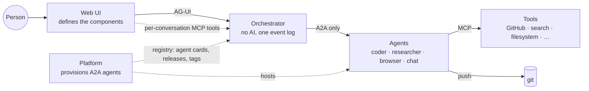
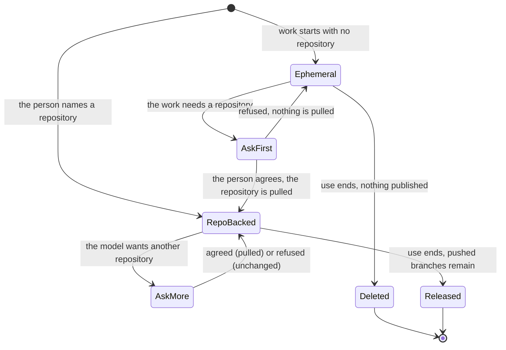

# Vision: the system

> Status: **written 2026-10-01 from the owner's review of the build; brought up to date on 2026-10-03.** This page says what
> the system is meant to be, in the owner's words where possible, and how far the code is from it. The build order toward it is
> the [MVP](mvp.md); the decisions it needed are
> [ADR 0022](decisions/0022-platform-provisions-agents-system-discovers-them.md) to
> [ADR 0026](decisions/0026-agent-mentions-as-structured-references.md), all accepted.
>
> **Update, 2026-10-01 (later the same day):** the owner delegated the open points, and the five ADRs are
> accepted, each with a dated status note; open questions 34, 35, 36 and 39 are closed.
>
> **Update, 2026-10-03: every capability below is built, or listed as not built with its reason.** The sections "Built" and
> "Not built" under each capability, and the table that follows this note, were rewritten against the code of the branch
> that ends plan 11 (the orchestrator, the web, `dev/` and the pinned adam-rs image), not against the earlier text of this
> page. The part that is **not proven** is the same for every row: all of it is proven on mocks (WireMock agents, a scripted
> model, a mock search, a mock GitHub, a mock registry, a mock OIDC issuer), by the scenario scripts of
> [`dev/`](../dev/README.md) and by tests; nothing was run against a live model, GitHub.com, the platform or a real browser
> agent (there is none); the web is tested in Chromium against its own mock server, never against the compose stack; and the owner has not yet tried this state. See [Not proven](#not-proven) and
> [ADR 0037](decisions/0037-the-mvp-is-complete-against-its-build-order.md). Statements about this repository's code were
> checked on 2026-10-03 against main at `1a62efd` ([#135](https://github.com/vymalo/another-agentic-system/pull/135)) plus the pin [#136](https://github.com/vymalo/another-agentic-system/pull/136) and the skills pull request [#137](https://github.com/vymalo/another-agentic-system/pull/137).

## Why this page exists

The owner tested the build of MVP steps 1 and 2: the orchestrator, the web chat, and adam-coder as
the only agent. Their verdict:

> "the adam part is not complete; the system part is not even 10% in the direction I thought it
> would be. The MVP is not ready."

What existed then (2026-10-01) was plumbing. The orchestrator spoke A2A to the agents listed in a static YAML
file (`AGENTS_FILE`), the web chat spoke AG-UI, a verification gate checked the work, and one
coding agent was wired in. It worked end to end, but it was a chat for testing one agent.

The system should be something else: **the person's whole environment, made known to agents.**
Which agents exist, which interface components the person's screen can show, which tools the person
has attached, which repositories they are working in. Agents should know all of it and use it.

> "The -system is not simply a chat for testing, it's a 'system'."

## The actors

- **The person** talks in the web UI, picks agents, mentions others, attaches tools, answers
  through components.
- **The web UI** owns the components (list, cards, choices, stepper, mermaid, web view, …) and
  describes them to the system. It knows nothing about any agent's internals.
- **The orchestrator** carries everything between the UI and agents and keeps the one event log
  ([ADR 0001](decisions/0001-rust-state-machine-on-postgres.md)). It has no model of its own.
  **It talks to agents only over A2A** ([ADR 0007](decisions/0007-protocol-only-dependencies.md)),
  and that stays true for everything on this page: every new capability is an optional A2A
  extension, detected from the agent card ([ADR 0008](decisions/0008-platform-integration-via-a2a-extension.md)
  pattern).
- **Agents** are A2A agents. Each does one kind of work well: coding, research, browsing, casual
  chat. adam-coder ([ADR 0014](decisions/0014-adam-coder-default-agent-over-a2a.md)) is the first.
- **The platform** (another-agentic-platform) provisions A2A agents and manages them: system prompt,
  configuration, revisions, promotion, tags. It is the registry the system reads. "The platform
  should not know about the UI normally, it just provisions A2A-capable Agents."
- **Tools** are MCP servers. Some belong to an agent; some the person attaches to a conversation.

## Requirement by requirement, 2026-10-03

"Built" means the code is on the branch and a scenario script or a test asserts it, on mocks. "Not built" is said with its
reason. The proofs are the scripts of [`dev/`](../dev/README.md#run-the-scenarios) (run by CI in
[`coder-e2e.yml`](../.github/workflows/coder-e2e.yml); a script is a check on the real orchestrator over HTTP and AG-UI, not a
browser), the Rust tests under [`orchestrator/crates/e2e/tests/`](../orchestrator/crates/e2e/tests/), and the web's Playwright
specs under [`web/e2e/`](../web/e2e/) (run against the web's own mock server).

| # | What the owner asked for | State | Proof | ADR |
|---|---|---|---|---|
| 1 | The platform is the agent registry: agents discovered live, no restart, releases from each card | **Built**, against a mock of the contract (the platform has no code yet) | `dev/registry-e2e.sh`, `crates/e2e/tests/registry.rs`, `web/e2e/registry.spec.ts` | [0022](decisions/0022-platform-provisions-agents-system-discovers-them.md) |
| 2a | The UI defines its components; they are sent once at the start, again when a newer UI joins, and an agent can refetch them | **Built** | `dev/choices-e2e.sh` (a newer catalog recorded on the same thread), `crates/e2e/tests/ui_catalog.rs`, `thread_tools.rs`, `web/e2e/catalog.spec.ts` | [0023](decisions/0023-ui-component-catalog-as-an-a2a-extension.md) |
| 2b | Rich answers: Choices (the smarter `ask_user`), Cards, Mermaid, Image, combined in one answer | **Built** (catalog version 4) | `dev/choices-e2e.sh`, `dev/cards-e2e.sh`, `dev/artifact-e2e.sh`; `web/e2e/choices.spec.ts`, `cards.spec.ts`, `files.spec.ts` | 0023, [0032](decisions/0032-files-from-agents-live-in-an-artifact-store.md) |
| 2c | List, Stepper, Agent suggestion, Skill request, Web view, Notification opt-in; rich input other than a choice | **Not built** | none | 0023; questions [37](open-questions.md), [38](open-questions.md) |
| 3 | MCP tools attached to a conversation from the UI, used by the agent, one icon per tool on its step | **Built** for the servers a deployment lists | `dev/tools-e2e.sh`, `crates/e2e/tests/tool_relay.rs`, `tools.rs`, `web/e2e/tools.spec.ts` | [0024](decisions/0024-mcp-tools-attached-per-conversation.md) |
| 3b | A person enters the URL of an MCP server of their own; the icon an upstream server offers | **Not built** | none | 0024; question 38 |
| 4 | Several agents in one message by mention; the composer autocompletes; the football example | **Built**, with mock agents asked | `dev/mentions-e2e.sh`, `crates/e2e/tests/mentions.rs`, `ask_agent.rs`, `asks.rs`, `web/e2e/mentions.spec.ts`, `asks.spec.ts` | [0026](decisions/0026-agent-mentions-as-structured-references.md) |
| 4b | A real researcher, browser and coder in the football run; a planner agent | **Not built** (the browser agent does not exist; the other two are mocks in that scenario by decision) | none | 0026 |
| 5 | Nested steps, collapsed, a little more per click, spinners, bounded log | **Built** | `dev/coder-e2e.sh` (the tree an OpenCode delegation leaves), `crates/e2e/tests/steps.rs`, `web/e2e/steps.spec.ts`, `step-io.spec.ts` | [0025](decisions/0025-nested-steps-events-carry-their-source-path.md), [0030](decisions/0030-a-step-carries-its-input-and-output-bounded-and-redacted.md) |
| 6 | Workspaces: several repositories, asking before a new one, ephemeral with none, GitHub through MCP, credentials per installation | **Built** in adam-coder; a job that pushes to two repositories is gated on the last only; the coder's checks are not published as GitHub check runs | `dev/workspace-e2e.sh`, `dev/coder-e2e.sh` (token and App) | [0014](decisions/0014-adam-coder-default-agent-over-a2a.md) status note; question 42 |
| 6b | A repository's devcontainer is its work environment | **Built** on a rootless Podman service; **not built** on Kubernetes | `dev/devcontainer-e2e.sh` | [0028](decisions/0028-devcontainer-json-is-the-workspace-environment-contract.md); question 41 |
| 7 | Agents configured at run time, not compiled | **Built** | `dev/agent-folder-e2e.sh`, `dev/greeting-e2e.sh` | 0014 status notes |
| 8 | Examples for several uses: a coder, a chat, a researcher, a browser | **Built** with a **mock browser**; the live researcher's real search is *unverified* | `dev/agents-e2e.sh`, `dev/mentions-e2e.sh` | 0014 |
| 9 | Streaming answers, thread titles | **Built** | `dev/coder-e2e.sh` (live frames), `dev/title-e2e.sh`, `web/e2e/stream.spec.ts` | [0027](decisions/0027-live-text-relayed-not-stored.md), [0005](decisions/0005-openai-compatible-model-endpoint.md) |

Added by the owner after the first review (2026-10-02) and built; each has its own section below the capabilities:

| What | State | Proof | ADR |
|---|---|---|---|
| Write while the agent works: Send steers the running task, Stop & send cancels it and starts the next | **Built**; the adam-rs fix that makes a task read `working` from its claim is merged there but **not in the compose pin yet** | `dev/steer-e2e.sh`, `crates/e2e/tests/steer.rs`, `web/e2e/steer.spec.ts` | [0036](decisions/0036-sending-while-an-agent-works.md) |
| Fork a chat from any turn, edit a message into a branch | **Built** | `dev/fork-e2e.sh`, `web/e2e/fork.spec.ts`, `branches.spec.ts` | [0029](decisions/0029-forking-a-thread-copies-its-log.md) |
| Files from agents reach the person (SVG, PNG, JSON), stored outside the log | **Built** | `dev/artifact-e2e.sh`, `crates/e2e/tests/files.rs`, `web/e2e/files.spec.ts` | 0032 |
| Roles, an OAuth2 resource server behind oauth2-proxy | **Built** against a mock issuer | `dev/rbac-e2e.sh`, `web/e2e/roles.spec.ts` | [0033](decisions/0033-the-orchestrator-is-an-oauth2-resource-server.md) |
| One YAML configuration, a model for the title and for a description of its own | **Built** | `dev/title-e2e.sh`, `dev/description-e2e.sh`, `web/e2e/description.spec.ts` | [0034](decisions/0034-one-yaml-configuration-secrets-by-reference.md), [0035](decisions/0035-utility-model-tasks.md) |

## Capabilities

Each capability lists what was asked, what is built and how it is proven, and what is not built. "Slice" refers to the build
order in the [MVP](mvp.md#the-new-build-order).

### 1. The platform is the agent registry

> another-agentic-platform "intend[s] to give a seam to manage (system prompt, configs, promote,
> tag, ...) multiple A2A dynamically, and -system should understand that."

**The rule:** the platform provisions A2A agents; the system discovers them and talks to them over
A2A. The platform never learns about the UI, the catalog or the chat. Management (editing a system
prompt, promoting a revision, tagging) happens in the platform; the system shows the result live.

**Built (slice 9, 2026-10-01).**
- The port `AgentRegistry` with a fixed implementation (the static `AGENTS_FILE`) and a composite, and the live reader of the
  platform's `agent-registry/v1` linkset (`orch-registry-platform`, `AGENT_REGISTRY_URL`); `GET /api/registry`; the picker's
  notice and its refresh on focus ([ADR 0022](decisions/0022-platform-provisions-agents-system-discovers-them.md) status note).
  The contract is `agent-registry/v1` in another-agentic-platform, an RFC 9727 `api-catalog`-shaped linkset with one agent-card
  URL per agent service. A2A standardises no registry API (*verified 2026-10-01*,
  <https://a2a-protocol.org/latest/topics/agent-discovery/>), so this is ours.
- Proof: `dev/registry-e2e.sh` (the registry's agent is listed after the static ones with the releases of its own card, an
  agent added to the mock shows up with no restart, a registry that is down leaves the static agents and the UI says so),
  `crates/e2e/tests/registry.rs`, `web/e2e/registry.spec.ts`.
- The release picker of ADR 0008 stays: a card that lists the release-channels extension offers its channels and revisions.

**Not built.**
- A read of a real platform. The platform is design only (*verified 2026-10-03*, its `CLAUDE.md`: "there is no code yet"), so
  `agent-registry/v1` and `release-channels/v1` are read only from mocks (open question 10 stays open).
- Authentication to the registry beyond a bearer token (open question 11).
- The file's agents come first and the first is the default; an explicit marker is open question 23.

### 2. Rich output and rich input, through components the agent knows about

> The goal is "to make the agent also aware of the user's environment, e.g know that a component in
> the UI is available".

> "The answer of the chat should be rich. The user input should also be rich. So the UI should
> define components, e.g. by key and params, then let the A2A seam know about them."

The owner wanted OpenUI at first; "we can redo their semantic here ourselves". The components the
owner listed, and where each stands:

| Component | What it does | Direction | State, 2026-10-03 |
|---|---|---|---|
| List | show the person a list | out | not built |
| Choices | ask a radio list, e.g. 5 questions at once; the smarter `ask_user` | in | **built** (catalog version 2) |
| Stepper | walk the person through steps | out and in | not built |
| Cards | show a list of cards | out | **built** (version 3) |
| Web view | display a web rendering in the UI (e.g. an iframe) | out | not built: needs the Content-Security-Policy decision of question 38 |
| Agent suggestion | propose another agent or a group of agents | in (the person accepts) | not built |
| Skill request | ask for more skills | in (the person approves) | not built |
| Mermaid | display a mermaid graph | out | **built** (version 3) |
| Image | place a picture at the start, middle or end of a text, or in a list | out | **built** (version 4), for a file of the thread only: never a URL |
| Notification opt-in | ask at first open to be notified later about this chat, and tell the agent | in | not built: needs an ADR on storage and delivery (question 37) |

And: **combine all of these** in one answer.

**The owner's decision (2026-10-01):** "since the components are not dynamic, their params only are,
then it's safe to send the UI components once at the beginning, then have a seam to refetch them,
like a tool. So that a chat across multiple UI versions can get the newest UI items."

**Built (slices 3 and 4, plus the Image of ADR 0032).**
- A2UI is the generative-UI format, end to end ([ADR 0013](decisions/0013-a2ui-generative-ui.md)). Agents send A2UI surfaces; the
  web validates and renders them ([`lib/a2ui/prepare.ts`](../web/src/features/chat/lib/a2ui/prepare.ts),
  [`components/surface/`](../web/src/features/chat/components/surface/)); a click goes back to the agent as the person's answer.
- **The catalog is ours:** the web defines its components as a JSON Schema catalog (`inlineCatalogs`), the orchestrator records
  each digest it sees as a `ui_catalog` event, sends the catalog to an agent whose card lists `ui-catalog/v1` with the first
  message and again when a newer digest joins, and the agent refetches it with the tool `get_ui_catalog` on a per-thread MCP
  endpoint (`thread-tools/v1`, a thread-scoped token). A surface that breaks a component's schema is refused visibly, and an older UI
  shows a "needs a newer version" placeholder for a component it lacks
  ([ADR 0023](decisions/0023-ui-component-catalog-as-an-a2a-extension.md), [`api/ui-catalog-v1.md`](api/ui-catalog-v1.md),
  [`api/thread-tools-v1.md`](api/thread-tools-v1.md)). A2UI has no way for an agent to refetch a catalog (*verified 2026-10-01*,
  <https://a2ui.org/specification/v0.9.1-a2ui/>), so that seam is ours.
- adam-rs turns the catalog into model tools and `ask_user` with options into Choices (adam-rs `c13ddf1`, pinned).
- Proof: `dev/choices-e2e.sh` (the coder asks three questions as one form from the web's catalog, one action answers them, a newer
  catalog is recorded on the same thread), `dev/cards-e2e.sh` (the researcher answers with one surface of a Text, three cards and a graph; an
  older screen leaves the thread's catalog alone; a screen without `Cards` gets words only), `dev/artifact-e2e.sh` (a surface places two files as `Image`s),
  `crates/e2e/tests/ui_catalog.rs`, `web/e2e/choices.spec.ts`, `cards.spec.ts`, `catalog.spec.ts`, `files.spec.ts`.

**Not built.**
- The six components marked "not built" above, and rich input beyond Choices (a filled stepper, an accepted suggestion). Each is
  additive: it raises the catalog's version and is its own change to [`api/ui-catalog-v1.md`](api/ui-catalog-v1.md). They were not
  in the build order, which asked for one input and the output components needed to show a combined answer.
- What a live model chooses to show with these components is *unverified*: the scripts of the scenarios are ours.
- Open questions 37 (notifications) and 38 (web view, remote images in text, tool icons from a URL).

### 3. Tools (MCP) per conversation, from the UI

> "I can imagine how A2A does coding, another does web research, ... And if I wanna do casual chat,
> I might use each one of them, pass in MCP tools for e.g. web search, e.g. from the UI directly,
> and let the agent somehow use it."

**Built (slice 8, 2026-10-02).**
- A person attaches servers to a conversation in the composer's Tools menu, and detaches them. The deployment lists what may be
  attached (`toolServers` of the configuration, [`api/config.md`](api/config.md)); `GET /api/tool-servers` shows each with its
  name, description, icon and the agents it is for, never its URL or credential; `PUT /api/threads/{id}/tools` sets the whole set.
  The thread records `tools_attached` and `tools_detached`.
- The orchestrator is the MCP client and the relay ([ADR 0024](decisions/0024-mcp-tools-attached-per-conversation.md), question
  35): it holds the credentials by reference, and an agent gets the thread's endpoint and a short-lived token, so no credential is
  in an A2A message, the log or an export. Each relayed call is one step with the server's icon, its input and its output.
- An agent whose card does not list `thread-tools/v1` is flagged in the composer before anything is sent, and the run is refused
  with 422 if it is sent anyway.
- The orchestrator is also an MCP server for other systems (`start_job`, `wait_for_job`;
  [ADR 0019](decisions/0019-mcp-server-over-streamable-http.md)), proven by `dev/mcp-e2e.sh`.
- Proof: `dev/tools-e2e.sh` (the chat's model calls the relayed `websearch__web_search`; one step with `icon: mcp-server:websearch`;
  the configured bearer and header reach the search and no secret is in the export, the frames or the model's requests; after a
  detach the chat answers "No web search attached"), `crates/e2e/tests/tool_relay.rs`, `tools.rs`, `web/e2e/tools.spec.ts`.

**Not built.**
- Entering the URL of an MCP server of one's own: ADR 0024 makes it off unless a deployment allows it, and no deployment can allow
  it yet, so a person chooses among the listed servers.
- The icon an upstream server offers, and any icon at a URL: only `data:` icons from the configuration are shown, because a
  remote image can track the person (question 38).
- No per-role filter on who may attach which server (anyone with `thread.write` may, for the servers listed for the thread's agent).

### 4. Several agents in one message, by mention

> "Help me understand football in Europe from 2011 till 2019. @researcher first check for data from
> that period and @browser you look for pictures to illustrate this experiment. And then @coder will
> plot the whole thing."

**Built (slice 10, 2026-10-02 and 2026-10-03).**
- The composer autocompletes mentions from the agents the person may invoke and sends a **structured reference** (agent id, label,
  UTF-16 offsets), never raw text; the orchestrator checks the references before anything is written (400 for a bad shape, 422
  for an unknown agent, a label that is not the text, or an agent the roles may not invoke, 503 for a registry that cannot answer)
  and records them in the `user_message` ([`api/mentions-v1.md`](api/mentions-v1.md)).
- **The addressed agent coordinates** ([ADR 0026](decisions/0026-agent-mentions-as-structured-references.md), option A, decided on
  the owner's delegation, question 34): it calls the thread tool `ask_agent` for each agent it chooses, the orchestrator sends the
  question to that agent as a child task in a context of its own, and the answer returns to the tool call. The asks are a ledger
  in the job (`ask_started`, `ask_finished`, migration `0014`) with limits (`asks.maxDepth` 2, `maxPerJob` 16, `maxRunning` 4,
  `timeoutSecs` 1800), and each ask ends exactly once: a crash neither asks twice nor leaves a task nobody follows.
- In AG-UI an asked agent is a `SUBAGENT_STARTED` nested under the run that asked, and the web draws it as one collapsed line,
  "Asked Coder", nested under the step that asked, with a spinner while it works and its answer when it ends.
- The owner's sentence runs as one scenario: `dev/mentions-e2e.sh` sends it mentioning `@researcher`, `@browser` and `@coder`;
  the chat's model (a script) asks the three in that order; the script asserts three `ask_started` by `main` in order, each
  `ask_finished` completed, each agent sent only its own request in its own context, the answer naming the three results, and the
  three `SUBAGENT_STARTED` in the stream; a mention of an agent nobody listed is 422 and writes nothing.
- Proof: `dev/mentions-e2e.sh`; `crates/e2e/tests/mentions.rs`, `asks.rs` and `ask_agent.rs` (the real dispatcher, adapter and
  endpoint on both stores, with a fake agent that makes the calls an adam agent makes); `web/e2e/mentions.spec.ts` (keyboard
  only, a refused send shown) and `web/e2e/asks.spec.ts` (nested, spinners, Stop ends them deepest first, axe in both schemes).

**Not built, or not proven.**
- **A real browser agent.** None exists. The browser in the football run is a WireMock agent that answers "Pictures: ...", by the
  owner's decision. The researcher and the coder in that run are mocks too (`mock-researcher`, `mock-coder`): the real researcher
  is a folder on a model, the real coder is gated and runs a repository, and the scenario needs answers a script can tell apart.
- **An asked agent's own work is not in the thread.** The log has the ask and its answer and, for a tool the asked agent calls
  through the orchestrator's endpoint, a step under `ask-<n>`; its own messages and steps are read for its answer and never copied,
  so that an asked agent cannot write the thread's transcript (ADR 0026 status note). The scenario cannot assert a child step,
  because a WireMock agent calls no tool; `crates/e2e/tests/ask_agent.rs` does.
- A real model's choice to call `ask_agent`, and that adam-rs's MCP client keeps a call of half an hour open (ADR 0026, *unverified*).
- A planner agent (option B) and parallel agents: the first plan's step 4, not built.

### 5. Nested steps

> "Too many tool calls make the UI unreadable."

In one real thread, 7 messages produced 336 status events, 197 of them from OpenCode. "UI should
be cute, sober, but still rich."

**Built (slice 5, 2026-10-01; input and output 2026-10-02).**
- Events carry their **source path**: the `agent_step` event, the contract [`api/steps-v1.md`](api/steps-v1.md) (A2A extension
  `steps/v1`, read from the card), AG-UI `SUBAGENT_STARTED` nested by `parentSubagentRunId` and `vymalo.step` activities
  (*verified 2026-10-01*, vendored schema
  [`ag-ui-1.0.schema.json`](../orchestrator/crates/agui-proto/schema/ag-ui-1.0.schema.json)). The log keeps a bounded number of
  updates per step.
- adam-rs reports every tool call as a step and OpenCode's own tool calls as children of `delegate_to_opencode`.
- The web draws a tree in the side panel's Activity tab ([`lib/step-tree.ts`](../web/src/features/chat/lib/step-tree.ts),
  [`web/DESIGN.md`](../web/DESIGN.md)): depth 1 always shown, each deeper level collapsed, a first click shows the latest three
  children and every failed one, "Show more" a virtualised list, a spinner on every level that works; the chat keeps one line per turn.
  A tool step opens onto its input and output, cut and redacted ([ADR 0030](decisions/0030-a-step-carries-its-input-and-output-bounded-and-redacted.md)).
- Proof: `dev/coder-e2e.sh` (an OpenCode sub-agent step with a command step under it, ended, the log bounded to six events per
  step, each tool step's input and output), `dev/agents-e2e.sh`, `crates/e2e/tests/steps.rs`, `web/e2e/steps.spec.ts`,
  `step-io.spec.ts`.

**Not proven.** What a real OpenCode reports for its bash call, and the tree drawn by a browser against the coder in containers.

### 6. Workspaces (what the system expects of agents)

These are requirements on agents, adam-rs first. The system records them so that the gate, the UI
and the agents agree.

- A workspace holds **several repositories**, chosen by the person, and can grow later. The model
  **asks the person's permission** before pulling a new repository.
- A workspace **with no repository is ephemeral**: deleted when its use ends ([adam-rs #52](https://github.com/vymalo/another-adam-rs/issues/52),
  the scratch workspace).
- GitHub access goes through MCP (a GitHub MCP server, a filesystem MCP server). The trusted parts
  stay in a small server of our own: preparing the sandbox, the named-repository rule, and real check
  runs bound to the pushed commit, which the gate relies on
  ([ADR 0002](decisions/0002-verification-over-consensus.md),
  [ADR 0018](decisions/0018-verification-gate-and-rework-loop.md)).
- Credentials **per installation**: a GitHub App in one deployment, a personal access token in
  another. Today adam-coder takes one static `GITHUB_TOKEN`.
- git stays the artifact ([ADR 0003](decisions/0003-git-as-durable-state-ephemeral-workers.md)):
  what outlives a workspace is what was pushed.
- Where a workspace lives across workers was open question 24 (closed 2026-10-01: `shared` placement and one coder process by default).

> **Note, 2026-10-01: built (MVP slice 7).** adam-coder (adam-rs `1021836`) starts with no repository, in a scratch project it deletes when the task ends, and publishes it to a repository the person names;
> a workspace holds several repositories, and a repository the person did not name joins it, or is created for them, only after they say yes to a form (the model never grants). It reads GitHub, read-only, through the
> official GitHub MCP server, and holds the credential of one installation in its own environment, a GitHub App or a token, never in a message or the log. The trusted tools (the named-repository rule, the checks bound
> to the pushed commit) stay inside the coder, not in a server of their own (decided for the MVP, 2026-10-01, in [adam-rs ADR 0009](https://github.com/vymalo/another-adam-rs/blob/1021836a1887610c4639de15f2289b26245b9ce4/docs/decisions/0009-github-per-installation-read-through-mcp.md); the owner may revisit it). Still open: a job that pushes to several repositories has the gate judge only the last (question 42), and publishing the
> coder's checks as GitHub check runs. The orchestrator did not change ([ADR 0014](decisions/0014-adam-coder-default-agent-over-a2a.md#status-note-2026-10-01-workspaces-github-per-installation-and-repositories-created-on-request),
> [`dev/README.md`](../dev/README.md#workspaces-github-over-mcp-and-a-github-app-the-coder-without-a-repository)).

> **Note, 2026-10-01: the work environment.** The owner asked "Can't we use devcontainers to build work
> environments?" and decided ([ADR 0028](decisions/0028-devcontainer-json-is-the-workspace-environment-contract.md))
> that a repository's `.devcontainer/devcontainer.json` is its work environment. The coder builds it with the
> official devcontainer CLI against a rootless Podman service (never the host's Docker socket), and runs its
> commands and OpenCode inside it. A repository without one gets the `workspace` image, published as a
> devcontainer. With several repositories in one workspace, the first repository's devcontainer is used and the
> others are mounted into it. The person sees the build as a step, and a broken file as a failed step, not as a
> silent fallback. On Kubernetes the coder stays as it is until the platform has a sandbox provider (open
> question 41). This is MVP slice 7b, after slice 7.
>
> **Note, 2026-10-02: built (MVP slice 7b).** adam-coder (adam-rs `c0f12dd`) runs `run_command`, `run_checks` and OpenCode in the
> repository's devcontainer, or in a default image, on a rootless Podman service; a stopped service is a step that says so, and a
> devcontainer.json it cannot use is a failed step and a question to the person, never a silent fallback. The stack runs it with an
> override (`dev/compose.devcontainer.yaml`, a Podman service with no `privileged`, `cap_add` or `devices`) and one scenario
> ([`dev/devcontainer-e2e.sh`](../dev/README.md#devcontainers)) that CI runs on every Coder E2E run. The orchestrator and the web did
> not change: the environment is a nested step ([ADR 0028](decisions/0028-devcontainer-json-is-the-workspace-environment-contract.md#status-note-2026-10-02-built-the-stack-and-its-scenario)).
> The scenario had not run when this was written: CI is its proof. Still open: Kubernetes (question 41).

**State, 2026-10-03.** Both notes stand. Proof: `dev/workspace-e2e.sh` (scratch work, a repository created after a yes to a form and
none after a no, a second repository added only after a yes, the gate and the pull request on the repository the work reached),
`dev/coder-e2e.sh` with `GITHUB_AUTH=token` and `app`, `dev/devcontainer-e2e.sh`. **Not proven:** a GitHub App against github.com,
the real `github-mcp-server`, the Podman service on a CI runner or a cluster, and a live model's use of the consent tools. The
compose pin is adam-rs `588e9b5` (since `b64e3fe`, [#136](https://github.com/vymalo/another-agentic-system/pull/136), it includes `7e5dcc3`: a task reads `working` from the moment a worker
claims its run; `4edee18` adds a GitHub App that finds the installation of each owner, ADR 0014's note of 2026-10-04; `588e9b5` streams a model's reasoning, ADR 0014's note of 2026-10-05).

### 7. Agents configured at run time, not compiled

adam-rs's authoring layer is an `agent/` folder: `instructions.md`, `SKILL.md` skills, subagents,
`mcp.json`. adam-coder compiled it into the binary (`build.rs` and `include_agent!`); the parser
already had a run-time path (`adam-agent-fs`'s `Dir`, beside the embedded package), which adam-coder did not use.

> "We need to make the editing of .md and .json possible at runtime"

- System prompt, skills and MCP servers editable at run time; the embedded copy is the fallback.
- This is what the platform's `AgentConfig` (instructions, tool universes) would write for a hosted
  agent, so the two meet here.
- `adam-coder` moves from `crates/` to `bin/` in adam-rs.
- The coder should not push every chat toward code. It answered "hi" with "give me a repo". A name
  and a plain self-description are
  [adam-rs #55](https://github.com/vymalo/another-adam-rs/issues/55).
  **The gate honours it (2026-10-04).** The verification gate used to fail a coder chat that pushed nothing ("no pushed
  commit") and rework it twice, so a question or a demo ("plot an image in TypeScript and show it here") ended
  `Failed`. It now verifies only pushed work: an agent that finishes with no `branch` artifact gave an answer and the
  thread is `Done` ([ADR 0018](decisions/0018-verification-gate-and-rework-loop.md#status-note-2026-10-04-only-pushed-work-is-verified)).

**Built (slices 1 and 2, 2026-10-01).** adam-coder reads its `agent/` folder from `ADAM_AGENT_DIR` at startup (the embedded copy is the fallback),
is named `Coder`, and answers "hi" with a greeting (adam-rs #56, #57, ADR 0004 there). One binary, `adam-agent`, serves any folder, so an agent
is a folder and a dozen lines of compose ([`dev/README.md`](../dev/README.md#add-a-fourth-agent-by-writing-a-folder)).
Proof: `dev/greeting-e2e.sh`, `dev/agent-folder-e2e.sh` (the coder restarted on an edited copy of its folder answers differently, no rebuild).
**Not proven:** how a live model follows the instructions (the mocks prove that the folder reaches the model). A change needs a restart: the
folder is read at startup, not watched.

### 8. Examples for several use cases

compose and the live examples should run agents for several uses, not only a coder: a researcher,
a browser, a chat-only agent.

**Built (slice 2).** [`dev/agents.yaml`](../dev/agents.yaml) lists the coder, a chat and a researcher (each a folder under
[`dev/agents/`](../dev/agents/), served by `adam-agent` on a scripted model), the WireMock agents `mock-researcher`, `mock-browser` and
`mock-coder` of the football example, and the mocks of the gate. `compose.live.yaml` points the coder, the chat and the researcher at a real
model, and the researcher at a real web search (`searxng-mcp` over SearXNG, Brave or Tavily:
[`dev/README.md`](../dev/README.md#web-search-for-real)). Proof: `dev/agents-e2e.sh` (three agents, each answers in its role; the
researcher's search is a step with its input and output).

**Not built, or not proven.** A real browser agent (there is none: the owner chose a mock). The live stack has not been run: the real
search, the real model and a real GitHub are *unverified*, and `dev/searxng-mcp/server.mjs` is covered by its own unit tests only
(`node --test dev/searxng-mcp/server.test.mjs`); no scenario runs it.

### 9. After the first review: what the owner asked for on 2026-10-02

The owner's second round of feedback added requirements that the capabilities above do not cover. Each is an ADR and is built;
the table at the top lists the proof.

- **Sending while an agent works** ([ADR 0036](decisions/0036-sending-while-an-agent-works.md)). "While an agent is working, it should also
  be possible for a human to send a message … e.g. 'you were wrong since line #1'." **Send** goes into the running task and is read at
  its next step (`steer/v1`, for an agent whose card lists it; any other agent gets the message after the turn), **Stop & send** cancels the task and
  starts the next job with the text. `dev/steer-e2e.sh` runs both on the chat agent (a model that takes 20 s); the web's two buttons are
  `web/e2e/steer.spec.ts`. Open question 33 (a follow-up sent as the task completes) is closed by it. The pin (adam-rs `588e9b5`; since `b64e3fe`, [#136](https://github.com/vymalo/another-agentic-system/pull/136)) includes the adam-rs
  change that makes a task read `working` from its claim, so, as ADR 0036 says, a steer sent during an adam task's first model call is read by the
  running task. *Unverified* by a scenario: `dev/steer-e2e.sh` still sends after the agent's first words.
- **Forking and editing** ([ADR 0029](decisions/0029-forking-a-thread-copies-its-log.md)). A fork is a new thread that starts with the parent's
  events up to a cut; its agent is told the conversation as a transcript; an edit is a fork with the new message, drawn as `‹ 1/2 ›`. A fork of a coding thread
  does not inherit the parent's workspace (open question 40).
- **Files** ([ADR 0032](decisions/0032-files-from-agents-live-in-an-artifact-store.md)). A file an agent makes goes to an artifact store behind a port (a
  directory or S3), the log keeps a reference, and the owner is served the bytes (an SVG sanitized, another user's request a 404). No thread deletion exists,
  so no file is deleted (open question 46).
- **Roles** ([ADR 0033](decisions/0033-the-orchestrator-is-an-oauth2-resource-server.md)). The orchestrator is an OAuth2 resource server; roles map to permissions;
  nobody reads another person's thread, an administrator included ([ADR 0039](decisions/0039-nobody-reads-another-persons-thread.md), which reversed ADR 0033's "administrators read every thread"); `GET /api/me` tells the web what to draw. The dev stack runs a real oauth2-proxy and a mock issuer;
  a real identity provider is *unverified*.
- **One YAML configuration and utility models** ([ADR 0034](decisions/0034-one-yaml-configuration-secrets-by-reference.md),
  [ADR 0035](decisions/0035-utility-model-tasks.md)). Secrets by reference, an endpoint and a prompt for the thread's title and its description each,
  and the title in the conversation's language. Hot reload of the file is not built (question 43).
- **Streaming and titles** ([ADR 0027](decisions/0027-live-text-relayed-not-stored.md)): the words show as they are written; the log keeps the final text once.

### Not proven

The same list stands behind every "built" above:

- **Live services.** No model, GitHub.com, GitHub App, search provider, identity provider or platform was used; every scenario runs on mocks. Where a
  claim depends on a live service, the section says *unverified*.
- **The owner has not tried this state.** The verdict of 2026-10-01 stands until they do.
- **The web against the real stack.** Playwright runs Chromium against the web's mock server (`web.yml`); the scenario scripts run against the real
  orchestrator without a browser. No test drives the real web against the compose stack.
- **CI.** The scenarios are run by the `Coder E2E` workflow. Several were written where no container could start, and say so in
  [`dev/README.md`](../dev/README.md); this page does not claim a green run that no one saw.

## A message, end to end

How a conversation looks now that capabilities 1 to 5 are built (the pieces are asserted by the scenarios of the table
above, not this whole sequence in one run, and `Registry` is a mock). The catalog goes once at the start; a newer UI resends
it; an agent can refetch it; an agent answers with a component; the person answers through it; a mention brings in a second
agent, which the addressed agent asks.

## A workspace

An ephemeral workspace's work is lost when it ends unless it was published first; the agent says so.
A repository-backed workspace keeps only what was pushed (ADR 0003). The workspace grows only
through the permission step.

## What does not change

- **Protocols only** ([ADR 0007](decisions/0007-protocol-only-dependencies.md)). Agents are A2A,
  tools are MCP, the UI speaks AG-UI and A2UI. Every new convenience is an optional extension that
  plain A2A agents can ignore.
- **No platform state here** ([ADR 0008](decisions/0008-platform-integration-via-a2a-extension.md)).
  Registry data is read live.
- **One event log** ([ADR 0001](decisions/0001-rust-state-machine-on-postgres.md)). The catalog a
  thread saw, the tools attached to it and the mentions in it are events.
- **Verification over consensus, git is the artifact**
  ([ADR 0002](decisions/0002-verification-over-consensus.md),
  [ADR 0003](decisions/0003-git-as-durable-state-ephemeral-workers.md)).
