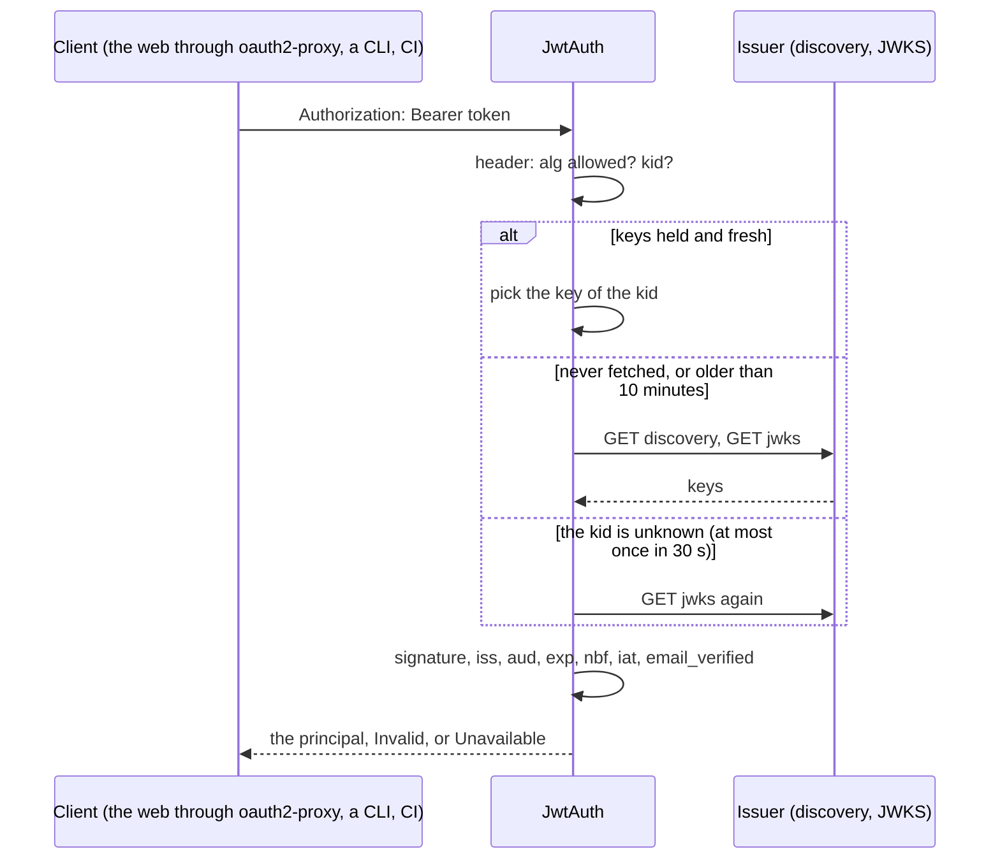

# orch-auth-jwt

The `Authenticator` over OAuth2 bearer tokens: a JWT signed by the issuer, validated here against the issuer's
keys, so that the orchestrator is an OAuth2 resource server and trusts no header a client can send.

## Where it sits

An **adapter** of the `Authenticator` port in [`orch-ports`](../ports/README.md)
([ADR 0009](../../../docs/decisions/0009-swappable-implementations-at-build-time.md),
[ADR 0033](../../../docs/decisions/0033-the-orchestrator-is-an-oauth2-resource-server.md)). Only the binary
([`orchestrator`](../../bin/orchestrator/README.md)) depends on it, behind the Cargo feature `auth-jwt` (on by
default), and builds one for `auth.mode: jwt` and `jwt_or_proxy_header`. Depends on
[`orch-core`](../core/README.md) and [`orch-ports`](../ports/README.md); the signatures are checked by
`jsonwebtoken` 11 over `aws-lc-rs`, the backend `rustls` already brings.

## What it does

```mermaid
stateDiagram-v2
  [*] --> NoKeys: the process starts, nothing is persisted
  NoKeys --> Fresh: a fetch gives at least one usable key
  NoKeys --> NoKeys: the fetch fails; not again for 5 s, Unavailable meanwhile
  Fresh --> Stale: 10 minutes old
  Stale --> Fresh: a fetch succeeds
  Stale --> Stale: the fetch fails; still verifies, for up to an hour more
  Stale --> NoKeys: older than 10 minutes plus the hour, or the copy is dropped
```

- **Algorithm**: RS256, RS384, ES256 and EdDSA, and nothing else. `none` and the HMAC family are refused whatever
  key they name (the algorithm confusion attack), and a key only verifies tokens of its own family. A JWKS key that
  cannot verify (symmetric, an RSA modulus under 2048 bits, `use: enc`, another curve) is skipped, never an error
  for the rest of the set. A token with no `kid` takes the one key of its kind, when there is exactly one.
- **Claims**: `iss` equals the configured issuer exactly; one of the configured audiences is among `aud`; `exp`,
  `iat`, `iss` and `aud` are present; `nbf` is honoured; 60 s of leeway for `exp` and `nbf`; `email_verified` is
  not `false` (a boolean or the text); the user claim (`userClaim`, default `email`) is non-empty text, trimmed and
  lower-cased by `UserId::new`. The e-mail and the name are `Principal.email` and `.name`, and the token's `exp` is `Principal.expires_at` (it bounds the streams opened with the token, ADR 0033). The roles are the texts at
  the dotted path `rolesClaim` (`realm_access.roles`, `groups`): a claim whose own name has dots is found by that
  name first; a list gives its texts, a text is one role, anything else is none, and a bad roles claim never
  refuses a token.
- **Size**: a token over 16 KiB (`MAX_TOKEN_BYTES`) is refused unread. A token that is not three base64url parts
  of JSON ends before any key is looked at: no fetch, no key.
- **The key cache** is a copy this process may lose at any time (ADR 0001). Fetched on first use and by `ready()`
  (which `/readyz` calls), refreshed once 10 minutes old, fetched again when a token names a `kid` the copy lacks
  **at most once in 30 s** (any fetch counts), and not again for 5 s after a failure. One request at a time:
  concurrent first requests make one fetch. While there is no copy, or it is older than the refresh interval plus an
  hour, every request is `AuthError::Unavailable` (fail closed; not a refusal, `Transient`); in between, the copy
  goes on verifying while the issuer is down.
- **Where the keys are**: `jwksUrl`, or the `jwks_uri` of `{issuer}/.well-known/openid-configuration`, whose `issuer`
  must be the configured one (OpenID Connect Discovery 1.0, 4.3). `jwks_uri` must be `http(s)` without credentials
  and not plain HTTP under an HTTPS issuer. **No redirect is followed**, a body over 1 MiB is refused, a request times
  out (5 s), `HTTP(S)_PROXY` is honoured like the A2A client's. There is no filter on the issuer's *address*: it is the
  operator's own configuration, and an identity provider in the cluster is a private address.
- Errors never carry the token or a claim value; a refusal says "the token has expired", "the token is not for this
  API (issuer or audience)", "the token's signature does not verify".

`JwtConfig::new(issuer, audiences)` builds the configuration (`with_user_claim`, `with_roles_claim`,
`with_jwks_url`, `without_system_proxy`; the intervals are public fields, for tests); `JwtAuth::new` reads nothing.
`BuildError` refuses an issuer that is not an `http(s)` URL without credentials, query or fragment, no audience, an
empty claim name, a bad `jwksUrl`.

## Features

| Feature | Default | Effect |
|---|---|---|
| `testkit` | no | `testkit::TestIdp`: a token issuer on `127.0.0.1:<port>` serving its discovery document and its JWKS, with RSA 2048, P-256 and Ed25519 keys made once per process (twice: one set it publishes, one it does not until `publish_unpublished_keys()`), `mint(claims, Signing)` for the tokens the cases need (the right ones, and `alg: none`, HS256 with a public key as the secret, a key that is not published), `set_jwks_down`, `set_discovery_down`, and fetch counters. For this crate's tests and the tests of the crates that authenticate with it (the binary's). |

## Tests

- `tests/conformance.rs`: `orch_ports::bearer_token_conformance!` through a `TokenFixture` over a `TestIdp` (the
  intervals shortened): a valid token for each allowed algorithm; expired and not yet valid, with the leeway; the
  issuer exactly; the audience (a string, a list, none); `exp` and `iat` required; `alg: none`; HS256 with a public
  key; a key nobody published; an unknown `kid` fetched at most once per interval; a rotated key found once
  published; the issuer down (`Unavailable`, `ready` failing, garbage still `Invalid` with no fetch); no bearer,
  an identity header alone, and malformed tokens; `email_verified`; the configured user claim; the roles claim; no
  error shows a token.
- `tests/jwks.rs`: discovery and `jwksUrl`; refresh when old; one fetch for concurrent first requests; the retry
  interval; the stale copy and its grace; a discovery document for another issuer, without a `jwks_uri`; a redirect
  never followed; an answer over 1 MiB; a set with no usable key; unusable keys beside good ones; the token cap;
  a trailing slash on the issuer; what a build refuses.
- Unit tests in `src/`: the choice of key (`keys.rs`), the claims (`claims.rs`), the `jwks_uri` rule (`fetch.rs`).

## See also

[`orch-ports`](../ports/README.md), [`orch-auth-header`](../auth-header/README.md), [`orch-api`](../api/README.md).
