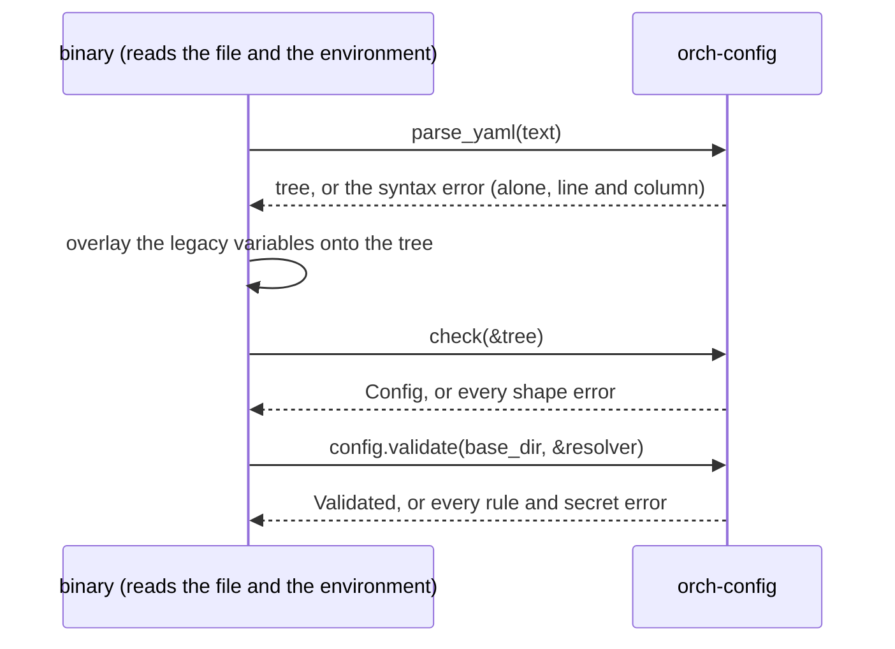
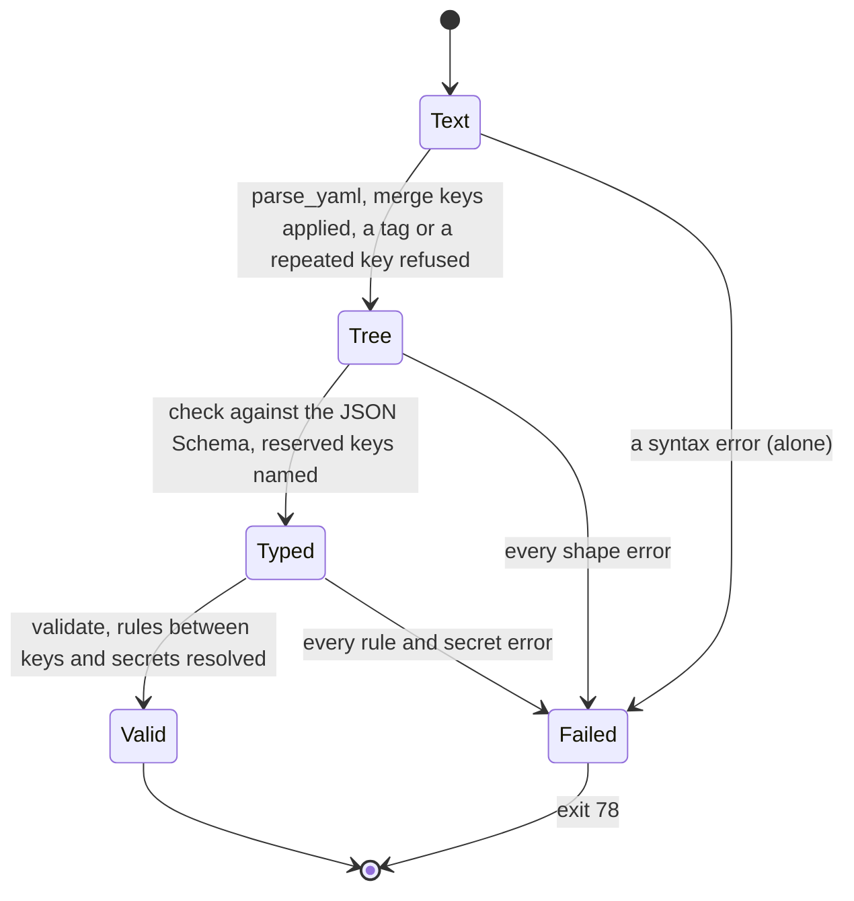

# orch-config

The orchestrator's configuration file: the typed keys, the JSON Schema generated from them, the three-pass validation
that lists every error and never prints a value, and secrets by reference
([ADR 0034](../../../docs/decisions/0034-one-yaml-configuration-secrets-by-reference.md); every key is in
[`docs/api/config.md`](../../../docs/api/config.md)). **Pure**: it reads no file and no environment variable and starts no
thread. The binary reads the file and the environment and passes them in, as text and through a `Resolve`.

Configuration is the composition root's **input**, not a port ([ADR 0009](../../../docs/decisions/0009-swappable-implementations-at-build-time.md)):
it decides which compiled-in implementation each port gets, so it has no trait and no testkit, and no implementation type
appears in its public types (an S3 bucket will be strings and a `SecretRef`). A developer with their own composition root
may use this crate or not.

## Where it sits

Depends on `serde`, `serde_json`, `serde_norway` (the YAML parser of the workspace,
[ADR 0034](../../../docs/decisions/0034-one-yaml-configuration-secrets-by-reference.md#facts-this-rests-on)), `schemars` and
`jsonschema` (the schema and its checker), `secrecy`, `thiserror` and `url`. It depends on no other crate of the
workspace. Used by [`orchestrator`](../../bin/orchestrator/README.md), which reads `ORCH_CONFIG_FILE`, lays the legacy
environment variables over the tree, and builds its own `Config` from the result.

## The three passes

1. **`parse_yaml`**: `serde_norway` reads the text, merge keys (`<<:`) are applied, a tag is refused, so is a key repeated in
   one mapping (never "the last one wins") and a key that is not a string. The tree is a `serde_json::Value`.
2. **`check`**: the tree is checked against the generated schema with `jsonschema`'s `iter_errors`, which yields **every**
   violation: an unknown key, a wrong type, a missing key, a value out of range or not allowed, a plain string where a
   secret goes. An unknown key that is in the table of **reserved keys** (`RESERVED`: the PR and ADR that bring it) is
   reported as reserved. Then the tree is read into `Config`, which cannot fail after a clean pass.
3. **`Config::validate`**: the rules a schema cannot say (both or neither of `threadTools.url` and `secret`; a mounted
   surface has what it needs; URLs; hosts; one endpoint; a task names an endpoint; the artifact store has the section of its kind and
   no other, and a bucket, an endpoint and a prefix a service can take), and every secret reference resolved
   through the `Resolve` the caller passes, collecting every error.

Each pass lists all of its errors; a pass runs only when the one before it found none (a rule cannot be checked on a value
that is not there).

## No error carries a value

A `ConfigError` is a key path and an `ErrorKind`; the kinds hold only what the program knows without the file (a bound
from the schema, the name of a variable or the path of a file taken from a reference, a line and a column). `jsonschema`'s
`Display` quotes the instance and is never used (the instance may be a secret that was pasted by mistake); a string where a
secret goes is "a secret is a reference: `{ env: NAME }` or `{ file: PATH }`"; a YAML syntax error is its line and column
only. `tests/config.rs::no_error_carries_a_value` feeds a recognisable secret into every kind of mistake and asserts it
is in no message.

## Secrets

`SecretRef` is `{ env: NAME }` or `{ file: PATH }` and nothing else; the file holds nothing more. `validate` resolves them
through `Resolve` (an environment variable that is unset or blank, a file that cannot be read, is empty or is over 64 KiB
is an error naming the key and the variable or path; a `{ file }` loses one trailing newline). A resolved `Secret` keeps its
reference beside its value, and every `Debug` of it, of `Secrets` and of `Validated` prints the reference. The
webhook secrets of a role that serves no routes are not resolved (a worker is not asked for secrets it would never use).

## API at a glance

| Item | What |
|---|---|
| `parse_yaml(text)` | pass 1 |
| `check(&tree)` | pass 2: `Result<Config, Vec<ConfigError>>` |
| `Config::validate(self, base_dir, &dyn Resolve)` | pass 3: `Result<Validated, Vec<ConfigError>>` |
| `load(text, base_dir, &dyn Resolve)` | the three passes, when nothing is overlaid on the tree |
| `Server.cors: Option<ServerCors { allowed_origins }>` | `server.cors` ([ADR 0047](../../../docs/decisions/0047-one-ui-for-web-desktop-and-mobile-each-signs-in-as-a-public-oauth-client.md)): the exact origins whose pages may call the API, any scheme, an `http(s)` one in the form a browser sends (lower case, no default port, an ASCII host), never `*` or `null`; `http://` only for local hosts in production |
| `Validated { config, secrets, prompts, base_dir }` | `agents_file()`, `mcp_tokens_file()` and `artifacts_fs_root()` resolved against the directory of the file; `prompts` (`Prompts { title, description }`) the text of each task's `system` (inline or read from its file, trimmed, 1 to `MAX_PROMPT_BYTES` = 4 KiB), none when a task has no `system` |
| `Tasks`, `TitleTask`, `DescriptionTask`, `Recompute`, `Prompt` (`Inline`, `File`), `Language` (`conversation` and the core's closed set; `as_str()`), `Ui` (with `UiHistory { initial_turns (12), page_turns (20), windowed (true) }`: `ui.history`, how the web opens a long thread, [ADR 0059](../../../docs/decisions/0059-a-thread-opens-at-its-end-and-older-turns-load-on-scroll-up.md); both counts 1 to 100 and not above `server.history.maxTurns`, a rule of the third pass) and `ServerHistory { max_turns (100, 1 to 1000), max_page_bytes (4 MiB, 64 KiB to 64 MiB) }` (`server.history`, what one page of a thread's history may hold) | the utility tasks ([ADR 0035](../../../docs/decisions/0035-utility-model-tasks.md)): per task the `endpoint` (a name in `models.endpoints`, which the rules pass checks), `model`, `system`, `maxTokens`, `language`; the description's `maxChars` and `recompute.minNewMessages`; and the `ui` section (`showDescriptions`), the only part of the file the web reads (`GET /api/config`) |
| `ToolServer`, `Config::tool_servers`, `DEFAULT_TOOL_SERVER_TIMEOUT_SECS` (120), `MAX_ICON_BYTES` (8 KiB), `ToolServerSecrets { bearer, headers }`, `Secrets::tool_servers` | the `toolServers` section ([ADR 0024](../../../docs/decisions/0024-mcp-tools-attached-per-conversation.md)): the MCP servers a person may attach to a conversation, at most 64, each with `id` (`^[a-z0-9][a-z0-9-]{0,30}$`, unique: no `_`, so `<id>__<tool>` splits at the first `__`), `name`, `description`, `url` (`http(s)`, a host, no user name, password, query or fragment), `icon` (a `data:image/(svg+xml\|png\|webp);base64,…` URI of at most 8 KiB), `bearer` and `headers` (secret references; `Authorization`, `Accept`, `Content-Type`, `Host`, `Mcp-Session-Id`, `Mcp-Protocol-Version` and `Last-Event-ID` refused in any case), a `tools` allow-list (names the relay can expose), the `agents` it is for and `timeoutSecs` (1 to 600). A server's resolved credentials are in `Secrets::tool_servers` by id (a server that has none has no entry), refuse a value a header cannot hold by key, and `Debug` prints references |
| `Auth`, `AuthMode`, `Jwt`, `AuthDpop`, `AuthBrowser`, `AuthRole`, `AuthPermission`, `AuthScope`, `AuthScopes`, `SplitScope` | authentication and roles ([ADR 0033](../../../docs/decisions/0033-the-orchestrator-is-an-oauth2-resource-server.md)): `auth.mode` and `auth.jwt` (S14), and **`auth.roles`** (a role name to `AuthRole { permissions, scope?, agents? }`, absent for the built-in `user` and `admin`) and **`auth.defaultRole`** (`Option<Option<String>>`: absent, a role, or `null` for none, the one key where `null` is a value, marked `x-null-is-a-value` in the schema) (S15), and, for [ADR 0054](../../../docs/decisions/0054-the-web-holds-its-own-tokens-dpop-bound-in-indexeddb.md), **`auth.dpop`** (`AuthDpop { publicOrigins, maxAgeSeconds (1 to 600, 60), futureSkewSeconds (0 to 60, 5) }`: DPoP-bound tokens, off by default; origins are `http(s)` origins with no path, query, fragment or credentials, and **production refuses `http://` but for `localhost`, `127.0.0.1` and `[::1]`**; only with a mode that reads tokens) and **`auth.browser`** (`AuthBrowser { clientId, scope (default `openid email profile offline_access`) }`, served at `GET /api/public/auth`; needs a mode that reads tokens **and `auth.dpop`**, a client id with no space, a scope of tokens separated by single spaces (RFC 6749 §3.3)). The rules name their key: the default role is one of the roles, a role name has no space around it, a permission is not listed twice, a `scope` or `agents` its role would ignore is an error, `agents: []` and `roles: {}` are errors, and **`scope: any` is refused** at its own key (`.scope`, `.scope.read` or `.scope.write`), naming [ADR 0039](../../../docs/decisions/0039-nobody-reads-another-persons-thread.md): `AuthScope::Any` is still parsed, only so that this error can say what is wrong |
| `UrlRef`, `Endpoint.base_url`, `Secrets::model_base_urls`, `Validated::model_base_url(name)` | a model endpoint's `baseUrl` is **text or a reference**: `UrlRef::Literal(String)` (the plain string, as ever) or `UrlRef::Ref(SecretRef)` (`{ env: NAME }` or `{ file: PATH }`, so a deployment keeps the gateway's address in a secret store, [ADR 0035](../../../docs/decisions/0035-utility-model-tasks.md), owner decision of 2026-10-04). A written URL is checked in the rules pass; a reference is read with the secrets by the rules of a `SecretRef` (trim, one trailing newline, 64 KiB), then **checked as a written one is** (`http` or `https` with a host) under the same key, `models.endpoints.<name>.baseUrl`, and its message never carries the value. The read value is in `Secrets::model_base_urls` (a `Secret`, so `Debug` prints the reference); a caller asks `Validated::model_base_url(name)`, which answers for both forms. A URL is not one of the fourteen secrets: `--print-config` shows the reference, and the schema's `baseUrl` is `string` or `SecretRef` (a shape error is "a URL is written as text, or read through a reference", `ErrorKind::NotAUrlOrRef`). **Breaking for a consumer of the types:** `Endpoint.base_url` is a `UrlRef`, no longer a `String` |
| `Sharing`, `SharingMode`, `SharingPublic`, `SharingRateLimit`, `Config.sharing`, `AuthPermission::ThreadShare` | the `sharing` section ([ADR 0040](../../../docs/decisions/0040-thread-sharing-by-revocable-link.md), [`config.md`](../../../docs/api/config.md#sharing)): `mode` (`disabled`, the default, `internal`, `public`), `secret` and `previousSecret` (references, required unless `disabled`, and never the thread tools' secret), `baseUrl`, `public.stepIo` and `public.files` (booleans, `false`, only with `public`) and `rateLimit` (`perLinkPerSecond`, `totalPerSecond`, `streamsPerLink`, `streamsTotal`: 10, 100, 5 and 50, in their ranges, only with `public`). `thread.share` is a permission of the `user` and `admin` roles |
| `AuthPermission::ThreadDelete` (`thread.delete`) | the permission to delete one's own thread, which erases it ([ADR 0043](../../../docs/decisions/0043-deleting-a-thread-erases-it.md), [`config.md`](../../../docs/api/config.md#roles-and-permissions)): a role lists it to hold it, it takes no scope (`scope` is still refused for a role that holds only it) and needs no `thread.write`, and **a role that lists its permissions does not get it by itself**. In `config.schema.json` |
| `Config::effective()` | the defaults that depend on other keys filled in (the surfaces, the attempts), for `--print-config` |
| `Config` and the section types | `Serialize` (a `SecretRef` is the mapping `{ env: NAME }`), so a `Config` prints as the file it came from |
| `schema()`, `schema_text()` | the JSON Schema, draft 2020-12, with no `null` (an optional key is optional) but `auth.defaultRole`'s |
| `RESERVED`, `reserved(path)` | the reserved keys |
| `Resolve` | `env(name)` and `read_file(path)`: what the caller reads for the library |
| `ConfigError { path, kind }`, `ErrorKind`, `render` | the errors |

## The JSON Schema

Generated by `schemars` from the types and committed at [`docs/api/config.schema.json`](../../../docs/api/config.schema.json)
(`additionalProperties: false` on every object, the doc comment of a key as its description, so an editor shows it). A test
compares the generated schema with the file and fails on any difference; regenerate with
`UPDATE_SCHEMA=1 cargo test -p orch-config --test schema` and review the diff. The same test lists the secret fields of the
schema and asserts they are the ten the contract names (the eight of ADR 0034 and the two credentials of the S3 store, ADR 0032); and that the `ui` section reaches no secret reference.

## Tests

`cargo test -p orch-config`:

* `tests/config.rs`: a minimal file with every default; **the example of `docs/api/config.md`** (read from the document, so
  it cannot drift); anchors and merge keys; a syntax error alone; a repeated key, a tag, a key that is not a string; the
  version; **every shape error listed at once** and **every rule error listed at once**; a plain string refused at each of
  the secret fields of the file and every wrong form of a reference; unknown and reserved keys; references that do not resolve
  (each names the key and the variable or the path); the newline of a `{ file }`; a worker that is not asked for webhook
  secrets; **no value in any error** and no value in any `Debug`. The module `artifacts` (ADR 0032): no section is no store; a directory store with its defaults and its root relative to the file; an S3 store with its credentials read by reference (an environment variable and a file), `--print-config` showing references and no value; `s3` without a bucket, without credentials or without the section refused; a store without its section and a section of the other store refused; every shape error, then every rule error listed at once, for a bucket, a region, an endpoint and a prefix (accepted and refused forms); the range of `maxFileBytes`; and a plain string as a credential refused without its value. `artifacts.maxPerJobBytes` (default 100 MiB, range) and `artifacts.fetchHosts` (default none; each entry a host with or without a port, refused with a scheme, a wildcard or a path) are built by S11.
* `tests/config.rs` also pins the endpoints and the tasks (ADR 0035): several named endpoints each with its key and timeout, a task with its own endpoint, model, prompt (inline, or a file read through the resolver relative to the file and trimmed) and limits with every default filled in, **every error of the tasks listed at once** (an endpoint name that is not a slug, a task naming no endpoint, a prompt that is empty, too long or unreadable, a value out of range with its bound, an unknown language with the allowed ones, a prompt that is neither `inline` nor `file`, the reserved `turnSummary`), no prompt or language text in an error, and the `ui` section's defaults.
* `tests/tool_servers.rs` (ADR 0024): no key is nothing attachable; a server with every member and its credentials resolved by id; no `Debug` or printed configuration shows a credential and `--print-config` shows the references; a string where a credential goes is refused; an unresolved reference names the key and the variable or path; a value a header cannot hold is refused by key; every mistake listed at once and named by its key (id, name, URL, icon, headers, tools, agents, description, a repeated id) with no value quoted; the icon as a small `data:` image only; the URL with no credential in it; the reserved headers in any case; the id's shape; the timeout and the empty lists as shape errors; at most 64 servers; **no value in any error**.
* `tests/config.rs` also pins `thread.delete` (ADR 0043): a role lists it (`reader`) or does not have it (`keeper`), and a `scope` with only it is refused naming the key. And `sharing` (ADR 0040): absent is `disabled` and needs no secret; `internal` and `public` need `secret`; the `public` options and the rate limits are errors unless the mode is `public`, and out of range limits are refused; the secret is not the thread tools' secret; `previousSecret` without `secret` is refused; no error carries a secret's value; `thread.share` is read as a permission.
* `tests/config.rs` also pins a model endpoint's `baseUrl` as text or a reference: a written one as before; `{ env }` set (and shown as its reference, never as the address), unset or blank (an error naming `models.endpoints.<name>.baseUrl`); `{ file }` (absolute, relative, one newline cut, missing, empty); a value read that is not `http(s)` (refused with the written one's message, for both forms); a shape error for anything else; and no value in any error.
* `tests/schema.rs`: the properties of type `UrlRef` are exactly `Endpoint.baseUrl`, which is reached only as `models.endpoints.<name>.baseUrl`; the committed schema is the generated one; the secrets are the fourteen of the contract (the two of `sharing` included) (the headers of a tool server are a map of references);* `tests/schema.rs`: the committed schema is the generated one; the secrets are the ten of the contract; every object is
  closed; `null` is a value of `auth.defaultRole` alone; the `ui` section holds no secret reference; the languages are the core's closed set.
* `tests/config.rs` also pins `server.cors` (ADR 0047): absent by default and not printed; the apps' origins read (`tauri://localhost`, `http://tauri.localhost`, a loopback port, an https origin) in production; `*`, `null`, a trailing slash, a path, a query, a fragment, credentials, a bare host, a wildcard host, a leading space and an http(s) origin a browser never sends (upper case, a default port, an IDN not in ASCII) refused with one message (a non-default port and a punycode host read); an empty list and a repeated origin refused; a plain `http://` origin refused in production only.
* `tests/config.rs` also pins `auth.dpop` and `auth.browser` (ADR 0054): both absent by default, every key read, the defaults, the documented example of `docs/api/config.md`, every rule naming its key (a mode that does not read tokens, no origin, an origin that is not an origin, a bad scope or client id, `browser` without `dpop`), the bounds of the window, and `http://` in production. The committed schema (`docs/api/config.schema.json`) is regenerated with `UPDATE_SCHEMA=1`.
* `tests/config.rs` also pins the roles (ADR 0033, S15): every key of a role is read; `defaultRole` absent, a name and `null`; every role rule names its key; the shape of a role is checked by the schema; `auth.roles` and `auth.defaultRole` are no longer reserved.
