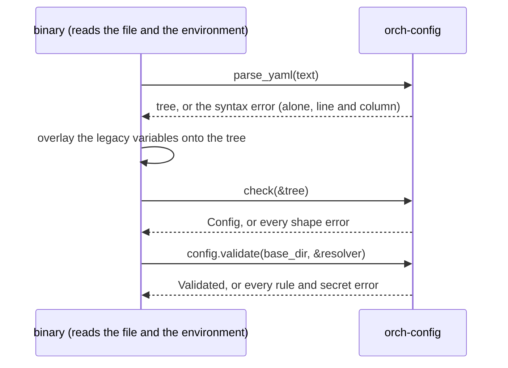
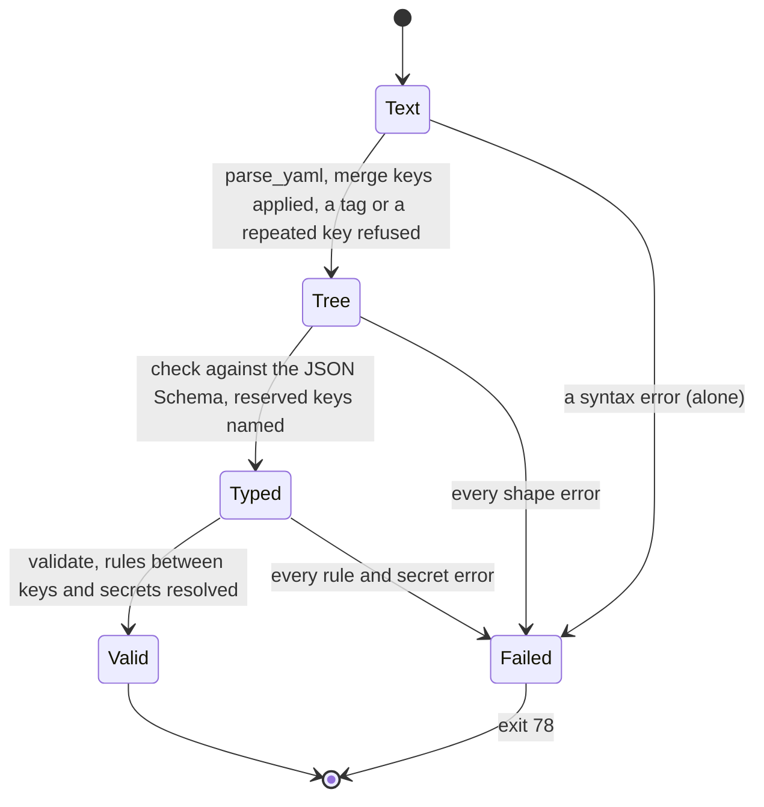

# orch-config

The orchestrator's configuration file: the typed keys, the JSON Schema generated from them, the three-pass validation
that lists every error and never prints a value, and secrets by reference
([ADR 0034](../../../docs/decisions/0034-one-yaml-configuration-secrets-by-reference.md); every key is in
[`docs/api/config.md`](../../../docs/api/config.md)). **Pure**: it reads no file and no environment variable and starts no
thread. The binary reads the file and the environment and passes them in, as text and through a `Resolve`.

Configuration is the composition root's **input**, not a port ([ADR 0009](../../../docs/decisions/0009-swappable-implementations-at-build-time.md)):
it decides which compiled-in implementation each port gets, so it has no trait and no testkit, and no implementation type
appears in its public types (an S3 bucket will be strings and a `SecretRef`). A developer with their own composition root
may use this crate or not.

## Where it sits

Depends on `serde`, `serde_json`, `serde_norway` (the YAML parser of the workspace,
[ADR 0034](../../../docs/decisions/0034-one-yaml-configuration-secrets-by-reference.md#facts-this-rests-on)), `schemars` and
`jsonschema` (the schema and its checker), `secrecy`, `thiserror` and `url`. It depends on no other crate of the
workspace. Used by [`orchestrator`](../../bin/orchestrator/README.md), which reads `ORCH_CONFIG_FILE`, lays the legacy
environment variables over the tree, and builds its own `Config` from the result.

## The three passes

1. **`parse_yaml`**: `serde_norway` reads the text, merge keys (`<<:`) are applied, a tag is refused, so is a key repeated in
   one mapping (never "the last one wins") and a key that is not a string. The tree is a `serde_json::Value`.
2. **`check`**: the tree is checked against the generated schema with `jsonschema`'s `iter_errors`, which yields **every**
   violation: an unknown key, a wrong type, a missing key, a value out of range or not allowed, a plain string where a
   secret goes. An unknown key that is in the table of **reserved keys** (`RESERVED`: the PR and ADR that bring it) is
   reported as reserved. Then the tree is read into `Config`, which cannot fail after a clean pass.
3. **`Config::validate`**: the rules a schema cannot say (both or neither of `threadTools.url` and `secret`; a mounted
   surface has what it needs; URLs; hosts; one endpoint; a task names an endpoint), and every secret reference resolved
   through the `Resolve` the caller passes, collecting every error.

Each pass lists all of its errors; a pass runs only when the one before it found none (a rule cannot be checked on a value
that is not there).

## No error carries a value

A `ConfigError` is a key path and an `ErrorKind`; the kinds hold only what the program knows without the file (a bound
from the schema, the name of a variable or the path of a file taken from a reference, a line and a column). `jsonschema`'s
`Display` quotes the instance and is never used (the instance may be a secret that was pasted by mistake); a string where a
secret goes is "a secret is a reference: `{ env: NAME }` or `{ file: PATH }`"; a YAML syntax error is its line and column
only. `tests/config.rs::no_error_carries_a_value` feeds a recognisable secret into every kind of mistake and asserts it
is in no message.

## Secrets

`SecretRef` is `{ env: NAME }` or `{ file: PATH }` and nothing else; the file holds nothing more. `validate` resolves them
through `Resolve` (an environment variable that is unset or blank, a file that cannot be read, is empty or is over 64 KiB
is an error naming the key and the variable or path; a `{ file }` loses one trailing newline). A resolved `Secret` keeps its
reference beside its value, and every `Debug` of it, of `Secrets` and of `Validated` prints the reference. The
webhook secrets of a role that serves no routes are not resolved (a worker is not asked for secrets it would never use).

## API at a glance

| Item | What |
|---|---|
| `parse_yaml(text)` | pass 1 |
| `check(&tree)` | pass 2: `Result<Config, Vec<ConfigError>>` |
| `Config::validate(self, base_dir, &dyn Resolve)` | pass 3: `Result<Validated, Vec<ConfigError>>` |
| `load(text, base_dir, &dyn Resolve)` | the three passes, when nothing is overlaid on the tree |
| `Validated { config, secrets, base_dir }` | `agents_file()` and `mcp_tokens_file()` resolved against the directory of the file |
| `Config::effective()` | the defaults that depend on other keys filled in (the surfaces, the attempts), for `--print-config` |
| `Config` and the section types | `Serialize` (a `SecretRef` is the mapping `{ env: NAME }`), so a `Config` prints as the file it came from |
| `schema()`, `schema_text()` | the JSON Schema, draft 2020-12, with no `null` (an optional key is optional) |
| `RESERVED`, `reserved(path)` | the reserved keys |
| `Resolve` | `env(name)` and `read_file(path)`: what the caller reads for the library |
| `ConfigError { path, kind }`, `ErrorKind`, `render` | the errors |

## The JSON Schema

Generated by `schemars` from the types and committed at [`docs/api/config.schema.json`](../../../docs/api/config.schema.json)
(`additionalProperties: false` on every object, the doc comment of a key as its description, so an editor shows it). A test
compares the generated schema with the file and fails on any difference; regenerate with
`UPDATE_SCHEMA=1 cargo test -p orch-config --test schema` and review the diff. The same test lists the secret fields of the
schema and asserts they are the eight the contract names.

## Tests

`cargo test -p orch-config`:

* `tests/config.rs`: a minimal file with every default; **the example of `docs/api/config.md`** (read from the document, so
  it cannot drift); anchors and merge keys; a syntax error alone; a repeated key, a tag, a key that is not a string; the
  version; **every shape error listed at once** and **every rule error listed at once**; a plain string refused at each of
  the eight secret fields and every wrong form of a reference; unknown and reserved keys; references that do not resolve
  (each names the key and the variable or the path); the newline of a `{ file }`; a worker that is not asked for webhook
  secrets; **no value in any error** and no value in any `Debug`.
* `tests/schema.rs`: the committed schema is the generated one; the secrets are the eight of the contract; every object is
  closed.
