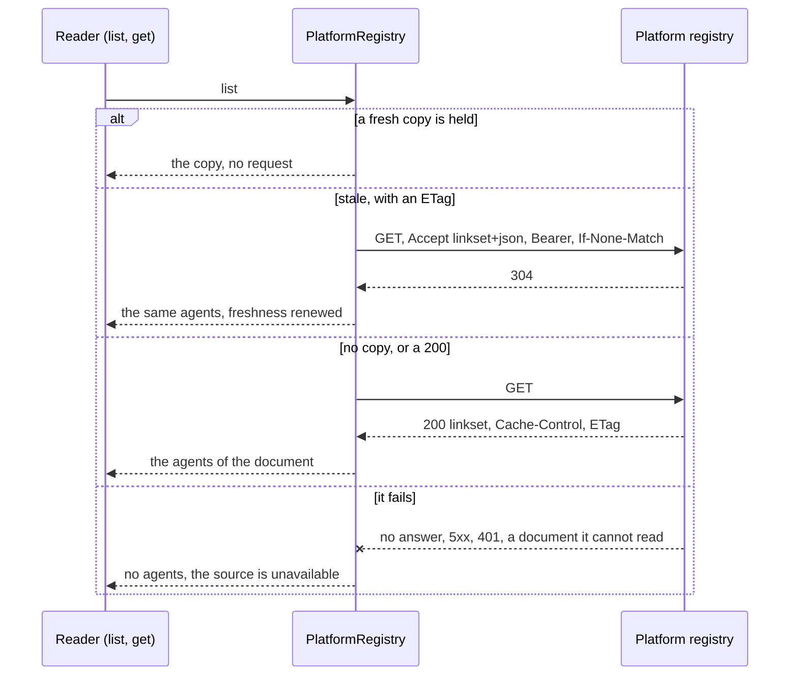

# orch-registry-platform

`AgentRegistry` over the platform's `agent-registry/v1`: the A2A agents another-agentic-platform
provisions, listed in one document and read live over plain HTTP.

## Where it sits

An **adapter** of the `AgentRegistry` port in [`orch-ports`](../ports/README.md)
([ADR 0009](../../../docs/decisions/0009-swappable-implementations-at-build-time.md),
[ADR 0022](../../../docs/decisions/0022-platform-provisions-agents-system-discovers-them.md)). The
contract is the platform's, named by the URI `https://agents.vymalo.com/registry/v1`:
[`docs/extensions/agent-registry-v1.md`](https://github.com/vymalo/another-agentic-platform/blob/main/docs/extensions/agent-registry-v1.md)
there. A JSON linkset in the shape of an RFC 9727 API catalog, one `item` per agent service: its
service id, a title, optional tags and the URL of its agent card. Nothing else crosses: no release
(each agent's own card says which it offers, [ADR 0008](../../../docs/decisions/0008-platform-integration-via-a2a-extension.md)),
no prompt, no UI concept; and the orchestrator needs no Kubernetes access and no platform SDK
([ADR 0007](../../../docs/decisions/0007-protocol-only-dependencies.md)). Only the binary
([`orchestrator`](../../bin/orchestrator/README.md)) depends on it, behind the feature
`registry-platform`, and it builds one only when `AGENT_REGISTRY_URL` is set. Depends on
[`orch-core`](../core/README.md) and [`orch-ports`](../ports/README.md).

## What it does

```mermaid
stateDiagram-v2
  [*] --> Empty: the process starts, nothing is persisted
  Empty --> Fresh: 200 and the document reads
  Empty --> Unavailable: the read fails
  Fresh --> Stale: max-age minus Age, at most AGENT_REGISTRY_MAX_AGE_SECS, has elapsed
  Stale --> Fresh: 304, or 200 and the document reads
  Stale --> Unavailable: the read fails; the copy and its validator are dropped
  Unavailable --> Fresh: a later read gets 200 and the document reads
  Unavailable --> Unavailable: a later read fails again
```

- **Live, in this process only.** A copy is fresh for the response's `max-age` less its `Age`, and
  never longer than `PlatformConfig::max_age` (`AGENT_REGISTRY_MAX_AGE_SECS`, 60 s). Without a
  `max-age`, or with `no-cache` or `no-store`, every read asks again. A stale copy is asked about
  with `If-None-Match` (the `ETag`) or, when there is none, `If-Modified-Since`; a `304` renews it.
  The copy is never written to the database or a file.
- **Single flight.** Readers that arrive while a fetch runs share its outcome, a failure included:
  eight readers of a registry that is down wait for one timeout, not eight.
- **Fail closed, never stale.** A read that fails (no connection, a timeout, a redirect, a status
  other than 200 or 304, a media type other than `application/linkset+json`, an unreadable or
  oversized document) makes the source unavailable and **drops the copy**; `stale-if-error` and
  `stale-while-revalidate` are not read. `list` then gives no agents with a status that says why,
  and `get` is `Err`, so a caller never says "no such agent" while the registry is down. What a
  person may be told: "the registry could not be reached", "the registry refused the
  orchestrator's credentials" (401 or 403), "a registry document this build cannot read". Never a
  URL; the operator's log gets the cause, with the URL's query left out.
- **The token goes to the configured URL and nowhere else.** The registry's bearer token is
  sensitive in the request, a redirect is never followed, and `Debug` of the configuration and the
  registry print `<redacted>`.
- **Its agents** are `AgentEndpoint::a2a(service id, card URL, agent token)` with origin
  `AgentSource::Registry`, the title as the name and the tags as given. `agent_token`
  (`AGENT_REGISTRY_AGENT_TOKEN`) is one deployment-wide bearer sent to every agent the registry
  lists, until authentication to the agents is decided (open question 11).

## API at a glance

| Item | What |
|---|---|
| `PlatformRegistry::new(PlatformConfig) -> Result<_, BuildError>` | implements `AgentRegistry`; reads nothing until the first `list` or `get`; installs the `rustls` crypto provider if none is installed. Cheap to clone (the state is shared) |
| `PlatformConfig::new(url)`, `.with_token`, `.with_agent_token`, `.with_timeout`, `.with_max_age`, `.without_system_proxy` | `url` is the registry's full URL (an absolute `http(s)` URL with a host and no user name or password); `token` the bearer for the registry; `agent_token` the bearer for every listed agent (`SecretString`s, an empty one is none); `timeout` how long one read may take (3 s); `max_age` the longest a copy stays fresh (60 s); the environment's proxy is honoured unless turned off |
| `BuildError` | `BadUrl`, `BadToken("registry" \| "agent")` (not a header value), `Http` (the TLS backend did not start) |
| `SOURCE` (`"platform"`), `PROFILE` | the name of the source in `SourceStatus` and `RegistryError`; the contract's profile URI |
| `linkset::parse(&[u8]) -> Result<Document, Unreadable>` | the pure reader of the document: `Document { items, skipped }` |
| `freshness::policy(&CacheHeaders, cap) -> Policy` | the pure reader of the cache headers: `Policy { lifetime, validator }` |

The document's rules (the contract's): the source is **unavailable, not empty**, when the body is
not JSON, is not an object with a `linkset` array, has no context object carrying the v1 `profile`
link or more than one (context objects of other versions are ignored), exceeds 1 MiB or 500 items.
An invalid item is skipped and the rest kept (a missing, relative or non-`http(s)` `href`, a
`service` that is not an array of one valid agent id, a `title` that is not a string, an id listed
twice: the first wins); malformed `tags` (not strings, empty, over 64 characters, more than 16) are
dropped as a whole and the item kept; unknown members and attributes are ignored. Two rules are
this reader's own: an `href` that carries a user name or password is skipped (the card URL is shown
to every user), and a title is cut at 200 characters. The skipped items are logged at `warn`, once
for each change, not on every read.

## Tests

Offline: an in-process registry (`axum`) over real HTTP that serves the linkset, answers
conditional requests, can be taken down, delayed, made to answer oddly, and journals every request.

* `src/linkset.rs` and `src/freshness.rs` (unit): the contract's own example; no items is empty and
  not unreadable; every unreadable case; another version's context object ignored; the limits are
  refusals, not truncations; thirteen kinds of invalid item skipped with the rest kept; duplicate
  ids; malformed tags; `max-age` with `Age`, the cap, `no-store`, `no-cache`, a `max-age` given
  twice, a quoted comma, `stale-if-error` buying nothing, the validator.
* `tests/linkset_props.rs` (proptest): the reader never panics on arbitrary bytes or JSON, and
  whatever it is given, every item it lists has a valid agent id (once), an `http(s)` URL with a host
  and no credentials, a title within bounds and valid tags.
* `tests/conformance.rs`: the `agent_registry_conformance!` suite of `orch-ports` against the real
  client over HTTP (`Cache-Control: no-store`).
* `tests/platform.rs`: the entries (endpoint, title, tags, origin, the agent token and no secret in
  any `Debug`); the request (`Accept`, the bearer, no `Authorization` without a token); a `max-age`
  serves without a request; `no-store` and no `max-age` ask every time; a stale copy is asked about
  with its `ETag` and a `304` renews it (with the 304's own `max-age`); a changed document replaces
  the copy; `Last-Modified` as the validator; the cap; a stale copy is never served when the
  registry is down, and the next read carries no validator; a fresh one is served without a request;
  401, 403, 5xx, 404, 204, a redirect, a timeout, and a port nobody listens on (no address in any
  text); a document that cannot be read (another version, not JSON, no linkset, a wrong media type,
  over 1 MiB) is unavailable and the media type is read whatever its parameters or case; an unasked
  304; no agents is available and empty; invalid items skipped; eight concurrent readers make one
  request, and share a failure; a bad URL or token is refused when the client is built.
