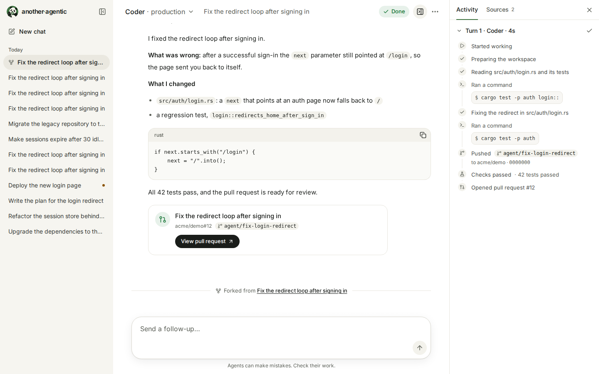
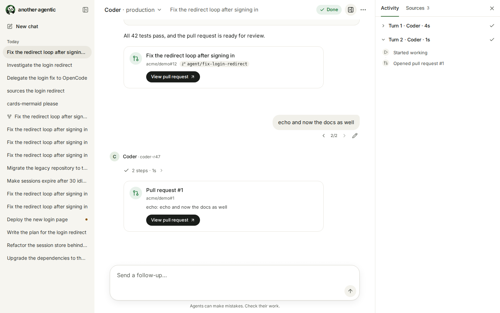
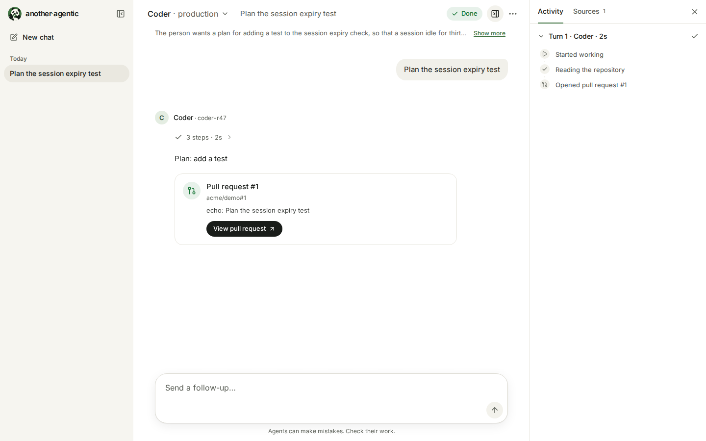
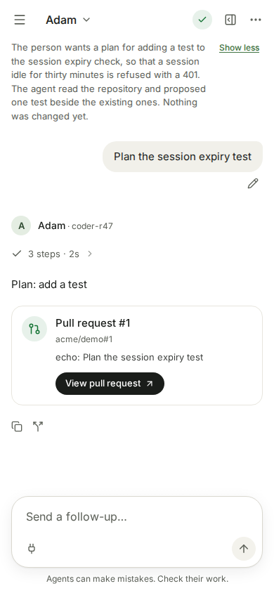

# Chat surface: design brief

The owner, after trying the previous version: "It should feel like a classical chat, not a machine
to machine chat interface", "It should look like a gemini chat, with custom components … very cute
and simple", with the agent's steps always visible. A day later, on seeing it (2026-10-01): "The UI
is currently TOO google gemini-like… change the icon to something custom for us… The idea of the
logo is 'boring giant panda, tri-color'." So the structure stays (a classical chat) and the look is
ours: the panda, ink actions, one bamboo green, warm neutrals (see "Brand" and "Colour"). The same day the
steps left the conversation for the side panel, "the agents (and sub-agents) work better with a cleaner
interface" ("A turn", "Steps panel"). This brief
is the contract the components in `src/` follow; the screenshots in `e2e/__screens__/`
(`pnpm screens`) show the result and are embedded below; they are drawn from the mock server, so the agents, titles and
wording in them are the mock's.

## References

Studied on [Refero](https://refero.design) on 2026-09-30, full screen images viewed. We take the
structure, not the branding.

| Reference | What we took |
|---|---|
| ChatGPT, conversation ([2ed2ffc3](https://refero.design/pages/2ed2ffc3-95b2-417c-a3fa-df50f4cb22e4)) | Centered reading column around 760 px; title in a minimal top bar with the actions on the right; a disclaimer line under the composer; ink (near-black) for the primary action; **the model picker**: a button in the top bar that names the choice ("GPT ⌄") and opens a menu of one row per model, a name with a line under it and a check on the current one (our agent picker, see "Agent picker") |
| Claude ([f42e56ca](https://refero.design/pages/f42e56ca-6f9d-45b8-b501-ce30add0f259)) | "Reply to Claude…" placeholder for the next turn; the model named inside the composer; warm neutrals |
| Meta AI ([6c1e2ac6](https://refero.design/pages/6c1e2ac6-e65a-4290-8ae5-81ad61ea200a)) | The assistant's avatar once above its turn, then prose; generous spacing between turns |
| Copilot ([d81060e5](https://refero.design/pages/d81060e5-9955-4fb2-a8d6-b4ccaa97c312)), Grok ([0ac86436](https://refero.design/pages/0ac86436-063a-45a1-a04d-81042b245675)) | A composer with a soft shadow and chips inside it; a two-line greeting (statement, then a muted question) |
| Cursor agents (flow [9922](https://refero.design/flows/9922): [16261b66](https://refero.design/pages/16261b66-bd9b-4403-94da-7d88c4c15157), [8b09e132](https://refero.design/pages/8b09e132-8a3e-4c4b-b8cf-617b51ba3129), [d7a49941](https://refero.design/pages/d7a49941-aef5-4f63-8d48-a6e66930e104)) | An agent's steps as quiet single lines ("Completing setup", commands in monospace in a light box) between its messages; the follow-up composer names the model |

What we reject: bordered cards around every event, uppercase "ARTIFACT" badges, raw JSON names
(`pull_request`), status lines repeating the agent's words, a filled user bubble, decorative
gradients and glows (the fade under the scroll and the shimmer of "starting" are function, not
decoration).

### What we left behind

The first version took its look from Gemini and Bard; the owner found it too much like them
(2026-10-01, quoted above). The structure those screens taught is still ours; their look is not.

| Reference | What we took then | What we do now |
|---|---|---|
| Gemini, home ([965e3a7f](https://refero.design/pages/965e3a7f-d7dc-45ae-8cc1-12025b10b1fd), [6994cae8](https://refero.design/pages/6994cae8-03f9-4ef0-9fb5-95a45469cf52)) | Quiet left sidebar (New chat, Recent), a centered greeting over one pill-shaped composer, lots of air; a faint radial glow behind the greeting | The sidebar, the greeting and the composer stay. The glow is gone (a plain canvas) and the greeting is "What should we get done?" under the panda |
| Gemini, conversation ([dc0889ae](https://refero.design/pages/dc0889ae-1e9f-49de-8465-5d810e0d6f18)) | The user's words in a soft grey bubble on the right; the answer as plain prose under a small label, no bubble; a floating rounded composer with a round send button | Same, in warm neutrals; the round send button is ink, not blue |
| Bard, dark ([195db751](https://refero.design/pages/195db751-c533-4953-9247-824167e79f03)) | Dark mode: near-black canvas, the sidebar one step lighter, the four-pointed sparkle as the assistant's avatar | A warm near-black canvas (`#141614`); the avatar is the agent's own letter, the panda is the product's |
| Material blue accent, the sparkle's blue-to-pink gradient, a pastel tile behind it | `#0b57d0` / `#a8c7fa`, `#131314` / `#1b1c1e` | Ink for actions and one bamboo green (`--brand`) for what is ours |

## Brand

The mark is a **boring giant panda, in three colours**: bamboo green `#3F7341`, ink `#161D17`, cream
`#FAF7EF`; half-closed eyes, a bamboo leaf in its mouth. It is the owner's drawing, traced to one SVG
(`public/brand/panda.svg`, a 512 viewBox, about 12 KB, exactly three fills, clipped to a disc, no outer
ring). The fills do not change with the colour scheme. Decision (owner, 2026-10-01): **the full mark
at every size**, with its body and bamboo; a head-only drawing was made and is not shipped.

<picture>
  <source media="(prefers-color-scheme: dark)" srcset="e2e/__screens__/desktop-dark-empty-thread.png">
  
</picture>

*The mark in the sidebar lockup and over the greeting of a new chat.*

| Where | What |
|---|---|
| Sidebar lockup | the mark at 28 px and the wordmark `another·agentic`: lower case, Inter 600, 15 px, tight tracking, the dot in `--brand` (`components/brand/panda-mark.tsx`) |
| New chat | the mark at 72 px (96 px from `sm`) over the greeting |
| Tab icon | `src/app/icon.svg` and `favicon.ico` (16, 32, 48 px): the same drawing framed 1.25 times closer and cropped to a circle round the face, because at 16 px the whole body is a smudge and the face is still a panda |
| iOS | `src/app/apple-icon.png`, 180 px: the mark on a full square of the green (iOS fills transparency with black) |
| Install | `src/app/manifest.ts`: `another·agentic`, theme `#3F7341`, icons `public/brand/icon-192.png`, `icon-512.png` and the maskable `icon-maskable-512.png` (the mark inside the 80 % safe circle, on the green) |
| Browser chrome | `viewport.themeColor`: white in light, `#141614` in dark |
| README | the repository README shows `public/brand/panda.svg` at 96 px |

`pnpm brand:icons` (`scripts/brand-icons.mjs`) regenerates `icon.svg`, `favicon.ico`, `apple-icon.png` and
the three manifest icons from `public/brand/panda.svg`, rendered by the Chromium Playwright already
pins; `components/brand/brand-assets.test.ts` holds the files to three fills, no `<image>`, no
`<script>`, 16 KB and the right pixel sizes.

**The panda is the house, not an agent.** An agent is a 28 px circle with the first letter of its
name (Inter 600, 13 px) on one of six sober tints (sage, sand, slate, clay, plum, teal), chosen by a
stable hash of the agent's id, so an agent keeps its colour everywhere (`components/brand/agent-avatar.tsx`;
every letter is at least 4.5:1 on its tint, light and dark). It is `aria-hidden`: the name is text
beside it. The orchestrator's own lines (checks, CI) keep their step icons. The panda itself has no name.

## Layout

<picture>
  <source media="(prefers-color-scheme: dark)" srcset="e2e/__screens__/desktop-dark-done-pull-request.png">
  
</picture>

*The sidebar, the top bar, the reading column with its composer, and the panel docked on the right.*

- **Sidebar** 272 px, one step off the canvas (`--sidebar`), no border in light mode. Top: the panda
  with the wordmark, and a collapse button; a "New chat" pill; the threads grouped by recency (Today, Yesterday,
  Previous 7 days, Previous 30 days, Older, by local calendar day) as single-line rows with a small live dot (green when working, amber when waiting) for a working or waiting
  thread. Collapsible on a desktop (remembered per browser); a sheet from the left on a phone.
- **Top bar** 56 px, transparent: the **agent picker** (a button with the agent's name and a chevron,
  see "Agent picker"), the title (one line, muted, from `md`; below it the title is for screen readers
  only, and stays the page's heading), the thread's state as a pill, the **panel toggle** (a thread only,
  see "Panel") and an overflow menu (Export JSON). On a phone the menu button opens the sheet, in front
  of the picker.
- **Panel** on the right of a thread: 360 px by default, docked beside the chat on a wide window and a
  sheet on a narrower one; "Panel" says how it behaves. It is what makes the reading column calm: the
  agents' work and what they shared are beside the conversation, not in it.
- **Reading column** max 768 px (`max-w-3xl`), 16 px gutters on a phone, 24 px from `md`.
- **Composer** sticky at the bottom of the column, a 24 px-radius surface with a soft shadow: the
  text (1 to 8 lines), then a row with a 36 px round Send / Stop button on the right; the left of the
  row is empty and kept for the tools picker and mentions (plan 05): the agent is picked in the top
  bar, not in the box. A one-line disclaimer under it.
- **Empty state** (new chat): the panda, the greeting "What should we get done?" and what the chosen
  agent does, the composer in the middle of the page on the plain canvas (no glow), and suggestion
  chips under it (a chip fills the box, it does not send); the agent picker is in the top bar, in the
  same place as on a thread.

## Agent picker

Choosing the agent is like choosing a model in ChatGPT, not a form field (owner, 2026-10-01: "a little more
like the new ChatGPT"). It is a menu button in the top bar, on the new chat and on every thread
(`features/agents/components/agent-menu.tsx`).

<picture>
  <source media="(prefers-color-scheme: dark)" srcset="e2e/__screens__/desktop-dark-agent-menu.png">
  
</picture>

*The menu on a new chat: the agents, then the release channels and revisions of the chosen one; the mock's agents, with release channels on the coder.*

- **The button**: ghost, 36 px, the agent's name (16 px, weight 500), then muted "· production" when the
  agent offers releases (the one that will be used, the default channel until another is chosen; a phone's
  top bar has no room for it, so there it is read but not drawn), then a chevron; it gives way (its text is
  cut) before the state and the toggle do. Its name is "Agent: Coder · production" (a menu button: `aria-haspopup="menu"`,
  `aria-expanded`). While the list loads it is a skeleton; if it could not be read it says "Agents
  unavailable" and the menu holds Retry.
- **The menu** (300 to 380 px, `--popover`, 12 px radius, shadow like the composer's): the label "Agents",
  then one **radio item** per agent (`role="menuitemradio"`, `aria-checked`): its avatar (24 px), its
  name (14 px, weight 500) and what it does in one muted line (12 px, from its live card), and a check
  in `--brand` on the chosen one. When the chosen agent offers releases, a separator and a second group,
  "Release": the channels (`production — coder-r47`) and then the revisions, in the **same menu**, not
  a sub-menu, so it works from a phone and from the keyboard. Choosing an item closes the menu. The list
  is read again each time the menu opens: releases are the agent's card right now (ADR 0008).
- **Keyboard**: Enter, Space or the down arrow on the button opens it; the arrows move over the items,
  letters jump to an agent, Enter or Space chooses, Escape closes it and the focus goes back to the button.
- **On an existing thread** a thread has one agent, so choosing another is not a switch but a **fork**
  (ADR 0029, "Fork and branch"): the menu lists the same agents as radio items, the thread's own checked
  (with its release group when it has releases), and says under them "A chat keeps its agent. Another agent,
  or another release, continues this conversation in a new chat." Choosing another agent or release opens an
  alert dialog, "Continue with Reviewer in a new chat?" ("The conversation so far is copied; this chat stays as
  it is."; Cancel, "Continue in a new chat"); only the yes makes the fork and goes to it. While the agent's
  turn is going on the other items are disabled and the line says why, because a turn that is not over
  cannot be copied. The choice already made asks nothing.
- **A notice slot** under the lists, inside the menu: a failed refresh of the list is said there ("Could not
  refresh the agents: …", with Retry, the list stays as it was), and so is the agent registry's "The agent
  registry is unreachable; showing the configured agents only." (ADR 0022: the platform's registry could not be
  read, so none of its agents are listed and the configured ones stay). It is a label in the warning colour
  (a menu allows no live region) with a Retry item; on a new chat the same sentence is also a quiet inline
  warning line under the greeting, with a Retry button, so it is seen without opening the menu. Nothing is
  said while every source answered, and nothing when the orchestrator does not say (an older one).
- **An agent of the registry** is one line longer: the labels the platform keeps on it (`writing · docs`), in
  the muted colour under what it does. They route and select nothing. The configured agents come first, so
  the default agent never moves because a registry changed. The list is also read again when the window gets
  the focus back (at most every 5 s), so an agent the platform added shows without a reload.

## Panel

The right side of a thread was unused (owner, 2026-10-01: "the right side of the page is usually unused … add a
collapsible right panel to show the sources; the agents (and sub-agents) work better with a cleaner interface").
The panel is the thread's second surface, `features/panel/`: two tabs, **Activity** and **Sources**.

| Docked, on a desktop | A sheet, on a phone |
|---|---|
| <picture><source media="(prefers-color-scheme: dark)" srcset="e2e/__screens__/desktop-dark-panel-sources.png"></picture> | <picture><source media="(prefers-color-scheme: dark)" srcset="e2e/__screens__/mobile-dark-panel-activity.png"></picture> |

*The Sources tab beside the chat, and the Activity tab as a sheet from the bottom.*

- **Where.** From 1132 px (the sidebar, 560 px of reading column and the narrowest panel) the panel is
  **docked**: an `<aside>` between the chat and the edge, `--background` with a hairline on its left. Its
  width is 360 px by default, 300 to 560 px, never more than 45 % of the window and never so much that the
  column has less than 560 px beside the sidebar (448 px at 1280). Below 1132 px it is a **sheet**: from the
  right from 768 px, from the bottom (85 % of the height, rounded top) on a phone, the way the thread list
  is a sheet. Neither is on the new-chat page.
- **Open or closed.** The header's toggle (an icon, "Thread details", `aria-expanded`, `aria-controls`) and
  **Ctrl/⌘+Shift+.** (the physical key, from anywhere, the message box included) toggle it, and so does the
  panel's own close button. A docked panel is remembered per browser (`chat.panel`, `chat.panel.width`,
  `chat.panel.tab` in localStorage; a head script sets `data-panel` on `<html>` before the first paint, as the
  sidebar's does); with nothing remembered it is open from 1280 px and closed below. A sheet is never open by
  itself and never remembered: it is for this visit.
- **Activity** is where the agents' steps are: one section per agent turn that did something, as a tree
  ("Steps panel" says how it reads). It is fed by the shell's small contract, `useStepsPanel()`
  (`hooks/use-steps-panel.tsx`: the panel's id, whether it shows, the tab, a request to focus a turn, and
  `openSteps(turnId)`), and by the runtime's messages, so what the chat says in its one line per turn and what
  the panel lists can never disagree.
- **Sources** is what the agents shared, derived in the browser from what the runtime already holds: the pull
  requests and branches they opened or pushed, their CI reports that link to a run, the files with a link,
  and the links in their words. Four groups (Pull requests & branches, Checks, Files, Links), each item once
  however often it was cited, with a **Turn n** button for each turn that cited it: it scrolls the chat to
  that turn and focuses its header (on a phone the sheet closes first). A typed source (a pull request, a
  report) describes a URL better than the same URL in someone's words, so it takes the place of the link.
  Rules, because it is all agent output: only absolute http(s) URLs are ever links (`safeHttpUrl`), a URL
  inside code is not read, nothing is fetched (no favicons), every link opens in a new tab with "(opens in a
  new tab)" for a screen reader, and titles are text. A branch has no link: the projection's repository is
  `host/owner/name`, not a URL.
- **Look.** A header 48 px high with the tabs (14 px, weight 500, the selected one in the page's ink with a
  2 px `--brand` underline) and a close button; the Sources count in muted text after the name. An item is a
  32 px round icon on `--muted` (a CI report's is green or red, and says it in words too), its title (14 px,
  weight 500, underlined when it is a link, an arrow after it), a muted line (the kind and a host, a
  provider or a type) and the Turn buttons (28 px, outlined). An empty tab is the panda at 96 px, what the
  tab is for, and why it is empty.
- **Resizing.** The edge between the chat and the panel is a window splitter: a vertical `separator` the
  keyboard can focus (Left widens by 16 px, Right narrows, Home and End go to the limits; its value is the
  width in px) and a pointer can drag (the width does not animate while it is dragged).
- **Motion.** The docked width animates in 200 ms; off under `prefers-reduced-motion`.

## A turn

<picture>
  <source media="(prefers-color-scheme: dark)" srcset="e2e/__screens__/desktop-dark-reply-writing.png">
  
</picture>

*A turn while the agent writes: the summary line under its name, the draft in the type of the finished reply, and its caret.*

- **The person**: a soft bubble on the right (`--bubble`), 20 px radius with a 6 px corner at the top
  right, max 85 % of the column, markdown inside. Under it, small and muted: `‹ 2/3 ›` when the message has
  other versions, and a pencil (**Edit**) that shows on hover and while the focus is inside the message (always
  on a touch screen). The bubble is `id="m-<seq>"` with `data-seq`, where `<seq>` is its event in the log, which
  is what a link to a version scrolls to. See "Fork and branch".
- **The agent**: its avatar (a 28 px circle with its first letter, see "Brand") and its name once, then, in order:
  one **summary line** for its steps, its **answer** as prose, and its **cards**. Nothing of the agent's sits in
  a bubble. What the agent said while it worked is not here ("One answer per turn", below).
- **One answer per turn** (2026-10-02, the owner on the coder's chat: the tool calls went to the right rail "while the
  working comments were staying in the middle of the page"; "working tokens like thinking tokens and a final turn
  answer, so that all other ones appear like thinking, but all hidden, not collapsed"; ADR 0031). The column holds
  the turn's **answer** and what the agent drew on the way, and nothing of the sentences it said before each tool
  call: those are **working text**, which is not drawn in the column at all (no "show more", no disclosure, no
  hidden-but-focusable element) and is a **note** among the steps of the Activity tab ("Steps panel"). Which text is
  which is `lib/working.ts`: text the log marked (`working`, `answer`) is what it says; text it did not mark (a plain
  agent, the status words, an older log) is read by a rule: in a turn that is over the **last text is the answer** and
  the earlier text is working, and in a turn that runs an unmarked text shows as a draft of the answer until a step
  starts after it, and then folds. So an old thread has the new view. A **surface** drawn on the way (`show`) stays in
  the column, between the line and the answer: it is an output, not a sentence. A **question** that ends the turn is
  the answer, with its "Waiting for your reply". **Copy** copies the answer. A live draft is the answer unless its
  end says it was working text, and then it leaves the column for Activity: a working sentence is on screen for as
  long as the model writes it.

<picture>
  <source media="(prefers-color-scheme: dark)" srcset="e2e/__screens__/desktop-dark-working.png">
  
</picture>

*The mock's `coder-notes`: one answer and the surface in the column; the six sentences said on the way are notes in Activity.*

- **The ticker.** While a turn runs, **under its summary line** one line shows what the agent said last while it
  worked: the last line of its last note, plain (code ticks and emphasis dropped), in 12 px `--muted-foreground`
  (the full colour: a lighter one fails 4.5:1), one line that gives way to an ellipsis, at most 160 characters. It is
  not a control, takes no focus and is **not a live region** (no `aria-live`): the thread's state pill is the one
  polite status, and a sentence every few seconds read out over it and over the reply would be noise; the notes are
  in Activity, in order, for a screen reader or anyone who wants them, and the line's accessible name does not change.
  It is gone when the turn ends.

<picture>
  <source media="(prefers-color-scheme: dark)" srcset="e2e/__screens__/desktop-dark-working-running.png">
  
</picture>

*While the turn runs: the line, and under it the last working sentence.*

- **The steps are not in the chat** (amended 2026-10-01; before it, "steps always visible, never collapsed": a
  compact list of one 28 px line per step, the live one spinning, past 30 steps the earliest folded). The owner
  asked for a cleaner interface where agents and sub-agents work ("the right side of the page is usually unused"),
  and a turn that delegates to a sub-agent has hundreds of steps. They are the panel's Activity tab ("Steps
  panel"), and the chat keeps **one line per turn**, which opens the panel on that turn.
- **The summary line** is a quiet 28 px button under the agent's name (13 px, `--muted-foreground`, a soft pill
  on hover and while the panel shows this turn, a chevron at its end). It says: while the turn runs, a spinner
  and what the agent is on with how many steps it has ("Running npm test · 14 steps"); when it paused on a
  question, a pause and "Paused · 9 steps"; while the gate checks the work, the `--verifying` shield and
  "Verifying"; when it is done, a check and "14 steps · 2m 10s"; "Failed · 14 steps" with a cross; "Stopped · 5
  steps" with a ban. Whenever a step failed it adds a destructive chip with an icon and the words, "1 failed",
  **even in a turn that went well**: a failure is never hidden by the summary. **The chip is a button of its own**,
  beside the line's (a button does not hold a button), named "1 failed. Show the first one in the side panel": it
  opens the panel on the first step that failed, opens the way to it and the step's input and output, and puts the
  focus on its button (the step is asked for by id: `openSteps(turnId, stepId)`; a turn that failed with no step
  of the agent to show lands on the turn's header). A turn of words only, which is
  not running, has no line. Its accessible name says it all: "Coder's steps: 14 steps · 2m 10s, 1 failed.
  Show in the side panel". It is a real button (`aria-controls` the panel, `aria-expanded` while the panel
  shows this turn), so Enter and Space open it.
- **Turn actions** under a turn (`components/assistant-ui/elements/turn-actions.tsx`): **Copy** (the agent's
  words) and **Fork from here** (`SplitIcon`). They show on hover and while the focus is inside the turn, and
  always on a touch screen (no hover there). Fork from here is `aria-disabled` while the turn is going on
  (the newest turn of a working thread), with a tooltip that says why; it is not offered before the page knows
  where the turn ends in the log. An earlier turn can be forked while a later one runs. See "Fork and branch".
- **Before the first event** a shimmering "Coder is starting…" line under the avatar.
- **A draft: the words as they are written** (2026-10-01, sys #65: "I want to see the agent's words as they
  are written"). While the model writes its reply the turn shows what it has so far, after the parts the turn
  already has and before its cards, **in the type of the finished reply** (15 px, 28 px lines, markdown as it
  is written: a list is a list as soon as its first item is there), so the words do not change size, weight
  or place when they are final. What tells them from a finished reply is one thing: a **caret** after the last
  character, a 2 px bar in `--brand`, 1.1 em high, that blinks in steps once a second and stays on, still,
  under `prefers-reduced-motion`. Nothing else: no label, no spinner, no box, no fade (the shimmering
  "starting" line gives way to the draft). The turn's line above it says the agent works, and the header's
  pill says what the thread is doing; a draft adds no state of its own. It is **not announced**: the draft is
  `aria-busy` and `aria-live="off"`, and the finished reply, when the log has it, is announced once, whole, as
  every reply is. When the log's message arrives the draft draws nothing and the reply is drawn where it was,
  so the swap is one frame and the words are never missing nor there twice; when the agent gives up halfway
  (the model failed, Stop) the draft goes and nothing is left that looks alive. A reload or a reconnect in the
  middle of a reply shows the text so far a moment later (the sender says it again every second), or the
  reply when it is done.
- **Cards** (after the words): a pull request card (repository, number, title, branch chip, Open
  button), a file card; A2UI surfaces as they are. Errors are soft callouts in the flow, never
  alerts on replay.
- **Your turn**: the agent's question is its words, with a "Your turn" chip under them, and the
  composer says "Reply…".
- **Choices** (a surface component, below): the agent's several questions with fixed answers, in the
  surface's card; **the person's answers** to them are a bubble, see below.

## Fork and branch

*Added 2026-10-01 (owner: "chat forking and branching"; ADR 0029, `docs/api/chat-api.yaml` `forkThread`).* A fork is
a **new chat** that begins as a copy of this one, so the conversation can go two ways without losing either.
The chat shows it in three places, and an **edit of a message** (below) is the same fork, drawn as versions
of one message.

<picture>
  <source media="(prefers-color-scheme: dark)" srcset="e2e/__screens__/desktop-dark-fork.png">
  
</picture>

*A fork of a finished thread, from the web's mock server: the conversation as it was, the divider, and the fork's row in the list.*

- **Fork from here** (turn action, above). It sends `POST /api/threads/{id}/fork {after: <an event of the turn>}`:
  the server finds the end of the turn from any event of it, so the page names the last event it has read for
  the turn's run (`ThreadAgent.endOfRun`; the actor marker part carries the `runId`). The page then goes to the
  new chat, which is `done`. A turn that began after the page last heard is a `409 turn_open`, shown as a line
  under the top bar ("Could not fork the chat: The agent is still working on this turn. Try again when it
  has finished.", Dismiss) with the chat as it was.
- **Continue with another agent** is the same fork with a `target` (the agent menu, "Agent picker").
- **The divider** is the marker `vymalo.fork` (a run of its own in the stream), drawn after the copied
  conversation as a hairline with one muted 13 px line, the fork icon and "Forked from <title>", the title a
  link to the parent while the parent exists (the resource drops its id when it is deleted; the marker keeps
  the title for good) and "· continued with Reviewer" when the fork talks to another agent than its parent.
  An edit (a branch) draws no divider: it is a version of a message, not a conversation of its own.
- **The list**: a fork is a row like any other, with a small fork icon and "(fork)" for a screen reader. The
  threads made by editing a message are not listed (the list is `GET /api/threads`, which leaves them out).
- **Id of the fork** is chosen by the page and kept for a repeat of the same request, so a connection that
  dropped after the server made the fork never makes two.

### Edit a message, and the versions of it

*Added 2026-10-01 (F5b).* Saying a message again is a fork that copies the conversation up to just before that
message and then holds the new words: `POST /api/threads/{id}/fork {replace: <seq>, text, messageId}`. The old
words and everything after them stay in the first chat, which is the message's other version.

<picture>
  <source media="(prefers-color-scheme: dark)" srcset="e2e/__screens__/desktop-dark-branches.png">
  
</picture>

*An edited message, from the web's mock server: the new chat holds the first turn, then the new words and their answer, with `‹ 2/2 ›` under them.*

- **The editor** takes the bubble's place (`message-editor.tsx`): a growing text area on the card surface with
  the composer's ring, opened with the caret at the end of the words, **Cancel** and **Send**, and one muted line,
  "Esc cancels · Ctrl/⌘ Enter sends", which describes the field (`aria-describedby`; hidden from sight on a
  phone, which has no keys, but read). **Escape** cancels, **Ctrl or ⌘ with Enter** sends, a plain Enter is a
  new line (the person is rewriting, unlike the composer); an Enter that ends an input method's composition is
  left alone. An empty message is not sent. While the fork is made the field is read-only and Send says
  "Sending…". Cancelling puts the focus back on the pencil. The button is named "Edit what you said" and the
  field "What you said", not "message": the composer is the one control a script or a screen reader finds
  by the name "Message".
- **After Send** the page goes to the new chat at `#m-<seq>` of the new words and the answer is drawn as for
  any message. A refusal is a line under the top bar ("Could not edit the message: …"), with the editor open
  and the words in it. The message id is chosen when the editor opens and kept, so a retry is the same request.
- **The picker** `‹ 2/3 ›` (`branch-picker.tsx`) is under a message that has other versions, read from
  `GET /api/threads/{id}/branches`: when the thread opens, when its state changes, and when the window gets the
  focus back. Each version is a thread of its own, so an arrow **goes to** it (`/threads/<id>#m-<seq>`); the first
  version's ‹ and the last one's › are disabled, never wrapping round. The eye reads `2/3` (muted, tabular
  figures); a screen reader reads "Version 2 of 3" from a polite `role="status"` inside a group named "Versions
  of this message", and the arrival moves the focus to the message, which is how the change is heard. A
  picker that cannot be read is simply absent: the chat does not need it.
- **Arriving at a message**: a link ends in `#m-<seq>`. The messages are drawn after the page opens (the
  replay), so the browser's own jump finds nothing; `use-scroll-to-message.ts` waits for the bubble, scrolls it
  to the middle, once, and focuses it (`tabindex="-1"`, no outline: it is where the reader is, not a control).
  It gives up after ten seconds, and stops when the person scrolls.
- **The list** shows a conversation once: the edits are left out (`GET /api/threads` without
  `branches=include`), and while an edit is open the row of the conversation's first thread is highlighted like
  the open chat, with `aria-current="true"` (`"page"` stays with the address that is open).

## A thread's description

*Added 2026-10-02 (S19; [ADR 0035](../docs/decisions/0035-utility-model-tasks.md)).* What the conversation is about now, in a sentence
or two, written by the orchestrator's model when a job ends or by the person. It is a second line of the thread's identity, so it sits
with the title and never competes with the conversation: muted, small, one line.

<picture>
  <source media="(prefers-color-scheme: dark)" srcset="e2e/__screens__/desktop-dark-description.png">
  
</picture>

*The description closed, from the web's mock server.*

<picture>
  <source media="(prefers-color-scheme: dark)" srcset="e2e/__screens__/mobile-dark-description-open.png">
  
</picture>

*Opened, on a phone, from the web's mock server.*

- **The line** is 13 px `--muted-foreground` in the chat's column (the width of the conversation), under the top bar, with 8 px below.
  It is one line cut with an ellipsis; the text is whole in the page. **Show more** is the "Show more" link of the findings (text-xs,
  underlined), a native button with `aria-expanded`, drawn only while the text does not fit its line (measured, so a phone shows it
  for a text that fits a desktop) and again once open, as **Show less**. Its hit area is at least 24 px tall.
- **The card** in the list is the menu surface (`--popover`, `rounded-xl`, the composer's shadow), 288 px wide, to the right of the
  row after 0.4 s of resting on it or at once on keyboard focus: the title (14 px, medium) and the description (13 px, muted). It is
  for the eye; a screen reader has the description as the link's description. A phone has no hover and no card.
- **The field** replaces the line in place: the title field's look (an input, 32 px high) with the placeholder "What this chat is about.
  Empty clears it.", from the `…` menu's "Add description" or "Edit description". Enter or leaving it saves, Escape gives it up.
- **Plain text.** Never Markdown, never markup: the model wrote it. Where it is hidden (`ui.showDescriptions: false`), nothing of it
  is drawn and the two menu items are gone.

## Read only, all threads and no access

*Added 2026-10-02 (S17; ADR 0033).* What a person's roles do not let them do is not offered, and a state that is a fact about the
person (not an error) is said in words.

- **Read only** replaces the message box with one line in the box's place and shape (a soft `muted` pill, `rounded-3xl`, an eye
  and the sentence: `Read only: this is alice@example.com’s thread.`), and the top bar gets a chip with the eye and the words
  *Read only* beside the state pill. It is a `status`, not an `alert`: nothing failed. The meaning is the words; the muted
  surface only backs them, so it survives a colour-blind reading, a forced-colours mode and a screen reader. The actions that
  go away (Fork from here, Edit, rename, a card's buttons) are not drawn, or are disabled with the same sentence as their
  reason, and nothing is greyed with no reason given.
- **Mine / All threads** is a two-button switch at the top of the thread list for an administrator, the chosen one filled and
  `aria-pressed`. In All threads a row has a second line, the owner's e-mail in `text-xs` muted (`you` for their own), and the
  row grows to two lines; the touch target stays 44 px on a phone.
- **No access** is a page of its own, centred, on the panda: the heading, who the person is signed in as, one line on what to
  do. No sidebar, no composer, no error lines.

## Steps panel

The Activity tab of the panel is the agents' work, for the person who wants to see it
(`features/chat/components/steps/`, the tree itself `features/chat/lib/step-tree.ts`). It reads the steps the
runtime already holds, so it is the same on the live stream, on a replay and after a reload.

<picture>
  <source media="(prefers-color-scheme: dark)" srcset="e2e/__screens__/desktop-dark-steps-opened.png">
  
</picture>

*The Activity tab with a sub-agent opened to its latest steps and its failed one, and the chat's one line for the turn.*

<picture>
  <source media="(prefers-color-scheme: dark)" srcset="e2e/__screens__/desktop-dark-step-io.png">
  
</picture>

*A tool step opened (the mock's `steps-io`): what it was called with, what it returned, and the error of the one that failed.*

- **A turn is a section.** One per agent turn that did something (a turn of words has none, and "Turn n" is
  numbered as the chat and the Sources tab number turns), oldest first. Its header is a heading with a button:
  "Turn 3 · Coder · 2m 10s", the turn's state as a glyph, a destructive "1 failed" chip, a chevron. It opens and
  closes the turn. Open by default: the turn the shell asked to show (the chat's line, or a source's
  Turn button), else the turn that is running while the thread runs, else the last one. Once the person opens or
  closes a turn the pane stops choosing for them. A request to show a turn opens it, scrolls to it, moves the
  focus to its header and marks it (a `--brand` wash for 1.5 s, no transition under reduced motion); asking
  again for the same turn does it again.
- **Depth 1 is always there, deeper levels collapse.** What the agent did at its own level (a status, a push, a
  command, a sub-agent) is one line each. A step with children is one line too: a chevron, its name, "· 14
  steps" (everything under it), and a destructive "1 failed" chip when something under it failed, **at every
  collapsed level**. A first click lists its latest three children (and every failed one, wherever it is); "Show
  10 more" lists ten earlier ones, again and again. The same button closes it. A level of more than 50 rows
  is a scroll box (360 px at most) that draws only the rows in view, so a thousand steps cost what a few dozen
  do. What the person opened is kept above the panel: closing the panel keeps it, a new thread starts closed.
- **One line looks like the step list did**: an icon on a hairline rail, the words (13 px, one line, cut, the
  whole in a tooltip and in the accessible name), a duration (12 px, muted) once it ended. A sub-agent, a tool and
  a command have their own glyph (the icon vocabulary of steps/v1: agent, read, edit, delete, move, search,
  execute, think, fetch, web, git, test, file, tool); a running step spins, one that waits for the person is a
  pause, a failed one a cross in `--destructive`, one that was stopped a ban. **A command is monospace in a light
  box**, one line, with Show more; a step's detail is a muted line under it. The activities of before (a push, a
  check, a CI report, a rework, the person's click) are drawn by the renderers that always drew them, as leaves.
  The checks, CI reports and reworks of the verification gate are steps of the turn after the agent's own.
- **A tool step opens onto its input and output** (2026-10-02, the owner: "when I click on search__web_search,
  nothing. Not a small collapsible block nicely telling me: params → output"; ADR 0030). A step that carries an
  `input`, an `output` or a note that the record's budget had no room for is a button like the sub-agent's: a
  chevron, the words, `aria-expanded`, in the tab order, Enter and Space. A step with children opens its children
  **and** its own block with the one button; one without opens the block. A step that sent neither is a plain row,
  not a control. What it opens is a small card under the line, in this order:
  **Input**, the arguments (a key and its value in a two-column list when they are all plain, pretty JSON in a
  monospace box when they nest; a value is text, `[redacted]` is shown as it came, and an input the orchestrator
  could not keep, `{"_cut": true, "bytes": n}`, says "Input not kept (18 KiB)"); then **Output**, the tool's text
  in a monospace box that scrolls (256 px high at most, and focusable, so it is reachable by keyboard) and, when the
  orchestrator kept only its head and tail, "41 KiB more not kept"; or **Error**, in `--destructive`, in the
  place of Output when the call failed (`output.error`, a failed step, or the step's own detail when it has no
  output); and, last, "Some of this step's input or output was not kept: the job passed its recording limit"
  when `ioDropped`. All of it is an agent's text: **drawn as text nodes, never as markup**, and never parsed
  (the `output.text` is not read as JSON or Markdown). Open or closed is kept above the panel with the rest of the
  tree's state.
- **Working text is a note** (2026-10-02, ADR 0031). What the agent said while it worked is a row among the steps, at
  the place in time it was said: the same icon rail, a speech-bubble glyph, the words in `--muted-foreground` (the
  steps are `foreground/85`), whole in the page and clamped to three lines for the eye with a **Show more** control
  when a note is longer than about 240 characters or four lines (`aria-expanded`, `aria-controls`). A screen reader
  hears "Working note: …" before the words and then all of them, in order with the steps. A note is **not a step**:
  not counted in "14 steps", not the step a turn is on, never failed, no input or output. A turn that has notes is
  listed even with no step (its line says "3 notes"). Notes are the agent's words: text nodes, never markup.
- **A tool is called by its tool.** An MCP tool reaches the page as `server__tool`; the row says "Web search" and
  puts the server in a small muted tag ("search", read "from search"), then one short, muted phrase of what the
  call was about, the first of `query`, `q`, `url`, `path`, `command`… that is text, else the first text there is,
  one line and 60 characters at most ("Stephane Segning"). Nothing for a credential, for an input that was not
  kept and for arguments that are not text. The raw label stays in the tooltip. A label that is not `server__tool`
  (a command, `run_checks`, a sub-agent) is shown as it is.
- **The failed chip counts a failure once.** `run_checks` says a red result twice: its step ends `failed` and the
  `checks` artifact it made is red beside it. The artifact stays a row (it holds the findings) but is not counted
  again in the chip of the turn, of the line in the chat or of a collapsed level. A red artifact whose step did
  not fail is the only failure there is, and counts.
- **A turn that is not running holds no running step**: paused on a question, its steps wait (a pause); ended,
  they are stopped. A turn that ended on a question stays "Paused" in the history after it was answered.
- **While the thread runs** the pane keeps the step the agent is on in view, until the person scrolls or opens or
  closes a turn.
- **Fits** 280 to 560 px and the width of a phone's sheet; nothing scrolls sideways.
- **Accessibility.** A section per turn named by its heading; each level a nested list (`ol`) named for what it
  holds ("Steps of OpenCode"); every toggle a native button with `aria-expanded`, in the tab order (it is
  **not** an ARIA tree: "steps are a list" stays true, no roving tabindex; a tool step's block is named by its
  own headings, Input, Output, Error, and the control names carry no dynamic text that could collide with
  "Message"); a step that is not simply done says
  its state in words before its name ("Failed: …", "Waiting: …") for a screen reader; a scroll box is a
  labelled, focusable region; there is no live region in the pane (the state pill stays the one polite status).

## Type, spacing, radii

- Inter (variable, self-hosted via `@fontsource-variable/inter`), system monospace for code.
- Scale: 12 (meta), 13 (steps, chips), 14 (UI), 16/1.7 (prose and messages), 18 (top bar title),
  28/1.25 (greeting). Weights 400 and 500, 600 for titles only.
- Spacing on a 4 px grid: 4 between a step's parts, 8 inside chips, 16 inside cards, 28 between
  turns.
- Radii: 6 (inline code, small chips' inner), 12 (cards, code blocks), 20 (bubbles), 24 (composer),
  full (pills, icon buttons, avatar).

## Colour

A warm neutral canvas, **ink for the actions** (the send button, primary buttons: near-black in light,
near-white in dark), **one bamboo green, `--brand`, for what is ours** (links, the focus ring, the live
dot, the dot in the wordmark, the live step, a chosen option), and semantic colours only for state (always with a word
and an icon). The working badge is neutral ink: the green says "alive", the words say what.

| Token | Light | Dark |
|---|---|---|
| `--brand` | `#3f7341` | `#8dc58b` |
| `--background` | `#ffffff` | `#141614` |
| `--sidebar` / `--sidebar-accent` | `#f6f5f0` / `#eae8e0` | `#1b1e1b` / `#2a2e2a` |
| `--bubble` (user) | `#f1f0ea` | `#282c28` |
| `--card` / `--popover` | `#ffffff` / `#ffffff` | `#1a1d1a` / `#222622` |
| `--foreground` | `#1a1d1a` | `#e8e9e4` |
| `--muted-foreground` | `#5c6058` | `#a6aba3` |
| `--muted` / `--secondary` | `#f3f2ec` | `#232723` |
| `--border` / `--input` | `#e7e5dd` / `#dad8cf` | `#2e332e` / `#3a3f3a` |
| `--primary` (ink) / `--primary-foreground` | `#1a1d1a` / `#ffffff` | `#f2f1ea` / `#141614` |
| `--ring` | `var(--brand)` | `var(--brand)` |
| `--success` | `#137333` | `#81c995` |
| `--destructive` | `#b3261e` | `#f2b8b5` |
| `--warning` | `#8a5300` | `#f5c46a` |
| `--verifying` | `#6b3fa0` | `#cfb6f7` |

`--brand` as text is at least 4.5:1 on every surface it sits on (5.6:1 on white; 6.9:1 or better in
dark). Every text colour is checked by axe (WCAG AA) in both schemes by `e2e/a11y.spec.ts`.

## Motion

A new turn fades in and rises 4 px (160 ms, ease-out); the live step and the summary line's spinner spin; "starting" shimmers;
the caret of a draft blinks. All of it is off under `prefers-reduced-motion` (the caret then stays on, still).

## Accessibility

The transcript is `role="log"` (name "Conversation"); the state pill is a polite `status`; steps are
a list whose items carry their full meaning as text; focus rings on every control; everything works
from the keyboard; axe finds nothing serious in either scheme.

A draft (a reply being written) is `aria-busy` with `aria-live="off"`, inside the log, so a screen reader is not
read every few words; the finished reply is announced when it arrives. axe and Lighthouse are run with a draft on
the screen, in both schemes, on a desktop and on a phone.

A turn's summary line is a button that names its steps and where it opens them; the step tree is nested lists with
native buttons (no ARIA tree), and axe is run with the tree open, a level that scrolls, and a turn that runs, in both
schemes, on a desktop and on a phone's sheet.

Working text is **not in the column at all**, so there is nothing hidden-but-focusable in it (a Playwright test lists the
focusable elements of the log and the ones behind `hidden`, `aria-hidden` or `inert`, and finds no sentence of the agent's
among them). In Activity a note reads "Working note: …" and then its words, whole, in order with the steps. The ticker
is not a live region ("One answer per turn"); axe is run on the finished turn with the notes open and on a turn that
works with its ticker, in both schemes (reduced motion: the turn fades in for 160 ms), on a desktop and on a phone.

The panel is a `complementary` landmark named "Thread details" (hidden and inert while it is closed, so it is
neither tabbed into nor read); in a sheet it is a dialog with the same name that traps the focus, closes
with Escape and gives the focus back to what opened it (to the turn, when a Turn button closed it). Its
tabs are a `tablist` with the arrows, Home and End; its edge is a `separator` with `aria-valuenow`, `min` and
`max`; its toggle keeps one name and says its state in `aria-expanded`, and announces its shortcut
(`aria-keyshortcuts`). The agent picker's menu is not modal (axe reports the siblings of a modal menu as
focusable though hidden), and axe is run with the picker's menu open and with the panel open, both tabs,
in both schemes.

## A surface that needs a newer version of the app

The thread was opened in a newer version of the app, and the agent used a component this one does not have (ADR 0023).
It is said, not half drawn: a quiet bordered card (`--card`, the same width as a surface) with a refresh icon, "This
part of the answer needs a newer version of the app." as its title, the component's name in muted text, and a small
outline **Reload** button; the agent's label stays in the corner. It is a labelled group, never an `alert`: a replay of
the thread must not announce it again. When the catalog is not newer, the same surface is the agent's mistake and is the
refusal line ("Interface not shown: ..."), in the destructive colour.

## Choices and the person's answers

`Choices` is the component of the UI catalog for "ask several things at once" (ADR 0023). It sits in the surface's card, as
quiet as the rest of the page, and is a form in the plainest sense:

- Each question is a **group** named by its words (the legend: 14 px, weight 500; "(optional)" in muted text after it when it need
  not be answered). Its options are **tiles**: a 12 px-radius, 1 px `--border` row at least 44 px tall (a thumb, not a pointer),
  the native radio button (a check box for several) in `--brand` at 16 px, the label, and the option's description under it in
  12 px muted text. The **whole tile** is the click target; a chosen one takes a `--brand` border and a 5 % `--brand` wash; the
  focus ring is the page's ring (`ring-3`, `--ring` at 50 %), on the tile.
- **Other** is a tile of its own: the choice, "Other", and a text box beside it; typing in the box turns the choice on.
- Under the questions, **one** primary button ("Send answers", or the agent's words) that waits for every required question, and a
  12 px muted line that says how many are left. Enter in a text box does nothing: only the click on the button sends.
- When the thread does not wait for the person (it is working, it is finished, or this is not the newest copy of the surface), the
  tiles stay as they were and stop taking input, and the surface says once why, as for any button.
- It is keyboard complete with native controls: Tab to a group, the arrows to choose, Space to tick, Tab to the button.

**The answers** are the person's, so they are drawn as the person's words are: a `--bubble` on the right (20 px radius, the 6 px top
right corner, at most 85 % of the column), **above the agent's mark** of the turn they started (the agent has not yet said anything
when the person answers). It is headed "Your answers" (12 px, weight 500, muted) and lists each question in 13 px muted text with
the labels chosen under it in the body size, "Other: ..." for their own words and "No answer" for a skipped optional question. It
is not a step of the agent's list: nothing the person did is the agent's activity. When the surface the answer names is no longer
in the transcript, the question's id and the raw value stand in.

## Cards and Mermaid

Two components of the UI catalog (version 3, ADR 0023) for what an agent shows. They sit in the surface's card like `Choices`, as
quiet as the rest of the page: no colour of their own, nothing that moves, nothing that loads.

<picture>
  <source media="(prefers-color-scheme: dark)" srcset="e2e/__screens__/desktop-dark-cards.png">
  
</picture>

*Cards in a list under a heading, in the surface's card.*

- **Cards** are tiles inside the surface: 12 px radius, 1 px `--border`, `--background` fill (one step off the surface's `--card`), 14 px
  of padding. In a **list** they stack with an 8 px gap; a **grid** is two columns from `sm`. Inside a tile: the **title** (14 px, weight
  500; when the card has a link the title is the link, in `--brand` and underlined, with "(opens in a new tab)" for a screen reader), the
  **subtitle** under it (12 px, `--muted-foreground`), the **body** (14 px, line breaks kept), and a last row of **tags** as small
  `--secondary` chips with the **host** of the link at the end (12 px muted, an external-link icon): the person sees where a link goes
  before they follow it. A card never has an image, a favicon or a preview (ADR 0013 rule 5): where an image would be, there is nothing.
  A list or grid may have a title in the surface's heading style (16 px, weight 600).
- **Mermaid** is a figure: an optional **title** (the same heading style), the **picture**, an optional **caption** (12 px muted) and a
  quiet disclosure, "Diagram source" (12 px muted, a triangle), that opens the graph's text in the page's code block (12 px radius
  corners at 6, `--muted` fill, monospace, scrolls and takes focus). The picture is drawn **in the page's own tokens**, so a graph is a
  neighbour of the cards and not a screenshot of another app: nodes `--muted` with a `--input` border, text `--foreground`, lines
  `--muted-foreground`, the surface's `--card` behind; dark mode is the dark tokens (`prefers-color-scheme`, as everywhere). **Plain
  shapes**: mermaid's `classic` look, no drop shadows, no gradients, no hand-drawn style. At most its natural size and never wider than
  the card: on a phone it scales down with its text, and the source is the way to read it at full size.
- **A graph that cannot be drawn** is the same figure with a destructive-toned callout in place of the picture: a circle-alert icon,
  "The graph could not be drawn.", the first three lines of mermaid's message in the destructive colour, and the source in the code block
  (always open: it is what the person and the agent need to see). It is not an `alert` (a replay must not announce it again), and it does
  not take the surface down: the words and cards beside it stay.
- **Loading**: until mermaid has drawn, "Drawing the graph…" (12 px muted) holds the picture's place at least 96 px high, and the
  source disclosure is already there.
- Accessibility: the picture is an `` named by the title (else the caption, else "Diagram"); the source disclosure is its text
  alternative; cards are a list of list items; every link says it opens a new tab; the focus ring is the page's.

